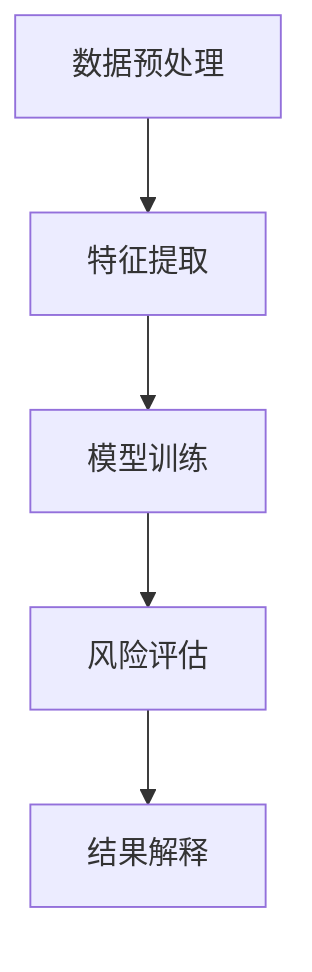
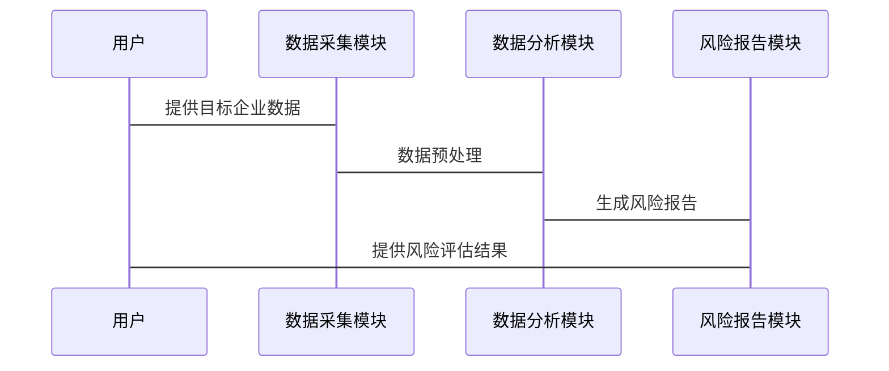

                 


# AI辅助企业并购风险评估与缓解策略

## 关键词：人工智能、企业并购、风险评估、风险缓解、机器学习

## 摘要：本文探讨了人工智能在企业并购风险评估中的应用，分析了常见的并购风险类型，详细讲解了基于机器学习和深度学习的算法原理，提出了构建AI辅助风险评估系统的架构设计，并通过实际案例展示了如何利用AI技术进行风险评估与缓解策略制定。

---

# 第1章: 企业并购与AI技术的结合

## 1.1 企业并购的基本概念

### 1.1.1 企业并购的定义与类型
企业并购（Mergers and Acquisitions, M&A）是指一家企业与其他企业合并或收购其资产或股权的过程。并购可以分为两类：
- **横向并购**：同一行业内的企业合并，旨在扩大市场份额。
- **纵向并购**：产业链上下游的企业合并，以优化生产流程。
- **混合并购**：与主业无关的跨行业并购，通常用于业务多元化。

### 1.1.2 并购过程中的主要风险
企业在并购过程中面临的主要风险包括：
- **市场风险**：目标企业所在行业的市场波动。
- **财务风险**：并购后的财务整合与债务偿还压力。
- **战略风险**：并购后的企业战略协同性问题。
- **法律与合规风险**：并购涉及的法律程序与合规性问题。

### 1.1.3 AI技术在企业并购中的应用前景
AI技术可以通过以下方式辅助企业并购：
- **数据驱动的决策支持**：利用AI分析大量数据，预测并购后的表现。
- **风险识别与量化**：通过机器学习模型识别潜在风险，并量化其影响。
- **并购目标筛选**：AI可以帮助企业筛选出适合并购的目标企业。

## 1.2 AI技术在企业并购中的作用

### 1.2.1 数据分析与预测能力
AI可以通过分析目标企业的历史数据、行业趋势和市场动态，预测并购后的表现。例如，使用时间序列分析模型预测目标企业的未来收入。

### 1.2.2 风险识别与评估能力
AI可以通过自然语言处理技术分析新闻报道、行业报告等文本数据，识别潜在的市场风险和法律风险。

### 1.2.3 并购策略优化能力
AI可以通过强化学习算法优化并购策略，例如选择最佳的并购时机和价格。

## 1.3 企业并购中的主要风险类型

### 1.3.1 市场风险
目标企业所在行业的市场波动可能影响并购后的业绩。例如，全球经济 downturn 可能导致目标企业收入下降。

### 1.3.2 财务风险
并购后的财务整合可能面临债务过高、资产质量不佳等问题。例如，目标企业可能存在隐性债务，导致并购后财务负担加重。

### 1.3.3 战略风险
并购后的企业战略协同性不足可能导致业务整合困难。例如，目标企业的文化与并购方企业不兼容，导致管理混乱。

### 1.3.4 法律与合规风险
并购涉及的法律程序复杂，可能因合规问题导致交易失败。例如，目标企业可能存在未披露的法律诉讼，导致并购后承担额外责任。

## 1.4 本章小结
企业并购是一个复杂的过程，涉及多种风险。AI技术可以通过数据分析、风险识别和策略优化，帮助企业在并购过程中降低风险，提高成功率。

---

# 第2章: AI辅助企业并购风险评估的核心概念

## 2.1 数据驱动的并购风险评估

### 2.1.1 数据来源与处理
AI辅助并购风险评估的数据来源包括：
- **目标企业的财务数据**：收入、利润、资产负债表等。
- **行业数据**：市场规模、增长率、竞争格局等。
- **市场数据**：股票价格、行业指数、宏观经济指标等。
- **文本数据**：新闻报道、行业报告、法律文件等。

数据处理步骤包括数据清洗、特征提取和数据标注。

### 2.1.2 数据特征提取
通过机器学习技术提取关键特征，例如：
- **财务特征**：ROE（净资产收益率）、毛利率、资产负债率等。
- **市场特征**：市场份额、行业增长潜力、竞争强度等。
- **文本特征**：关键词提取、情感分析等。

## 2.2 AI算法在风险评估中的应用

### 2.2.1 机器学习模型
常用的机器学习模型包括：
- **线性回归**：用于预测目标企业的未来收入。
- **随机森林**：用于分类和回归问题，可以处理高维数据。
- **支持向量机（SVM）**：用于分类问题，适用于小样本数据。

### 2.2.2 深度学习模型
常用的深度学习模型包括：
- **卷积神经网络（CNN）**：用于处理图像和文本数据。
- **循环神经网络（RNN）**：用于处理序列数据，如时间序列分析。
- **长短期记忆网络（LSTM）**：适用于时间序列数据，可以捕捉长期依赖关系。

### 2.2.3 自然语言处理模型
常用的NLP模型包括：
- **词嵌入**：如Word2Vec，用于将文本数据转换为向量表示。
- **情感分析**：用于分析文本中的情感倾向，识别潜在的市场风险。
- **文本分类**：用于分类文本数据，如将新闻报道分为正面、负面或中性。

## 2.3 风险评估指标与模型选择

### 2.3.1 风险评估指标体系
常见的风险评估指标包括：
- **财务风险指标**：如杠杆率、流动比率等。
- **市场风险指标**：如Beta值、波动率等。
- **战略风险指标**：如目标企业的核心竞争力、管理团队稳定性等。

### 2.3.2 不同算法的适用场景
- **线性回归**：适用于线性关系的预测问题。
- **随机森林**：适用于高维数据和非线性关系。
- **深度学习模型**：适用于复杂的数据模式和大规模数据。

## 2.4 本章小结
AI辅助并购风险评估的核心在于数据的处理和特征提取，以及选择合适的算法进行风险预测和分类。

---

# 第3章: 企业并购风险评估的算法原理

## 3.1 机器学习模型的原理

### 3.1.1 监督学习
监督学习通过训练数据预测目标变量。例如，使用线性回归模型预测目标企业的未来收入。

### 3.1.2 非监督学习
非监督学习用于发现数据中的潜在模式。例如，使用聚类算法将目标企业分为不同类别。

### 3.1.3 强化学习
强化学习通过试错方式优化决策策略。例如，使用强化学习算法优化并购时机和价格。

## 3.2 深度学习模型的原理

### 3.2.1 神经网络结构
神经网络由输入层、隐藏层和输出层组成，通过调整权重和激活函数进行特征提取和分类。

### 3.2.2 卷积神经网络（CNN）
CNN适用于处理图像和文本数据，通过卷积层提取局部特征。

### 3.2.3 循环神经网络（RNN）
RNN适用于处理序列数据，通过循环层捕捉时间序列中的依赖关系。

## 3.3 自然语言处理模型的原理

### 3.3.1 词嵌入技术
词嵌入技术将文本数据转换为低维向量表示，例如Word2Vec和GloVe。

### 3.3.2 模型训练与微调
通过预训练模型（如BERT）进行微调，适用于特定任务的文本分析。

### 3.3.3 模型解释性分析
通过LIME等技术解释模型的决策过程，提高模型的可解释性。

## 3.4 算法流程图（Mermaid）



## 3.5 本章小结
机器学习和深度学习模型在企业并购风险评估中的应用需要结合具体场景，选择合适的算法和模型结构。

---

# 第4章: 企业并购风险评估的数学模型与公式

## 4.1 风险评分模型

### 4.1.1 模型公式
$$风险评分 = \alpha \cdot 财务风险 + \beta \cdot 市场风险 + \gamma \cdot 战略风险$$
其中，$\alpha, \beta, \gamma$为权重系数，$\alpha + \beta + \gamma = 1$。

## 4.2 机器学习模型的损失函数

### 4.2.1 交叉熵损失函数
$$L = -\frac{1}{N}\sum_{i=1}^{N} y_i \log(p_i) + (1 - y_i) \log(1 - p_i)$$
其中，$y_i$为真实标签，$p_i$为预测概率。

## 4.3 深度学习模型的激活函数

### 4.3.1 ReLU
$$f(x) = \max(0, x)$$
ReLU激活函数适用于深层神经网络，避免梯度消失问题。

## 4.4 本章小结
数学模型和公式是AI辅助并购风险评估的核心工具，需要结合具体场景进行调整和优化。

---

# 第5章: 企业并购风险评估系统的架构设计

## 5.1 系统功能设计

### 5.1.1 数据采集模块
负责收集目标企业的财务数据、市场数据和文本数据。

### 5.1.2 数据分析模块
通过机器学习和深度学习模型进行风险评估和预测。

### 5.1.3 风险报告模块
生成风险评估报告，提出风险缓解策略。

## 5.2 系统架构设计（Mermaid）


## 5.3 系统接口设计
系统接口包括：
- 数据输入接口：接收目标企业的数据。
- 数据处理接口：对数据进行清洗和特征提取。
- 模型调用接口：调用机器学习模型进行风险评估。
- 报告生成接口：生成风险评估报告。

## 5.4 系统交互流程（Mermaid）



## 5.5 本章小结
系统架构设计是AI辅助并购风险评估的核心，需要考虑数据采集、分析和报告生成的全流程。

---

# 第6章: 企业并购风险评估的项目实战

## 6.1 环境安装

### 6.1.1 安装Python
```bash
python --version
pip install --upgrade pip
```

### 6.1.2 安装机器学习库
```bash
pip install numpy pandas scikit-learn
```

### 6.1.3 安装深度学习库
```bash
pip install tensorflow keras
```

## 6.2 核心代码实现

### 6.2.1 数据预处理
```python
import pandas as pd
import numpy as np

# 加载数据
data = pd.read_csv('target_company.csv')

# 数据清洗
data.dropna(inplace=True)

# 特征提取
X = data[['收入', '利润', '市场份额']]
y = data['风险标签']
```

### 6.2.2 模型训练
```python
from sklearn.ensemble import RandomForestClassifier

model = RandomForestClassifier()
model.fit(X, y)
```

### 6.2.3 模型预测
```python
importances = model.feature_importances_
print(importances)
```

## 6.3 案例分析

### 6.3.1 数据分析
目标企业A的财务数据和市场数据进行分析，预测并购后的风险。

### 6.3.2 模型应用
使用训练好的随机森林模型预测目标企业A的风险评分。

## 6.4 项目总结
通过项目实战，验证了AI技术在企业并购风险评估中的有效性，提高了并购决策的科学性和准确性。

---

# 第7章: 企业并购风险评估的最佳实践与总结

## 7.1 最佳实践

### 7.1.1 数据质量
确保数据的完整性和准确性，选择合适的特征进行分析。

### 7.1.2 模型选择
根据具体场景选择合适的算法，避免过度拟合。

### 7.1.3 可解释性
通过模型解释性分析，提高风险评估的透明度和可信度。

## 7.2 注意事项

### 7.2.1 数据隐私
确保数据的隐私和合规性，遵守相关法律法规。

### 7.2.2 模型更新
定期更新模型，适应市场变化和企业需求。

## 7.3 拓展阅读
- 《机器学习实战》
- 《深度学习》
- 《自然语言处理入门》

## 7.4 本章小结
AI技术在企业并购风险评估中的应用前景广阔，但需要结合实际场景，选择合适的算法和模型，确保数据质量和模型可解释性。

---

# 作者：AI天才研究院 & 禅与计算机程序设计艺术

