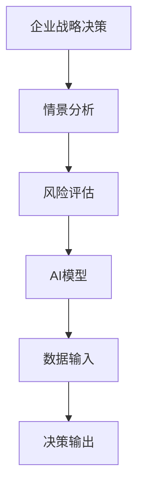
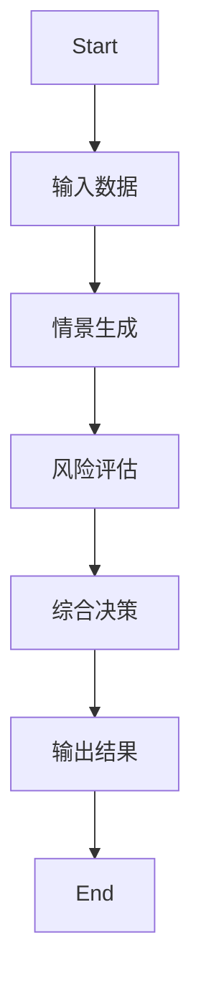
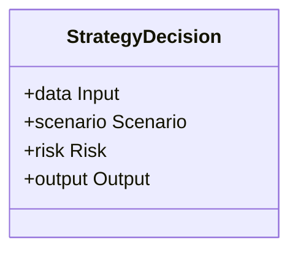
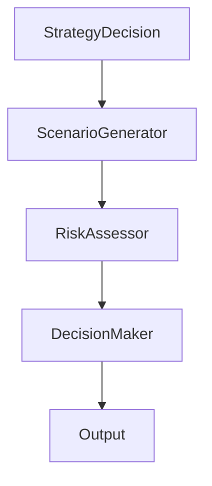
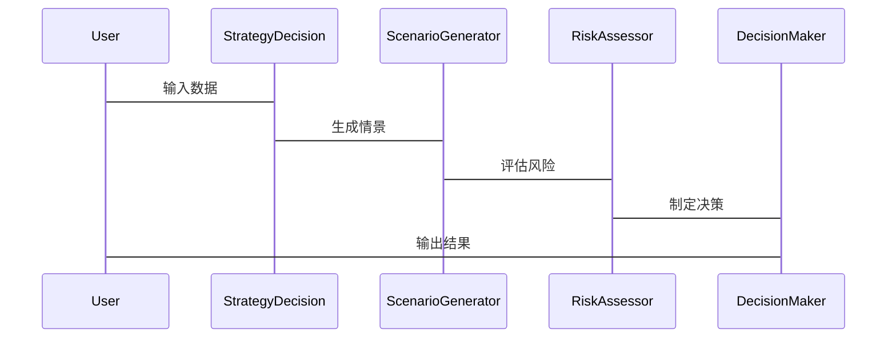

                 


# AI辅助企业战略决策：情景分析与风险评估

## 关键词：
- 人工智能（AI）
- 企业战略决策
- 情景分析
- 风险评估
- AI算法
- 系统架构
- 项目实战

## 摘要：
本文将深入探讨人工智能如何辅助企业进行战略决策，重点分析情景分析与风险评估的核心概念、算法原理、系统架构及项目实战。通过详细讲解AI在企业战略决策中的应用，帮助读者理解如何利用AI技术提升决策的准确性和效率。文章从背景介绍、核心概念、算法原理、系统架构、项目实战到最佳实践，层层递进，全面解析AI辅助企业战略决策的理论与实践。

---

# 第一部分: AI辅助企业战略决策的背景与核心概念

## 第1章: AI辅助企业战略决策的背景与问题分析

### 1.1 企业战略决策的背景与挑战
企业战略决策是企业在复杂多变的市场环境中，为实现长期发展目标而制定的重要决策。传统的企业战略决策依赖于经验丰富的管理层和专家团队，但随着市场竞争的加剧和数据量的爆炸式增长，这种方法逐渐暴露出效率低、覆盖面有限、主观性强等问题。

#### 1.1.1 企业战略决策的传统模式
传统的战略决策模式主要依赖于以下几个方面：
1. **经验判断**：决策者基于个人经验和行业知识进行判断。
2. **数据支持**：通过财务报表、市场调研等数据提供支持。
3. **专家意见**：依赖外部专家或顾问的意见。

#### 1.1.2 数字化转型对企业决策的影响
数字化转型为企业提供了海量数据和强大的计算能力，使得数据驱动的决策成为可能。企业可以通过大数据分析、人工智能等技术，从海量数据中提取有价值的信息，辅助战略决策。

#### 1.1.3 AI在企业决策中的作用与价值
AI通过以下方式赋能企业战略决策：
1. **数据处理能力**：AI能够快速处理和分析海量数据，提取关键信息。
2. **模式识别**：AI能够识别数据中的模式和趋势，帮助预测未来可能的情况。
3. **情景模拟**：通过AI技术，企业可以模拟不同情景下的结果，评估各种决策的可行性。

### 1.2 情景分析与风险评估的核心概念
情景分析和风险评估是企业战略决策中的两个重要环节。情景分析通过模拟不同情景，帮助企业了解可能的结果；风险评估则通过量化风险，帮助企业制定应对策略。

#### 1.2.1 情景分析的定义与特点
情景分析是一种通过构建不同情景来预测未来结果的方法。其特点包括：
1. **多样性**：情景分析可以涵盖多种可能的情况。
2. **动态性**：情景可以根据实时数据进行调整。
3. **预测性**：情景分析可以帮助企业预测未来可能的结果。

#### 1.2.2 风险评估的基本原理
风险评估是通过分析潜在风险，评估其对战略决策的影响。其基本原理包括：
1. **风险识别**：识别可能的风险因素。
2. **风险量化**：评估风险的严重程度。
3. **风险应对**：制定应对策略。

#### 1.2.3 AI如何赋能情景分析与风险评估
AI通过以下方式赋能情景分析与风险评估：
1. **数据驱动**：AI可以利用大数据进行情景模拟和风险评估。
2. **自动化**：AI可以自动化处理数据，提高效率。
3. **动态调整**：AI可以根据实时数据动态调整情景和风险评估结果。

### 1.3 本章小结
本章介绍了企业战略决策的背景与挑战，重点分析了AI在其中的作用与价值。通过情景分析和风险评估的核心概念，帮助企业更好地理解AI在战略决策中的应用。

---

## 第2章: AI辅助战略决策的核心概念与联系

### 2.1 核心概念原理
AI辅助战略决策的核心概念包括情景分析和风险评估，其原理如下：
1. **情景分析**：通过构建不同情景，预测未来结果。
2. **风险评估**：通过量化风险，制定应对策略。

#### 2.1.1 情景分析的数学模型
情景分析的数学模型可以通过概率分布来描述：
$$ P(s) = \sum_{i=1}^{n} p_i \cdot s_i $$
其中，\( p_i \) 是情景 \( s_i \) 的概率。

#### 2.1.2 风险评估的算法原理
风险评估可以通过蒙特卡洛模拟来实现，具体步骤如下：
1. **定义风险因素**：识别可能影响战略决策的风险因素。
2. **模拟风险场景**：通过蒙特卡洛模拟生成多个风险场景。
3. **评估风险影响**：计算每个场景的风险影响。

### 2.2 核心概念属性特征对比
通过对比分析，帮助企业更好地理解情景分析和风险评估的区别与联系。

#### 2.2.1 情景分析与风险评估的对比分析
| 属性 | 情景分析 | 风险评估 |
|------|----------|----------|
| 目的 | 预测未来结果 | 评估风险影响 |
| 方法 | 情景模拟 | 蒙特卡洛模拟 |
| 输出 | 情景结果 | 风险概率 |

#### 2.2.2 不同AI模型的性能对比
| 模型 | 情景分析能力 | 风险评估能力 |
|------|--------------|--------------|
| 决策树 | 强 | 弱 |
| 支持向量机 | 中 | 强 |
| 神经网络 | 强 | 强 |

#### 2.2.3 传统方法与AI方法的优劣势分析
- **传统方法**：依赖经验，主观性强；数据处理能力有限。
- **AI方法**：数据处理能力强，结果更客观；但需要大量数据支持。

### 2.3 ER实体关系图架构
以下是情景分析与风险评估的实体关系图：



### 2.4 本章小结
本章通过核心概念原理、属性特征对比和实体关系图，帮助企业更好地理解AI辅助战略决策的核心概念与联系。

---

## 第3章: AI辅助战略决策的算法原理

### 3.1 算法原理概述
AI辅助战略决策的算法主要包括情景生成算法和风险评估算法。

#### 3.1.1 情景生成算法
情景生成算法通过构建不同的情景，模拟未来可能的结果。

#### 3.1.2 风险评估算法
风险评估算法通过量化风险，评估其对战略决策的影响。

#### 3.1.3 综合决策算法
综合决策算法通过综合考虑情景和风险评估结果，制定最终决策。

### 3.2 算法流程图
以下是AI辅助战略决策的算法流程图：



### 3.3 算法实现代码
以下是AI辅助战略决策的算法实现代码：

```python
def scenario_analysis(data):
    # 情景生成算法
    pass

def risk_assessment(data):
    # 风险评估算法
    pass

def decision_making(data):
    # 综合决策算法
    pass
```

### 3.4 数学模型与公式
#### 3.4.1 情景分析模型
$$ P(s) = \sum_{i=1}^{n} p_i \cdot s_i $$

#### 3.4.2 风险评估模型
$$ R = \sum_{j=1}^{m} q_j \cdot r_j $$

### 3.5 本章小结
本章详细讲解了AI辅助战略决策的算法原理，包括情景生成算法、风险评估算法和综合决策算法。

---

## 第4章: 系统分析与架构设计

### 4.1 系统分析
通过系统分析，帮助企业更好地理解AI辅助战略决策的系统架构。

#### 4.1.1 项目介绍
本项目旨在通过AI技术，帮助企业进行战略决策。

#### 4.1.2 系统功能设计
以下是系统功能设计的类图：



#### 4.1.3 系统架构设计
以下是系统架构设计的架构图：



### 4.2 系统接口设计
系统接口设计包括输入接口和输出接口。

#### 4.2.1 输入接口
输入接口包括数据输入和参数输入。

#### 4.2.2 输出接口
输出接口包括情景结果和风险评估结果。

### 4.3 系统交互序列图
以下是系统交互序列图：



### 4.4 本章小结
本章通过系统分析与架构设计，帮助企业更好地理解AI辅助战略决策的系统架构。

---

## 第5章: 项目实战

### 5.1 环境安装
安装必要的软件和库，例如Python、TensorFlow、Scikit-learn等。

### 5.2 系统核心实现
以下是系统核心实现代码：

```python
import numpy as np
from sklearn.tree import DecisionTreeRegressor

def scenario_analysis(data):
    model = DecisionTreeRegressor()
    model.fit(data.features, data.targets)
    return model.predict(data.new_features)

def risk_assessment(data):
    model = DecisionTreeRegressor()
    model.fit(data.features, data.targets)
    return model.predict(data.new_features)

def decision_making(data):
    scenario = scenario_analysis(data)
    risk = risk_assessment(data)
    return scenario * risk
```

### 5.3 案例分析
通过具体案例分析，帮助企业更好地理解AI辅助战略决策的应用。

### 5.4 本章小结
本章通过项目实战，帮助企业更好地理解AI辅助战略决策的实现过程。

---

## 第6章: 最佳实践与总结

### 6.1 小结
总结AI辅助战略决策的核心概念与算法原理。

### 6.2 注意事项
注意事项包括数据质量、模型选择、结果解释等。

### 6.3 拓展阅读
推荐进一步阅读的资料，包括相关书籍和论文。

---

## 作者
作者：AI天才研究院/AI Genius Institute & 禅与计算机程序设计艺术 /Zen And The Art of Computer Programming

---

通过以上内容，我们全面解析了AI辅助企业战略决策的理论与实践，帮助企业更好地理解AI在战略决策中的应用。

