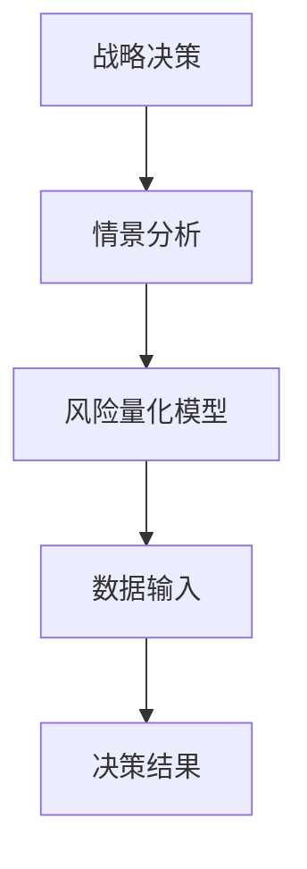
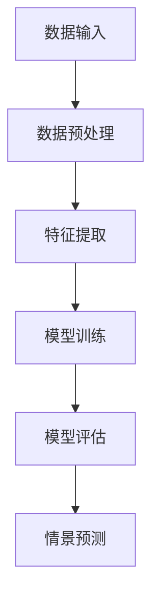
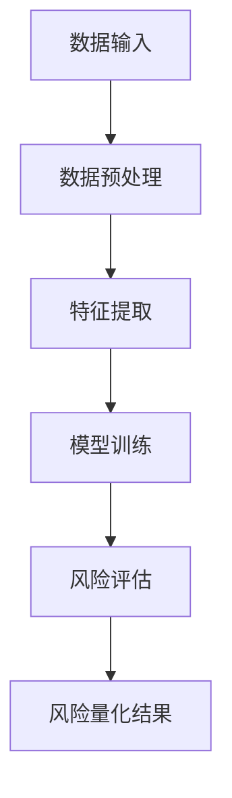
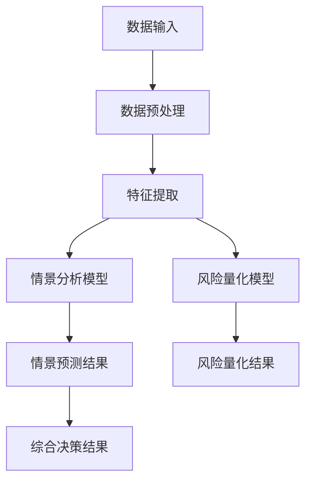
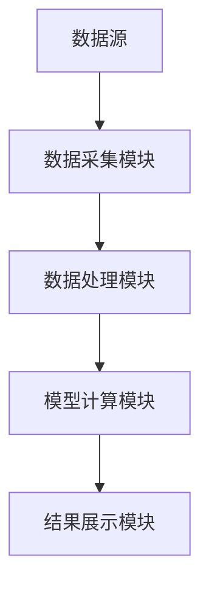
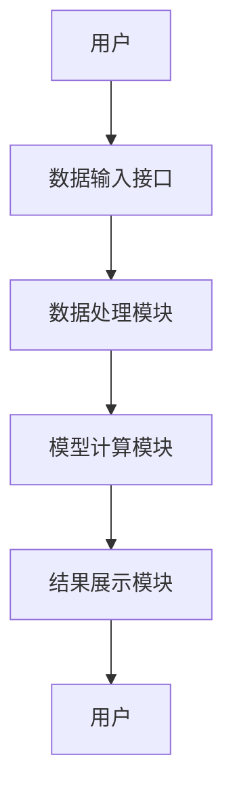

                 


# AI辅助企业战略决策：情景分析与风险量化模型

> 关键词：AI，企业战略决策，情景分析，风险量化，机器学习，深度学习，NLP，数学模型

> 摘要：本文详细探讨了AI技术在企业战略决策中的应用，特别是情景分析与风险量化模型的构建。通过分析传统决策的局限性，介绍了AI技术如何提升决策效率和准确性。文章结合实际案例，深入讲解了算法原理、数学模型和系统架构设计，为企业应用AI技术提供了指导和参考。

---

## 第1章 AI辅助企业战略决策概述

### 1.1 AI在企业决策中的作用

#### 1.1.1 传统企业决策方式的局限性

传统的企业决策主要依赖于经验和人工分析，这种方式存在以下问题：

- 数据处理能力有限：无法处理大量复杂数据。
- 决策周期长：人工分析效率低。
- 风险预测不足：难以预见潜在风险。

#### 1.1.2 AI技术对企业决策的变革

AI技术通过以下方式改变了企业决策：

- 数据处理能力强：AI可以快速处理大量数据，提供实时分析。
- 决策效率高：通过自动化分析缩短决策周期。
- 风险预测准确：利用机器学习模型预测潜在风险。

#### 1.1.3 战略决策的核心要素与AI的结合

战略决策的核心要素包括目标设定、资源分配、风险评估等。AI技术通过数据挖掘、预测分析和优化模型，将这些要素有机结合，提升决策的科学性和准确性。

### 1.2 情景分析与风险量化的重要性

#### 1.2.1 情景分析的定义与应用场景

情景分析是一种通过构建不同情景来评估可能结果的方法，常用于市场分析、财务预测等领域。

#### 1.2.2 风险量化在战略决策中的作用

风险量化通过数学模型评估风险的概率和影响程度，帮助企业在决策中考虑潜在风险。

#### 1.2.3 情景分析与风险量化的关系

情景分析提供多种可能的未来情况，风险量化则评估每种情况下的风险，两者结合可以制定更全面的决策策略。

### 1.3 本书的目标与结构安排

#### 1.3.1 本书的核心目标

- 探讨AI技术在企业战略决策中的应用。
- 提供情景分析与风险量化模型的构建方法。
- 通过案例分析展示模型的实际应用。

#### 1.3.2 本书的章节安排

- 第1章：AI辅助企业战略决策概述。
- 第2章：AI辅助决策的核心概念与联系。
- 第3章：情景分析模型的构建与实现。
- 第4章：风险量化模型的构建与实现。
- 第5章：情景分析与风险量化模型的综合构建。
- 第6章：系统架构与实现。
- 第7章：实战案例分析。
- 第8章：最佳实践与未来展望。

#### 1.3.3 本书的读者群体

- 企业决策者：希望通过AI技术优化决策过程。
- IT技术人员：希望了解AI在战略决策中的技术实现。
- 研究人员：希望深入研究相关模型和算法。

### 1.4 本章小结

本章介绍了AI在企业战略决策中的重要性，详细阐述了情景分析与风险量化模型的必要性，并概述了本书的结构和目标。

---

## 第2章 AI辅助决策的核心概念与联系

### 2.1 核心概念原理

#### 2.1.1 机器学习与深度学习的原理

- 机器学习：通过训练数据学习模式，用于预测和分类。
- 深度学习：利用多层神经网络，提取数据特征，适用于复杂模式识别。

#### 2.1.2 自然语言处理（NLP）在战略决策中的应用

NLP技术用于分析文本数据，提取关键词和情感倾向，辅助市场分析和竞争对手研究。

#### 2.1.3 数据驱动决策的数学模型

数学模型通过数据建模和优化算法，提供决策支持，如线性规划和非线性回归模型。

### 2.2 核心概念属性特征对比

| 比较维度 | 传统决策 | AI辅助决策 |
|----------|----------|------------|
| 数据处理能力 | 有限 | 强大 |
| 决策效率 | 低 | 高 |
| 风险预测 | 不够准确 | 高度准确 |

### 2.3 ER实体关系图架构



### 2.4 本章小结

本章介绍了AI辅助决策的核心概念，包括机器学习、深度学习和NLP技术，分析了它们在战略决策中的作用，并通过对比分析和实体关系图展示了各概念之间的联系。

---

## 第3章 情景分析模型的构建与实现

### 3.1 情景分析模型的算法原理

#### 3.1.1 基于机器学习的情景分析算法

使用随机森林和XGBoost等算法，从历史数据中学习模式，预测未来情景。

#### 3.1.2 深度学习在情景分析中的应用

利用LSTM网络处理时间序列数据，预测未来市场变化。

#### 3.1.3 情景分析的数学模型

构建多元回归模型，预测不同情景下的关键指标。

### 3.2 情景分析模型的实现步骤

#### 3.2.1 数据预处理与特征提取

- 数据清洗：处理缺失值和异常值。
- 特征工程：提取关键特征，如市场趋势和竞争对手动向。

#### 3.2.2 模型训练与优化

- 选择合适的算法，训练模型。
- 调参优化，提升模型性能。

#### 3.2.3 模型评估与验证

- 使用交叉验证评估模型准确性。
- 检查模型在不同情景下的表现。

### 3.3 情景分析模型的mermaid流程图



### 3.4 本章小结

本章详细讲解了情景分析模型的构建过程，从数据预处理到模型训练，再到评估和验证，展示了如何利用AI技术进行情景分析。

---

## 第4章 风险量化模型的构建与实现

### 4.1 风险量化模型的算法原理

#### 4.1.1 基于贝叶斯网络的风险量化方法

利用贝叶斯网络分析风险因素之间的依赖关系，评估风险概率。

#### 4.1.2 基于支持向量机的风险分类模型

通过SVM算法，将风险分为不同类别，评估其影响程度。

#### 4.1.3 风险量化模型的数学公式

$$ R = \sum_{i=1}^{n} p_i \times I_i $$

其中，$R$ 是总风险值，$p_i$ 是风险因素 $i$ 的概率，$I_i$ 是其影响程度。

### 4.2 风险量化模型的实现步骤

#### 4.2.1 数据收集与清洗

- 收集历史风险数据。
- 清洗数据，处理缺失值和异常值。

#### 4.2.2 风险指标体系建立

- 确定关键风险指标，如市场风险、操作风险。
- 设计指标权重，反映其重要性。

#### 4.2.3 模型训练与优化

- 使用训练数据训练模型。
- 调整模型参数，优化性能。

### 4.3 风险量化模型的mermaid流程图



### 4.4 本章小结

本章详细讲解了风险量化模型的构建过程，从数据处理到模型训练，再到评估和优化，展示了如何利用AI技术量化风险。

---

## 第5章 情景分析与风险量化模型的综合构建

### 5.1 综合模型的设计思路

#### 5.1.1 综合模型的目标

结合情景分析和风险量化，提供全面的决策支持。

#### 5.1.2 综合模型的架构设计

将情景分析和风险量化模型集成，提供一体化的分析结果。

### 5.2 综合模型的实现步骤

#### 5.2.1 数据整合与模型集成

- 整合情景分析和风险量化数据。
- 使用集成学习方法，优化模型性能。

#### 5.2.2 模型验证与优化

- 使用测试数据验证模型准确性。
- 调整模型参数，提升性能。

#### 5.2.3 实际案例分析

通过具体案例，展示综合模型的应用效果。

### 5.3 综合模型的mermaid流程图



### 5.4 本章小结

本章展示了如何将情景分析和风险量化模型结合起来，构建综合模型，提供更全面的决策支持。

---

## 第6章 系统架构与实现

### 6.1 系统架构设计

#### 6.1.1 系统功能模块

- 数据采集模块：收集相关数据。
- 数据处理模块：进行数据清洗和特征提取。
- 模型计算模块：运行情景分析和风险量化模型。
- 结果展示模块：可视化分析结果。

#### 6.1.2 系统架构图



### 6.2 系统接口设计

#### 6.2.1 接口定义

- 数据输入接口：接收原始数据。
- 模型调用接口：调用AI模型进行分析。
- 结果输出接口：返回分析结果。

#### 6.2.2 接口交互图



### 6.3 系统交互流程

用户通过界面输入数据，系统处理后返回分析结果，整个过程包括数据采集、处理、计算和展示。

### 6.4 本章小结

本章详细讲解了系统的架构设计和接口实现，展示了如何构建一个完整的AI辅助决策系统。

---

## 第7章 实战案例分析

### 7.1 案例背景介绍

#### 7.1.1 案例选择

选择一个典型行业，如金融行业，分析市场变化和风险因素。

### 7.2 系统实现与分析

#### 7.2.1 系统核心代码实现

```python
import pandas as pd
from sklearn.ensemble import RandomForestClassifier

# 数据加载
data = pd.read_csv('input.csv')

# 特征提取
features = data.drop('label', axis=1)
labels = data['label']

# 模型训练
model = RandomForestClassifier()
model.fit(features, labels)

# 模型预测
predictions = model.predict(features)
```

#### 7.2.2 代码应用解读与分析

解释代码的功能，展示如何加载数据、提取特征、训练模型和进行预测。

### 7.3 实际案例分析

通过具体案例，展示模型的应用效果，分析结果并提出策略建议。

### 7.4 本章小结

本章通过实战案例，展示了AI技术在企业战略决策中的实际应用，验证了模型的有效性。

---

## 第8章 最佳实践与未来展望

### 8.1 最佳实践 tips

- 数据质量是关键：确保数据准确性和完整性。
- 模型选择要合理：根据实际需求选择合适的算法。
- 持续优化模型：定期更新数据和调整参数。

### 8.2 本章总结

总结全文内容，重申AI技术在企业战略决策中的重要性。

### 8.3 未来展望

探讨AI技术在企业决策中的未来发展方向，如强化学习和自适应模型的应用。

### 8.4 本章小结

本章总结了最佳实践，并展望了AI技术在企业决策中的未来应用。

---

## 作者信息

作者：AI天才研究院/AI Genius Institute & 禅与计算机程序设计艺术 /Zen And The Art of Computer Programming

---

通过以上章节的详细展开，本文全面探讨了AI辅助企业战略决策的实现方法，从理论到实践，为企业应用AI技术提供了系统的指导和参考。

