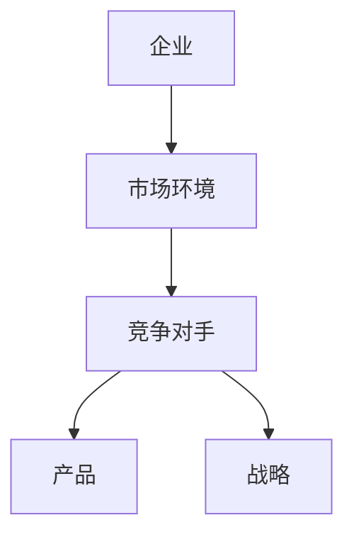
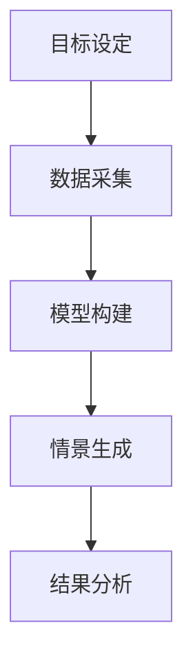
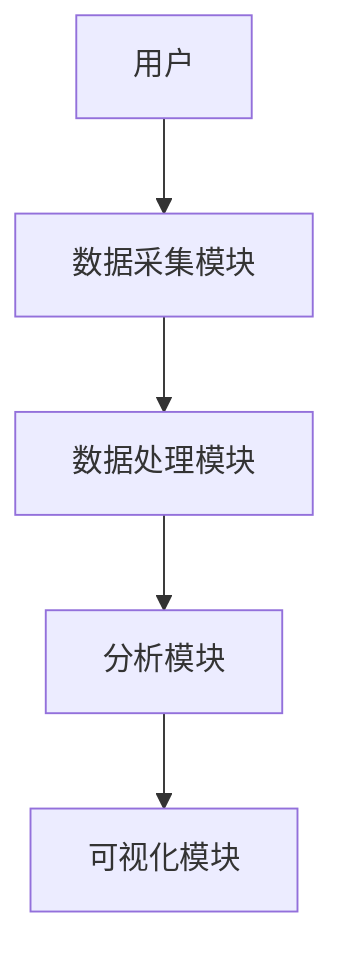
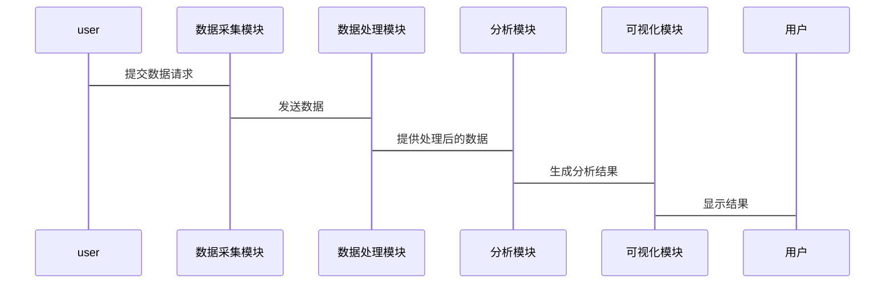

                 


# AI辅助企业战略制定：竞争态势分析与未来情景模拟

> 关键词：企业战略、人工智能、竞争分析、情景模拟、战略制定

> 摘要：随着人工智能技术的快速发展，企业战略制定正面临着前所未有的挑战和机遇。本文深入探讨了AI在竞争态势分析与未来情景模拟中的应用，分析了其对企业战略制定的支持作用，提供了从算法原理到系统实现的详细指导，最后通过实际案例展示了AI辅助企业战略制定的实践成果。

---

## 第1章：AI与企业战略制定的背景

### 1.1 企业战略制定的挑战

#### 1.1.1 传统企业战略制定的局限性
企业战略的制定往往依赖于经验和主观判断，存在信息不全、数据滞后、竞争分析不深入等问题，难以应对快速变化的市场环境。

#### 1.1.2 数字化转型对企业战略的新要求
在数字化转型的背景下，企业需要更快速、更精准地捕捉市场动态，传统的战略制定方法已无法满足需求。

#### 1.1.3 AI技术在企业战略中的潜力
AI技术能够通过大数据分析和模式识别，为企业提供实时、动态的竞争态势分析和未来情景模拟，显著提升战略制定的效率和准确性。

### 1.2 AI技术的核心概念与特点

#### 1.2.1 AI的定义与分类
人工智能（AI）是指计算机系统模拟人类智能的能力，包括学习、推理、自我改进等功能。AI可以分为弱人工智能和强人工智能，其中弱人工智能已在特定领域展现出强大的应用潜力。

#### 1.2.2 大模型在AI中的地位与作用
大模型（如GPT-4）通过海量数据训练，能够理解和生成人类语言，广泛应用于自然语言处理、信息提取等领域，为竞争态势分析提供了强大的工具。

#### 1.2.3 AI与企业战略的结合点
AI通过数据挖掘、预测分析和知识图谱构建，能够辅助企业在市场分析、竞争对手分析和战略规划中做出更明智的决策。

### 1.3 企业竞争态势分析的现状

#### 1.3.1 竞争态势分析的传统方法
传统方法依赖于市场调研、SWOT分析等，但存在数据获取困难、分析耗时长等问题。

#### 1.3.2 当前企业竞争分析的痛点
企业面临数据碎片化、竞争动态变化快、分析结果缺乏实时性等问题，传统方法难以满足需求。

#### 1.3.3 AI在竞争态势分析中的优势
AI能够快速处理海量数据，提取关键信息，构建竞争对手的知识图谱，提供实时的态势分析。

### 1.4 未来情景模拟的意义

#### 1.4.1 未来情景模拟的定义与作用
未来情景模拟是通过构建不同的假设场景，预测未来可能发生的变化，为企业战略提供参考。

#### 1.4.2 企业战略制定中的情景模拟需求
企业需要在复杂多变的环境中提前制定应对策略，情景模拟为其提供了可能性分析的工具。

#### 1.4.3 AI在情景模拟中的应用前景
AI能够基于历史数据和趋势，预测未来市场变化，构建多种情景，帮助企业制定更具前瞻性的战略。

---

## 第2章：AI辅助企业战略制定的核心概念

### 2.1 竞争态势分析的AI模型

#### 2.1.1 竞争态势分析的框架
AI驱动的竞争态势分析框架包括数据采集、信息处理、模型构建和结果输出四个阶段。

#### 2.1.2 基于AI的竞争分析方法
通过自然语言处理（NLP）和机器学习技术，AI可以从新闻、财报等文本数据中提取竞争信息，构建竞争对手的动态模型。

#### 2.1.3 竞争态势分析的实体关系图



### 2.2 未来情景模拟的AI模型

#### 2.2.1 情景模拟的基本原理
情景模拟基于历史数据和趋势，通过机器学习算法预测未来可能发生的变化，构建多种情景。

#### 2.2.2 基于AI的情景模拟方法
利用时间序列分析和预测模型（如ARIMA），AI能够生成未来市场趋势的多种预测结果。

#### 2.2.3 情景模拟的流程图



### 2.3 竞争态势与未来情景的关联

#### 2.3.1 竞争态势分析与情景模拟的关系
竞争态势分析提供当前市场状态，情景模拟基于此预测未来变化，两者共同为企业战略提供全面支持。

#### 2.3.2 竞争态势分析对企业战略的影响
通过实时分析竞争对手的动态，企业能够及时调整自身战略，保持竞争优势。

#### 2.3.3 情景模拟对企业战略的指导作用
情景模拟帮助企业在复杂环境中制定灵活的战略，降低风险，抓住机会。

---

## 第3章：AI辅助竞争态势分析的算法原理

### 3.1 竞争态势分析的算法框架

#### 3.1.1 数据预处理
数据清洗和特征提取是竞争态势分析的基础，确保数据质量和可用性。

#### 3.1.2 数据分析与建模
使用聚类分析和主题模型（如LDA）对竞争信息进行分类和主题提取。

#### 3.1.3 结果可视化
通过图表展示竞争态势，帮助决策者直观理解分析结果。

### 3.2 基于大模型的竞争态势分析

#### 3.2.1 大模型在竞争分析中的应用
利用大模型进行语义理解，从非结构化数据中提取关键信息。

#### 3.2.2 基于大模型的文本分析流程
从数据采集、文本清洗到模型训练和结果解析的完整流程。

#### 3.2.3 基于大模型的竞争分析案例
通过具体案例展示大模型在竞争分析中的实际应用。

### 3.3 竞争态势分析的数学模型

#### 3.3.1 竞争指数计算公式
$$竞争指数 = \frac{\sum_{i=1}^{n} w_i x_i}{\sum_{i=1}^{n} w_i}$$
其中，$w_i$为权重，$x_i$为指标值。

#### 3.3.2 竞争指数的计算步骤
1. 确定各竞争指标及其权重。
2. 收集相关数据，计算各指标得分。
3. 加权求和，得到竞争指数。

---

## 第4章：AI辅助未来情景模拟的算法原理

### 4.1 情景模拟的基本原理

#### 4.1.1 情景模拟的步骤
从目标设定到结果分析的完整流程。

#### 4.1.2 情景模拟的数学模型
时间序列预测模型，如ARIMA。

### 4.2 基于AI的情景模拟方法

#### 4.2.1 机器学习在情景模拟中的应用
使用回归分析和决策树进行预测和分类。

#### 4.2.2 情景模拟的流程图
展示从数据采集到结果分析的整个过程。

### 4.3 情景模拟的数学模型

#### 4.3.1 时间序列分析公式
$$ARIMA(p, d, q)$$
其中，$p$为自回归阶数，$d$为差分阶数，$q$为移动平均阶数。

#### 4.3.2 情景模拟的案例分析
通过具体案例展示模型的应用和结果解读。

---

## 第5章：系统架构与实现方案

### 5.1 系统功能设计

#### 5.1.1 数据采集模块
负责从多种来源获取数据，包括公开数据和内部数据。

#### 5.1.2 数据处理模块
对数据进行清洗、转换和特征提取。

#### 5.1.3 竞争态势分析模块
基于机器学习模型进行竞争分析，生成分析报告。

#### 5.1.4 未来情景模拟模块
构建情景模型，生成多种未来预测结果。

#### 5.1.5 可视化模块
将分析结果以图表形式展示，便于用户理解。

### 5.2 系统架构设计



#### 5.2.1 系统架构图
展示各模块之间的关系和数据流。

### 5.3 系统接口设计

#### 5.3.1 数据接口
定义数据输入和输出的格式，确保模块间数据一致。

#### 5.3.2 用户接口
设计友好的用户界面，方便用户交互。

### 5.4 系统交互设计



展示用户与系统之间的交互流程。

---

## 第6章：项目实战与案例分析

### 6.1 环境安装与配置

#### 6.1.1 安装Python
安装Python 3.x，确保版本兼容性。

#### 6.1.2 安装库
安装必要的库，如TensorFlow、Scikit-learn、Plotly。

#### 6.1.3 配置开发环境
配置Jupyter Notebook或IDE，便于代码编写和调试。

### 6.2 核心代码实现

#### 6.2.1 数据预处理代码

```python
import pandas as pd

def preprocess_data(data):
    # 数据清洗
    data = data.dropna()
    # 特征提取
    features = data[['feature1', 'feature2']]
    return features
```

#### 6.2.2 竞争态势分析代码

```python
from sklearn.cluster import KMeans

def competitor_analysis(features):
    # 聚类分析
    model = KMeans(n_clusters=3)
    model.fit(features)
    return model.labels_
```

#### 6.2.3 情景模拟代码

```python
from statsmodels.tsa.arima.model import ARIMA

def forecast_trend(data):
    # 时间序列预测
    model = ARIMA(data, order=(1, 1, 1))
    model_fit = model.fit()
    forecast = model_fit.forecast(10)
    return forecast
```

### 6.3 案例分析与结果解读

#### 6.3.1 案例背景
假设某企业在科技行业面临激烈竞争，希望通过AI分析竞争对手的动态。

#### 6.3.2 数据分析结果
通过聚类分析发现主要竞争对手的市场策略，生成竞争指数报告。

#### 6.3.3 情景模拟结果
预测未来三年的市场趋势，生成多种情景，帮助企业制定灵活的战略。

### 6.4 项目总结与经验分享

#### 6.4.1 项目总结
AI辅助企业战略制定显著提高了分析效率和准确性，为企业提供了有力支持。

#### 6.4.2 经验分享
数据质量是关键，选择合适的模型和工具能够事半功倍。

---

## 第7章：总结与展望

### 7.1 全文总结

本文详细探讨了AI在企业战略制定中的应用，从竞争态势分析到未来情景模拟，提供了完整的解决方案和实践案例，展示了AI技术的强大潜力。

### 7.2 未来展望

随着AI技术的不断进步，企业战略制定将更加智能化和数据驱动。未来，可以进一步研究多模态数据的融合，提升分析的深度和广度。

### 7.3 最佳实践与注意事项

在实施AI辅助战略制定时，企业应注重数据安全、模型可解释性，并结合企业的实际需求选择合适的技术方案。

---

## 作者

**作者：AI天才研究院/AI Genius Institute & 禅与计算机程序设计艺术 /Zen And The Art of Computer Programming**

---

以上是根据您的要求逐步展开的内容，涵盖了从背景介绍到系统实现的各个方面，提供了详细的技术指导和实际案例分析，确保读者能够全面理解AI在企业战略制定中的应用。

