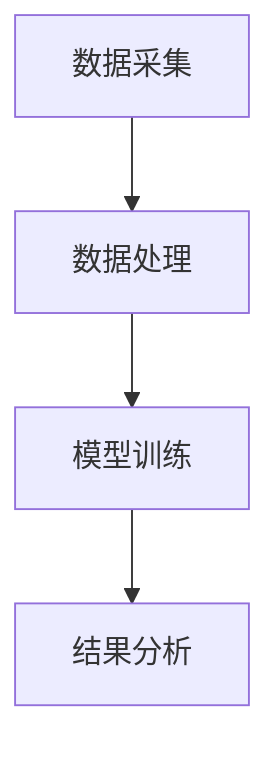
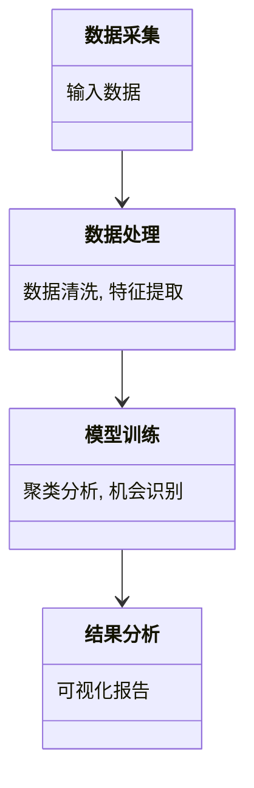

                 

# AI辅助企业战略制定：竞争态势分析与机会识别

> 关键词：AI辅助战略制定，竞争态势分析，机会识别，企业战略，数据驱动决策

> 摘要：本文探讨了如何利用人工智能技术辅助企业战略制定，重点分析了竞争态势分析与机会识别的核心方法。通过结合AI技术的优势，详细阐述了数据驱动决策的原理、算法实现、系统架构设计以及实际项目案例，为企业提供了一套高效的战略制定方案。

---

# 第一部分: AI辅助企业战略制定的背景与概念

## 第1章: AI辅助企业战略制定的背景与意义

### 1.1 企业战略制定的传统方法与挑战

#### 1.1.1 传统战略制定的流程与问题
传统的企业战略制定通常依赖于经验丰富的管理人员和市场调研报告，这种方法存在以下问题：
- 数据收集范围有限，难以覆盖全市场
- 分析结果主观性强，缺乏数据支持
- 竞争态势分析不够全面，难以发现潜在机会

#### 1.1.2 竞争态势分析的传统方法
传统竞争态势分析主要依赖SWOT分析和五力模型，但存在以下局限性：
- 分析结果过于主观，缺乏数据支持
- 需要大量人工分析，效率低下
- 无法实时更新，难以应对快速变化的市场

#### 1.1.3 机会识别的传统方式及其局限性
机会识别传统上依赖专家判断和市场趋势分析，但存在以下问题：
- 机会识别不够系统化
- 需要大量人工判断，效率低下
- 难以发现隐藏在大量数据中的潜在机会

### 1.2 AI技术对企业战略制定的变革

#### 1.2.1 AI技术的快速发展与应用
近年来，AI技术在各个领域的应用取得了显著进展，特别是在数据分析和预测方面。AI技术的应用可以帮助企业更高效地进行战略制定。

#### 1.2.2 数据驱动决策的优势
数据驱动决策通过利用大数据分析技术，能够从海量数据中提取有价值的信息，帮助企业做出更科学的决策。

#### 1.2.3 AI在竞争分析与机会识别中的潜力
AI技术可以通过自然语言处理、机器学习等技术，帮助企业更准确地进行竞争态势分析和机会识别。

---

## 第2章: AI辅助企业战略制定的核心概念

### 2.1 竞争态势分析的AI方法

#### 2.1.1 竞争态势分析的定义与维度
竞争态势分析是指通过对市场环境、竞争对手、行业趋势等多方面因素的综合分析，评估企业在市场中的竞争地位。

#### 2.1.2 数据驱动的竞争分析模型
数据驱动的竞争分析模型通过收集和分析竞争对手的产品、价格、市场表现等数据，构建竞争态势分析的模型。

#### 2.1.3 AI在竞争态势分析中的应用案例
例如，某企业利用AI技术分析竞争对手的市场动态，发现潜在威胁并制定应对策略。

### 2.2 机会识别的AI方法

#### 2.2.1 机会识别的定义与关键因素
机会识别是指通过分析市场趋势、消费者需求等，发现潜在的商业机会。

#### 2.2.2 基于AI的机会识别模型
基于AI的机会识别模型通过自然语言处理、机器学习等技术，从大量数据中发现潜在机会。

#### 2.2.3 AI在机会识别中的优势
AI技术可以帮助企业快速分析大量数据，发现隐藏在数据中的机会。

---

## 第3章: AI辅助战略制定的核心技术与工具

### 3.1 数据采集与处理

#### 3.1.1 数据来源与类型
数据来源包括公开数据、企业内部数据、社交媒体数据等，数据类型包括结构化数据和非结构化数据。

#### 3.1.2 数据清洗与预处理
数据清洗包括去除噪声数据、填补缺失值等，预处理包括数据标准化、特征提取等。

#### 3.1.3 数据存储与管理
数据存储可以采用数据库、数据仓库等，数据管理需要考虑数据安全和数据隐私。

### 3.2 竞争态势分析的算法与模型

#### 3.2.1 基于聚类分析的竞争分析
聚类分析可以将竞争对手分为不同的类别，帮助企业更好地理解市场结构。

#### 3.2.2 基于自然语言处理的机会识别
自然语言处理技术可以分析竞争对手的产品描述，提取关键词，发现潜在机会。

#### 3.2.3 竞争态势分析的机器学习模型
机器学习模型可以通过训练数据，预测竞争对手的市场动态，帮助企业制定应对策略。

### 3.3 机会识别的算法与模型

#### 3.3.1 基于分类算法的机会识别
分类算法可以通过训练数据，识别潜在机会。

#### 3.3.2 基于深度学习的机会预测模型
深度学习模型可以分析复杂的市场动态，预测未来的市场趋势。

#### 3.3.3 机会识别的特征提取方法
特征提取方法可以将市场数据转化为易于分析的特征，帮助模型更好地识别机会。

---

## 第4章: AI辅助战略制定的系统架构与流程

### 4.1 系统架构设计

#### 4.1.1 系统功能模块划分
系统功能模块包括数据采集、数据处理、模型训练、结果分析等。

#### 4.1.2 系统架构图（Mermaid）

#### 4.1.3 系统接口设计
系统接口设计需要考虑数据输入输出的格式，以及与其他系统的集成。

### 4.2 竞争态势分析的流程

#### 4.2.1 数据采集与清洗
数据采集包括从公开数据源、竞争对手网站等获取数据，数据清洗包括去除噪声数据、填补缺失值等。

#### 4.2.2 竞争分析模型构建
竞争分析模型可以通过聚类分析、机器学习等技术构建。

#### 4.2.3 结果可视化与解读
结果可视化可以通过图表等形式展示竞争态势，帮助企业更好地理解分析结果。

### 4.3 机会识别的流程

#### 4.3.1 数据特征提取
数据特征提取包括从市场数据中提取关键词、趋势等特征。

#### 4.3.2 机会识别模型训练
机会识别模型可以通过训练数据，识别潜在机会。

#### 4.3.3 模型优化与部署
模型优化包括调整模型参数、评估模型性能等，模型部署可以通过API等方式提供服务。

---

## 第5章: 项目实战——AI辅助企业战略制定的实现

### 5.1 项目背景与目标

#### 5.1.1 项目背景
某企业希望利用AI技术进行竞争态势分析和机会识别，制定更科学的企业战略。

#### 5.1.2 项目目标
通过AI技术，帮助企业发现潜在机会，优化企业战略。

#### 5.1.3 项目范围
包括数据采集、模型训练、结果分析等。

### 5.2 系统功能设计

#### 5.2.1 系统功能模块
系统功能模块包括数据采集、数据处理、模型训练、结果分析等。

#### 5.2.2 系统功能设计图（Mermaid）

#### 5.2.3 系统功能实现
系统功能实现包括数据采集、数据处理、模型训练、结果分析等。

### 5.3 竞争态势分析的实现

#### 5.3.1 数据采集与清洗
数据采集包括从公开数据源获取竞争对手的数据，数据清洗包括去除噪声数据、填补缺失值等。

#### 5.3.2 竞争分析模型训练
竞争分析模型可以通过聚类分析等技术训练，识别竞争对手的市场动态。

#### 5.3.3 竞争态势分析结果
分析结果可以通过图表等形式展示，帮助企业理解竞争态势。

### 5.4 机会识别的实现

#### 5.4.1 数据特征提取
数据特征提取包括从市场数据中提取关键词、趋势等特征。

#### 5.4.2 机会识别模型训练
机会识别模型可以通过自然语言处理、机器学习等技术训练，识别潜在机会。

#### 5.4.3 机会识别结果
分析结果可以通过报告等形式展示，帮助企业识别潜在机会。

### 5.5 项目小结

#### 5.5.1 项目总结
通过AI技术，帮助企业实现了竞争态势分析和机会识别，制定更科学的企业战略。

#### 5.5.2 项目经验
项目实施过程中，需要注意数据质量、模型优化等问题。

---

## 第6章: 最佳实践与小结

### 6.1 最佳实践

#### 6.1.1 数据质量管理
数据质量管理是确保分析结果准确性的关键。

#### 6.1.2 模型优化与部署
模型优化包括调整模型参数、评估模型性能等，模型部署可以通过API等方式提供服务。

#### 6.1.3 人才与技术结合
企业需要结合内部人才和技术资源，制定科学的企业战略。

### 6.2 小结

#### 6.2.1 本文总结
本文详细介绍了AI辅助企业战略制定的方法，包括竞争态势分析和机会识别的核心技术与工具。

#### 6.2.2 未来展望
未来，随着AI技术的不断发展，企业战略制定将更加依赖于数据驱动决策。

---

作者：AI天才研究院/AI Genius Institute & 禅与计算机程序设计艺术 /Zen And The Art of Computer Programming

