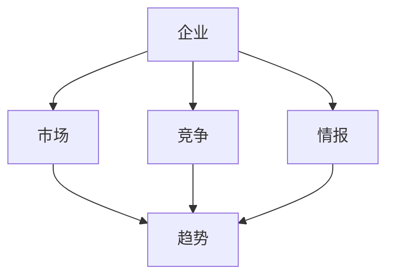
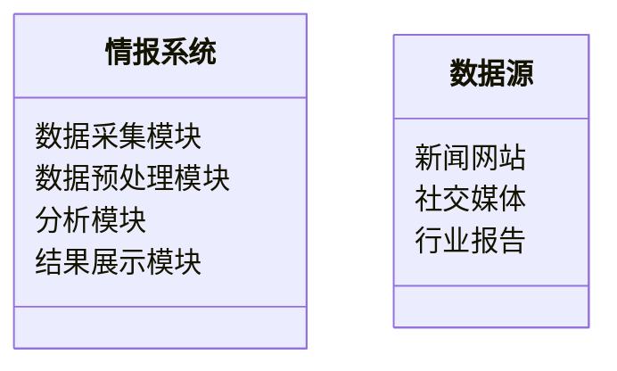
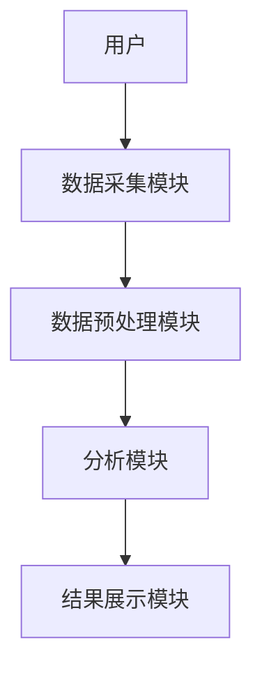
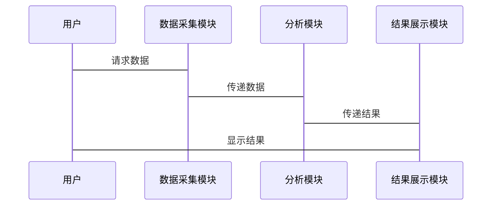

                 


# AI辅助企业战略情报收集：市场趋势与竞争分析

## 关键词：AI, 战略情报, 市场趋势, 竞争分析, 大数据, NLP, 机器学习

## 摘要：随着市场竞争的加剧，企业对及时准确的市场趋势和竞争情报需求日益迫切。AI技术，特别是自然语言处理（NLP）和机器学习模型，为企业提供了强大的工具，能够高效地收集、分析和预测市场数据。本文将深入探讨AI在企业战略情报收集中的应用，从算法原理到系统架构，再到实际案例，全面解析如何利用AI技术提升企业的市场洞察力和竞争力。

---

# 第一部分：背景介绍

## 第1章：问题背景与核心概念

### 1.1 问题背景

#### 1.1.1 战略情报收集的重要性
在当今快速变化的商业环境中，企业需要实时掌握市场动态、竞争对手的动向以及行业趋势。这些情报对于制定战略决策、优化业务模式和提升竞争力至关重要。然而，传统的信息收集方法往往依赖于人工调研，效率低下且成本高昂，难以满足现代企业的需求。

#### 1.1.2 问题描述
企业面临以下挑战：
- 数据来源分散，包括新闻、社交媒体、行业报告等，难以整合。
- 数据量庞大，人工分析耗时且容易出错。
- 竞争对手的策略变化迅速，企业需要实时情报来做出快速反应。

#### 1.1.3 AI技术的解决方案
AI技术，尤其是自然语言处理（NLP）和机器学习，能够自动抓取、分析和预测市场数据，帮助企业在短时间内获取关键情报，显著提高效率和准确性。

### 1.2 核心概念与问题解决

#### 1.2.1 AI辅助情报收集的定义
AI辅助情报收集是指利用人工智能技术，通过自动化手段从多种数据源中提取、分析和总结相关信息，为企业提供战略决策支持的过程。

#### 1.2.2 战略情报的构成要素
战略情报包括市场趋势、竞争对手分析、行业动态、消费者行为等多个方面。

#### 1.2.3 问题解决与边界
AI技术的应用边界包括：
- 数据源的多样性和可获取性。
- 模型的准确性和泛化能力。
- 道德和法律问题，如数据隐私和版权问题。

### 1.3 边界与外延

#### 1.3.1 核心要素
- 数据源：新闻网站、社交媒体、行业报告等。
- 分析模型：NLP、机器学习模型。
- 用户需求：实时情报、预测分析。

#### 1.3.2 系统架构
- 数据采集模块：负责从多个数据源抓取数据。
- 数据预处理模块：清洗和标注数据。
- 分析模块：应用NLP和机器学习模型进行分析。
- 结果展示模块：以可视化方式呈现情报。

---

# 第二部分：核心概念与联系

## 第2章：核心概念与原理

### 2.1 AI技术在情报收集中的应用

#### 2.1.1 自然语言处理（NLP）
NLP技术用于从文本数据中提取关键信息，如情感分析、关键词提取和实体识别。

#### 2.1.2 机器学习模型
机器学习模型用于分类、聚类和预测，帮助识别市场趋势和竞争对手策略。

### 2.2 核心概念对比

#### 2.2.1 对比分析
| 对比维度 | 传统方法 | AI技术 |
|----------|----------|--------|
| 效率 | 低 | 高 |
| 准确性 | 一般 | 高 |
| 成本 | 高 | 低 |

#### 2.2.2 ER实体关系图


---

# 第三部分：算法原理与数学模型

## 第3章：算法原理讲解

### 3.1 算法流程

#### 3.1.1 数据预处理
- 清洗数据：去除噪声和无关信息。
- 标注数据：提取关键词和实体。

#### 3.1.2 模型训练
- 使用NLP模型（如BERT）进行文本表示。
- 应用机器学习模型（如SVM）进行分类。

#### 3.1.3 结果分析
- 可视化结果：生成图表和报告。

### 3.2 Python代码实现

```python
import numpy as np
from sklearn import svm

# 数据预处理
X = np.array([[0, 0], [1, 1], [2, 2], [3, 3]])
y = np.array([0, 1, 2, 3])

# 模型训练
model = svm.SVC()
model.fit(X, y)

# 预测
print(model.predict([[4,4]]))
```

### 3.3 数学模型与公式

#### 3.3.1 分类算法
$$ P(y|x) = \frac{P(x|y)P(y)}{P(x)} $$

---

# 第四部分：系统分析与架构设计

## 第4章：系统架构

### 4.1 系统场景介绍
企业需要实时监控市场动态，快速获取竞争对手的最新信息。

### 4.2 领域模型设计



### 4.3 系统架构设计



### 4.4 接口与交互设计



---

# 第五部分：项目实战

## 第5章：项目实现

### 5.1 环境安装
安装Python和必要的库（如scikit-learn、NLTK）。

### 5.2 核心代码实现

```python
from sklearn.feature_extraction.text import TfidfVectorizer
from sklearn.svm import SVC

# 数据预处理
corpus = ["This is a sample text.", "Another example text.", "This is the third text."]

vectorizer = TfidfVectorizer()
X = vectorizer.fit_transform(corpus)

model = SVC()
model.fit(X, [0, 1, 2])

# 预测
new_doc = ["New text to classify."]
X_new = vectorizer.transform([new_doc])
print(model.predict(X_new))
```

### 5.3 案例分析
分析竞争对手的新闻，提取关键词并预测市场趋势。

---

# 第六部分：最佳实践

## 第6章：经验总结

### 6.1 小结
AI技术显著提高了企业情报收集的效率和准确性。

### 6.2 注意事项
- 数据隐私和版权问题。
- 模型的准确性和可解释性。

### 6.3 拓展阅读
推荐学习深度学习和强化学习，以进一步提升模型性能。

---

# 小结

AI技术在企业战略情报收集中的应用前景广阔，能够帮助企业实时掌握市场动态，制定科学的决策。随着技术的进步，未来将有更多创新应用出现。

---

# 作者

作者：AI天才研究院/AI Genius Institute & 禅与计算机程序设计艺术 /Zen And The Art of Computer Programming

