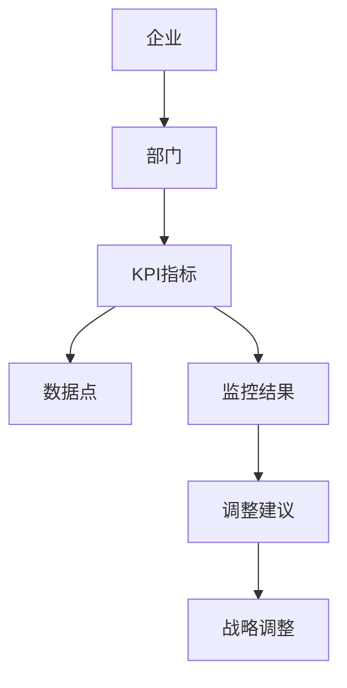
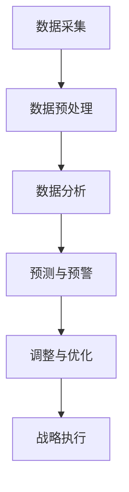

                 

# AI辅助企业战略执行：KPI监控与调整

**关键词：** 人工智能、KPI监控、战略执行、数据驱动、企业绩效管理

**摘要：** 本文探讨了如何利用人工智能技术辅助企业战略执行中的KPI监控与调整。通过分析KPI的核心概念、AI在KPI监控中的应用、算法原理、系统架构设计以及项目实战，文章详细阐述了AI如何赋能企业绩效管理，提升战略执行效率。文章还提供了数学模型、系统架构图和代码示例，帮助读者全面理解AI辅助KPI监控的实现过程。

---

# 第一部分: AI辅助企业战略执行概述

## 第1章: AI辅助企业战略执行的背景与意义

### 1.1 企业战略执行的挑战与机遇

#### 1.1.1 传统企业战略执行的痛点

企业战略执行是将企业战略目标转化为具体行动的过程，其成功与否直接关系到企业的生存与发展。然而，传统的企业战略执行过程中存在诸多痛点：

1. **KPI设定不科学**：传统的KPI（关键绩效指标）往往基于经验设定，缺乏数据支持，可能导致执行偏差。
2. **数据孤岛问题**：企业内部各部门之间数据分散，难以形成统一的监控体系。
3. **实时性不足**：传统KPI监控通常依赖定期报告，无法实现实时监控和快速调整。
4. **人工干预过多**：KPI的调整和优化需要大量人工分析，效率低下且容易出错。

#### 1.1.2 AI技术对企业战略执行的赋能

人工智能（AI）技术的快速发展为企业战略执行带来了新的可能性。AI可以通过以下方式赋能企业战略执行：

1. **数据驱动的决策**：AI能够整合和分析海量数据，提供科学的KPI设定和调整建议。
2. **实时监控与预测**：通过机器学习算法，AI可以实时监控KPI的变化，并预测未来趋势。
3. **自动化调整**：AI可以根据实时数据自动优化KPI，减少人工干预，提高效率。
4. **个性化策略**：AI能够根据企业实际情况制定个性化的战略执行方案。

#### 1.1.3 KPI监控与调整在企业战略中的核心地位

KPI是企业战略执行的核心工具，它能够量化企业的目标和成果，帮助管理层实时了解战略执行的效果。AI辅助KPI监控与调整能够显著提升战略执行的效率和效果，是企业数字化转型的重要组成部分。

### 1.2 AI辅助KPI监控与调整的定义与特点

#### 1.2.1 KPI的定义与分类

KPI（关键绩效指标）是衡量企业战略执行效果的重要工具。KPI可以根据不同的维度进行分类，例如：

- **财务类KPI**：如净利润率、投资回报率等。
- **客户类KPI**：如客户满意度、客户留存率等。
- **内部流程类KPI**：如生产效率、订单处理时间等。
- **学习与成长类KPI**：如员工培训率、员工满意度等。

#### 1.2.2 AI在KPI监控中的应用

AI在KPI监控中的应用主要体现在以下几个方面：

1. **数据采集与预处理**：AI可以帮助企业从多个数据源采集KPI相关数据，并进行清洗和转换。
2. **数据分析与预测**：通过机器学习算法，AI可以分析历史数据，预测未来KPI的变化趋势。
3. **异常检测与预警**：AI可以实时监控KPI的变化，发现异常情况并及时预警。
4. **自动化调整与优化**：AI可以根据实时数据自动调整KPI，优化战略执行方案。

#### 1.2.3 KPI监控与调整的边界与外延

KPI监控与调整的边界是指其应用范围和限制。例如，KPI监控不能替代企业的整体战略规划，它只是战略执行过程中的一个环节。KPI监控的外延则包括与之相关的数据分析、决策支持等更广泛的内容。

### 1.3 本章小结

本章从企业战略执行的背景出发，分析了传统KPI监控的痛点，介绍了AI技术在KPI监控中的应用，明确了KPI监控与调整的核心地位及其定义与特点。为后续章节的深入讨论奠定了基础。

---

# 第二部分: KPI监控的核心概念与联系

## 第2章: KPI监控的核心要素与AI的结合

### 2.1 KPI监控的核心要素

#### 2.1.1 KPI的构成要素

KPI的构成要素主要包括目标、指标、权重、时间范围和责任人。例如，某企业的销售KPI可以设定为“季度销售额达到1000万元”，其中销售额是指标，季度是时间范围，销售部门是责任人。

#### 2.1.2 KPI的分类与应用场景

KPI可以根据不同的分类标准进行划分，例如：

- **财务类KPI**：适用于衡量企业的财务健康状况。
- **客户类KPI**：适用于衡量客户满意度和客户关系管理。
- **内部流程类KPI**：适用于优化企业内部流程和运营效率。

#### 2.1.3 KPI监控的核心要素对比表

| 核心要素 | 传统KPI监控 | AI辅助KPI监控 |
|----------|--------------|----------------|
| 数据来源 | 结构化数据    | 结构化+非结构化数据 |
| 数据处理 | 手动处理      | 自动化处理      |
| 分析方法 | 统计分析      | 统计分析+机器学习 |
| 调整方式 | 人工调整      | 自动化调整      |

#### 2.1.4 KPI监控的ER实体关系图

### 2.2 AI在KPI监控中的应用

#### 2.2.1 数据采集与处理

AI可以通过多种数据源（如数据库、API、传感器等）采集KPI相关数据，并通过数据清洗、转换等步骤进行预处理。

#### 2.2.2 数据分析与预测

AI可以利用机器学习算法（如线性回归、随机森林等）对KPI数据进行分析，预测未来趋势。

#### 2.2.3 自动化调整与优化

AI可以根据实时数据自动调整KPI，优化战略执行方案。

### 2.3 KPI监控系统的流程图

---

## 总结

通过以上章节的讨论，我们可以看到，AI辅助企业战略执行中的KPI监控与调整是一个复杂而系统的过程。从数据采集、分析到预测、调整，每一步都需要精确的算法和系统的架构设计。AI的应用不仅提高了KPI监控的效率，还为企业提供了更科学的决策支持。接下来的章节将进一步探讨AI辅助KPI监控的算法原理、系统架构设计以及实际项目中的应用，帮助读者更好地理解和应用这些技术。

---

**作者：AI天才研究院/AI Genius Institute & 禅与计算机程序设计艺术 /Zen And The Art of Computer Programming**

