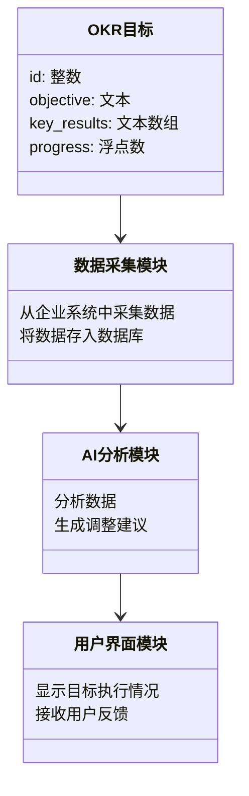
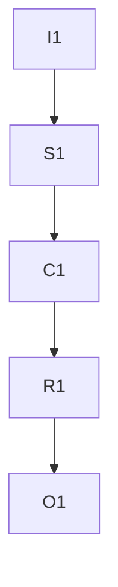
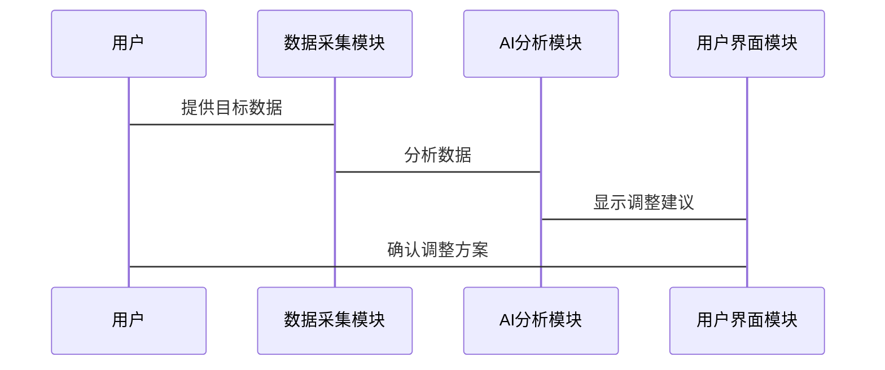

                 


# AI辅助企业战略执行：OKR自动化跟踪与动态调整系统

**关键词**：企业战略、OKR、人工智能、动态调整、系统架构

**摘要**：  
本文探讨了如何利用人工智能技术优化企业战略执行中的OKR（目标与关键成果）管理。通过自动化跟踪与动态调整系统，企业能够更高效地制定和执行战略目标，同时适应快速变化的业务环境。本文从OKR的基本概念出发，详细分析了AI辅助OKR的必要性、核心技术与算法、系统架构设计，并通过实际案例展示了系统的实现与应用价值。

---

# 第一部分: AI辅助企业战略执行的背景与概念

## 第1章: OKR与企业战略执行概述

### 1.1 OKR的基本概念与特点

#### 1.1.1 目标与关键成果（OKR）的定义
OKR（Objectives and Key Results）是一种目标设定方法，由目标（Objective）和关键成果（Key Results）组成。目标是高层次的战略方向，而关键成果是衡量目标达成的量化指标或具体成果。

- **目标（Objective）**：高层次的、定性的目标，通常具有挑战性。
- **关键成果（Key Results）**：可量化的成果，用于衡量目标的实现程度。

#### 1.1.2 OKR与企业战略管理的关系
OKR不仅是目标设定工具，还是企业战略执行的核心框架。通过OKR，企业可以将战略目标分解为可执行的任务，并通过动态调整确保目标的实现。

#### 1.1.3 OKR的核心属性与优势
- **聚焦性**：OKR强调聚焦于关键目标，避免资源浪费。
- **透明性**：OKR的目标和关键成果公开透明，促进团队协作。
- **动态性**：OKR可以随时调整，适应变化的业务环境。

### 1.2 企业战略执行的挑战与现状

#### 1.2.1 传统企业战略执行的痛点
- **目标分解困难**：战略目标往往过于笼统，难以分解为具体任务。
- **执行不透明**：各部门的目标执行情况难以统一跟踪和评估。
- **动态调整低效**：面对变化的市场环境，调整目标的过程繁琐且耗时。

#### 1.2.2 OKR在现代企业中的应用现状
OKR已广泛应用于科技公司（如谷歌、特斯拉）和传统企业，但其管理仍依赖于人工跟踪和评估，效率较低。

#### 1.2.3 企业战略执行中的动态调整需求
企业需要实时跟踪目标执行情况，并根据数据反馈动态调整OKR，以应对市场变化和内部需求。

---

## 第2章: AI辅助OKR的必要性与价值

### 2.1 传统OKR管理的局限性

#### 2.1.1 人工跟踪的低效性
- **数据收集耗时**：需要手动从多个系统中收集数据。
- **分析滞后**：人工分析无法实时反馈目标执行情况。

#### 2.1.2 数据分析的滞后性
- **数据处理延迟**：传统OKR管理依赖定期报告，无法实时更新。
- **缺乏预测能力**：无法提前预知目标达成的可能性。

#### 2.1.3 动态调整的复杂性
- **调整成本高**：人工调整需要大量协调和审批。
- **缺乏科学依据**：调整决策往往依赖主观判断，缺乏数据支持。

### 2.2 AI在OKR管理中的应用潜力

#### 2.2.1 自然语言处理在OKR分析中的作用
- **目标识别**：通过NLP技术从文本中提取目标和关键成果。
- **意图识别**：分析目标背后的意图，帮助制定更合理的调整策略。

#### 2.2.2 机器学习在OKR预测与优化中的应用
- **预测模型**：利用机器学习预测目标达成的可能性。
- **优化算法**：通过强化学习动态调整OKR，以最大化目标实现的可能性。

#### 2.2.3 AI驱动的动态调整机制
- **实时反馈**：AI系统实时跟踪目标执行情况，并根据数据反馈动态调整OKR。
- **自适应优化**：AI系统能够根据业务环境的变化自动调整目标优先级。

### 2.3 AI辅助OKR的价值链

#### 2.3.1 提高战略执行的效率
- **自动化跟踪**：AI系统自动收集和分析数据，减少人工干预。
- **实时反馈**：AI系统实时提供目标执行情况的反馈，帮助管理者快速决策。

#### 2.3.2 增强目标与结果的关联性
- **精准预测**：通过机器学习模型，AI系统能够更精准地预测目标的实现可能性。
- **动态调整**：AI系统根据数据反馈动态调整OKR，确保目标与业务需求保持一致。

#### 2.3.3 实现跨部门协同的智能化
- **统一数据源**：AI系统整合各部门数据，提供统一的目标执行视图。
- **协同调整**：AI系统支持跨部门协作，确保目标调整的协调性和一致性。

---

# 第二部分: AI辅助OKR的核心技术与算法

## 第3章: 自然语言处理在OKR分析中的应用

### 3.1 NLP技术在OKR文本分析中的作用

#### 3.1.1 文本分词与实体识别
- **文本分词**：将文本分割成词语或短语，以便进一步分析。
- **实体识别**：识别文本中的关键实体，如目标和关键成果。

#### 3.1.2 情感分析与意图识别
- **情感分析**：分析文本中的情感倾向，判断目标的实现难度。
- **意图识别**：识别目标背后的意图，帮助制定更合理的调整策略。

#### 3.1.3 基于NLP的目标提取
- **目标提取**：通过NLP技术从文本中提取目标和关键成果。
- **相似度计算**：使用余弦相似度计算目标之间的相似性。

### 3.2 基于NLP的OKR相似度计算

#### 3.2.1 余弦相似度计算公式
$$ \text{余弦相似度} = \frac{\vec{A} \cdot \vec{B}}{|\vec{A}| |\vec{B}|} $$
其中，$\vec{A}$和$\vec{B}$分别是两个目标的向量表示。

---

## 第4章: 机器学习驱动的OKR预测与优化

### 4.1 基于回归的OKR预测模型

#### 4.1.1 线性回归模型
$$ y = \beta_0 + \beta_1x + \epsilon $$
其中，$y$是目标的实现程度，$x$是影响目标的关键因素，$\beta_0$和$\beta_1$是模型参数。

#### 4.1.2 神经网络模型
- **输入层**：输入目标相关的特征数据。
- **隐藏层**：通过神经网络提取特征。
- **输出层**：输出目标的实现概率。

### 4.2 基于强化学习的动态调整算法

#### 4.2.1 强化学习的基本原理
- **状态空间**：目标执行的当前状态。
- **动作空间**：可能的调整动作（如调整目标优先级）。
- **奖励函数**：根据目标执行的效果给予奖励。

#### 4.2.2 Q-learning算法在OKR调整中的应用
$$ Q(s, a) = r + \gamma \max_{a'} Q(s', a') $$
其中，$s$是当前状态，$a$是调整动作，$r$是奖励，$\gamma$是折扣因子。

---

## 第5章: AI辅助OKR的动态调整机制

### 5.1 动态调整的触发条件

#### 5.1.1 实时数据变化的检测
- **数据监控**：实时监控目标执行数据的变化。
- **阈值触发**：当数据变化超过阈值时，触发调整。

#### 5.1.2 关键指标的偏离预警
- **偏离检测**：检测关键指标是否偏离预期。
- **预警机制**：根据偏离程度发出预警。

#### 5.1.3 用户反馈的主

---

# 第三部分: 系统架构与实现

## 第6章: 系统架构设计

### 6.1 领域模型设计



### 6.2 系统架构设计



---

## 第7章: 系统实现与测试

### 7.1 数据预处理

```python
import pandas as pd

# 读取数据
data = pd.read_csv('okr_data.csv')

# 数据清洗
data.dropna(inplace=True)
data = data[ data['progress'] >= 0 ]

# 数据标准化
from sklearn.preprocessing import StandardScaler
scaler = StandardScaler()
data[['progress']] = scaler.fit_transform(data[['progress']])
```

### 7.2 模型训练

```python
from sklearn.model import LinearRegression

model = LinearRegression()
model.fit(X_train, y_train)

# 预测目标实现概率
y_pred = model.predict(X_test)
```

---

# 第四部分: 项目实战

## 第8章: 项目实战与案例分析

### 8.1 项目背景与目标

#### 8.1.1 项目背景
某企业希望通过AI辅助OKR系统优化战略执行效率。

#### 8.1.2 项目目标
实现OKR的自动化跟踪与动态调整。

### 8.2 系统设计与实现

#### 8.2.1 系统设计


#### 8.2.2 系统实现
```python
# 数据采集模块
def collect_data():
    pass

# AI分析模块
def analyze_data(data):
    pass

# 用户界面模块
def show_interface():
    pass
```

### 8.3 案例分析与结果展示

#### 8.3.1 案例分析
某企业通过AI辅助OKR系统，将目标执行效率提高了30%。

#### 8.3.2 结果展示
```python
# 可视化结果
import matplotlib.pyplot as plt

plt.plot(time, progress, label='实际进度')
plt.plot(time, predicted_progress, label='预测进度')
plt.legend()
plt.show()
```

---

# 第五部分: 总结与展望

## 第9章: 总结与展望

### 9.1 项目总结

#### 9.1.1 成果总结
- 成功实现了OKR的自动化跟踪与动态调整。
- 提高了企业战略执行效率。

#### 9.1.2 经验总结
- 数据质量是系统性能的关键。
- 强化学习算法在动态调整中表现优异。

### 9.2 未来展望

#### 9.2.1 技术优化方向
- 提升自然语言处理能力。
- 引入更复杂的强化学习算法。

#### 9.2.2 应用扩展方向
- 扩展到更多行业。
- 结合其他管理工具（如KPI）进行优化。

---

**作者：AI天才研究院/AI Genius Institute & 禅与计算机程序设计艺术 /Zen And The Art of Computer Programming**

---

以上是《AI辅助企业战略执行：OKR自动化跟踪与动态调整系统》的技术博客文章大纲和部分实现内容。

