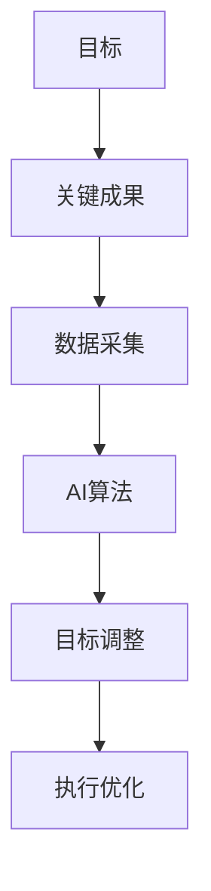
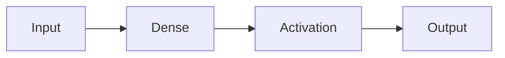

                 


# AI辅助企业战略执行：OKR自动化跟踪与调整

> 关键词：AI辅助、企业战略执行、OKR、目标管理、自动化跟踪

> 摘要：本文将探讨如何利用人工智能技术来优化企业战略执行中的OKR（目标与关键成果）管理。通过分析OKR的核心概念、AI辅助OKR的实现原理、算法模型、系统架构设计以及实际案例，本文将深入解析如何通过自动化跟踪与调整来提升企业战略执行效率。同时，文章还将提供详细的系统实现方案和代码示例，帮助读者更好地理解和应用AI辅助OKR的解决方案。

---

# 第一部分: AI辅助企业战略执行的背景与概念

## 第1章: OKR与企业战略管理概述

### 1.1 OKR的基本概念与特点

#### 1.1.1 目标与关键成果（OKR）的定义
目标（Objective）是组织或个人希望在未来某个时间点实现的结果，通常具有长期性和挑战性。关键成果（Key Results）是衡量目标实现程度的具体指标，通常采用定量或定性的方法来评估。

- **目标**：高层次、长期性的目标，例如“提升客户满意度”。
- **关键成果**：具体可衡量的成果，例如“客户满意度评分提高10%”。

OKR的特点包括：
- **透明性**：目标和关键成果对所有相关人员公开。
- **挑战性**：目标通常具有一定的难度，要求团队超越现状。
- **时间性**：目标和关键成果需要在特定时间内完成。

#### 1.1.2 OKR与传统目标管理的区别

| **方面** | **传统目标管理** | **OKR** |
|----------|-----------------|---------|
| **目标设定** | 强调明确性，注重短期目标 | 强调挑战性，注重长期目标 |
| **执行方式** | 分级管理，自上而下 | 更加灵活，鼓励创新 |
| **透明度** | 目标通常不公开或部分公开 | 目标和关键成果公开透明 |

#### 1.1.3 OKR在企业管理中的作用

- **提升团队协作**：OKR的透明性和挑战性能够促进团队内部的协作与沟通。
- **驱动创新**：OKR鼓励设定具有挑战性的目标，激发团队的创新潜力。
- **增强执行力**：通过定期跟踪和评估关键成果，企业能够及时调整策略，提升执行力。

### 1.2 企业战略执行的挑战与痛点

#### 1.2.1 传统目标管理的局限性

- **缺乏灵活性**：传统目标管理通常采用固定的流程和模板，难以应对快速变化的市场环境。
- **数据孤岛**：目标分解和执行过程中缺乏数据的共享和整合，导致资源浪费和效率低下。
- **执行监控不足**：缺乏实时跟踪和反馈机制，难以及时发现和解决问题。

#### 1.2.2 现代企业面临的复杂目标管理问题

- **目标分解的复杂性**：如何将长期目标分解为可执行的具体任务是企业面临的难题。
- **数据驱动的决策需求**：现代企业需要通过数据分析来优化目标执行过程。
- **动态调整的挑战**：市场环境的变化要求企业能够快速调整目标和策略。

#### 1.2.3 OKR在现代企业中的应用价值

- **提升目标管理的灵活性**：OKR的结构允许企业在执行过程中进行动态调整。
- **促进跨部门协作**：OKR的透明性有助于打破部门壁垒，促进跨部门协作。
- **数据驱动的决策支持**：通过数据分析和AI技术，企业能够更科学地制定和调整OKR。

### 1.3 AI在企业战略执行中的潜力

#### 1.3.1 AI技术对企业目标管理的赋能

- **数据处理能力**：AI能够快速处理大量数据，帮助企业在目标分解和执行过程中做出更明智的决策。
- **自动化跟踪与调整**：通过机器学习算法，AI可以实时跟踪OKR的执行情况，并根据数据反馈自动调整目标和关键成果。
- **预测与优化**：AI可以预测目标实现的可能性，并提供优化建议，帮助企业在复杂环境中制定最优策略。

#### 1.3.2 数据驱动的OKR自动化管理

- **数据采集与处理**：AI系统可以自动采集企业内外部数据，包括市场数据、客户反馈、内部绩效指标等。
- **自动化跟踪**：通过机器学习算法，AI能够实时跟踪OKR的执行进度，并根据数据变化自动调整目标。
- **智能推荐**：AI可以根据历史数据和当前情况，推荐最优的关键成果和目标调整方案。

#### 1.3.3 AI辅助OKR的目标分解与执行优化

- **目标分解**：AI可以根据企业的长期目标和当前资源状况，自动分解出具体的关键成果。
- **执行优化**：通过分析历史数据和实时反馈，AI可以优化目标执行过程，提升效率。

---

## 第2章: AI辅助OKR的核心概念与原理

### 2.1 AI与OKR的结合原理

#### 2.1.1 数据驱动的OKR分析

- **数据采集**：AI系统需要采集与OKR相关的各种数据，包括目标分解数据、执行数据、反馈数据等。
- **数据处理**：通过数据清洗、特征提取等步骤，将原始数据转化为可用于机器学习的格式。
- **数据分析**：利用统计分析和机器学习算法，分析数据之间的关系，为OKR的制定和调整提供依据。

#### 2.1.2 AI算法在OKR预测与优化中的应用

- **预测模型**：通过机器学习算法，AI可以预测OKR实现的可能性，并根据预测结果调整目标。
- **优化模型**：利用优化算法，AI可以找到最优的关键成果组合，以实现目标的高效执行。

#### 2.1.3 自动化OKR调整的实现机制

- **实时跟踪**：AI系统通过实时数据采集和分析，跟踪OKR的执行进度。
- **自动调整**：根据跟踪结果，AI系统可以自动调整关键成果或目标，以应对变化的环境。

### 2.2 AI辅助OKR的核心要素

#### 2.2.1 数据采集与处理

- **数据源**：企业内部数据（如销售数据、客户反馈）、外部数据（如市场趋势、行业报告）。
- **数据清洗**：去除噪声数据，确保数据质量。
- **数据转换**：将数据转换为适合机器学习的格式，如数值型、分类型等。

#### 2.2.2 AI算法模型

- **监督学习**：用于预测OKR的实现可能性。
- **无监督学习**：用于发现数据中的潜在模式，帮助制定更合理的OKR。
- **强化学习**：用于动态调整OKR，优化执行过程。

#### 2.2.3 系统架构与交互设计

- **系统架构**：分为数据采集层、算法层、用户交互层。
- **用户交互**：通过友好的界面，用户可以查看OKR的执行情况，并根据AI的建议进行调整。

### 2.3 OKR与AI的实体关系图



---

## 第3章: AI辅助OKR的算法原理与数学模型

### 3.1 基于机器学习的OKR预测模型

#### 3.1.1 线性回归模型

$$ y = \beta_0 + \beta_1x + \epsilon $$

其中，$y$ 是目标实现的可能性，$x$ 是关键成果的执行进度，$\beta_0$ 和 $\beta_1$ 是模型参数，$\epsilon$ 是误差项。

#### 3.1.2 支持向量回归模型

$$ y = \text{max}(0, 1 - \gamma \|x - x_0\|) $$

其中，$\gamma$ 是惩罚系数，$x_0$ 是关键成果的基准值。

### 3.2 基于深度学习的OKR优化算法

#### 3.2.1 神经网络结构



其中，`Dense` 表示全连接层，`Activation` 表示激活函数，`Output` 表示输出层。

---

## 第4章: AI辅助OKR的系统架构设计

### 4.1 系统功能设计

#### 4.1.1 功能模块

- **数据采集模块**：负责采集与OKR相关的数据。
- **算法模块**：包括预测模型和优化模型。
- **用户交互模块**：提供友好的用户界面，供用户查看和调整OKR。

#### 4.1.2 功能流程

1. 用户输入目标和关键成果。
2. 数据采集模块采集相关数据。
3. 算法模块分析数据，预测OKR的实现可能性。
4. 用户根据预测结果调整OKR。
5. 系统记录调整后的OKR，并更新执行进度。

### 4.2 系统架构设计


其中，`DataCollector` 表示数据采集模块，`Algorithm` 表示算法模块，`Display` 表示用户界面。

---

## 第5章: AI辅助OKR的项目实战

### 5.1 环境安装与配置

- **Python环境**：安装Python 3.8及以上版本。
- **机器学习库**：安装`scikit-learn`、`tensorflow`等库。
- **可视化工具**：安装`matplotlib`、`seaborn`等库。

### 5.2 核心实现代码

```python
import numpy as np
from sklearn.linear_model import LinearRegression
from sklearn.metrics import mean_squared_error

# 示例数据
X = np.array([[1], [2], [3], [4], [5]])
y = np.array([2, 3, 5, 6, 8])

# 训练模型
model = LinearRegression()
model.fit(X, y)

# 预测结果
y_pred = model.predict(X)
print("预测值:", y_pred)
print("均方误差:", mean_squared_error(y, y_pred))
```

### 5.3 代码解读与分析

- **数据准备**：`X` 是输入特征，`y` 是目标变量。
- **模型训练**：使用线性回归模型训练数据。
- **预测与评估**：使用训练好的模型进行预测，并计算均方误差。

### 5.4 实际案例分析

假设某企业希望提升客户满意度，设定目标为“客户满意度评分提高10%”。关键成果包括：

1. 客户满意度评分从7分提高到8分。
2. 客户投诉数量减少20%。
3. 客户留存率提高15%。

通过AI算法预测，模型发现客户投诉数量减少20%的实现难度较大，建议将目标调整为“客户满意度评分从7分提高到7.5分”。用户可以根据AI的建议调整关键成果，以更高效地实现目标。

---

## 第6章: 最佳实践与小结

### 6.1 最佳实践 tips

- **数据质量**：确保数据的准确性和完整性，避免噪声数据影响模型效果。
- **模型选择**：根据具体场景选择合适的算法，避免盲目追求复杂模型。
- **实时监控**：定期检查模型性能，及时调整和优化。

### 6.2 小结

本文详细介绍了AI辅助OKR的实现原理和系统架构设计，并通过实际案例展示了AI在OKR管理中的应用价值。通过数据驱动的分析和自动化跟踪与调整，企业可以更高效地执行战略目标，提升整体竞争力。

---

## 第7章: 注意事项与拓展阅读

### 7.1 注意事项

- **数据隐私**：在数据采集和处理过程中，需要注意保护企业数据隐私。
- **模型解释性**：复杂的模型可能导致解释性较差，需要结合实际情况选择合适的模型。
- **持续优化**：定期评估模型性能，并根据反馈进行优化。

### 7.2 拓展阅读

- **《Data Smart: Using Data Science to Make
  Better Decisions》**：介绍数据科学在企业管理中的应用。
- **《机器学习实战》**：提供机器学习算法的实现细节和案例分析。

---

# 作者：AI天才研究院/AI Genius Institute & 禅与计算机程序设计艺术 /Zen And The Art of Computer Programming

