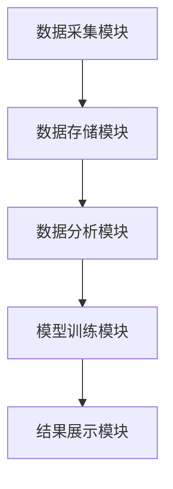
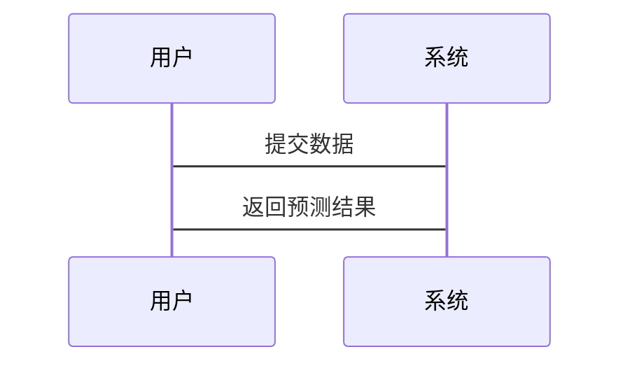

                 


---

# AI辅助企业战略规划：大数据分析与预测模型

> **关键词**: AI, 大数据分析, 预测模型, 企业战略规划, 数据科学  
>
> **摘要**: 本文探讨了人工智能（AI）在企业战略规划中的应用，重点分析了大数据分析与预测模型在战略决策中的作用。通过详细阐述大数据分析的基本原理、预测模型的构建与优化，以及AI辅助系统的架构设计，本文为读者提供了一种基于数据驱动的新型企业战略规划方法，旨在帮助企业更高效地制定和执行战略决策。

---

## 第1章: AI与大数据在企业战略规划中的作用

### 1.1 企业战略规划的定义与重要性

#### 1.1.1 企业战略规划的基本概念
企业战略规划是指企业在复杂的市场环境中，为了实现长期目标而制定的全局性、系统性规划。它涉及企业资源分配、市场定位、竞争优势分析等多个方面。

#### 1.1.2 战略规划在企业管理中的作用
战略规划是企业发展的纲领性文件，它决定了企业的方向、目标和资源分配。有效的战略规划能够帮助企业应对市场变化，抓住机遇，避免风险。

#### 1.1.3 AI与大数据对企业战略规划的影响
随着数据量的爆炸式增长和AI技术的快速发展，企业可以通过大数据分析和AI技术获取更精准的市场洞察，从而优化战略决策。

### 1.2 AI辅助企业战略规划的背景

#### 1.2.1 大数据时代的到来
在大数据时代，企业每天都会产生海量数据，这些数据包含了丰富的市场信息和消费者行为数据。

#### 1.2.2 AI技术的快速发展
AI技术的进步使得企业能够更高效地处理和分析数据，提取有价值的信息，为战略决策提供支持。

#### 1.2.3 企业对智能化决策的需求
在竞争激烈的市场环境中，企业需要更快、更准确的决策支持，AI和大数据技术正好满足了这一需求。

### 1.3 本书的核心目标与内容

#### 1.3.1 本书的核心目标
本书旨在探讨如何利用AI和大数据技术辅助企业制定战略规划，通过构建预测模型，帮助企业预测市场趋势，优化资源配置。

#### 1.3.2 本书的主要内容概述
- 第一部分：AI与大数据在企业战略规划中的作用
- 第二部分：大数据分析与预测模型的核心概念
- 第三部分：AI辅助企业战略规划的系统架构设计
- 第四部分：项目实战与案例分析
- 第五部分：总结与展望

#### 1.3.3 本书的结构安排
本书将从理论到实践，逐步引导读者理解AI和大数据技术在企业战略规划中的应用。

### 1.4 本章小结
本章介绍了企业战略规划的基本概念、AI与大数据在战略规划中的作用，以及本书的核心目标和结构安排。

---

## 第2章: 大数据分析的基本原理

### 2.1 数据的分类与特征

#### 2.1.1 结构化数据与非结构化数据
- 结构化数据：可以组织成表格形式的数据，如数据库中的记录。
- 非结构化数据：如文本、图像、音频等，需要特殊处理才能进行分析。

#### 2.1.2 数据的特征与属性
- 数据特征：如时间、地点、用户行为等。
- 数据属性：如数值型、分类型、文本型等。

#### 2.1.3 数据质量的重要性
- 数据的完整性、准确性、一致性对分析结果的影响。

### 2.2 数据预处理与清洗

#### 2.2.1 数据清洗的必要性
- 数据清洗是数据分析的第一步，目的是去除噪声数据，确保数据质量。

#### 2.2.2 数据清洗的步骤与方法
- 删除重复数据
- 处理缺失值
- 标准化与归一化

#### 2.2.3 数据标准化与归一化
- 数据标准化：将数据缩放到统一的范围内。
- 数据归一化：将数据标准化到[0,1]区间。

### 2.3 数据分析的基本方法

#### 2.3.1 描述性分析
- 通过统计指标和图表描述数据的基本特征。

#### 2.3.2 预测性分析
- 基于历史数据预测未来趋势。

#### 2.3.3 实验性分析
- 通过实验设计验证假设。

### 2.4 本章小结
本章介绍了数据分析的基本原理，包括数据分类、预处理、清洗以及分析方法。

---

## 第3章: 预测模型的基本原理与分类

### 3.1 预测模型的基本原理

#### 3.1.1 预测模型的定义
- 预测模型是基于数据训练出的数学模型，用于预测新数据的输出。

#### 3.1.2 预测模型的核心要素
- 数据特征：输入变量
- 目标变量：输出变量
- 模型类型：回归、分类、聚类等

#### 3.1.3 预测模型的评估指标
- 均方误差（MSE）
- 准确率
- F1分数

### 3.2 常见的预测模型分类

#### 3.2.1 线性回归模型
- 简单线性回归：$y = a + bx$
- 多元线性回归：$y = a + b_1x_1 + b_2x_2 + \dots + b_nx_n$

#### 3.2.2 分类模型（如决策树、随机森林）
- 决策树：通过特征分裂进行分类
- 随机森林：基于决策树的集成方法

#### 3.2.3 聚类模型
- K均值聚类：将数据分成K个簇

### 3.3 AI在预测模型中的应用

#### 3.3.1 机器学习在预测模型中的应用
- 监督学习：基于标记数据训练模型
- 无监督学习：基于无标记数据发现模式

#### 3.3.2 深度学习在预测模型中的应用
- 神经网络：用于复杂数据模式的识别

#### 3.3.3 自然语言处理在预测模型中的应用
- 文本分析：从文本中提取情感、主题等信息

### 3.4 本章小结
本章介绍了预测模型的基本原理和分类，以及AI在预测模型中的应用。

---

## 第4章: 企业战略规划的AI辅助系统架构

### 4.1 系统功能模块设计

#### 4.1.1 数据采集模块
- 数据源：企业内部数据、外部市场数据
- 数据采集方式：数据库查询、网络爬取

#### 4.1.2 数据分析模块
- 数据清洗、特征工程、模型训练

#### 4.1.3 模型训练模块
- 模型选择、参数调优、模型评估

### 4.2 系统架构设计

#### 4.2.1 系统架构图


#### 4.2.2 系统接口设计
- 数据接口：RESTful API
- 模型接口：API调用

#### 4.2.3 系统交互流程


### 4.3 本章小结
本章介绍了AI辅助企业战略规划系统的架构设计，包括功能模块、系统架构图和交互流程。

---

## 第5章: 项目实战与案例分析

### 5.1 项目背景

#### 5.1.1 项目介绍
- 项目目标：预测企业销售额
- 数据来源：销售数据、市场数据

### 5.2 系统实现

#### 5.2.1 环境安装
- Python 3.8+
- Jupyter Notebook
- Scikit-learn、Pandas、NumPy

#### 5.2.2 核心代码实现
```python
import pandas as pd
from sklearn.model_selection import train_test_split
from sklearn.linear_model import LinearRegression

# 数据加载
data = pd.read_csv('sales_data.csv')
X = data[['price', '广告投入']]
y = data['sales']

# 数据分割
X_train, X_test, y_train, y_test = train_test_split(X, y, test_size=0.2, random_state=42)

# 模型训练
model = LinearRegression()
model.fit(X_train, y_train)

# 模型预测
y_pred = model.predict(X_test)
```

#### 5.2.3 代码解读
- 数据加载：读取CSV文件
- 数据分割：将数据分为训练集和测试集
- 模型训练：使用线性回归模型训练
- 模型预测：预测测试集的销售额

### 5.3 案例分析

#### 5.3.1 数据分析结果
- 模型评估指标：R²=0.85，均方误差=0.2

#### 5.3.2 模型部署
- 模型保存：使用pickle序列化模型
- API接口：提供预测服务

### 5.4 本章小结
本章通过一个具体的案例，展示了如何利用AI和大数据技术辅助企业制定战略规划。

---

## 第6章: 总结与展望

### 6.1 本书的总结

#### 6.1.1 核心内容回顾
- AI与大数据在企业战略规划中的作用
- 大数据分析与预测模型的基本原理
- AI辅助系统的架构设计
- 项目实战与案例分析

### 6.2 未来展望

#### 6.2.1 技术发展趋势
- AI算法的优化
- 大数据处理技术的提升

#### 6.2.2 应用前景
- 更多行业的应用
- 更精准的预测模型

### 6.3 最佳实践 tips

#### 6.3.1 数据质量的重要性
- 数据清洗是关键步骤
- 数据特征选择影响模型性能

#### 6.3.2 模型可解释性
- 解释性模型（如线性回归）更易于理解
- 使用特征重要性分析

### 6.4 本章小结
本章总结了本书的主要内容，并展望了AI和大数据技术在企业战略规划中的未来发展方向。

---

## 作者：AI天才研究院

--- 

希望这个目录和文章内容能满足你的需求。如果需要进一步扩展或修改，请随时告知！

