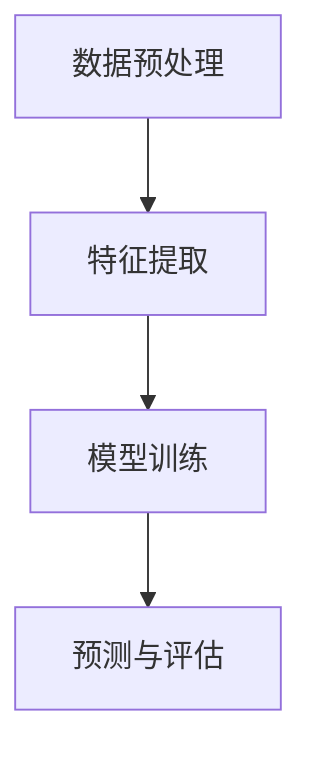
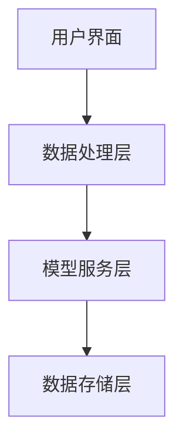

                 


# AI辅助企业战略规划：市场趋势分析与预测

> 关键词：AI、企业战略规划、市场趋势分析、预测模型、机器学习、深度学习

> 摘要：随着AI技术的迅速发展，企业战略规划的市场趋势分析与预测正在经历一场深刻的变革。本文将从AI技术的基本概念入手，深入探讨其在企业战略规划中的应用，重点分析市场趋势预测的核心算法、系统架构设计以及实际项目中的实现案例。通过详细讲解背景、算法原理、系统架构和项目实战，本文为读者提供了一套完整的AI辅助企业战略规划解决方案，帮助企业在复杂多变的市场环境中做出更明智的决策。

---

## 第一部分：AI与企业战略规划的背景

### 第1章：AI与企业战略规划的背景

#### 1.1 企业战略规划的传统方法与挑战

企业战略规划是企业制定未来发展路径的关键过程，传统方法依赖于市场调研、历史数据分析和专家经验。然而，这种方法存在以下挑战：

- 数据量有限：传统方法往往依赖于有限的历史数据，难以捕捉市场变化的全貌。
- 预测精度低：专家经验和定性分析难以准确预测市场趋势。
- 信息处理效率低：面对海量数据，人工分析效率低下。

#### 1.2 AI技术如何变革企业战略规划

AI技术的引入为企业战略规划带来了革命性的变化。通过机器学习和深度学习，AI能够处理海量数据，识别复杂模式，并提供高精度的市场趋势预测。AI的应用优势包括：

- **数据处理能力**：AI能够快速处理和分析大量数据，提取关键特征，为战略决策提供支持。
- **实时预测**：通过实时数据处理，AI能够帮助企业及时调整战略，应对市场变化。
- **自动化学习**：AI模型能够不断优化，适应市场变化，提升预测准确性。

#### 1.3 当前市场趋势分析与预测的重要性

在当前全球经济环境下，市场趋势分析与预测的重要性日益凸显。企业需要准确预测市场需求、竞争态势和宏观经济变化，以制定有效的战略规划。AI技术在市场趋势预测中的应用，使得企业能够更精准地识别市场机会和风险，从而做出更科学的决策。

---

## 第二部分：AI辅助市场趋势分析的核心概念

### 第2章：AI辅助市场趋势分析的核心概念

#### 2.1 数据驱动的市场分析新范式

AI驱动的市场分析范式以数据为中心，通过机器学习和深度学习模型，从海量数据中提取有价值的信息。这种分析范式的优势在于：

- **数据驱动**：依赖于大量数据，而非传统的经验判断。
- **实时性**：能够实时处理数据，提供实时预测。
- **准确性**：通过算法优化，提高预测的准确性。

#### 2.2 AI如何提升预测准确性

AI通过以下方式显著提升了市场趋势预测的准确性：

- **复杂模式识别**：AI能够识别数据中的复杂模式，捕捉市场变化的细微信号。
- **多维度分析**：AI可以从多个维度（如市场、经济、行业）进行分析，提供全面的预测结果。
- **自我优化**：AI模型能够通过反馈机制不断优化，提升预测精度。

#### 2.3 企业竞争优势的构建

通过AI辅助的市场趋势分析，企业可以构建持续的竞争优势：

- **快速反应能力**：基于AI的预测，企业能够更快地调整战略，应对市场变化。
- **精准决策**：AI提供的数据支持使企业决策更加精准，降低决策风险。
- **创新能力**：AI驱动的分析可以发现新的市场机会，推动企业创新。

---

## 第三部分：AI算法原理与实现

### 第3章：市场趋势预测的算法实现

#### 3.1 机器学习模型

##### 3.1.1 线性回归模型

线性回归是一种简单但强大的预测模型，适用于线性关系的数据。

- **数学模型**：$$ y = \beta_0 + \beta_1 x + \epsilon $$
- **应用场景**：适用于简单的线性趋势预测。

##### 3.1.2 支持向量机（SVM）

SVM适用于分类和回归问题，特别适合小数据集的高维特征分析。

- **数学模型**：通过最大化-margin分类器，找到最优超平面。
- **应用场景**：适用于非线性趋势分析。

##### 3.1.3 随机森林与梯度提升树

随机森林和梯度提升树是基于树的集成模型，适用于高维数据和复杂关系的预测。

- **数学模型**：通过集成多个决策树，提升预测准确性。
- **应用场景**：适用于复杂的市场趋势预测。

#### 3.2 深度学习模型

##### 3.2.1 LSTM网络

LSTM（长短期记忆网络）适用于时间序列数据的预测，能够捕捉长期依赖关系。

- **数学模型**：通过门控机制控制信息流动。
- **应用场景**：适用于时间序列的市场趋势预测。

##### 3.2.2 Transformer架构

Transformer是一种基于注意力机制的模型，适用于并行处理和长距离依赖关系的捕捉。

- **数学模型**：通过自注意力机制，捕捉数据中的全局关系。
- **应用场景**：适用于多维度市场数据的综合分析。

##### 3.2.3 图神经网络的应用

图神经网络适用于复杂网络结构的数据分析，能够捕捉数据中的关联性。

- **数学模型**：通过图卷积操作，处理图结构数据。
- **应用场景**：适用于竞争网络和供应链网络的分析。

#### 3.3 算法流程图



---

## 第四部分：系统架构与设计

### 第4章：AI辅助战略规划系统的架构设计

#### 4.1 系统功能设计

##### 4.1.1 数据采集模块

负责收集市场数据，包括销售数据、行业报告、宏观经济指标等。

##### 4.1.2 数据分析模块

对数据进行清洗、特征提取和预处理，为模型训练提供高质量数据。

##### 4.1.3 模型训练模块

训练机器学习和深度学习模型，生成预测结果。

##### 4.1.4 结果展示模块

将预测结果可视化，提供直观的市场趋势分析报告。

#### 4.2 系统架构图



---

## 第五部分：项目实战与案例分析

### 第5章：AI辅助战略规划系统的实现

#### 5.1 环境搭建与工具安装

##### 5.1.1 安装Python与相关库

安装Python和必要的机器学习库（如TensorFlow、Scikit-learn）。

##### 5.1.2 配置开发环境

配置Jupyter Notebook或PyCharm作为开发环境。

#### 5.2 核心代码实现

##### 5.2.1 数据预处理代码

```python
import pandas as pd
data = pd.read_csv('market_data.csv')
data = data.dropna()
```

##### 5.2.2 模型训练代码

```python
from sklearn.ensemble import RandomForestRegressor
model = RandomForestRegressor(n_estimators=100)
model.fit(X_train, y_train)
```

##### 5.2.3 结果展示代码

```python
import matplotlib.pyplot as plt
plt.plot(predicted_values, label='预测值')
plt.plot(actual_values, label='实际值')
plt.legend()
plt.show()
```

#### 5.3 项目小结

通过实际项目的实现，我们可以看到AI技术在市场趋势预测中的巨大潜力。通过数据预处理、模型训练和结果展示，企业可以更高效地进行市场分析和战略规划。

---

## 第六部分：最佳实践与小结

### 第6章：最佳实践与小结

#### 6.1 小结

AI技术正在深刻改变企业战略规划的方式，通过数据驱动的市场趋势分析与预测，企业能够做出更明智的决策。本文详细介绍了AI辅助战略规划的核心概念、算法原理和系统架构设计，并通过实际案例展示了AI技术的应用。

#### 6.2 注意事项

- 数据质量：数据预处理是关键，确保数据的准确性和完整性。
- 模型选择：根据具体场景选择合适的模型，避免过度复杂化。
- 实时性：确保系统能够实时处理数据，及时提供预测结果。

#### 6.3 拓展阅读

- 《Hands-On Machine Learning with Scikit-Learn, Keras, and TensorFlow》
- 《Deep Learning》 by Ian Goodfellow

---

## 作者：AI天才研究院 & 禅与计算机程序设计艺术

通过本文的深入探讨，我们希望读者能够理解AI技术在企业战略规划中的重要性，并能够将这些知识应用到实际工作中，提升企业的市场分析能力和竞争力。

