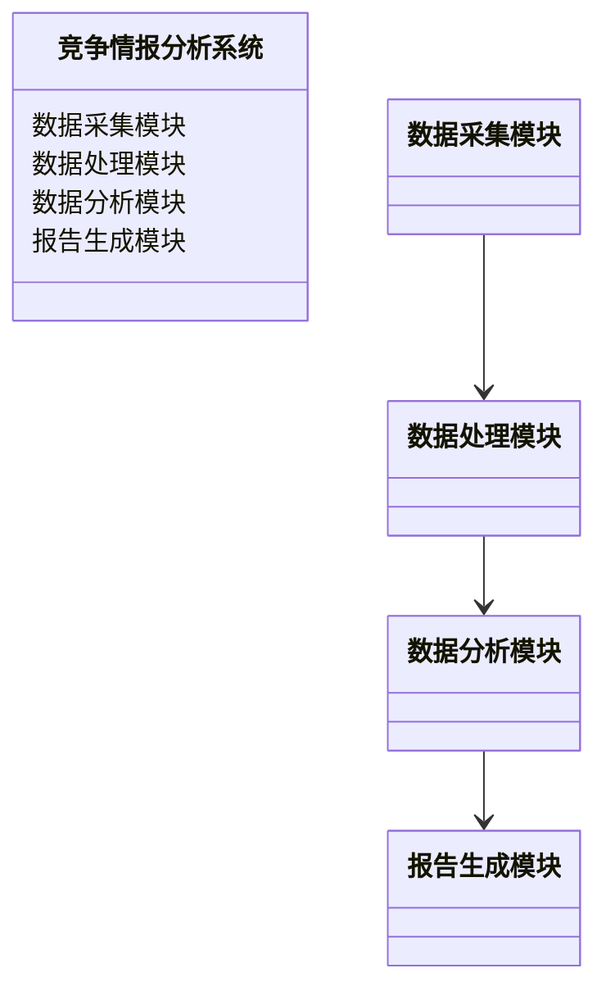
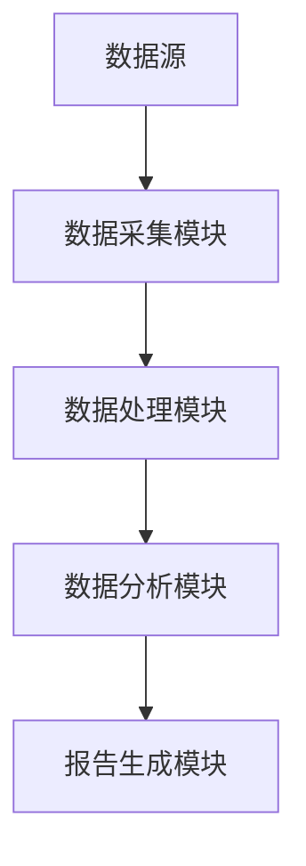
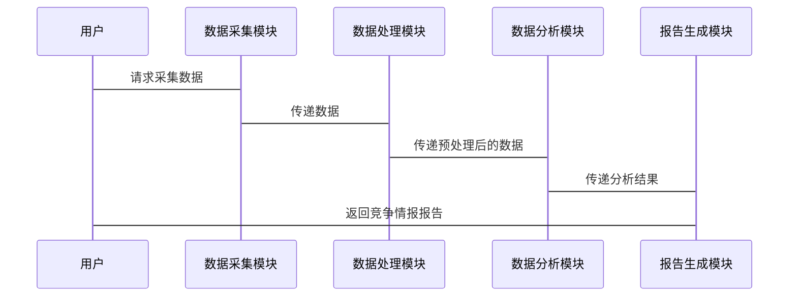

                 


# AI辅助企业竞争情报分析：自动化数据收集与洞察生成

> 关键词：AI，竞争情报分析，数据收集，自动化，洞察生成，自然语言处理，机器学习

> 摘要：随着企业竞争的日益激烈，竞争情报分析的重要性愈发凸显。传统竞争情报分析方法依赖人工收集和处理数据，效率低下且难以应对海量信息。AI技术的引入，特别是机器学习和自然语言处理（NLP）的应用，为竞争情报分析带来了革命性的变化。本文将详细探讨AI如何辅助企业竞争情报分析，从数据收集到洞察生成的自动化流程，结合实际案例和系统架构设计，为企业提供高效、精准的竞争情报分析解决方案。

---

## 第一部分: AI辅助企业竞争情报分析的背景与基础

### 第1章: 企业竞争情报分析的背景与挑战

#### 1.1 竞争情报分析的定义与重要性

- **1.1.1 竞争情报分析的定义**
  - 竞争情报分析是指通过收集、分析和利用竞争对手及相关市场信息，为企业制定战略决策提供支持的过程。
  - 核心目标包括识别竞争对手的优势与劣势、分析市场趋势、发现机会与威胁。

- **1.1.2 竞争情报分析的重要性**
  - 帮助企业在复杂市场环境中制定更具竞争力的战略。
  - 提高市场反应速度，降低决策风险。
  - 优化资源配置，提升企业核心竞争力。

- **1.1.3 竞争情报分析的核心目标**
  - 发现竞争对手的动态。
  - 分析市场趋势和消费者行为。
  - 提供数据支持的战略建议。

#### 1.2 传统竞争情报分析的局限性

- **1.2.1 数据收集的效率问题**
  - 人工收集数据效率低，且容易遗漏关键信息。
  - 数据来源分散，难以整合。

- **1.2.2 数据处理的复杂性**
  - 数据清洗和预处理耗时耗力。
  - 人工分析容易受到主观因素影响。

- **1.2.3 洞察生成的主观性**
  - 分析结果依赖分析师的经验，缺乏客观性。
  - 难以从海量数据中提取深层次洞察。

#### 1.3 AI在竞争情报分析中的作用

- **1.3.1 AI如何提升数据收集效率**
  - 自动化数据爬取：利用网络爬虫技术从多个来源自动收集竞争对手信息。
  - 多语言支持：AI能够处理多种语言的数据，扩大信息收集范围。

- **1.3.2 AI在数据处理与分析中的优势**
  - 自动化数据清洗：AI能够快速识别并处理数据中的噪声和冗余信息。
  - 高效模式识别：通过机器学习算法发现数据中的隐藏模式。

- **1.3.3 AI驱动的自动化洞察生成**
  - 自动文本挖掘：从竞争对手的新闻稿、社交媒体等文本数据中提取关键词和主题。
  - 自动生成报告：AI能够根据分析结果自动生成竞争情报报告。

### 第2章: AI与大数据的基础

#### 2.1 机器学习基础

- **2.1.1 机器学习的基本概念**
  - 机器学习是一种通过数据训练模型，使其能够从数据中学习并做出预测或决策的技术。
  - 常见的机器学习算法包括线性回归、支持向量机（SVM）、随机森林、神经网络等。

- **2.1.2 监督学习与无监督学习**
  - 监督学习：基于标记数据训练模型，适用于分类和回归任务。
  - 无监督学习：基于未标记数据发现数据中的结构和模式。

- **2.1.3 深度学习简介**
  - 深度学习是一种基于人工神经网络的机器学习方法，适用于处理非结构化数据，如文本、图像等。

#### 2.2 自然语言处理(NLP)基础

- **2.2.1 NLP的核心任务**
  - 分词：将文本分割成词语或短语。
  - 词性标注：识别词语的词性（名词、动词、形容词等）。
  - 命名实体识别：识别文本中的实体（人名、地名、组织名等）。
  - 情感分析：分析文本的情感倾向。

- **2.2.2 常见的NLP模型**
  - 词袋模型（Bag-of-Words, BoW）：将文本表示为词袋，忽略词语顺序。
  - 词嵌入模型（Word2Vec、GloVe）：将词语映射为低维向量，捕捉词语语义。
  - 循环神经网络（RNN）：适用于序列数据的处理。
  - Transformer模型（BERT、GPT）：基于自注意力机制的模型，性能强大。

- **2.2.3 NLP在竞争情报中的应用**
  - 文本挖掘：从竞争对手的新闻稿、社交媒体中提取关键词和主题。
  - 情感分析：分析消费者对竞争对手产品的评价，识别市场趋势。
  - 自动翻译：处理多语言数据，扩大信息收集范围。

#### 2.3 数据挖掘与爬虫技术

- **2.3.1 数据挖掘的基本概念**
  - 数据挖掘是从大量数据中发现模式、关联、趋势的技术。
  - 常见任务包括分类、聚类、关联规则挖掘等。

- **2.3.2 网络爬虫的原理与实现**
  - 网络爬虫是一种用于从网页中抓取数据的自动化工具。
  - 常见的网络爬虫实现包括简单的HTTP请求和高级的分布式爬虫架构。

- **2.3.3 数据清洗与预处理**
  - 数据清洗：去除噪声数据，如重复数据、无效数据。
  - 数据预处理：将数据转换为适合分析的格式，如文本分词、数值归一化等。

---

## 第二部分: 竞争情报分析的自动化流程

### 第3章: 数据收集与预处理

#### 3.1 数据收集的自动化

- **3.1.1 竞争对手信息的多源数据收集**
  - 从竞争对手的官方网站、新闻媒体、社交媒体等多个来源收集数据。
  - 使用网络爬虫技术从网页中提取结构化数据。

- **3.1.2 数据爬取的实现与优化**
  - 使用Python的requests库和BeautifulSoup库进行网页数据爬取。
  - 实现反爬虫机制，如设置请求间隔、使用代理IP等。

- **3.1.3 数据收集的合规性与风险控制**
  - 遵守相关法律法规，避免侵犯竞争对手的隐私和版权。
  - 采用分布式爬虫架构，避免对目标网站造成过大压力。

#### 3.2 数据预处理与清洗

- **3.2.1 数据清洗的必要性**
  - 数据清洗是数据预处理的重要步骤，旨在去除噪声数据，提高数据质量。

- **3.2.2 数据格式的统一与标准化**
  - 将不同来源的数据统一到相同的格式，便于后续分析。
  - 例如，将日期格式统一为ISO标准格式。

- **3.2.3 数据去重与异常值处理**
  - 使用哈希算法去重，去除重复数据。
  - 识别并处理异常值，如异常高的数值或缺失值。

### 第4章: 数据分析与洞察生成

#### 4.1 文本挖掘与关键词提取

- **4.1.1 基于TF-IDF的关键词提取**
  - TF-IDF（Term Frequency-Inverse Document Frequency）是一种用于衡量词语重要性的统计方法。
  - 使用Python的TfidfVectorizer库实现关键词提取。

- **4.1.2 基于主题模型的主题提取**
  - 主题模型是一种用于发现文本主题的技术，常见的主题模型包括LDA（Latent Dirichlet Allocation）和LSA（Latent Semantic Analysis）。
  - 使用Gensim库实现主题模型。

- **4.1.3 关键词提取的案例分析**
  - 例如，从竞争对手的新闻稿中提取关键词，分析其市场战略。

#### 4.2 数据分析与洞察生成

- **4.2.1 基于机器学习的分类与聚类**
  - 使用监督学习算法（如SVM、随机森林）进行分类任务，例如识别竞争对手的市场定位。
  - 使用无监督学习算法（如K-means）进行聚类任务，例如将竞争对手分为不同的市场细分。

- **4.2.2 可视化分析与报告生成**
  - 使用数据可视化工具（如Matplotlib、Tableau）将分析结果可视化。
  - 自动生成竞争情报报告，包括关键发现、趋势分析和建议。

---

## 第三部分: 系统架构设计与实现

### 第5章: 系统架构设计

#### 5.1 竞争情报分析系统的功能设计

- **5.1.1 系统功能模块**
  - 数据采集模块：负责从多个数据源采集数据。
  - 数据处理模块：负责数据清洗和预处理。
  - 数据分析模块：负责文本挖掘、主题建模等分析任务。
  - 报告生成模块：负责自动生成竞争情报报告。

- **5.1.2 领域模型设计**
  - 使用Mermaid绘制领域模型类图，展示各模块之间的关系。



#### 5.2 系统架构设计

- **5.2.1 系统架构图**
  - 使用Mermaid绘制系统架构图，展示系统的分层架构。



- **5.2.2 接口设计**
  - 数据采集模块与数据处理模块之间的接口。
  - 数据分析模块与报告生成模块之间的接口。

#### 5.3 系统交互设计

- **5.3.1 系统交互流程**
  - 使用Mermaid绘制系统交互序列图。



---

## 第四部分: 项目实战与优化

### 第6章: 项目实战

#### 6.1 环境搭建

- **6.1.1 安装必要的Python库**
  - 使用pip安装requests、BeautifulSoup、TfidfVectorizer、Gensim等库。

#### 6.2 核心实现

- **6.2.1 数据爬取与预处理**
  - 编写Python代码，从竞争对手的官方网站和社交媒体中爬取数据。
  - 使用BeautifulSoup和pandas进行数据清洗和预处理。

- **6.2.2 文本挖掘与关键词提取**
  - 使用TfidfVectorizer提取关键词。
  - 使用Gensim库进行主题建模。

#### 6.3 案例分析

- **6.3.1 竞争对手的市场定位分析**
  - 从竞争对手的新闻稿中提取关键词，分析其市场定位。
  - 使用LDA主题模型发现竞争对手的市场战略。

#### 6.4 代码实现与解读

- **6.4.1 数据爬取代码**
  ```python
  import requests
  from bs4 import BeautifulSoup

  def fetch_data(url):
      response = requests.get(url)
      soup = BeautifulSoup(response.text, 'html.parser')
      return str(soup)

  url = 'https://example.com'
  data = fetch_data(url)
  print(data)
  ```

- **6.4.2 关键词提取代码**
  ```python
  from sklearn.feature_extraction.text import TfidfVectorizer

  vectorizer = TfidfVectorizer()
  tfidf_matrix = vectorizer.fit_transform(documents)
  feature_names = vectorizer.get_feature_names_out()
  ```

#### 6.5 项目小结

- **6.5.1 项目实现的关键点**
  - 数据爬取与预处理。
  - 文本挖掘与关键词提取。
  - 竞争对手市场定位分析。

- **6.5.2 项目的优化方向**
  - 提高数据爬取效率。
  - 优化文本挖掘算法，如使用更先进的主题模型。

---

## 第五部分: 最佳实践与展望

### 第7章: 最佳实践与小结

#### 7.1 最佳实践

- **7.1.1 数据安全与合规性**
  - 遵守数据采集和使用的相关法律法规。
  - 采用数据脱敏技术，保护敏感信息。

- **7.1.2 系统性能优化**
  - 使用分布式架构提高数据处理效率。
  - 优化算法模型，减少计算时间。

#### 7.2 项目小结

- **7.2.1 项目总结**
  - 本项目通过AI技术实现了企业竞争情报分析的自动化流程。
  - 从数据收集到洞察生成的整个过程均实现了自动化。

- **7.2.2 项目意义**
  - 提高了企业竞争情报分析的效率和准确性。
  - 为企业制定战略决策提供了有力支持。

### 第8章: 展望与进一步学习

#### 8.1 展望

- **8.1.1 AI技术的进一步发展**
  - 更先进的NLP模型（如GPT-3、GPT-4）的应用。
  - 多模态数据分析，如结合图像和文本数据进行分析。

#### 8.2 进一步学习

- **8.2.1 学习资源推荐**
  - 书籍：《Python机器学习实战》、《自然语言处理入门》。
  - 在线课程：Coursera上的《机器学习与NLP》课程。
  - 开源项目：GitHub上的NLP相关项目。

---

## 作者：AI天才研究院/AI Genius Institute & 禅与计算机程序设计艺术/Zen And The Art of Computer Programming

---

**文章小结：**  
本文详细探讨了AI在企业竞争情报分析中的应用，从数据收集到洞察生成的自动化流程，结合实际案例和系统架构设计，为企业提供高效、精准的竞争情报分析解决方案。通过本文的学习，读者可以掌握AI辅助竞争情报分析的核心技术，并能够将其应用于实际项目中。

