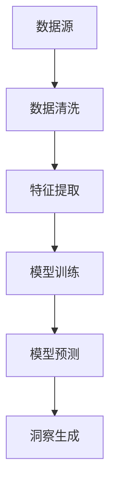
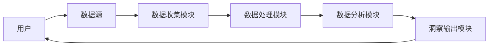

                 


# AI辅助企业竞争情报分析：自动化数据收集与洞察生成系统

> 关键词：AI，企业竞争情报分析，数据收集，自动化，洞察生成系统

> 摘要：本文深入探讨了如何利用人工智能技术辅助企业进行竞争情报分析。通过自动化数据收集与洞察生成系统，企业可以更高效地获取、处理和分析竞争对手信息，从而制定更明智的商业策略。文章从背景、核心概念、算法原理、系统架构设计、项目实战等多个方面详细阐述了AI在竞争情报分析中的应用，为读者提供了全面的技术指导和实践案例。

---

## 第一部分：AI辅助企业竞争情报分析的背景与核心概念

### 第1章：AI辅助企业竞争情报分析的背景

#### 1.1 企业竞争情报分析的定义与重要性

企业竞争情报分析是指通过收集、整理、分析和利用竞争对手及其市场环境的相关信息，帮助企业制定更有效的市场策略。竞争情报分析不仅仅是了解竞争对手的动向，还包括分析市场趋势、消费者行为、技术发展等多方面信息，以帮助企业发现机会和威胁。

**竞争情报分析的重要性：**
- **市场洞察**：帮助企业了解竞争对手的策略、产品、服务等信息，提前预判市场变化。
- **竞争优势**：通过分析竞争对手的优劣势，找到自身产品的差异化竞争点。
- **风险预警**：及时发现潜在风险，如竞争对手的新产品发布、市场扩展等，提前制定应对策略。

#### 1.2 AI技术在竞争情报分析中的应用背景

随着市场竞争的加剧，企业需要处理的信息量急剧增加。传统的竞争情报分析方法依赖人工收集和分析，效率低下且容易遗漏重要信息。AI技术的引入，特别是自然语言处理（NLP）、机器学习和大数据分析技术，为竞争情报分析带来了革命性的变化。

**AI技术的应用优势：**
- **自动化数据收集**：通过爬虫技术自动抓取竞争对手的产品信息、新闻报道、社交媒体数据等。
- **智能化分析**：利用机器学习模型自动分析文本数据，提取关键词、情感倾向、市场趋势等信息。
- **实时监控**：AI系统可以实时跟踪竞争对手的动态，提供即时的市场反馈。

#### 1.3 为什么需要自动化数据收集与洞察生成系统？

传统的竞争情报分析流程效率低、成本高，且容易受到人为因素的干扰。自动化数据收集与洞察生成系统能够通过AI技术实现以下目标：
- **高效数据收集**：自动化抓取多源数据，覆盖广泛的市场信息。
- **智能分析**：利用机器学习模型自动分析数据，生成有价值的洞察。
- **实时监控**：持续跟踪市场动态，及时发现潜在机会和威胁。

---

### 第2章：AI辅助竞争情报分析的核心概念与联系

#### 2.1 核心概念原理

AI辅助竞争情报分析的核心在于将数据转化为 actionable insights（可操作的洞察）。这一过程涉及以下几个关键步骤：
1. **数据收集**：从各种来源（如竞争对手的官方网站、社交媒体、新闻媒体等）获取相关信息。
2. **数据处理**：清洗、整理和结构化数据，以便后续分析。
3. **数据分析**：利用机器学习算法对数据进行分析，提取关键信息和模式。
4. **洞察生成**：将分析结果转化为易于理解的报告或警报，帮助企业制定策略。

#### 2.2 核心概念属性对比表

以下表格对比了AI辅助竞争情报分析中的几个核心概念及其属性：

| 概念       | 数据来源         | 数据处理方式   | 数据分析方法   |
|------------|------------------|----------------|----------------|
| 数据收集   | 竞争对手网站、社交媒体、行业报告 | 数据清洗、去重、结构化 | NLP、机器学习模型 |
| 情报生成   | 分析结果         | 可视化报告、警报 | 基于模型的预测   |

#### 2.3 ER实体关系图

以下是一个简单的ER实体关系图，展示了AI辅助竞争情报分析系统中的主要实体及其关系：

```mermaid
er
  competitor: 竞争对手
  data_source: 数据来源
  data_collection: 数据收集模块
  data_analysis: 数据分析模块
  insight_output: 洞察输出模块

  competitor --> data_source: 提供数据
  data_source --> data_collection: 数据收集
  data_collection --> data_analysis: 数据分析
  data_analysis --> insight_output: 输出洞察
```

---

## 第二部分：AI辅助竞争情报分析的算法原理

### 第3章：算法原理详解

#### 3.1 数据预处理与特征提取

在竞争情报分析中，数据预处理是关键的一步。以下是常见的数据预处理步骤：
1. **数据清洗**：去除噪声数据、重复数据和无关数据。
2. **数据结构化**：将非结构化数据（如文本）转化为结构化数据（如关键词列表）。
3. **特征提取**：从文本中提取关键词、情感倾向等特征。

#### 3.2 机器学习模型训练

常用的机器学习模型包括：
- **文本分类模型**：用于分类竞争对手的产品类别、市场策略等。
- **情感分析模型**：用于分析消费者对竞争对手产品的评价情感。
- **主题模型**（如LDA）：用于发现文本中的主题和趋势。

#### 3.3 算法流程图

以下是一个典型的竞争情报分析算法流程图：



#### 3.4 数学模型与公式

以下是一个简单的文本分类模型的数学公式：

$$ P(y|x) = \frac{P(x|y)P(y)}{P(x)} $$

其中：
- $P(y|x)$ 是在给定特征$x$的情况下，类别$y$的概率。
- $P(x|y)$ 是在类别$y$的情况下，特征$x$出现的概率。
- $P(y)$ 是类别$y$的先验概率。
- $P(x)$ 是特征$x$的总概率。

---

## 第三部分：AI辅助竞争情报分析的系统架构设计

### 第4章：系统架构设计

#### 4.1 系统功能模块

一个典型的AI辅助竞争情报分析系统包括以下功能模块：
1. **数据收集模块**：负责从多个数据源收集竞争情报数据。
2. **数据处理模块**：对收集的数据进行清洗、结构化和特征提取。
3. **数据分析模块**：利用机器学习模型对数据进行分析，生成洞察。
4. **洞察输出模块**：将分析结果转化为可视化报告或警报。

#### 4.2 系统架构图

以下是一个简单的系统架构图：



#### 4.3 接口设计与交互流程

系统的接口设计包括：
- **数据收集接口**：用于从不同数据源获取数据。
- **数据处理接口**：用于数据清洗和特征提取。
- **数据分析接口**：用于模型训练和预测。
- **洞察输出接口**：用于生成报告和警报。

---

## 第四部分：项目实战：AI辅助竞争情报分析系统实现

### 第5章：项目实战

#### 5.1 项目背景与目标

本项目旨在开发一个AI辅助竞争情报分析系统，实现以下目标：
- 自动化收集竞争对手的数据。
- 利用机器学习模型生成竞争情报分析报告。

#### 5.2 环境安装与配置

以下是项目所需的环境和工具：
- **Python**：3.8+
- **库**：`scikit-learn`, `nltk`, `beautifulsoup4`, `requests`

#### 5.3 核心代码实现

以下是项目的部分核心代码示例：

```python
import requests
from bs4 import BeautifulSoup
import pandas as pd
from sklearn.feature_extraction.text import TfidfVectorizer
from sklearn.naive_bayes import MultinomialNB

# 数据收集
def collect_data(url):
    response = requests.get(url)
    soup = BeautifulSoup(response.text, 'html.parser')
    content = soup.find('div', {'class': 'content'}).text
    return content

# 数据处理
def preprocess(text):
    # 分词处理
    words = text.split()
    return words

# 特征提取
vectorizer = TfidfVectorizer()
X = vectorizer.fit_transform(X)

# 模型训练
model = MultinomialNB()
model.fit(X, y)

# 预测与输出
new_data = ["竞争对手新产品发布"]
X_new = vectorizer.transform(new_data)
y_pred = model.predict(X_new)
print(y_pred)
```

#### 5.4 案例分析与结果解读

通过上述代码，我们可以实现竞争对手产品的分类和情感分析。例如，如果竞争对手发布了一款新产品，系统会自动分类其产品类型并预测消费者的评价情感。

#### 5.5 项目总结与优化建议

项目总结：
- 成功实现了AI辅助竞争情报分析系统的数据收集、处理、分析和输出功能。
- 通过机器学习模型，提高了分析的准确性和效率。

优化建议：
- 引入更复杂的模型（如深度学习模型）以提高分析精度。
- 增加实时监控功能，实现对竞争对手动态的实时跟踪。

---

## 第五部分：AI辅助竞争情报分析的最佳实践

### 第6章：最佳实践

#### 6.1 小结

本文详细介绍了AI辅助企业竞争情报分析的背景、核心概念、算法原理、系统架构设计和项目实战。通过自动化数据收集与洞察生成系统，企业可以更高效地获取和分析竞争情报，制定更明智的市场策略。

#### 6.2 注意事项

- 数据收集时需要注意遵守相关法律法规，避免侵犯竞争对手的隐私和数据安全。
- 在模型训练时，需要确保数据的多样性和代表性，以提高模型的泛化能力。
- 系统上线后，需要定期更新模型和数据源，以适应市场环境的变化。

#### 6.3 拓展阅读

- 《竞争情报分析：方法与实践》
- 《机器学习实战》
- 《自然语言处理入门》

---

## 作者：AI天才研究院/AI Genius Institute & 禅与计算机程序设计艺术 /Zen And The Art of Computer Programming

---

**END**

