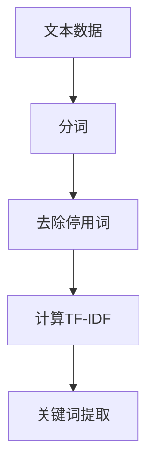
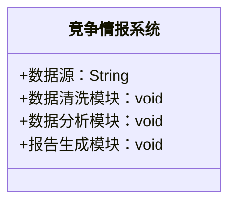

                 


# AI辅助企业竞争情报分析：自动化数据采集与洞察生成

> **关键词**：AI，竞争情报分析，数据采集，自动化，洞察生成，自然语言处理，机器学习

> **摘要**：本文详细探讨了人工智能在企业竞争情报分析中的应用，从数据采集到洞察生成的自动化过程。通过分析核心概念、算法原理、系统设计和项目实战，展示了AI如何提升竞争情报分析的效率和准确性。

---

## 第一章：引言

### 1.1 问题背景
竞争情报分析是企业在市场中获取优势的关键工具，涉及收集、分析和解读竞争对手的信息。然而，传统方法依赖人工采集和分析，效率低且容易出错。AI的引入，特别是自然语言处理（NLP）和机器学习，为竞争情报分析带来了革命性的变化。

### 1.2 问题描述
竞争情报分析面临的挑战包括数据量大、信息分散、分析复杂等。AI能够自动化数据采集、处理和分析，显著提高效率和准确性。本文将探讨如何利用AI技术解决这些问题。

### 1.3 问题解决
通过AI技术，企业可以实现竞争情报分析的自动化，包括数据采集、清洗、分析和洞察生成。本文将详细讲解AI在这些环节中的应用，提供实际案例和系统设计。

---

## 第二章：竞争情报分析的核心概念

### 2.1 竞争情报分析的基本原理
竞争情报分析涉及收集、整理和分析竞争对手的信息，以帮助企业制定战略决策。AI技术的应用使其更加高效和精准。

### 2.2 AI在竞争情报分析中的作用
- **自然语言处理（NLP）**：用于从文本数据中提取关键信息，如情感分析、关键词提取。
- **机器学习**：用于预测市场趋势和竞争对手行为。
- **数据挖掘**：用于发现数据中的模式和关联。

### 2.3 核心概念的联系与对比
通过ER图展示竞争情报分析的核心要素，包括企业、竞争对手、市场趋势等实体及其关系。

```mermaid
erDiagram
    actor 顾客
    actor 竞争对手
    actor 市场
    actor 企业
    enterprise 企业系统
    competitor_info 竞争对手信息
    market_trend 市场趋势
    product_feature 产品特征
    actor 顾客 --> product_feature: 使用
    actor 竞争对手 --> competitor_info: 提供
    actor 市场 --> market_trend: 反映
    enterprise 与 competitor_info 和 market_trend 关联
```

---

## 第三章：自然语言处理（NLP）在竞争情报分析中的应用

### 3.1 算法原理
NLP用于处理文本数据，提取关键词、情感分析和主题模型。例如，使用TF-IDF提取关键词，情感分析判断市场情绪。



### 3.2 算法实现
以下是Python代码实现情感分析的示例：

```python
from textblob import TextBlob

def analyze_sentiment(text):
    blob = TextBlob(text)
    return blob.sentiment.polarity

text = "The new product is excellent!"
print(analyze_sentiment(text))  # 输出：0.9
```

---

## 第四章：系统分析与架构设计

### 4.1 系统功能设计
系统模块包括数据采集、清洗、分析和报告生成。领域模型类图展示各模块关系：



### 4.2 系统架构设计
系统架构分为数据采集层、处理层和应用层。架构图如下：

```mermaid
rectangle 竞争情报系统 {
    网络爬虫 --> 数据清洗 --> 数据分析 --> 报告生成
}
```

---

## 第五章：项目实战

### 5.1 环境安装
安装必要的库，如requests、BeautifulSoup、TextBlob：

```bash
pip install requests beautifulsoup4 textblob
```

### 5.2 核心实现
编写数据采集和分析的代码：

```python
import requests
from bs4 import BeautifulSoup

def scrape_competitor_data(url):
    response = requests.get(url)
    soup = BeautifulSoup(response.text, 'html.parser')
    # 提取竞争对手信息
    return extracted_data

scraped_data = scrape_competitor_data("https://example.com/competitors")
# 分析数据并生成报告
```

### 5.3 案例分析
通过实际案例展示AI如何帮助某公司分析竞争对手的产品策略，并生成市场趋势报告。

---

## 第六章：总结与展望

### 6.1 本章小结
AI技术显著提升了竞争情报分析的效率和准确性，通过自动化数据采集和分析，为企业提供了有力的支持。

### 6.2 未来展望
未来，AI在竞争情报分析中的应用将更加广泛，包括更复杂的模型和实时分析。企业需要关注数据隐私和模型优化。

### 6.3 最佳实践 tips
- 确保数据来源合法和合规。
- 定期更新模型以适应市场变化。
- 结合人工分析确保洞察的准确性。

---

**作者：AI天才研究院/AI Genius Institute & 禅与计算机程序设计艺术 /Zen And The Art of Computer Programming**

