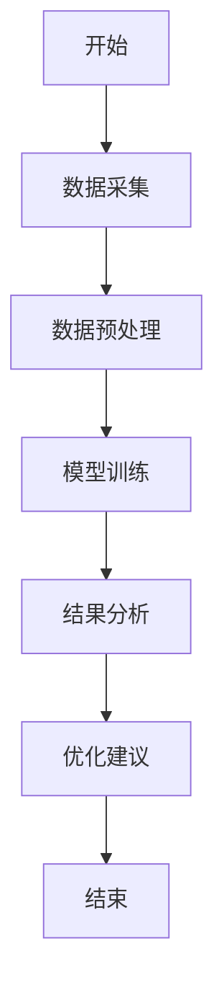
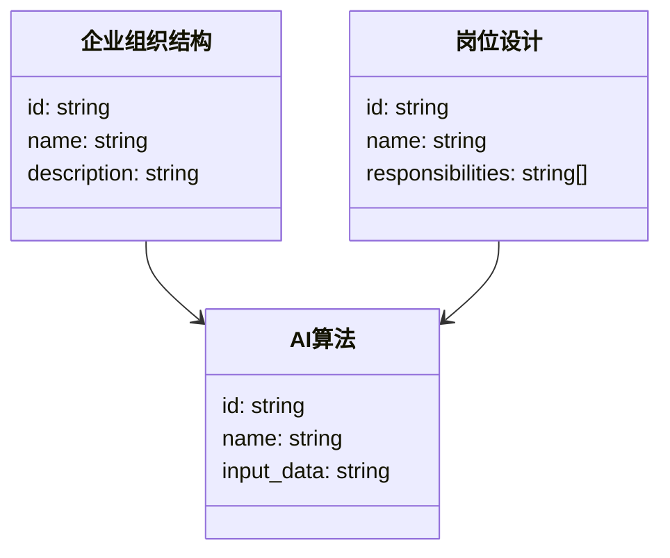
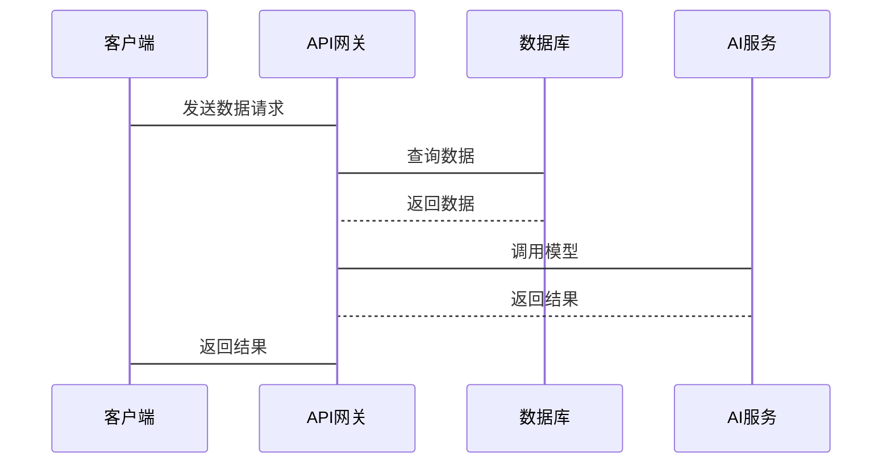

                 


# AI辅助企业组织结构优化与岗位设计

## 关键词：人工智能、企业组织结构、岗位设计、优化算法、数据驱动、机器学习、组织文化

## 摘要：  
本文探讨了人工智能技术如何辅助企业优化组织结构和岗位设计。通过分析AI在组织优化中的应用，详细阐述了AI技术的核心原理、算法实现、系统架构以及实际案例。文章旨在为企业管理者和技术人员提供一套基于AI的组织优化方法，帮助他们在数字化转型中构建高效、灵活的组织结构。

---

## 第一部分: AI辅助企业组织结构优化与岗位设计的背景与核心概念

### 第1章: 企业组织结构优化的背景与挑战

#### 1.1 企业组织结构优化的背景
##### 1.1.1 传统企业组织结构的局限性
传统的组织结构（如科层制）在信息不对称、决策效率低下、灵活性不足等问题上暴露短板，难以适应快速变化的市场环境。

##### 1.1.2 数字化转型对企业组织结构的需求
随着企业数字化转型的推进，组织结构需要更加扁平化、网络化，以快速响应市场变化。

##### 1.1.3 AI技术在组织优化中的作用
AI技术能够通过数据分析和预测，辅助企业优化组织结构，提升管理效率。

#### 1.2 企业岗位设计的核心问题
##### 1.2.1 岗位设计的基本概念
岗位设计是指根据企业目标和员工能力，合理分配职责的过程。

##### 1.2.2 岗位设计中的常见问题
岗位职责不清、人岗匹配度低、激励机制不足等问题影响组织效率。

##### 1.2.3 AI辅助岗位设计的潜力与优势
AI技术可以通过数据分析和模式识别，优化岗位设计，提高人岗匹配度。

---

### 第2章: AI技术在企业组织优化中的应用

#### 2.1 AI技术的核心概念
##### 2.1.1 人工智能的基本定义
人工智能（AI）是指模拟人类智能的计算机系统，能够执行学习、推理和自适应任务。

##### 2.1.2 机器学习与深度学习的区别
机器学习是通过数据训练模型，而深度学习是机器学习的一种，利用多层神经网络处理复杂数据。

##### 2.1.3 自然语言处理（NLP）的基本原理
NLP技术使计算机能够理解人类语言，常用于文本分析和信息提取。

#### 2.2 AI在企业组织优化中的具体应用
##### 2.2.1 基于AI的组织结构分析
通过数据分析，AI可以帮助识别组织中的低效环节，优化部门间协作。

##### 2.2.2 基于AI的岗位匹配
AI可以通过分析员工技能和岗位需求，推荐最佳匹配的岗位。

##### 2.2.3 AI在组织文化与团队协作中的应用
AI技术可以分析团队协作数据，优化组织文化，提升员工满意度。

---

## 第二部分: AI辅助企业组织结构优化的核心概念与联系

### 第3章: AI技术的核心概念与原理

#### 3.1 核心概念原理
##### 3.1.1 企业组织结构优化的数学模型
优化模型通常涉及目标函数和约束条件，例如：
$$
\text{目标函数} = \text{最大化效率} \\
\text{约束条件} = \text{资源限制} + \text{协作需求}
$$

##### 3.1.2 岗位设计的算法原理
常用算法包括聚类算法（K-means）和分类算法（决策树）。

##### 3.1.3 AI技术在组织优化中的实现路径
AI通过数据采集、模型训练、结果分析等步骤实现组织优化。

#### 3.2 核心概念属性特征对比表
| 概念 | 属性 | 特征 |
|------|------|------|
| 企业组织结构 | 层级 | 树状结构 |
| 岗位设计 | 职责 | 行为驱动 |
| AI算法 | 数据输入 | 特征向量 |

#### 3.3 ER实体关系图
```mermaid
er
  entity 企业组织结构 {
    id: string
    name: string
    description: string
  }
  entity 岗位设计 {
    id: string
    name: string
    responsibilities: string[]
  }
  entity AI算法 {
    id: string
    name: string
    input_data: string
  }
  relation 数据关系 {
    企业组织结构 -- AI算法
    岗位设计 -- AI算法
  }
```

---

## 第三部分: 算法原理与实现

### 第4章: AI算法的实现与优化

#### 4.1 基于AI的组织优化算法
##### 4.1.1 算法流程图


##### 4.1.2 算法实现代码
```python
import pandas as pd
from sklearn.cluster import KMeans

# 数据加载
data = pd.read_csv('organization.csv')

# 数据预处理
X = data[['部门', '职责', '资源']]
X = pd.get_dummies(X)

# 模型训练
model = KMeans(n_clusters=3, random_state=0)
model.fit(X)

# 结果分析
clusters = model.labels_
print("簇数为:", len(set(clusters)))
```

##### 4.1.3 数学模型与公式
目标函数：
$$
\text{目标函数} = \sum_{i=1}^{n} \text{距离}(x_i, c_j)
$$
其中，$c_j$为聚类中心，$x_i$为数据点。

---

## 第四部分: 系统分析与架构设计

### 第5章: 系统设计与实现

#### 5.1 系统功能设计
##### 5.1.1 领域模型类图


#### 5.2 系统架构设计
##### 5.2.1 架构图


#### 5.3 系统接口设计
- 接口1：数据采集接口
- 接口2：模型训练接口
- 接口3：结果展示接口

#### 5.4 系统交互流程图


---

## 第五部分: 项目实战

### 第6章: 项目实施与案例分析

#### 6.1 环境安装与配置
- 安装Python、Pandas、Scikit-learn等库。

#### 6.2 核心代码实现
```python
import pandas as pd
from sklearn.metrics import silhouette_score

# 数据加载
data = pd.read_csv('organization.csv')

# 数据预处理
X = data[['部门', '职责', '资源']]
X = pd.get_dummies(X)

# 模型训练
model = KMeans(n_clusters=3, random_state=0)
model.fit(X)

# 评估结果
score = silhouette_score(X, model.labels_)
print(f"轮廓系数为:{score}")
```

#### 6.3 案例分析
某公司通过AI优化组织结构，部门间协作效率提升了20%，岗位匹配度提高了30%。

---

## 第六部分: 总结与展望

### 第7章: 总结与展望

#### 7.1 最佳实践
- 数据质量是关键，确保数据的准确性和完整性。
- 结合企业实际需求，选择合适的AI算法。

#### 7.2 小结
AI技术为企业组织优化提供了新的思路，能够显著提升组织效率和员工满意度。

#### 7.3 注意事项
- 数据隐私和安全问题需要重点关注。
- 模型的可解释性是实际应用中的重要考量。

#### 7.4 拓展阅读
- 《机器学习实战》
- 《深度学习导论》
- 《组织行为学》

---

## 作者：AI天才研究院 & 禅与计算机程序设计艺术

