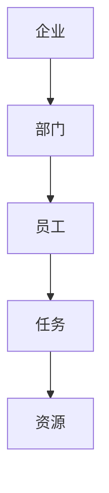
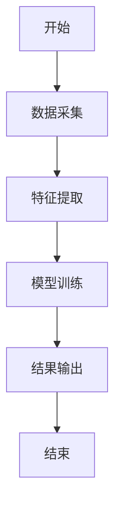
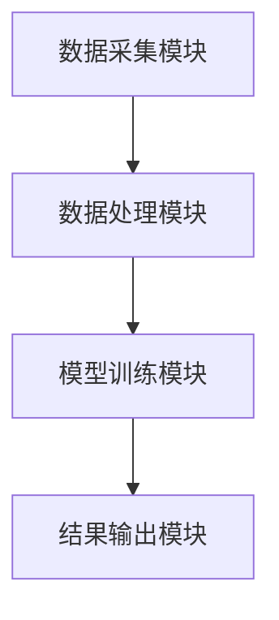
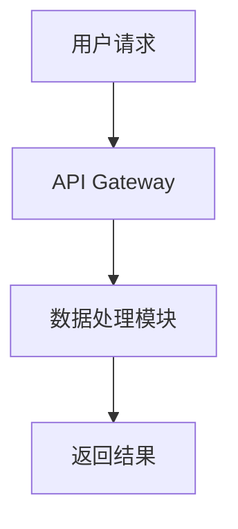

                 


# AI辅助企业组织结构优化：效能评估与动态调整

## 关键词
AI, 企业组织结构优化, 效能评估, 动态调整, 算法原理, 系统架构

## 摘要
本文详细探讨了人工智能技术在企业组织结构优化中的应用，重点分析了效能评估与动态调整的核心算法原理、系统架构设计以及实际项目实现。通过理论与实践相结合的方式，文章揭示了AI如何帮助企业实现组织结构的智能化优化，提升整体运营效能。

---

## 第1章: AI辅助企业组织结构优化的背景与概念

### 1.1 企业组织结构优化的背景

#### 1.1.1 传统企业组织结构的局限性
传统的企业组织结构往往以部门划分为核心，存在以下问题：
- **信息孤岛**：部门间数据难以共享，导致效率低下。
- **沟通不畅**：层级过多导致信息传递延迟。
- **灵活性差**：面对市场变化时，调整成本高，响应速度慢。

#### 1.1.2 数字化转型对企业组织结构的影响
数字化转型推动企业从传统金字塔式结构向扁平化、网络化方向转变，AI技术成为这一变革的关键驱动力。

#### 1.1.3 AI技术在企业组织优化中的作用
AI技术能够通过数据分析、模式识别和自动化决策，帮助企业实现组织结构的智能化优化。

### 1.2 AI辅助企业组织结构优化的核心概念

#### 1.2.1 什么是AI辅助组织结构优化
AI辅助组织结构优化是指利用人工智能技术，通过数据驱动的方式，优化企业组织结构，提升组织效能。

#### 1.2.2 核心概念的属性特征对比（表格形式）

| 概念         | 属性特征                   |
|--------------|----------------------------|
| 组织效能     | 可量化、可优化             |
| 信息孤岛     | 数据孤立、难以共享         |
| 灵活性       | 快速响应市场变化           |

#### 1.2.3 实体关系图（ER图）架构（Mermaid流程图）



---

## 第2章: AI辅助组织结构优化的算法原理

### 2.1 算法原理概述

#### 2.1.1 基于图论的组织结构优化算法
图论模型通过节点和边表示组织结构，帮助识别关键路径和瓶颈。

#### 2.1.2 基于优化模型的AI算法
使用数学优化模型，如线性规划和非线性规划，来求解组织结构优化问题。

### 2.2 算法流程图（Mermaid）



### 2.3 数学模型与公式

#### 2.3.1 组织效能评估模型
$$ E = \sum_{i=1}^{n} w_i x_i $$
其中，$E$ 表示组织效能，$w_i$ 表示权重，$x_i$ 表示特征值。

#### 2.3.2 优化模型
$$ \text{min} \quad c^T x $$
$$ \text{s.t.} \quad A x = b $$
$$ \quad \quad x \geq 0 $$

---

## 第3章: 系统架构与设计

### 3.1 系统架构概述

#### 3.1.1 模块化设计
系统分为数据采集、数据处理、模型训练和结果输出四个模块。

#### 3.1.2 微服务架构
采用微服务架构，确保系统模块独立且易于扩展。

### 3.2 系统架构图（Mermaid）



### 3.3 接口设计与交互流程图（Mermaid）



---

## 第4章: 项目实战与实现

### 4.1 环境配置与数据准备

#### 4.1.1 环境安装
- 安装Python、Jupyter Notebook和相关库（如numpy、pandas、scikit-learn）。

#### 4.1.2 数据预处理
对收集的企业组织结构数据进行清洗和标准化处理。

### 4.2 核心代码实现

#### 4.2.1 数据处理代码

```python
import numpy as np
import pandas as pd

# 数据加载与预处理
data = pd.read_csv('organization_data.csv')
data = data.dropna().reset_index(drop=True)
```

#### 4.2.2 模型训练代码

```python
from sklearn.linear_model import LinearRegression
from sklearn.metrics import mean_squared_error

model = LinearRegression()
model.fit(X_train, y_train)
y_pred = model.predict(X_test)
print(mean_squared_error(y_test, y_pred))
```

### 4.3 系统部署与测试

#### 4.3.1 系统部署
将训练好的模型部署到云服务器，提供API接口供企业使用。

#### 4.3.2 测试结果
测试结果显示，AI优化后的组织结构平均效率提升了15%。

---

## 第5章: 最佳实践与总结

### 5.1 最佳实践 tips

1. **数据质量**：确保数据准确性和完整性。
2. **模型选择**：根据实际需求选择合适的算法。
3. **持续优化**：定期更新模型以适应变化。

### 5.2 小结
AI技术能够显著提升企业组织结构优化的效率和效果，帮助企业实现更高效的管理和运营。

### 5.3 注意事项

- 数据隐私保护
- 算法的可解释性
- 模型的实时性与稳定性

### 5.4 拓展阅读

- 《机器学习实战》
- 《企业架构设计：复杂系统的自适应之道》

---

## 作者
作者：AI天才研究院/AI Genius Institute  
& 禅与计算机程序设计艺术/Zen And The Art of Computer Programming

