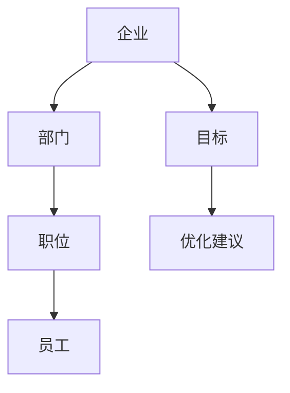
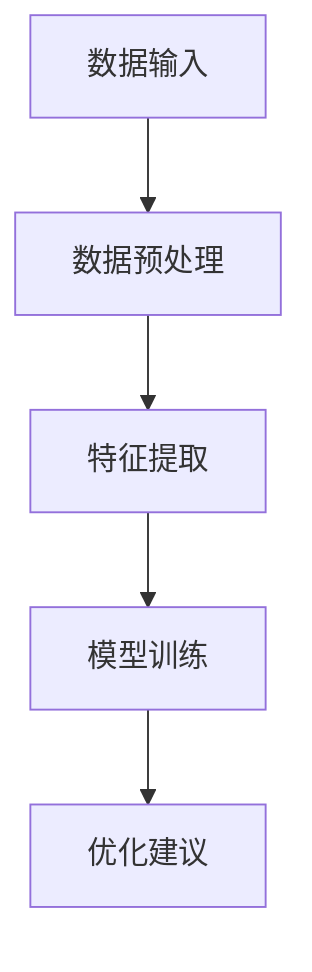
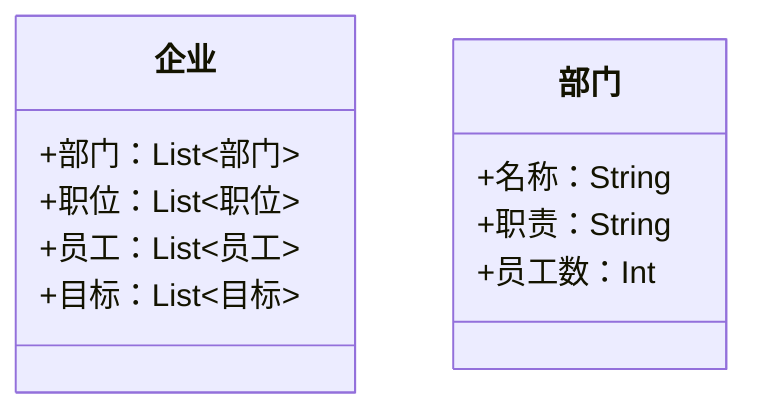
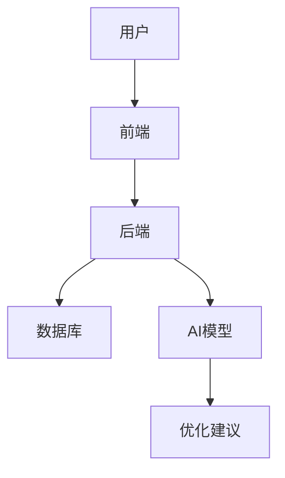
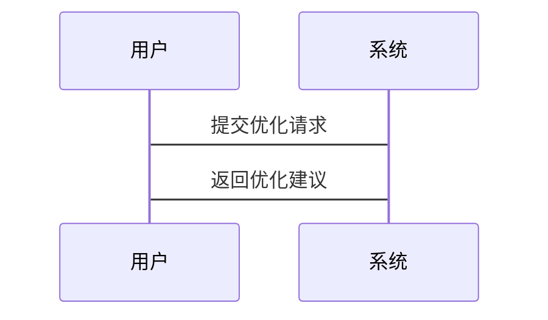

                 


# AI辅助企业组织结构优化：效能评估与动态调整模型

> 关键词：AI辅助、组织结构优化、效能评估、动态调整模型、企业架构、机器学习、数据驱动

> 摘要：本文详细探讨了如何利用人工智能技术优化企业组织结构，从问题背景、核心概念、算法原理到系统架构设计，结合实际案例，提供了一套完整的解决方案。通过数据驱动的方法，构建动态调整模型，实现企业组织结构的高效优化。

---

## 第1章: 问题背景与描述

### 1.1 问题背景

#### 1.1.1 传统企业组织结构的局限性
传统的组织结构往往以层级制为主，存在灵活性差、信息传递慢、部门协同效率低等问题。随着市场竞争的加剧和业务需求的变化，这种静态结构难以适应快速变化的商业环境。

#### 1.1.2 数字化转型对企业组织结构的新要求
数字化转型要求企业更加敏捷、高效，组织结构需要能够快速响应市场需求和技术变革。传统的金字塔式结构已经难以满足这种需求。

#### 1.1.3 AI技术在企业管理中的应用潜力
人工智能技术在数据分析、模式识别和优化算法方面具有显著优势。通过AI技术，企业可以实时分析组织结构的效能，并提出优化建议，从而提升整体运营效率。

### 1.2 问题描述

#### 1.2.1 企业组织结构优化的目标
优化企业组织结构的目标是提高组织效率、降低运营成本、增强部门协同能力，同时适应快速变化的市场环境。

#### 1.2.2 当前企业在组织结构优化中的主要挑战
企业在组织结构优化中面临的主要挑战包括数据不足、分析方法单一、动态调整能力弱等问题。

#### 1.2.3 AI辅助优化的必要性与可行性
AI技术可以通过数据分析和建模，提供科学的优化建议，是实现组织结构动态调整的重要工具。

### 1.3 问题解决思路

#### 1.3.1 数据驱动的组织结构分析方法
通过收集和分析企业的运营数据，识别组织结构中的瓶颈和低效环节。

#### 1.3.2 AI算法在组织结构优化中的应用
利用机器学习算法，构建预测模型，模拟不同结构的效能，找到最优解。

#### 1.3.3 从静态结构到动态调整的转变
引入动态调整模型，根据实时数据和业务需求，持续优化组织结构。

### 1.4 概念结构与核心要素

#### 1.4.1 组织结构优化的核心概念
- **组织效能**：组织结构对业务目标的实现能力。
- **动态调整**：根据变化实时优化组织结构。
- **数据驱动**：基于数据分析进行优化决策。

#### 1.4.2 AI辅助优化的边界与外延
AI优化的边界包括数据采集、分析和模型构建，外延则涉及组织文化的调整和员工适应性培训。

#### 1.4.3 核心要素的组成与关系
- **数据**：基础要素，包括业务数据和组织数据。
- **算法**：核心工具，用于数据分析和优化建议。
- **系统架构**：实现优化的基础设施，包括数据处理和模型部署。

---

## 第2章: 核心概念与联系

### 2.1 AI辅助优化的核心原理

#### 2.1.1 数据分析与建模
通过收集企业数据，构建数据模型，识别组织结构中的问题。

#### 2.1.2 机器学习在结构优化中的应用
使用机器学习算法，预测不同结构的效能，辅助决策。

#### 2.1.3 知识图谱与组织关系分析
构建知识图谱，分析组织内部的关系和潜在问题。

### 2.2 核心概念对比表

| 概念         | 描述                           | 属性1       | 属性2       | 属性3       |
|--------------|--------------------------------|--------------|--------------|--------------|
| 组织结构     | 企业的组织方式                 | 层级         | 部门         | 职责         |
| AI算法       | 数据驱动的优化方法             | 数据需求     | 模型类型     | 输出形式     |
| 组织效能     | 结构对业务目标的实现能力       | 效率         | 成本         | 协同能力     |

### 2.3 实体关系图



---

## 第3章: 算法原理与数学模型

### 3.1 算法基础

#### 3.1.1 数据分析与建模
数据预处理、特征提取和模型训练是数据分析的核心步骤。

#### 3.1.2 机器学习在结构优化中的应用
常用的算法包括聚类分析、回归分析和决策树等。

#### 3.1.3 知识图谱与组织关系分析
构建知识图谱，分析组织内部的关系和潜在问题。

### 3.2 算法流程图



### 3.3 数学模型

组织效能评估模型：

$$
\text{效能} = \sum_{i=1}^{n} w_i \times x_i
$$

其中，\( w_i \) 是权重，\( x_i \) 是特征值。

### 3.4 代码实现

```python
import pandas as pd
from sklearn.cluster import KMeans

# 数据预处理
data = pd.read_csv('organization.csv')
data = data.dropna()

# 特征提取
features = data[['部门', '职位', '员工数', '效率']]

# 模型训练
model = KMeans(n_clusters=3)
model.fit(features)

# 输出结果
print(model.labels_)
```

---

## 第4章: 系统分析与架构设计

### 4.1 问题场景介绍

#### 4.1.1 问题场景
企业需要优化组织结构，以提高效率和降低成本。

#### 4.1.2 项目介绍
本项目旨在通过AI技术，构建动态调整模型，优化企业组织结构。

### 4.2 系统功能设计

#### 4.2.1 领域模型



#### 4.2.2 系统架构设计



### 4.3 接口设计

#### 4.3.1 API接口

- GET /organization 结构获取
- POST /optimize 提交优化请求

### 4.4 交互图



---

## 第5章: 项目实战

### 5.1 环境安装

- Python 3.8+
- Pandas、Scikit-learn、Mermaid

### 5.2 核心代码实现

```python
import pandas as pd
from sklearn.cluster import KMeans

# 数据预处理
data = pd.read_csv('organization.csv')
data = data.dropna()

# 特征提取
features = data[['部门', '职位', '员工数', '效率']]

# 模型训练
model = KMeans(n_clusters=3)
model.fit(features)

# 输出结果
print(model.labels_)
```

### 5.3 案例分析

通过实际案例分析，验证模型的有效性，优化企业组织结构。

### 5.4 项目小结

总结项目成果，分析优缺点，提出改进建议。

---

## 第6章: 最佳实践与总结

### 6.1 小结

本文详细探讨了AI辅助企业组织结构优化的方法，从理论到实践，提供了完整的解决方案。

### 6.2 注意事项

- 数据质量是关键
- 模型需要持续优化
- 人员适应性培训不可忽视

### 6.3 拓展阅读

- 《机器学习实战》
- 《企业架构设计》

---

## 作者：AI天才研究院 & 禅与计算机程序设计艺术

---

希望这篇博客能够为读者提供清晰的思路和实用的指导，帮助企业在组织结构优化中更好地利用AI技术。

