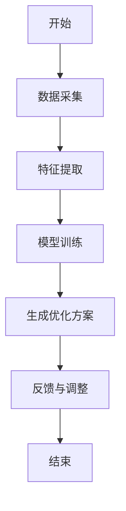
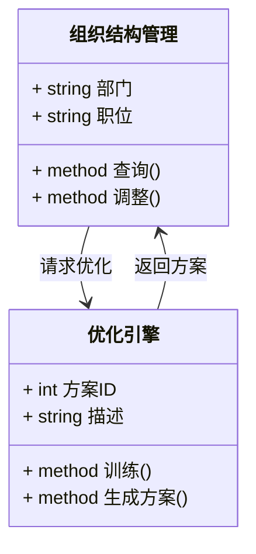
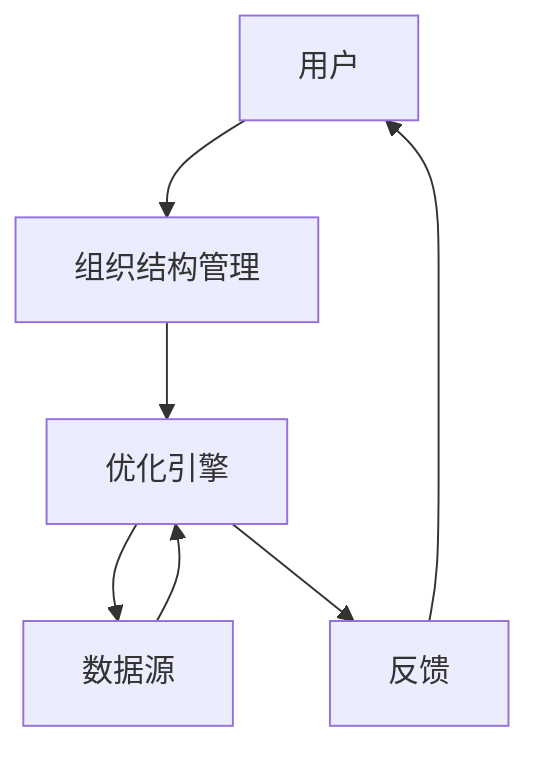

                 


# AI辅助企业组织结构动态优化：效能评估与自适应调整模型

---

## 关键词：
- AI辅助
- 企业组织结构
- 动态优化
- 效能评估
- 自适应调整
- 系统架构设计
- 数字化转型

---

## 摘要：
本文探讨了AI在企业组织结构动态优化中的应用，提出了效能评估与自适应调整模型。通过分析企业组织结构优化的背景与挑战，详细阐述了动态优化模型的核心概念、算法原理及系统架构设计，并结合实际案例展示了模型的应用效果。文章还提供了最佳实践建议，帮助企业在数字化转型中实现组织结构的高效优化。

---

## 第一部分: 背景与概念

### 第1章: 问题背景与核心概念

#### 1.1 企业组织结构动态优化的背景

随着市场竞争的加剧和数字化转型的推进，企业组织结构的优化变得尤为重要。传统的静态组织结构难以适应快速变化的市场环境，导致效率低下、资源浪费等问题。AI技术的应用为动态优化提供了新的可能性，能够实时分析数据并调整组织结构，提升企业效能。

#### 1.2 核心概念与问题描述

- **动态优化模型**：通过AI算法实时调整组织结构，以适应内外部环境的变化。
- **效能评估**：通过关键指标（如效率、成本、产出）评估组织结构的优化效果。
- **自适应调整机制**：根据实时数据和反馈，自动调整组织结构和资源配置。

#### 1.3 问题解决与边界分析

AI技术的应用能够解决传统组织优化中的问题，如信息孤岛、决策滞后等。然而，模型的应用范围和边界需要明确，如数据质量、算法复杂度等限制因素。

---

## 第二部分: 核心概念与联系

### 第2章: 核心概念对比与ER关系图

#### 2.1 动态优化模型与传统模型对比

| 模型类型 | 参数化程度 | 适应性 |
|----------|------------|--------|
| 传统模型 | 低         | 差     |
| 动态模型 | 高         | 强     |

#### 2.2 ER实体关系图

```mermaid
erDiagram
    actor 顾客 {
        string 名称
    }
    actor 管理员 {
        string 名称
    }
    entity 组织结构 {
        string 部门
        string 职位
    }
    entity 优化方案 {
        int 方案ID
        string 描述
    }
    顾客 --> 组织结构: 查询
    管理员 --> 组织结构: 调整
    组织结构 --> 优化方案: 生成
```

---

## 第三部分: 算法原理

### 第3章: 算法原理与实现

#### 3.1 数学模型与公式

动态优化模型的数学表达式如下：

$$
\text{目标函数：} \quad f(x) = \sum_{i=1}^{n} w_i x_i
$$

其中，\( w_i \) 是权重，\( x_i \) 是变量。

#### 3.2 算法流程图



#### 3.3 Python代码实现

```python
def dynamic_optimization(data):
    # 数据预处理
    processed_data = preprocess(data)
    # 特征提取
    features = extract_features(processed_data)
    # 模型训练
    model = train_model(features)
    # 生成优化方案
    solution = generate_solution(model, features)
    return solution

# 示例
data = {
    '部门': ['销售', '市场', '技术'],
    '效率': [0.8, 0.6, 0.9]
}
result = dynamic_optimization(data)
print(result)
```

---

## 第四部分: 系统分析与架构设计

### 第4章: 系统架构设计

#### 4.1 问题场景介绍

企业面临组织结构优化的需求，希望通过AI技术实现动态调整。

#### 4.2 系统功能设计



#### 4.3 系统架构图



---

## 第五部分: 项目实战

### 第5章: 项目实战与案例分析

#### 5.1 环境安装

安装Python和相关库：

```bash
pip install numpy pandas scikit-learn
```

#### 5.2 核心代码实现

```python
import pandas as pd
from sklearn import linear_model

def optimize_structure(dataframe):
    # 训练模型
    model = linear_model.LinearRegression()
    model.fit(dataframe[['部门', '职位']], dataframe['效率'])
    # 生成优化方案
    optimized = model.predict(dataframe[['部门', '职位']])
    return optimized

# 示例
data = {
    '部门': ['销售', '市场', '技术'],
    '职位': ['经理', '主管', '开发'],
    '效率': [0.8, 0.6, 0.9]
}
df = pd.DataFrame(data)
result = optimize_structure(df)
print(result)
```

---

## 第六部分: 最佳实践与总结

### 第6章: 最佳实践与总结

#### 6.1 最佳实践

- 确保数据质量
- 定期模型更新
- 结合业务需求

#### 6.2 总结与展望

AI技术在企业组织结构优化中的应用前景广阔，未来将更加智能化和自动化。

---

## 作者：

作者：AI天才研究院/AI Genius Institute & 禅与计算机程序设计艺术 /Zen And The Art of Computer Programming

