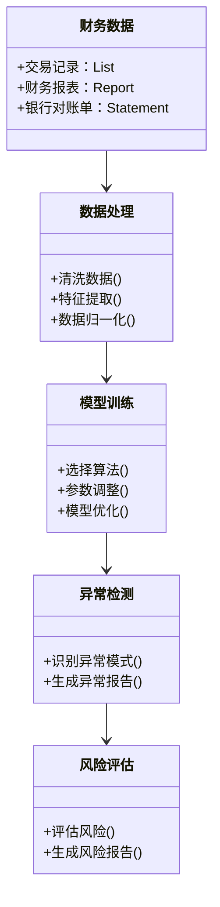
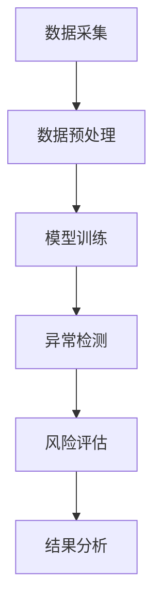
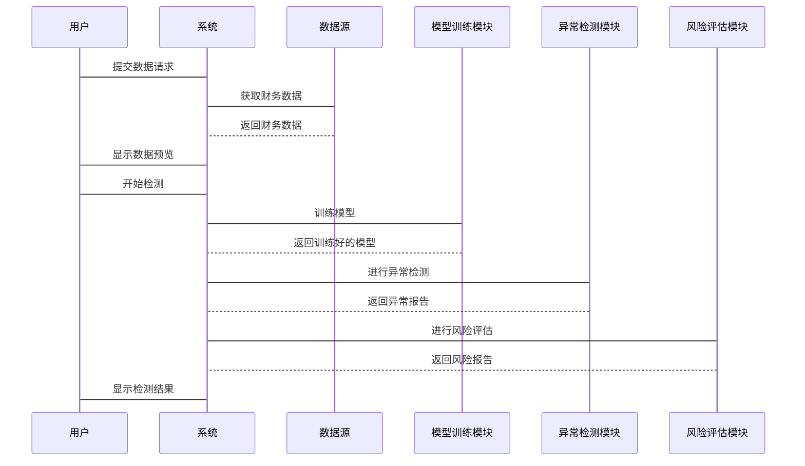

                 


# AI辅助企业财务舞弊检测：异常模式识别与风险评估

> **关键词**：AI、财务舞弊检测、异常模式识别、风险评估、机器学习、深度学习、企业财务

> **摘要**：随着企业规模的不断扩大，财务舞弊问题日益严重，传统的财务舞弊检测方法逐渐显现出其局限性。本文将详细介绍如何利用人工智能技术，特别是异常模式识别和风险评估的方法，来提高企业财务舞弊检测的效率和准确性。本文将从问题背景、核心概念、算法原理、系统设计、项目实战到最佳实践，逐步展开，全面解析AI在财务舞弊检测中的应用。

---

## 第1章: 问题背景与核心概念

### 1.1 问题背景介绍

#### 1.1.1 企业财务舞弊的现状与挑战

企业财务舞弊行为不仅损害了企业的利益，还可能导致企业面临法律风险和信誉损失。随着企业规模的扩大和业务复杂性的增加，传统的财务舞弊检测方法逐渐显现出其局限性。传统方法主要依赖于审计人员的经验和人工审查，这种方法不仅效率低下，而且容易受到人为因素的影响，难以发现复杂的舞弊行为。

#### 1.1.2 传统财务舞弊检测的局限性

传统的财务舞弊检测方法存在以下问题：
1. **效率低下**：人工审查需要大量的时间和资源，难以应对海量的财务数据。
2. **主观性**：审计人员的经验和判断会影响检测结果，存在主观性。
3. **复杂性**：复杂的财务结构和交易模式使得传统的检测方法难以覆盖所有可能的舞弊行为。

#### 1.1.3 AI技术在财务舞弊检测中的优势

人工智能技术，特别是机器学习和深度学习，能够通过分析大量数据，自动识别异常模式和风险点。AI技术的优势包括：
1. **高效性**：AI能够快速处理大量数据，显著提高检测效率。
2. **准确性**：通过训练模型，AI能够识别复杂的异常模式，提高检测的准确性。
3. **可扩展性**：AI模型可以适应不同规模和复杂性的财务数据。

### 1.2 核心概念与定义

#### 1.2.1 异常模式识别的定义

异常模式识别是指通过分析数据，发现与正常模式不符的异常点或模式。在财务舞弊检测中，异常模式识别可以帮助识别潜在的舞弊行为。

#### 1.2.2 风险评估的基本概念

风险评估是通过分析潜在的风险因素，评估其对企业和财务健康的影响。在财务舞弊检测中，风险评估可以帮助企业识别高风险的交易和行为，从而采取相应的防范措施。

#### 1.2.3 AI辅助检测的流程与方法

AI辅助财务舞弊检测的流程通常包括以下几个步骤：
1. **数据收集**：收集企业的财务数据，包括交易记录、财务报表等。
2. **数据预处理**：对数据进行清洗、归一化和特征提取。
3. **模型训练**：使用机器学习或深度学习算法训练模型。
4. **异常检测**：通过训练好的模型识别异常模式。
5. **风险评估**：根据异常模式评估潜在的舞弊风险。
6. **结果分析**：对检测结果进行分析，提供风险报告和改进建议。

### 1.3 核心要素与系统架构

#### 1.3.1 数据来源与处理

财务数据来源包括企业的财务报表、交易记录、银行对账单等。数据处理包括数据清洗、特征提取和数据归一化。

#### 1.3.2 模型训练与优化

模型训练需要选择合适的算法，进行参数调整和优化，以提高检测的准确性和效率。

#### 1.3.3 结果分析与反馈

通过对模型检测结果的分析，识别高风险的交易和行为，并提供改进建议。

---

## 第2章: AI技术与财务舞弊检测的结合

### 2.1 AI技术在财务分析中的应用

#### 2.1.1 机器学习在异常检测中的作用

机器学习算法，如聚类和分类算法，可以帮助识别异常交易和模式。

#### 2.1.2 自然语言处理在财务报告分析中的应用

自然语言处理技术可以用于分析财务报告中的文本，识别潜在的舞弊信号。

#### 2.1.3 深度学习在复杂模式识别中的优势

深度学习模型，如卷积神经网络和循环神经网络，能够处理复杂的财务数据和模式。

### 2.2 财务舞弊检测的核心算法

#### 2.2.1 聚类算法在异常交易识别中的应用

聚类算法，如K-Means和DBSCAN，可以将交易数据分成不同的簇，识别异常簇。

#### 2.2.2 分类算法在舞弊类型识别中的应用

分类算法，如随机森林和支持向量机，可以对不同的舞弊类型进行分类。

#### 2.2.3 强化学习在风险评估中的潜在应用

强化学习可以通过模拟和反馈机制，优化风险评估策略。

---

## 第3章: 异常模式识别的算法原理

### 3.1 聚类算法

#### 3.1.1 K-Means算法的原理与实现

K-Means算法是一种常用的聚类算法，通过将数据分成K个簇，识别异常簇。

#### 3.1.2 DBSCAN算法在异常点检测中的应用

DBSCAN算法基于密度的聚类方法，能够识别密度较低的异常点。

#### 3.1.3 层次聚类在财务数据分组中的应用

层次聚类可以将财务数据分成不同的层次，识别异常的分组。

### 3.2 分类算法

#### 3.2.1 支持向量机（SVM）在舞弊分类中的应用

SVM是一种常用的分类算法，能够通过构建超平面，将数据分成不同的类别。

#### 3.2.2 随机森林算法在多类别舞弊检测中的优势

随机森林算法通过构建多个决策树，提高分类的准确性和鲁棒性。

#### 3.2.3 神经网络在复杂模式识别中的应用

神经网络能够处理复杂的财务数据，识别潜在的异常模式。

### 3.3 深度学习模型

#### 3.3.1 卷积神经网络（CNN）在财务图像识别中的应用

CNN可以用于处理财务图像，识别潜在的异常模式。

#### 3.3.2 循环神经网络（RNN）在时间序列数据中的应用

RNN可以用于处理财务时间序列数据，识别潜在的异常模式。

#### 3.3.3 Transformer模型在长文本分析中的优势

Transformer模型可以用于分析长文本数据，识别潜在的舞弊信号。

---

## 第4章: 风险评估与系统架构设计

### 4.1 系统功能设计

#### 4.1.1 数据采集与预处理模块

数据采集模块负责收集企业的财务数据，预处理模块对数据进行清洗和归一化。

#### 4.1.2 模型训练与优化模块

模型训练模块负责选择合适的算法，进行参数调整和优化。

#### 4.1.3 风险评估与报告生成模块

风险评估模块根据检测结果，生成风险报告和改进建议。

### 4.2 系统架构设计

#### 4.2.1 领域模型类图



#### 4.2.2 系统架构图



### 4.3 系统接口设计

#### 4.3.1 数据接口

数据接口负责与企业财务系统对接，获取财务数据。

#### 4.3.2 模型接口

模型接口负责与训练好的模型进行交互，接收输入数据，返回检测结果。

#### 4.3.3 报告接口

报告接口负责生成风险报告和异常报告。

### 4.4 系统交互流程图



---

## 第5章: 项目实战

### 5.1 环境安装与配置

#### 5.1.1 安装Python与相关库

安装Python和以下库：
- numpy
- pandas
- scikit-learn
- keras
- tensorflow

#### 5.1.2 数据集准备

准备企业财务数据集，包括交易记录、财务报表等。

### 5.2 核心代码实现

#### 5.2.1 数据预处理代码

```python
import pandas as pd
import numpy as np

# 加载数据
data = pd.read_csv('financial_data.csv')

# 数据清洗
data.dropna(inplace=True)
data = data.drop_duplicates()

# 特征提取
features = data[['交易金额', '交易时间', '交易地点', '交易类型']]
```

#### 5.2.2 模型训练代码

```python
from sklearn.cluster import KMeans

# 初始化模型
kmeans = KMeans(n_clusters=3, random_state=0)

# 训练模型
kmeans.fit(features)

# 预测簇
clusters = kmeans.predict(features)
```

#### 5.2.3 异常检测代码

```python
from sklearn.ensemble import IsolationForest

# 初始化模型
iforest = IsolationForest(n_estimators=100, random_state=0)

# 训练模型
iforest.fit(features)

# 预测异常
outliers = iforest.predict(features)
```

#### 5.2.4 风险评估代码

```python
from sklearn.svm import SVC

# 初始化模型
svm = SVC(gamma='auto')

# 训练模型
svm.fit(features, labels)

# 预测风险
risk_scores = svm.predict(features)
```

### 5.3 实际案例分析与解读

#### 5.3.1 案例背景

某企业财务数据中存在异常交易，需要通过AI模型进行检测和风险评估。

#### 5.3.2 数据分析

通过对交易金额、时间和地点的分析，发现某些交易金额异常，且交易时间集中在非工作时间。

#### 5.3.3 结果解读

模型检测出异常交易，并评估出高风险的交易行为，建议企业采取相应的防范措施。

### 5.4 项目小结

通过项目实战，我们可以看到AI技术在财务舞弊检测中的强大能力。通过数据预处理、模型训练和结果分析，我们可以有效地识别异常模式和风险点，帮助企业减少财务舞弊的风险。

---

## 第6章: 最佳实践与注意事项

### 6.1 小结

本文详细介绍了AI在企业财务舞弊检测中的应用，包括异常模式识别和风险评估的核心算法和系统设计。通过项目实战，我们展示了如何利用AI技术提高财务舞弊检测的效率和准确性。

### 6.2 注意事项

- 数据质量和完整性对模型的准确性至关重要。
- 模型需要定期更新和优化，以适应新的舞弊手段。
- 需要结合企业的实际情况，选择合适的算法和模型。

### 6.3 拓展阅读

- 《机器学习实战》
- 《深度学习入门：基于Python和Keras》
- 《数据挖掘导论》

---

## 作者

**作者：** AI天才研究院/AI Genius Institute & 禅与计算机程序设计艺术 /Zen And The Art of Computer Programming

