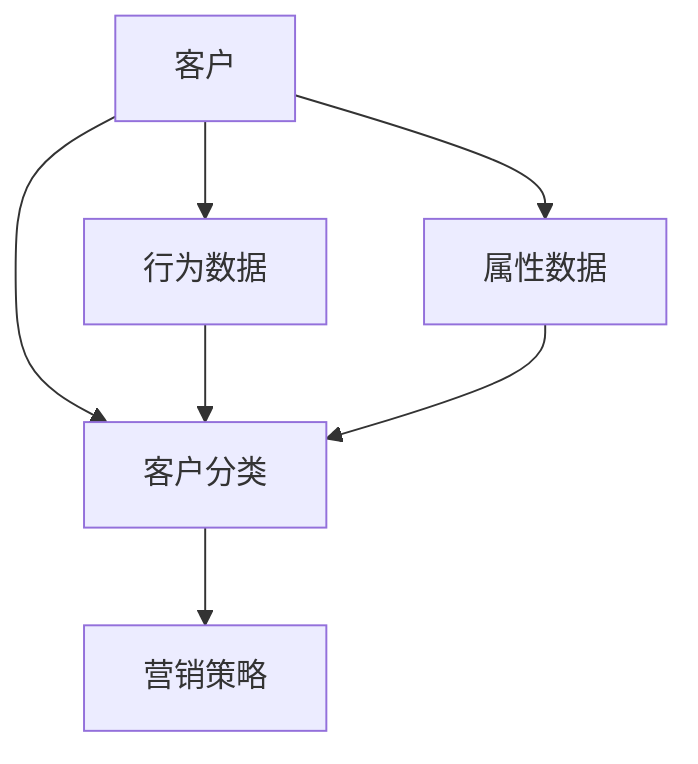
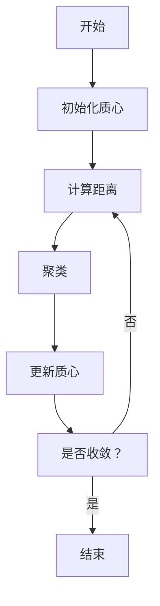
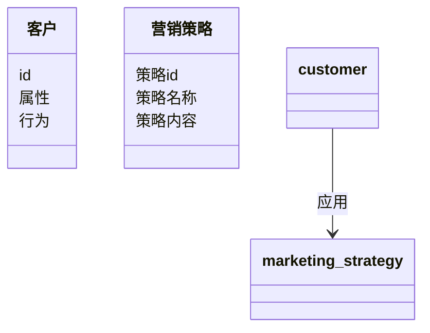
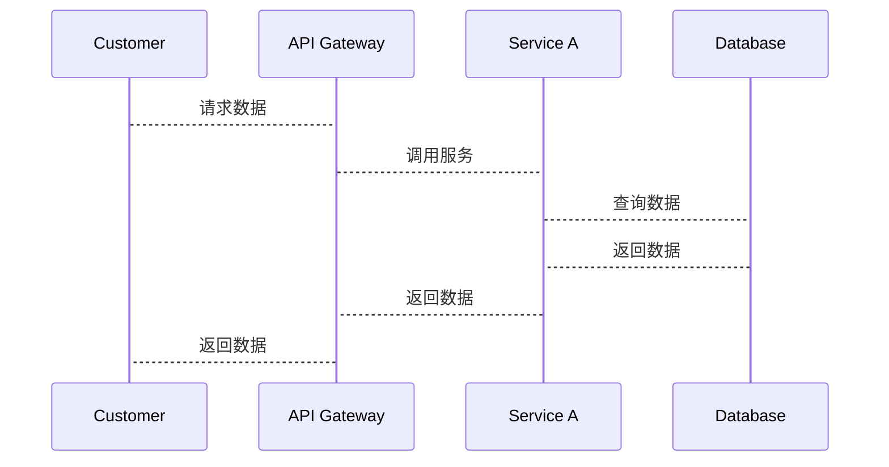

                 


# AI辅助客户细分与精准营销的最佳实践

## 关键词：
- AI
- 客户细分
- 精准营销
- 机器学习
- 数据挖掘

## 摘要：
随着人工智能技术的快速发展，AI在客户细分与精准营销中的应用越来越广泛。本文将详细探讨AI如何通过数据挖掘、机器学习和自然语言处理等技术，实现客户细分与精准营销的最佳实践。从背景介绍到核心概念，从算法原理到系统架构，再到项目实战，本文将一步步引导读者理解并应用AI技术，提升营销效果。

---

## 第1章: 客户细分与精准营销的背景

### 1.1 客户细分与精准营销的背景

#### 1.1.1 传统营销方式的局限性
传统营销方式主要依赖于经验和直觉，难以覆盖所有客户群体，导致资源浪费和效果不佳。

#### 1.1.2 数据驱动营销的兴起
随着大数据技术的发展，企业开始利用数据驱动的方法进行营销，提高了效率和精准度。

#### 1.1.3 AI如何解决这些问题
AI通过自动化处理和分析大量数据，能够快速识别客户特征，实现精准营销。

### 1.2 问题背景与问题描述

#### 1.2.1 客户细分的核心问题
客户细分的关键在于如何有效地将客户分成不同的群体，以便制定个性化的营销策略。

#### 1.2.2 精准营销的关键挑战
精准营销需要考虑客户的个性化需求和行为，传统的营销方式难以满足这一要求。

#### 1.2.3 AI如何解决这些问题
AI通过机器学习算法，能够自动识别客户特征，优化营销策略。

### 1.3 问题解决与边界定义

#### 1.3.1 AI辅助客户细分的解决方案
通过聚类分析、分类算法等技术，将客户分成不同的细分市场。

#### 1.3.2 精准营销的实现路径
利用客户数据进行预测分析，制定个性化营销方案。

#### 1.3.3 解决方案的边界与外延
AI解决方案仅处理客户数据，不涉及实际营销活动的执行。

### 1.4 核心概念与结构

#### 1.4.1 客户细分与精准营销的概念结构
客户细分是精准营销的基础，精准营销是客户细分的应用。

#### 1.4.2 核心要素与组成关系
客户数据、算法模型、营销策略是核心要素。

#### 1.4.3 与相关概念的对比分析
客户细分与市场细分的区别在于客户细分更注重个体特征。

### 1.5 本章小结
本章介绍了客户细分和精准营销的背景，分析了AI在其中的作用，并界定了核心概念和解决方案的边界。

---

## 第2章: AI辅助客户细分与精准营销的核心概念

### 2.1 数据挖掘与机器学习

#### 2.1.1 数据挖掘的基本原理
数据挖掘是从大量数据中提取有用信息的过程，常用于客户细分。

#### 2.1.2 机器学习在客户细分中的应用
机器学习算法如K-means、决策树等，可用于客户聚类和分类。

#### 2.1.3 常见算法对比分析
K-means适用于无监督学习，决策树适合有标签数据。

### 2.2 自然语言处理与客户行为分析

#### 2.2.1 NLP在客户数据处理中的作用
NLP技术可用于分析客户的文本数据，提取情感和关键词。

#### 2.2.2 客户行为分析的实现方法
通过分析客户的点击流数据，识别行为模式。

#### 2.2.3 NLP与客户细分的结合应用
利用NLP分析客户评论，进行情感分析，辅助客户细分。

### 2.3 数据可视化与结果呈现

#### 2.3.1 数据可视化的工具与方法
常用工具包括Matplotlib、Tableau等，方法包括柱状图、散点图等。

#### 2.3.2 可视化在客户细分中的作用
帮助直观展示客户分布，便于制定营销策略。

#### 2.3.3 结果呈现的最佳实践
使用交互式可视化工具，动态展示客户细分结果。

### 2.4 核心概念对比分析

#### 2.4.1 数据挖掘与机器学习对比表
| 技术 | 数据挖掘 | 机器学习 |
|------|----------|-----------|
| 定义 | 数据处理 | 数据模式识别 |
| 应用 | 数据提取 | 模型训练 |

#### 2.4.2 NLP与传统统计方法对比表
| 方法 | NLP | 传统统计 |
|------|-----|-----------|
| 数据类型 | 文本数据 | 结构化数据 |
| 分析目标 | 情感分析 | 描述性分析 |

### 2.5 ER实体关系图


### 2.6 本章小结
本章详细介绍了AI辅助客户细分的核心技术，包括数据挖掘、机器学习、NLP和数据可视化，并通过对比分析和ER图帮助读者理解各概念之间的关系。

---

## 第3章: AI辅助客户细分的算法原理

### 3.1 常见算法概述

#### 3.1.1 K-means聚类算法
适用于无监督学习，常用于客户聚类。

#### 3.1.2 决策树分类算法
适用于有标签数据的分类，如客户 churn 预测。

#### 3.1.3 线性回归分析
适用于预测性分析，如销售预测。

### 3.2 算法原理与流程

#### 3.2.1 K-means算法流程
1. 初始化质心。
2. 计算每个数据点到质心的距离。
3. 聚类并更新质心。
4. 重复直到收敛。



#### 3.2.2 K-means算法实现代码
```python
import numpy as np
from sklearn.cluster import KMeans

# 示例数据
X = np.array([[1, 2], [3, 4], [5, 6], [7, 8]])

# 初始化模型
kmeans = KMeans(n_clusters=2, random_state=0)

# 训练模型
kmeans.fit(X)

# 获取聚类结果
labels = kmeans.labels_
print(labels)
```

#### 3.2.3 K-means算法数学公式
距离计算公式：
$$d(x_i, c_j) = \sqrt{(x_i - c_j)^2}$$

### 3.3 本章小结
本章详细讲解了AI辅助客户细分的常见算法及其原理，通过流程图和代码示例帮助读者理解如何实现客户聚类。

---

## 第4章: 系统分析与架构设计

### 4.1 问题场景介绍
企业需要根据客户数据制定精准营销策略。

### 4.2 系统功能设计

#### 4.2.1 领域模型


#### 4.2.2 系统架构设计
```mermaid
graph LR
    Client --> API Gateway
    API Gateway --> Service A
    Service A --> Database
```

### 4.3 系统接口设计
API接口用于数据交互，如`/api/customers`。

### 4.4 系统交互设计


### 4.5 本章小结
本章通过系统分析和架构设计，展示了如何构建一个高效的AI辅助客户细分系统。

---

## 第5章: 项目实战

### 5.1 环境安装
安装Python和相关库（如scikit-learn、pandas、numpy）。

### 5.2 核心实现

#### 5.2.1 数据预处理
```python
import pandas as pd
import numpy as np

# 加载数据
data = pd.read_csv('customers.csv')

# 数据清洗
data = data.dropna()
```

#### 5.2.2 模型训练
```python
from sklearn.cluster import KMeans

# 初始化模型
kmeans = KMeans(n_clusters=3, random_state=0)

# 训练模型
kmeans.fit(data)

# 获取聚类结果
labels = kmeans.labels_
print(labels)
```

#### 5.2.3 结果展示
```python
import matplotlib.pyplot as plt

plt.scatter(data[0], data[1], c=labels)
plt.show()
```

### 5.3 代码解读与分析
详细解释每一步代码的作用和实现原理。

### 5.4 案例分析
通过具体案例分析，展示如何利用AI技术实现客户细分。

### 5.5 本章小结
本章通过实战项目，详细讲解了如何利用AI技术实现客户细分和精准营销。

---

## 第6章: 最佳实践

### 6.1 小结
总结全文内容，强调AI在客户细分和精准营销中的重要性。

### 6.2 注意事项
在实际应用中，需要注意数据隐私和模型的可解释性。

### 6.3 拓展阅读
推荐相关书籍和论文，供读者进一步学习。

### 6.4 本章小结
本章总结了AI辅助客户细分与精准营销的最佳实践，并提出了注意事项和拓展建议。

---

## 作者：AI天才研究院/AI Genius Institute & 禅与计算机程序设计艺术 /Zen And The Art of Computer Programming

---

以上是《AI辅助客户细分与精准营销的最佳实践》的完整目录和内容概要。按照这个结构，您可以逐步展开每个章节的内容，深入探讨AI在客户细分和精准营销中的应用。

