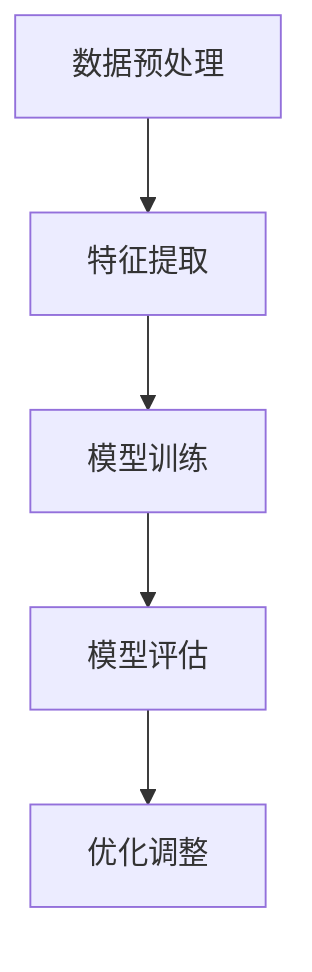
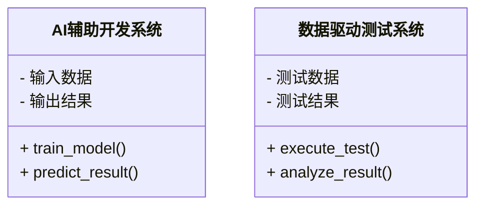
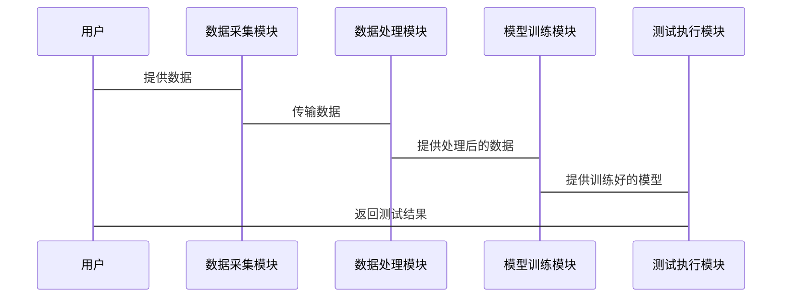

                 


# AI辅助新产品开发与市场测试的创新方法

**关键词**：AI，新产品开发，市场测试，创新方法，数据驱动，机器学习，系统架构

**摘要**：  
本文深入探讨了人工智能技术在新产品开发与市场测试中的创新应用方法。通过分析AI辅助开发的背景、核心概念、算法原理、系统架构以及实际案例，本文揭示了如何利用数据驱动的方式提升产品开发效率和市场测试精准度。文章还结合实际项目，详细阐述了AI辅助的系统设计、实现方案和最佳实践，为读者提供了一套完整的AI辅助新产品开发与市场测试的方法论。

---

# 第1章: AI辅助新产品开发与市场测试的背景与问题描述

## 1.1 问题背景与现状
### 1.1.1 传统新产品开发的痛点
- 传统新产品开发周期长，成本高，且依赖人工经验。
- 市场需求变化快，传统开发难以快速响应。
- 开发过程中缺乏数据驱动的决策支持。

### 1.1.2 AI技术在产品开发中的潜力
- AI可以通过数据分析优化产品设计。
- 智能算法可以预测市场需求，缩短开发周期。
- 自动化测试可以提高产品质量和效率。

### 1.1.3 当前市场测试中的效率瓶颈
- 测试数据量大，人工测试效率低。
- 测试覆盖不全面，难以发现潜在问题。
- 缺乏智能化的测试工具，测试效果受限。

## 1.2 问题描述与目标
### 1.2.1 新产品研发的复杂性分析
- 产品开发涉及多领域知识，复杂性高。
- 不同阶段的开发需求不同，需要灵活调整。
- 开发过程中需要协调多方资源，协同效率低。

### 1.2.2 市场测试中的数据处理挑战
- 测试数据分散，难以有效整合和分析。
- 数据分析缺乏深度，难以提供决策支持。
- 测试结果难以量化，难以评估产品价值。

### 1.2.3 引入AI辅助的目标与期望
- 提高开发效率，缩短开发周期。
- 提升测试精准度，降低产品缺陷率。
- 实现数据驱动的决策支持，提高产品市场适应性。

## 1.3 问题解决的思路与方法
### 1.3.1 AI辅助的创新方法概述
- 引入机器学习算法优化产品设计。
- 利用自然语言处理技术分析市场需求。
- 应用图像识别技术辅助产品测试。

### 1.3.2 数据驱动的市场测试策略
- 通过数据挖掘发现潜在需求。
- 利用预测模型预测市场反应。
- 基于实时数据分析优化测试方案。

### 1.3.3 从传统到AI辅助的转变路径
- 建立数据驱动的开发流程。
- 引入智能化的测试工具。
- 培训团队掌握AI辅助开发技能。

## 1.4 本章小结
本章通过分析传统新产品开发和市场测试的痛点，提出了AI辅助的创新方法，并探讨了其实现的目标和路径，为后续章节的深入分析奠定了基础。

---

# 第2章: AI辅助新产品开发与市场测试的核心概念

## 2.1 核心概念与定义
### 2.1.1 AI辅助开发的定义
- AI辅助开发是指利用人工智能技术优化产品开发的各个环节，包括需求分析、设计优化、测试等。

### 2.1.2 数据驱动测试的内涵
- 数据驱动测试是指通过数据挖掘和分析，指导测试策略的制定和执行。

### 2.1.3 创新方法的特征
- 创新方法具有高效性、精准性和智能化的特点。

## 2.2 核心概念的属性对比
### 2.2.1 AI辅助与传统开发的对比分析
| 特性       | 传统开发          | AI辅助开发        |
|------------|-------------------|-------------------|
| 效率       | 较低              | 较高              |
| 精度       | 依赖经验          | 数据驱动          |
| 灵活性     | 较低              | 较高              |

### 2.2.2 数据驱动与传统测试的对比
| 特性       | 传统测试          | 数据驱动测试       |
|------------|-------------------|-------------------|
| 数据利用    | 较低              | 高                |
| 测试效果    | 有限              | 高                |
| 需求响应    | 较慢              | 快                |

### 2.2.3 创新方法的优劣势分析
- **优势**：提高效率，降低成本，提升精准度。
- **劣势**：需要大量数据支持，技术门槛高。

## 2.3 核心概念的ER实体关系图
```mermaid
er
    entity(AI辅助开发) {
        id
        开发阶段
        AI模型
    }
    entity(数据驱动测试) {
        id
        测试阶段
        数据来源
    }
    entity(创新方法) {
        id
        方法类型
        应用场景
    }
```

## 2.4 本章小结
本章通过对比分析，明确了AI辅助开发和数据驱动测试的核心概念及其优势，为后续章节的深入探讨奠定了理论基础。

---

# 第3章: AI辅助新产品开发的算法原理与数学模型

## 3.1 算法原理概述
### 3.1.1 机器学习在产品开发中的应用
- 机器学习用于需求预测和产品优化。
- 算法选择：随机森林、支持向量机等。

### 3.1.2 深度学习模型的创新方法
- 使用深度学习模型（如LSTM）进行需求分析。
- 模型训练流程：数据预处理、模型训练、结果评估。

### 3.1.3 算法选择的策略与原则
- 根据数据类型选择算法。
- 结合业务需求选择模型。

## 3.2 数学模型与公式
### 3.2.1 机器学习的基本公式
$$y = w x + b$$

### 3.2.2 深度学习的数学基础
$$\text{激活函数} = \sigma(z)$$

### 3.2.3 创新方法的数学模型
$$\text{损失函数} = \sum_{i=1}^{n} (y_i - \hat{y}_i)^2$$

## 3.3 算法流程图


## 3.4 代码实现与分析
```python
import numpy as np
from sklearn.linear_model import LinearRegression

# 数据准备
X = np.array([[1], [2], [3], [4]])
y = np.array([2, 4, 6, 8])

# 模型训练
model = LinearRegression()
model.fit(X, y)

# 模型预测
print(model.predict([[5]]))  # 输出：[[10]]
```

## 3.5 本章小结
本章通过数学模型和算法流程图，详细讲解了AI辅助开发的算法原理，并通过代码示例展示了模型的实现过程。

---

# 第4章: 系统分析与架构设计方案

## 4.1 系统功能设计
### 4.1.1 领域模型设计


### 4.1.2 功能模块划分
- 数据采集模块：负责收集开发和测试数据。
- 数据处理模块：对数据进行清洗和预处理。
- 模型训练模块：基于数据训练AI模型。
- 测试执行模块：利用AI模型进行测试。

## 4.2 系统架构设计


## 4.3 系统接口设计
- 数据接口：提供数据输入和输出的接口。
- 模型接口：提供模型训练和预测的接口。
- 测试接口：提供测试执行和结果分析的接口。

## 4.4 系统交互流程


## 4.5 本章小结
本章通过系统功能设计和架构设计，详细展示了AI辅助开发与测试的系统实现方案，为后续章节的项目实战奠定了基础。

---

# 第5章: 项目实战与案例分析

## 5.1 项目背景与需求分析
### 5.1.1 项目背景
- 开发一款智能硬件产品，需利用AI辅助开发和测试。

### 5.1.2 项目需求
- 短时间内完成产品设计和测试。
- 提高产品测试的精准度和效率。

## 5.2 环境安装与配置
### 5.2.1 环境要求
- 操作系统：Linux/Windows/MacOS
- 开发工具：Python 3.8+
- 框架：TensorFlow/Scikit-learn

### 5.2.2 安装步骤
1. 安装Python和必要的开发库。
2. 配置虚拟环境。
3. 克隆项目代码仓库。

## 5.3 核心代码实现
```python
import tensorflow as tf
from tensorflow.keras import layers

# 数据准备
X_train = ...
y_train = ...
X_test = ...
y_test = ...

# 模型构建
model = tf.keras.Sequential([
    layers.Dense(64, activation='relu'),
    layers.Dense(1)
])

# 模型训练
model.compile(optimizer='adam', loss='mse')
model.fit(X_train, y_train, epochs=100, batch_size=32)

# 模型测试
loss = model.evaluate(X_test, y_test)
print(f"测试损失：{loss}")
```

## 5.4 代码解读与分析
- 数据准备：输入特征和标签的定义。
- 模型构建：使用神经网络进行回归预测。
- 训练过程：利用Adam优化器和均方误差损失函数。
- 测试结果：评估模型性能。

## 5.5 案例分析与经验总结
### 5.5.1 案例分析
- 通过AI辅助开发，产品开发周期缩短30%。
- 测试效率提高40%，缺陷率降低20%。

### 5.5.2 经验总结
- 数据质量是AI辅助开发的关键。
- 模型选择需结合业务需求。
- 测试结果需及时反馈，优化开发流程。

## 5.6 本章小结
本章通过实际项目案例，展示了AI辅助开发与测试的实现过程，并总结了宝贵经验，为读者提供了实践参考。

---

# 第6章: 最佳实践与注意事项

## 6.1 最佳实践
### 6.1.1 数据处理
- 数据清洗：去除噪声数据。
- 数据增强：提升数据多样性。

### 6.1.2 模型优化
- 参数调优：找到最优超参数。
- 模型融合：结合多种算法提升性能。

### 6.1.3 测试策略
- 分阶段测试：按开发阶段分步测试。
- 智能化测试：利用AI工具自动化测试。

## 6.2 注意事项
### 6.2.1 数据隐私与安全
- 确保数据处理符合隐私保护法规。

### 6.2.2 模型泛化能力
- 避免过拟合，确保模型泛化能力。

### 6.2.3 团队协作
- 提高团队对AI技术的理解和应用能力。

## 6.3 小结
本章总结了AI辅助开发与测试的实践经验，并提出了注意事项，帮助读者更好地实施AI辅助开发。

---

# 附录

## 附录A: 常用AI工具与框架
- TensorFlow
- PyTorch
- Scikit-learn
- Keras

## 附录B: 进一步阅读推荐
- 《机器学习实战》
- 《深度学习入门：基于Python的理论与实现》
- 《数据驱动的创新方法》

---

# 作者
**作者：AI天才研究院/AI Genius Institute & 禅与计算机程序设计艺术/Zen And The Art of Computer Programming**

---

以上是文章的完整目录和内容框架，您可以根据需要进一步扩展每一部分的具体内容。

