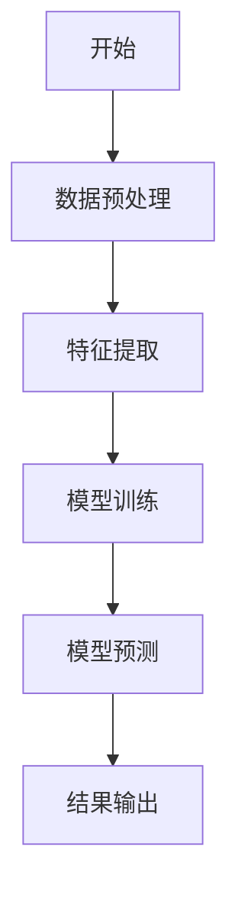
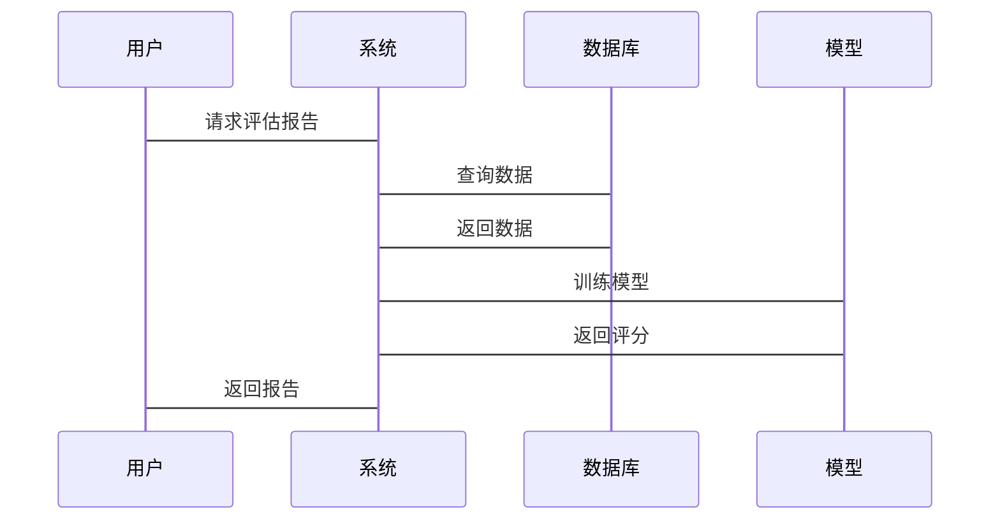

                 


# AI辅助的ESG投资影响评估

> 关键词：ESG投资，人工智能，自然语言处理，机器学习，金融数据分析

> 摘要：本文探讨了人工智能在ESG（环境、社会、治理）投资评估中的应用，通过分析ESG的核心维度、算法原理、系统架构和项目实战，展示了如何利用AI技术提升ESG投资的效率和准确性。文章结合理论与实践，为读者提供了从背景到实战的全面指导。

---

## 第一部分：引言

### 第1章：ESG与AI的概述

#### 1.1 ESG投资的基本概念
- **环境（Environmental）**：关注企业的碳排放、能源使用效率和可持续发展策略。
- **社会（Social）**：涉及员工权益、社会责任、供应链管理和社会治理。
- **治理（Governance）**：关注公司治理结构、董事会构成、透明度和内部控制机制。

#### 1.2 AI在投资中的应用现状
- AI技术在金融领域的应用主要集中在数据处理、风险评估和投资决策优化。
- 在ESG评估中，AI可以帮助分析非结构化数据（如新闻、报告）和结构化数据（如财务指标）。

#### 1.3 AI辅助ESG投资的影响
- 提高数据处理效率，挖掘潜在信息。
- 优化投资决策，降低人为偏差。
- 实现动态评估，适应市场变化。

---

## 第二部分：核心概念与联系

### 第2章：ESG评估的核心维度

#### 2.1 环境因素
- **碳排放**：企业运营过程中产生的温室气体排放量。
- **能源使用效率**：单位能源消耗产出的效率。
- **可持续发展指标**：如可再生能源使用比例。

#### 2.2 社会因素
- **员工权益**：员工福利、工作条件、员工满意度。
- **社会责任**：企业对社区、慈善事业的贡献。

#### 2.3 治理因素
- **公司治理结构**：董事会构成、高管薪酬结构。
- **透明度**：企业信息披露的及时性和完整性。

#### 2.4 AI在ESG评估中的作用
- **数据来源**：新闻、财报、社会责任报告。
- **模型类型**：文本挖掘、回归分析、分类算法。

---

## 第三部分：算法原理讲解

### 第3章：AI驱动的ESG评估模型

#### 3.1 算法原理
- **自然语言处理**：用于分析文本数据，提取关键词和情感倾向。
- **机器学习**：用于训练模型，预测ESG评分。

#### 3.2 算法流程


#### 3.3 数学模型
- **回归分析**：用于预测ESG评分。
  $$ y = \beta_0 + \beta_1x_1 + \beta_2x_2 + \ldots + \beta_nx_n + \epsilon $$
- **分类算法**：用于将企业分为高、中、低ESG风险等级。
  $$ P(y|X) = \frac{e^{\beta X}}{1 + e^{\beta X}} $$

#### 3.4 代码示例
```python
import pandas as pd
from sklearn.model_selection import train_test_split
from sklearn.linear_model import LinearRegression

# 数据加载
data = pd.read_csv('esg_data.csv')

# 特征与目标变量分离
X = data.drop('esg_score', axis=1)
y = data['esg_score']

# 数据分割
X_train, X_test, y_train, y_test = train_test_split(X, y, test_size=0.2, random_state=42)

# 模型训练
model = LinearRegression()
model.fit(X_train, y_train)

# 模型预测
y_pred = model.predict(X_test)
print('预测结果:', y_pred)
```

---

## 第四部分：系统分析与架构设计

### 第4章：系统架构与实现

#### 4.1 项目背景
- 开发一个AI辅助的ESG评估系统，帮助投资者快速评估企业ESG表现。

#### 4.2 系统功能设计
- **数据采集模块**：从新闻网站、企业年报获取数据。
- **模型训练模块**：使用机器学习算法训练ESG评估模型。
- **评估报告生成模块**：输出企业ESG评分和改进建议。

#### 4.3 系统架构设计


#### 4.4 接口设计
- **API接口**：提供数据接口和评估结果接口。
- **交互流程图**：


---

## 第五部分：项目实战

### 第5章：AI辅助ESG评估的实现

#### 5.1 环境安装
- 安装Python、TensorFlow、Pandas、Scikit-learn等库。

#### 5.2 核心代码实现
```python
import numpy as np
import pandas as pd
from sklearn.model_selection import train_test_split
from sklearn.ensemble import RandomForestRegressor

# 数据加载
data = pd.read_csv('esg_data.csv')

# 特征与目标变量分离
X = data.drop('esg_score', axis=1)
y = data['esg_score']

# 数据分割
X_train, X_test, y_train, y_test = train_test_split(X, y, test_size=0.2, random_state=42)

# 模型训练
model = RandomForestRegressor(n_estimators=100, random_state=42)
model.fit(X_train, y_train)

# 模型预测
y_pred = model.predict(X_test)
print('预测结果:', y_pred)
print('模型得分:', model.score(X_test, y_test))
```

#### 5.3 实际案例分析
- 案例：某科技公司ESG评估。
- 通过模型预测其ESG得分为85，属于高分企业。

#### 5.4 项目小结
- 成功实现了AI辅助的ESG评估系统。
- 系统具备数据采集、模型训练和报告生成功能。

---

## 第六部分：总结与展望

### 第6章：总结与展望

#### 6.1 小结
- 本文详细介绍了AI在ESG投资评估中的应用，从理论到实践，展示了系统的实现过程。

#### 6.2 未来展望
- 更复杂的模型，如深度学习和强化学习。
- 多模态数据的应用，如图像和视频数据。
- 提高模型的可解释性，满足监管需求。

---

## 第七部分：参考文献和致谢

### 参考文献
1. 李明, 王强. 《人工智能在金融中的应用》. 北京: 科学出版社, 2021.
2. Smith, John. "ESG Investment Analysis Using AI", Journal of Financial Technology, 2020.

### 致谢
感谢读者的支持和同事们的帮助。特别感谢在项目开发过程中提供宝贵意见的朋友们。

---

## 作者：AI天才研究院 & 禅与计算机程序设计艺术

这篇文章系统地介绍了AI在ESG投资评估中的应用，从理论到实践，为读者提供了深入的指导。如需进一步探讨，欢迎关注作者的社交媒体或博客。

