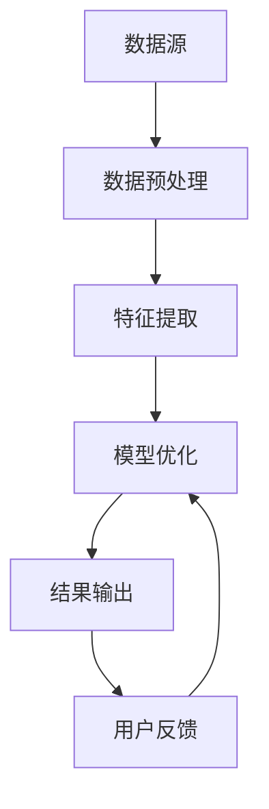
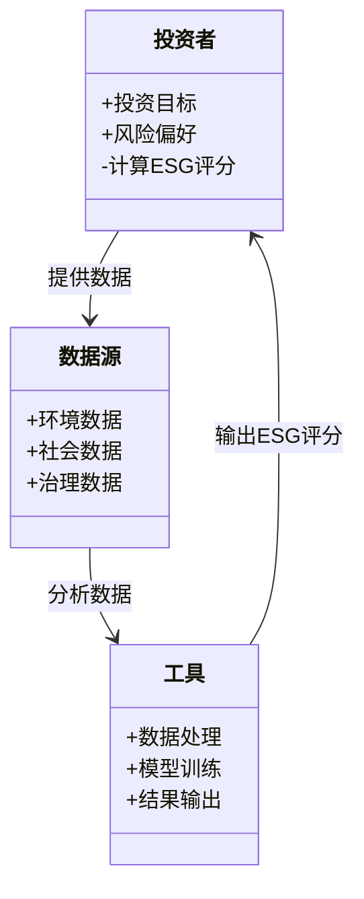
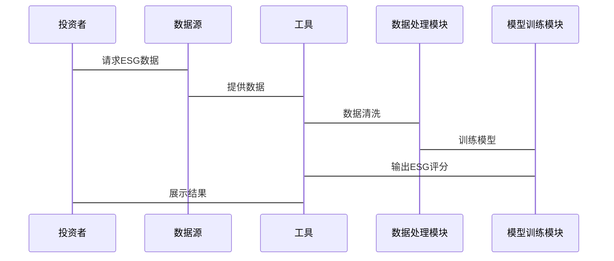

                 


# AI辅助的ESG投资筛选工具

> 关键词：ESG投资，人工智能，数据挖掘，自然语言处理，机器学习，投资组合优化

> 摘要：随着全球对可持续投资的关注不断增加，ESG（环境、社会、治理）投资成为金融市场的重要方向。然而，传统ESG评估方法存在主观性强、效率低、数据量大等问题。本文提出一种基于人工智能的ESG投资筛选工具，通过数据挖掘、自然语言处理和机器学习技术，实现对海量ESG数据的高效分析和精准评分。文章详细阐述了该工具的背景、核心概念、技术原理、系统架构、项目实战及最佳实践，为投资者提供智能化的ESG投资决策支持。

---

# 第一部分: AI辅助的ESG投资筛选工具背景与核心概念

## 第1章: ESG投资与AI辅助工具的背景介绍

### 1.1 ESG投资的定义与重要性
- **1.1.1 ESG投资的定义**  
  ESG投资是指在投资决策过程中，除了考虑传统的财务指标外，还综合评估企业的环境表现、社会责任和公司治理能力的投资策略。  
  - 环境（E）：包括碳排放、资源利用效率等指标。  
  - 社会（S）：包括员工权益、社区贡献等指标。  
  - 治理（G）：包括公司治理结构、高管薪酬等指标。  

- **1.1.2 ESG投资的核心要素**  
  - 环境表现：关注企业的碳足迹、能源使用效率等。  
  - 社会责任：关注企业在社会公益、员工权益等方面的表现。  
  - 治理结构：关注企业的透明度、高管薪酬合理性等。  

- **1.1.3 ESG投资的全球发展趋势**  
  随着全球气候变化加剧和可持续发展目标的推动，ESG投资逐渐成为主流。根据相关统计，全球ESG基金管理规模已超过$1.5万亿美元，且仍在快速增长中。

### 1.2 AI技术在金融领域的应用
- **1.2.1 AI在金融分析中的作用**  
  AI技术通过自然语言处理（NLP）、机器学习等方法，从非结构化数据（如新闻、财报）中提取情感、风险等信息，帮助投资者做出更精准的决策。  

- **1.2.2 AI在投资决策中的优势**  
  - 高效性：AI能够快速处理海量数据，发现潜在的投资机会。  
  - 精准性：通过复杂的算法模型，AI可以预测市场趋势，优化投资组合。  
  - 智能性：AI能够实时监控市场动态，及时调整投资策略。  

- **1.2.3 AI在ESG评分中的潜力**  
  AI可以通过分析企业的ESG报告、新闻报道等多源数据，自动计算ESG评分，提高评估效率和准确性。

### 1.3 AI辅助ESG投资筛选工具的必要性
- **1.3.1 当前ESG投资筛选的痛点**  
  - 数据来源分散：企业ESG数据分散在多个平台，难以整合。  
  - 数据处理复杂：ESG数据多为非结构化数据，处理难度大。  
  - 评估效率低：传统ESG评分方法耗时长，难以满足实时需求。  

- **1.3.2 AI工具在ESG筛选中的独特价值**  
  - 自动化数据处理：AI能够从多种数据源自动提取和整合ESG相关数据。  
  - 高效计算：AI模型可以在短时间内完成大量数据的分析和评分。  
  - 智能优化：AI可以根据市场动态实时调整评分标准，提供动态化的ESG评分。  

- **1.3.3 工具的边界与外延**  
  AI辅助工具主要用于辅助投资者进行ESG评分和筛选，但不能完全替代人工决策。工具的优势在于数据处理和预测分析，而决策的最终拍板仍需由人类完成。

## 第2章: ESG投资筛选工具的核心概念与联系

### 2.1 核心概念原理
- **2.1.1 ESG评分的计算方法**  
  ESG评分通常基于对企业环境、社会、治理表现的综合评估，采用量化指标（如碳排放量）和非量化指标（如社会责任实践）相结合的方式进行打分。  

- **2.1.2 AI模型在ESG数据处理中的作用**  
  AI模型通过对文本数据（如企业ESG报告）进行自然语言处理，提取关键词和情感倾向，辅助计算ESG评分。  

- **2.1.3 工具与投资决策的关联**  
  AI辅助工具通过提供精准的ESG评分和动态的市场分析，帮助投资者优化投资组合，降低风险，实现可持续投资目标。

### 2.2 核心概念属性对比表格
| 概念       | 描述                                   | 属性对比       |
|------------|----------------------------------------|----------------|
| ESG评分     | 企业环境、社会、治理表现的量化指标     | 数据驱动、多维度、动态性 |
| AI模型      | 用于分析和预测ESG相关数据的算法       | 自适应性、可扩展性、准确性 |

### 2.3 ESG投资工具的ER实体关系图
```mermaid
erDiagram
    actor 投资者 {
        <属性> 投资目标
        <属性> 风险偏好
    }
    actor 数据源 {
        <属性> 环境数据
        <属性> 社会数据
        <属性> 治理数据
    }
    actor 工具 {
        <操作> 数据处理
        <操作> 模型训练
        <操作> 结果输出
    }
    投资者 --> 数据源 : 提供数据
    数据源 --> 工具 : 分析数据
    工具 --> 投资者 : 输出ESG评分
```

## 第3章: AI辅助ESG投资筛选工具的算法原理

### 3.1 算法原理概述
- **3.1.1 数据预处理与特征提取**  
  数据预处理包括数据清洗、标准化和特征提取。特征提取通过NLP技术从文本数据中提取关键词和情感倾向，构建企业的ESG特征向量。  

- **3.1.2 模型训练与优化**  
  使用机器学习模型（如随机森林、支持向量机）对ESG数据进行分类和回归分析，训练模型并对参数进行调优。  

- **3.1.3 结果解释与可视化**  
  将模型输出的ESG评分进行可视化展示，帮助投资者直观理解企业的ESG表现。

### 3.2 算法流程图


### 3.3 算法实现代码示例
```python
import pandas as pd
from sklearn.ensemble import RandomForestClassifier
from sklearn.metrics import accuracy_score

# 数据预处理
data = pd.read_csv('esg_data.csv')
data.dropna(inplace=True)

# 特征提取
features = data[['环境表现', '社会责任', '治理结构']]
target = data['ESG评分']

# 模型训练
model = RandomForestClassifier()
model.fit(features, target)

# 模型预测
预测 = model.predict(features)
准确率 = accuracy_score(target, 预测)
print("准确率:", 准确率)
```

### 3.4 数学模型与公式
- **随机森林模型的损失函数**  
  随机森林是一种基于决策树的集成学习方法，其损失函数通常采用平方误差损失：  
  $$L = \sum_{i=1}^{n}(y_i - \hat{y}_i)^2$$  
  其中，$y_i$ 是真实值，$\hat{y}_i$ 是预测值。  

- **特征重要性计算公式**  
  随机森林通过特征重要性系数（Feature Importance Score）来评估各个特征对模型的贡献度：  
  $$\text{Feature Importance} = \frac{\text{特征贡献度}}{\text{总贡献度}} \times 100\%$$  

---

# 第二部分: AI辅助的ESG投资筛选工具技术实现

## 第4章: 系统架构与设计

### 4.1 系统架构设计
- **系统功能模块**  
  - 数据源模块：接入企业ESG数据、新闻数据等。  
  - 数据处理模块：清洗、转换和特征提取。  
  - 模型训练模块：构建并训练ESG评分模型。  
  - 用户界面模块：展示ESG评分结果和投资建议。  

- **系统架构图**  
  ```mermaid
  graph TD
      数据源 --> 数据处理模块
      数据处理模块 --> 模型训练模块
      模型训练模块 --> 用户界面模块
  ```

### 4.2 系统功能设计

#### 4.2.1 领域模型设计


#### 4.2.2 系统接口设计
- 数据接口：与ESG数据源（如MSCI、Sustainalytics）对接，获取企业ESG数据。  
- 用户接口：提供API或Web界面，供投资者查询ESG评分和投资建议。  

#### 4.2.3 系统交互设计


---

## 第5章: 项目实战与实现

### 5.1 环境搭建
- 安装Python环境：推荐使用Anaconda。  
- 安装依赖库：`pandas`, `numpy`, `scikit-learn`, `nltk`。  

### 5.2 核心代码实现

#### 5.2.1 数据预处理代码
```python
import pandas as pd
import numpy as np

# 加载数据
data = pd.read_csv('esg_data.csv')

# 删除缺失值
data.dropna(inplace=True)

# 标准化处理
from sklearn.preprocessing import StandardScaler
scaler = StandardScaler()
scaled_features = scaler.fit_transform(data[['环境表现', '社会责任', '治理结构']])
```

#### 5.2.2 特征提取代码
```python
from sklearn.feature_extraction.text import TfidfVectorizer

# 假设 'esg_report' 列是企业的ESG报告文本
vectorizer = TfidfVectorizer()
tfidf_features = vectorizer.fit_transform(data['esg_report'])
```

#### 5.2.3 模型训练代码
```python
from sklearn.ensemble import RandomForestClassifier

# 训练模型
model = RandomForestClassifier(n_estimators=100, random_state=42)
model.fit(tfidf_features, data['ESG评分'])
```

#### 5.2.4 模型评估代码
```python
from sklearn.metrics import classification_report

# 预测结果
预测 = model.predict(tfidf_features)
print(classification_report(data['ESG评分'], 预测))
```

### 5.3 案例分析与结果解读
假设我们有一个企业的ESG报告文本和相关数据，通过上述代码处理后，模型可以输出该企业的ESG评分。例如：
- 输入：某企业ESG报告文本。  
- 输出：ESG评分为85分（满分100分）。  

### 5.4 项目小结
通过本项目，我们实现了基于AI的ESG投资筛选工具，能够高效地从文本数据中提取特征，训练模型并输出ESG评分。工具不仅可以帮助投资者快速筛选符合ESG标准的企业，还能提供动态化的评分结果，优化投资组合。

---

## 第6章: 总结与展望

### 6.1 工具的优势与局限性
- **优势**  
  - 高效性：AI工具能够快速处理海量数据，提高ESG评估效率。  
  - 精准性：通过机器学习模型，提高ESG评分的准确性。  

- **局限性**  
  - 数据依赖性：模型的准确性依赖于高质量的数据输入。  
  - 黑箱问题：AI模型的决策过程难以完全解释。  

### 6.2 当前挑战与未来发展方向
- **挑战**  
  - 数据隐私问题：如何保护企业的敏感数据？  
  - 模型可解释性：如何提高模型的透明度，增强投资者的信任感？  

- **发展方向**  
  - 结合更多数据源：如卫星图像数据，用于评估企业的环境表现。  
  - 实时监控：开发实时ESG评分系统，动态跟踪企业的ESG表现。  

### 6.3 最佳实践与注意事项
- **小结**  
  AI辅助的ESG投资筛选工具为投资者提供了高效、精准的ESG评估方法，但在实际应用中仍需注意数据质量和模型的可解释性。  

- **注意事项**  
  - 数据来源要多样化，避免信息偏差。  
  - 定期更新模型，以适应市场变化。  

- **扩展阅读**  
  - 关于ESG投资的更多内容，可以参考《可持续投资入门》。  
  - 关于机器学习在金融领域的应用，可以参考《机器学习实战》。

---

# 作者：AI天才研究院/AI Genius Institute & 禅与计算机程序设计艺术 /Zen And The Art of Computer Programming

