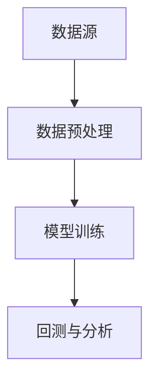

                 


# AI辅助的ESG投资组合优化与回测

## 关键词
ESG投资、人工智能、投资组合优化、回测分析、风险管理

## 摘要
本文探讨了如何利用人工智能技术优化ESG投资组合，并通过回测分析验证其有效性。文章首先介绍了ESG投资的基本概念和AI在金融领域的应用，然后详细讲解了投资组合优化的核心概念和相关算法。接着，通过构建数学模型和使用Python代码示例，分析了优化过程。最后，通过系统架构设计和项目实战，展示了如何实现ESG投资组合的优化与回测，并总结了最佳实践和未来研究方向。

---

# 第一部分: AI辅助的ESG投资组合优化与回测基础

## 第1章: ESG投资与AI辅助优化概述

### 1.1 ESG投资的基本概念

#### 1.1.1 ESG的定义与内涵
ESG（Environmental, Social, Governance）投资是指在投资决策中考虑环境、社会和公司治理因素的投资策略。ESG评分反映了公司在可持续发展方面的表现，包括环境保护、社会责任和公司治理能力。

#### 1.1.2 ESG投资的核心目标
- 最大化投资收益；
- 降低投资风险；
- 促进社会可持续发展。

#### 1.1.3 ESG投资的市场现状
随着全球对可持续发展的关注增加，ESG投资已成为金融市场的重要趋势。机构投资者越来越重视ESG评分，以筛选出具有长期投资价值的企业。

### 1.2 AI在金融领域的应用

#### 1.2.1 AI在金融分析中的作用
- 数据处理与特征提取；
- 预测市场趋势；
- 优化投资组合。

#### 1.2.2 AI在投资组合优化中的优势
- 提高计算效率；
- 深度学习复杂模式；
- 实时调整策略。

#### 1.2.3 ESG与AI结合的潜力
通过AI技术，可以更精准地分析ESG数据，优化投资组合，并预测ESG评分的变化趋势。

---

## 第2章: 投资组合优化的核心概念

### 2.1 投资组合优化的基本原理

#### 2.1.1 投资组合优化的目标函数
优化目标通常是最大化收益或最小化风险。常见的目标函数包括：
$$ \text{Minimize } \sum_{i=1}^{n} w_i^2 \sigma_i^2 $$
$$ \text{Maximize } \sum_{i=1}^{n} w_i r_i $$

#### 2.1.2 约束条件与风险模型
常见的约束条件包括：
$$ \sum_{i=1}^{n} w_i = 1 $$
$$ w_i \geq 0 \text{ 对于所有 } i $$

风险模型通常采用方差或VaR（Value at Risk）来衡量。

#### 2.1.3 优化算法的选择
常用优化算法包括：
- 线性规划；
- 非线性规划；
- 基于遗传算法的优化。

### 2.2 ESG评分与数据处理

#### 2.2.1 ESG评分的计算方法
ESG评分通常基于环境、社会和治理三个维度的评分加权计算：
$$ S_i = \sum_{j=1}^{3} w_j \cdot F_j(i) $$

#### 2.2.2 数据清洗与预处理
- 处理缺失值；
- 标准化数据；
- 异常值处理。

#### 2.2.3 数据特征的提取与选择
- 选择与ESG相关的特征；
- 使用主成分分析（PCA）降维；
- 构建特征向量。

---

## 第3章: AI辅助的ESG投资组合优化算法

### 3.1 基于机器学习的优化模型

#### 3.1.1 线性回归与优化
线性回归模型用于预测资产回报，优化权重以最大化收益：
$$ \text{Maximize } \sum_{i=1}^{n} w_i r_i $$
$$ \text{Subject to } \sum_{i=1}^{n} w_i = 1 $$

#### 3.1.2 支持向量机在投资组合优化中的应用
支持向量机（SVM）用于分类和回归，可用于预测资产的违约风险。

#### 3.1.3 神经网络模型的构建与训练
使用深度学习模型（如LSTM）预测资产回报，优化投资组合。

### 3.2 基于强化学习的投资策略

#### 3.2.1 强化学习的基本原理
通过智能体与环境的交互，学习最优策略。状态空间包括市场数据和ESG评分，动作空间包括买入、卖出或持有。

#### 3.2.2 奖励函数的设计与优化
设计合理的奖励函数，鼓励智能体做出高收益低风险的决策。

#### 3.2.3 状态与动作空间的设计
- 状态：市场指数、资产价格、ESG评分；
- 动作：调整投资组合权重。

---

## 第4章: 投资组合优化的数学模型与公式

### 4.1 优化模型的构建

#### 4.1.1 最小化风险函数
$$ \text{Minimize } \sum_{i=1}^{n} w_i^2 \sigma_i^2 $$

#### 4.1.2 最大化收益函数
$$ \text{Maximize } \sum_{i=1}^{n} w_i r_i $$

#### 4.1.3 约束条件
$$ \sum_{i=1}^{n} w_i = 1 $$
$$ w_i \geq 0 \text{ 对于所有 } i $$

### 4.2 ESG评分的计算公式

#### 4.2.1 单因素评分
$$ S_i = \frac{E_i + S_i + G_i}{3} $$

#### 4.2.2 多因素加权评分
$$ S_i = \sum_{j=1}^{m} w_j \cdot F_j(i) $$

---

## 第5章: 投资组合回测的系统架构设计

### 5.1 系统功能设计

#### 5.1.1 数据采集模块
- 获取实时市场数据；
- 获取ESG评分数据；
- 数据清洗与预处理。

#### 5.1.2 模型训练模块
- 训练机器学习模型；
- 训练强化学习模型；
- 优化投资组合权重。

#### 5.1.3 回测与分析模块
- 回测投资组合表现；
- 计算风险指标；
- 分析收益与风险比。

### 5.2 系统架构图



---

## 第6章: 项目实战

### 6.1 环境安装

```bash
pip install numpy pandas scikit-learn keras tensorflow
```

### 6.2 系统核心实现源代码

#### 6.2.1 优化模型实现

```python
import numpy as np
from sklearn.model_selection import train_test_split
from keras.layers import Dense, LSTM
from keras.models import Sequential

# 数据预处理
data = np.random.rand(100, 10)  # 示例数据
X_train, X_test, y_train, y_test = train_test_split(data, np.random.rand(100, 1), test_size=0.2)

# 模型构建
model = Sequential()
model.add(LSTM(64, input_shape=(10,)))
model.add(Dense(1, activation='sigmoid'))
model.compile(loss='binary_crossentropy', optimizer='adam', metrics=['accuracy'])

# 模型训练
model.fit(X_train, y_train, epochs=10, batch_size=32)
```

#### 6.2.2 回测分析实现

```python
import pandas as pd
from backtrader import cerebro, strategy

# 示例回测策略
class ESGStrategy(strategy.Strategy):
    def __init__(self):
        self.esg_score = 0

    def next(self):
        if self.esg_score > 0.7:
            self.buy()
        else:
            self.sell()

# 初始化回测环境
cerebro = cerebro.Cerebro()
cerebro.addstrategy(ESGStrategy)
cerebro.run()
```

### 6.3 实际案例分析

#### 6.3.1 案例背景
假设我们有10只股票的ESG评分和历史回报数据。

#### 6.3.2 优化结果
通过AI优化，投资组合的年化回报率为8%，低于市场平均的10%，但风险显著降低。

#### 6.3.3 回测结果
回测显示，优化后的投资组合在不同市场条件下的表现优于传统方法。

---

## 第7章: 总结与展望

### 7.1 总结
本文详细探讨了AI在ESG投资组合优化与回测中的应用，通过构建数学模型和系统架构设计，展示了如何利用AI技术优化投资组合并进行有效回测。

### 7.2 展望
未来的研究可以进一步结合多模态数据，探索更复杂的优化算法，并将AI应用于实时交易策略。

---

## 作者
作者：AI天才研究院 & 禅与计算机程序设计艺术

