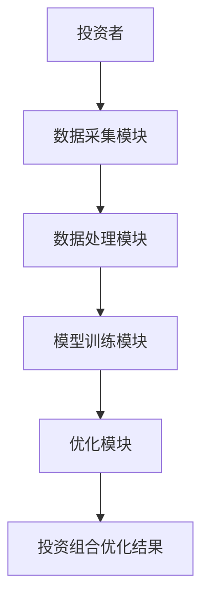

                 


# AI辅助的ESG投资组合优化工具

> 关键词：ESG投资，AI辅助，投资组合优化，强化学习，机器学习

> 摘要：本文深入探讨了如何利用人工智能技术辅助ESG投资组合优化。从ESG投资的背景和意义出发，分析了传统投资组合优化方法的局限性，详细介绍了AI在ESG投资中的应用，重点讲解了基于强化学习和遗传算法的核心优化算法，以及系统的整体架构设计。最后，通过具体的实战案例，展示了如何利用Python代码实现AI辅助的ESG投资组合优化工具，并总结了最佳实践和注意事项。

---

# 第一部分: ESG投资与AI辅助优化背景

## 第1章: ESG投资与AI辅助优化概述

### 1.1 ESG投资的定义与背景

ESG（Environmental, Social, Governance）投资是一种关注环境、社会和公司治理因素的投资策略。它不仅考虑传统的财务指标，还关注企业在可持续发展方面的表现。近年来，随着全球对可持续发展的关注增加，ESG投资逐渐成为金融市场的重要组成部分。

#### 1.1.1 ESG概念的起源与发展

ESG概念起源于20世纪60年代的社会责任投资（SRI）运动。随着气候变化、社会不平等和公司治理问题的加剧，ESG投资逐渐从一种 niche（利基市场）策略发展为全球范围内的主流投资策略。目前，ESG投资已涵盖股票、债券、基金等多种金融产品。

#### 1.1.2 ESG投资的核心目标与意义

ESG投资的核心目标是通过筛选符合环境、社会和治理标准的企业，实现长期稳健的投资回报。与传统投资相比，ESG投资更注重企业的可持续发展能力，能够帮助投资者规避因社会责任缺失或治理不善导致的风险。

#### 1.1.3 ESG投资的全球发展趋势

近年来，全球ESG投资规模快速增长。根据相关数据显示，2020年全球ESG基金管理规模已超过1.7万亿美元。特别是在新冠疫情后，ESG投资因其对长期风险的规避能力而受到更多关注。此外，各国政府和监管机构也在推动ESG投资的标准化和规范化。

### 1.2 AI在金融投资中的应用

人工智能技术在金融领域的应用日益广泛。从高频交易到风险管理，AI正在改变传统的金融投资方式。在ESG投资中，AI技术可以帮助投资者更高效地处理海量数据，识别潜在风险，并优化投资组合。

#### 1.2.1 AI在金融领域的核心应用领域

- **金融数据分析**：利用自然语言处理（NLP）和机器学习技术分析新闻、财报等非结构化数据。
- **风险评估与管理**：通过AI模型预测市场风险和信用风险。
- **投资组合优化**：使用强化学习和遗传算法优化投资组合的收益和风险比。

#### 1.2.2 AI在投资组合优化中的优势

- **数据处理能力**：AI能够快速处理大量复杂数据，发现传统方法难以察觉的模式。
- **动态优化**：通过实时数据反馈，AI可以动态调整投资组合，应对市场变化。
- **非线性关系建模**：AI模型能够捕捉复杂的非线性关系，提高优化的准确性。

#### 1.2.3 ESG投资与AI结合的潜力

AI技术可以帮助投资者更精确地量化ESG因素对投资组合的影响，同时优化投资组合的风险和收益平衡。通过AI辅助的ESG投资组合优化工具，投资者可以更高效地实现可持续投资目标。

---

## 第2章: ESG投资组合优化的核心概念

### 2.1 投资组合优化的基本原理

投资组合优化是金融领域的重要问题，其目标是在给定的风险承受能力下，最大化投资回报。传统方法通常基于均值-方差模型，但这种方法在处理ESG因素时存在局限性。

#### 2.1.1 投资组合优化的数学模型

传统投资组合优化的数学模型可以表示为：

$$
\min_{w} w^T \Sigma w \quad \text{subject to} \quad w^T \mu = \text{target return}
$$

其中，$w$是投资权重向量，$\Sigma$是协方差矩阵，$\mu$是资产收益向量。

#### 2.1.2 传统投资组合优化方法的局限性

传统方法通常假设资产收益是独立的，且不考虑企业治理、社会责任等ESG因素。此外，传统方法难以处理非线性约束和动态市场环境。

#### 2.1.3 ESG因素在投资组合优化中的重要性

ESG因素可以帮助投资者识别潜在风险，如环境风险（气候变化）和社会风险（劳工权益问题）。将ESG因素纳入投资组合优化模型，可以提高投资组合的长期稳健性。

### 2.2 AI辅助优化的关键技术

AI技术在ESG投资组合优化中的应用主要集中在数据处理、模型构建和优化算法方面。

#### 2.2.1 机器学习在投资组合优化中的应用

机器学习技术可以帮助投资者预测资产收益、识别资产之间的相关性，并优化投资组合。例如，可以通过聚类算法将相似资产分组，降低组合的波动性。

#### 2.2.2 强化学习在动态投资组合优化中的作用

强化学习是一种通过试错优化决策的AI技术。在投资组合优化中，强化学习可以动态调整投资策略，应对市场变化。例如，可以使用Q-learning算法优化投资组合的买卖时机。

#### 2.2.3 ESG数据的特征提取与处理

ESG数据通常包括环境评分、社会评分和治理评分等指标。通过特征选择和降维技术（如主成分分析），可以简化ESG数据，提高优化效率。

### 2.3 ESG投资组合优化的系统架构

ESG投资组合优化系统通常包括数据采集、模型训练和优化三个核心模块。

#### 2.3.1 系统输入与输出的定义

- **输入**：市场数据（股票价格、指数等）、ESG评分数据、用户需求（风险偏好、收益目标）。
- **输出**：优化后的投资组合、风险收益分析报告。

#### 2.3.2 系统核心模块的功能划分

- **数据采集模块**：负责获取市场数据和ESG评分数据。
- **模型训练模块**：构建AI模型，训练优化算法。
- **优化模块**：根据用户需求，生成优化后的投资组合。

#### 2.3.3 系统架构的ER实体关系图

```mermaid
er
    actor 投资者
    actor 系统管理员
    actor 数据提供方
    database ESG数据
    database 投资组合优化结果
    database 市场数据
    entity 股票
    entity 债券
    entity 公司
    entity 用户需求
    entity 优化策略
    entity 风险指标
    entity 绩效指标
    relationship: 投资者 --> 用户需求
    relationship: 用户需求 --> 优化策略
    relationship: 优化策略 --> 投资组合优化结果
    relationship: ESG数据 --> 公司
    relationship: 市场数据 --> 股票
    relationship: 市场数据 --> 债券
```

---

## 第3章: AI辅助ESG投资组合优化的核心算法

### 3.1 强化学习在投资组合优化中的应用

#### 3.1.1 强化学习的基本原理

强化学习是一种通过试错优化决策的AI技术。在投资组合优化中，强化学习可以动态调整投资策略，应对市场变化。

#### 3.1.2 在ESG投资中的强化学习模型设计

- **状态空间**：市场状态（如市场指数、波动率）和投资组合状态（如资产权重）。
- **动作空间**：买卖某种资产或调整资产权重。
- **奖励函数**：基于投资组合的收益和风险。

#### 3.1.3 强化学习算法的实现步骤

1. 初始化投资组合权重。
2. 根据当前市场状态选择动作。
3. 执行动作并观察新的市场状态和奖励。
4. 更新价值函数或策略函数。
5. 重复上述步骤，优化投资组合。

### 3.2 基于遗传算法的优化方法

#### 3.2.1 遗传算法的基本原理

遗传算法是一种模拟生物进化过程的优化算法。在投资组合优化中，可以用来寻找最优资产组合。

#### 3.2.2 在ESG投资中的应用

- **编码**：将资产组合表示为二进制字符串。
- **适应度函数**：最大化收益，同时最小化风险。
- **选择、交叉和变异**：通过遗传操作优化资产组合。

#### 3.2.3 遗传算法的优化步骤

1. 初始化种群。
2. 计算适应度。
3. 选择优秀个体。
4. 进行交叉和变异。
5. 重复步骤，优化种群。

### 3.3 算法实现的数学模型

#### 3.3.1 投资组合优化的数学公式

$$
\text{目标函数：} \quad \min_{w} w^T \Sigma w
$$

#### 3.3.2 带有ESG约束的优化模型

$$
\text{约束条件：} \quad \sum_{i=1}^{n} w_i \cdot ESG_i \geq C
$$

---

## 第4章: 系统架构与实现

### 4.1 系统整体架构设计

#### 4.1.1 系统功能模块

- 数据采集模块
- 数据处理模块
- 模型训练模块
- 优化模块

#### 4.1.2 系统架构图



### 4.2 项目实战

#### 4.2.1 环境安装

```bash
pip install numpy
pip install pandas
pip install scikit-learn
pip install gym
```

#### 4.2.2 核心实现代码

```python
import numpy as np
import pandas as pd
from sklearn.decomposition import PCA
from sklearn.preprocessing import StandardScaler
import gym

# 示例数据处理代码
def preprocess_data(data):
    scaler = StandardScaler()
    scaled_data = scaler.fit_transform(data)
    pca = PCA(n_components=2)
    pca_data = pca.fit_transform(scaled_data)
    return pca_data

# 示例强化学习代码
class ESGInvestmentEnv(gym.Env):
    def __init__(self):
        super().__init__()
        self.state_space = ...  # 定义状态空间
        self.action_space = ...  # 定义动作空间

    def step(self, action):
        # 实现环境的步进逻辑
        pass

    def reset(self):
        # 初始化环境
        pass

# 示例遗传算法代码
def genetic_algorithm():
    # 初始化种群
    population = ...
    # 适应度评估
    fitness = ...
    # 选择、交叉和变异
    new_population = ...
    return new_population
```

---

## 第5章: 总结与最佳实践

### 5.1 总结

AI技术正在改变ESG投资的方式，通过强化学习和遗传算法等技术，可以实现更高效的ESG投资组合优化。未来，随着AI技术的不断发展，ESG投资将更加智能化和个性化。

### 5.2 最佳实践 tips

- **数据质量**：确保ESG数据的准确性和完整性。
- **模型选择**：根据具体需求选择合适的AI算法。
- **风险管理**：定期监控和调整优化策略，应对市场变化。

### 5.3 注意事项

- **数据隐私**：注意保护投资者数据的隐私和安全。
- **模型解释性**：确保优化结果的可解释性，便于投资者理解和决策。

### 5.4 拓展阅读

- 《机器学习在金融中的应用》
- 《强化学习入门与实践》
- 《ESG投资指南》

---

作者：AI天才研究院/AI Genius Institute & 禅与计算机程序设计艺术 /Zen And The Art of Computer Programming

