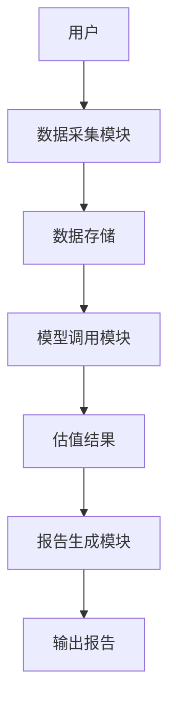

                 


# AI辅助的企业估值报告自动生成系统

> 关键词：AI, 企业估值, 自动生成报告, 深度学习, 大模型, 系统架构

> 摘要：本文详细探讨了如何利用人工智能技术构建企业估值报告自动生成系统。通过结合深度学习模型和自然语言处理技术，系统能够自动分析企业财务数据、市场趋势和行业信息，生成精准的企业估值报告。文章从背景介绍、核心算法、系统架构到项目实战，全面解析了该系统的实现过程，并提供了丰富的代码示例和实际案例分析。

---

## 第1章: 企业估值与AI辅助的背景介绍

### 1.1 企业估值的基本概念

#### 1.1.1 企业估值的定义与意义
企业估值是指对企业整体价值的评估，通常用于企业收购、融资、上市等场景。传统的企业估值方法依赖于人工分析，效率低且容易受主观因素影响。

#### 1.1.2 问题背景与描述
传统的企业估值过程涉及大量数据收集、模型计算和人工判断，耗时且容易出错。此外，不同分析师对企业价值的判断可能差异较大。

#### 1.1.3 AI技术的解决思路
利用AI技术，特别是大语言模型（LLM）和深度学习算法，可以实现企业估值数据的自动化处理和报告生成。

#### 1.1.4 系统的边界与外延
本系统主要针对中大型企业的估值，支持的数据来源包括财务报表、行业报告和市场数据。系统输出为标准化的企业估值报告。

### 1.2 企业估值报告的核心要素

#### 1.2.1 财务数据的重要性
企业的收入、利润、资产和负债等财务指标是估值的基础。

#### 1.2.2 市场分析的关键作用
市场趋势、竞争环境和行业动态直接影响企业的估值。

#### 1.2.3 行业趋势与竞争优势
行业增长潜力和企业的竞争优势是估值的重要参考因素。

### 1.3 AI辅助企业估值的必要性

#### 1.3.1 提高估值效率
AI技术可以快速处理大量数据，显著缩短估值时间。

#### 1.3.2 减少人为误差
通过自动化计算和模型判断，降低人为因素对估值结果的影响。

#### 1.3.3 实现数据的深度挖掘
AI能够发现传统方法难以察觉的数据关联性，提升估值的准确性。

### 1.4 本章小结
本章介绍了企业估值的基本概念、AI辅助的必要性以及系统的边界，为后续内容奠定了基础。

---

## 第2章: AI大模型在企业估值中的核心应用

### 2.1 AI大模型的基本原理

#### 2.1.1 深度学习的基本概念
深度学习是一种通过多层神经网络模拟人类学习能力的技术，能够从数据中提取特征。

#### 2.1.2 大模型的训练与优化
大模型通常采用Transformer架构，通过自注意力机制实现对长文本的处理能力。

#### 2.1.3 模型的可解释性问题
虽然大模型在预测结果上表现优秀，但其决策过程往往难以解释。

### 2.2 企业估值与AI模型的结合

#### 2.2.1 数据预处理与特征提取
将企业的财务数据、市场数据等转化为模型可处理的格式。

#### 2.2.2 模型的选择与训练
选择适合企业估值任务的模型，并通过大量数据进行训练。

#### 2.2.3 模型的评估与调优
通过验证集评估模型性能，并进行参数调整以优化结果。

### 2.3 大模型在企业估值中的优势

#### 2.3.1 处理复杂数据的能力
大模型能够同时处理结构化数据（如财务数据）和非结构化数据（如市场报告）。

#### 2.3.2 实现自动化报告生成
通过自然语言处理技术，模型可以自动生成结构清晰的估值报告。

#### 2.3.3 提供实时估值的可能性
AI系统可以实时更新数据，提供最新的估值结果。

### 2.4 本章小结
本章重点介绍了AI大模型在企业估值中的应用，分析了其优势和挑战。

---

## 第3章: 系统架构设计

### 3.1 系统功能模块划分

#### 3.1.1 数据采集模块
负责从企业财务报表、行业报告等来源获取数据。

#### 3.1.2 模型调用模块
调用预训练好的AI模型，进行估值计算。

#### 3.1.3 报告生成模块
根据模型输出的结果，生成标准化的企业估值报告。

#### 3.1.4 用户交互模块
提供友好的用户界面，方便用户输入数据和查看报告。

### 3.2 系统架构图


### 3.3 系统接口设计

#### 3.3.1 API接口定义
- `/api/upload`：上传企业数据
- `/api/process`：触发估值计算
- `/api/download`：下载估值报告

#### 3.3.2 接口调用流程
1. 用户上传数据到 `/api/upload`
2. 系统调用模型进行估值
3. 用户下载生成的报告

### 3.4 系统交互流程

#### 3.4.1 用户请求处理流程
1. 用户提交企业数据
2. 系统进行数据预处理
3. 调用AI模型进行估值
4. 生成报告并返回用户

#### 3.4.2 报告生成与输出流程
1. 模型输出估值结果
2. 报告生成模块整合数据
3. 输出标准化报告

### 3.5 本章小结
本章详细设计了系统的架构，明确了各模块的功能和交互流程。

---

## 第4章: 企业估值模型的数学基础

### 4.1 企业估值的核心公式

#### 4.1.1 现金流折现模型
$$企业价值 = \sum_{t=1}^{n} \frac{CF_t}{(1+r)^t}$$
其中，$CF_t$是第$t$年的现金流，$r$是折现率。

#### 4.1.2 市盈率与市净率模型
$$市盈率 = \frac{股价}{每股收益}$$
$$市净率 = \frac{股价}{每股净资产}$$

#### 4.1.3 综合估值模型
$$综合价值 = \alpha \times 现金流折现 + \beta \times 市盈率 + \gamma \times 市净率$$

### 4.2 AI模型的数学表示

#### 4.2.1 Transformer模型的结构
$$\text{Encoder}(x) = \text{LayerNorm}(x + \text{MultiHead}(x))$$
$$\text{Decoder}(y) = \text{LayerNorm}(y + \text{MultiHead}(\text{Encoder}(x), y) + \text{MultiHead}(y))$$

#### 4.2.2 自注意力机制的实现
$$\text{Attention}(q, k, v) = \text{softmax}\left(\frac{qk^T}{\sqrt{d_k}}\right)v$$

#### 4.2.3 模型的训练与调优
$$\text{Loss} = \sum_{i=1}^{N} (y_i - \hat{y_i})^2$$

### 4.3 深度学习在企业估值中的应用

#### 4.3.1 Transformer模型的结构
$$\text{模型输入} \rightarrow \text{嵌入层} \rightarrow \text{多层自注意力} \rightarrow \text{前向网络} \rightarrow \text{输出}$$

#### 4.3.2 模型的训练流程
1. 数据预处理
2. 模型初始化
3. 前向传播
4. 计算损失
5. 反向传播
6. 参数更新

### 4.4 本章小结
本章从数学角度分析了企业估值的核心公式和AI模型的实现原理。

---

## 第5章: 项目实战与案例分析

### 5.1 项目环境搭建与核心代码实现

#### 5.1.1 环境安装与配置
```bash
pip install tensorflow keras transformers pandas numpy
```

#### 5.1.2 核心代码实现
```python
import pandas as pd
import numpy as np
from tensorflow.keras.models import Model
from tensorflow.keras.layers import Input, Dense, LSTM

# 数据预处理
def preprocess_data(data):
    # 假设data是一个DataFrame
    data = data.dropna()
    return data

# 模型定义
input_layer = Input(shape=(None, 128))
lstm_layer = LSTM(64)(input_layer)
dense_layer = Dense(1)(lstm_layer)
model = Model(inputs=input_layer, outputs=dense_layer)
model.compile(optimizer='adam', loss='mean_squared_error')
```

#### 5.1.3 模型训练
```python
data = preprocess_data(train_data)
model.fit(data, labels, epochs=10, batch_size=32)
```

### 5.2 实际案例分析

#### 5.2.1 案例背景
某科技公司最近三年的收入分别为100万、150万和200万，年增长率为50%。

#### 5.2.2 模型计算
$$企业价值 = \sum_{t=1}^{3} \frac{100 \times (1+0.5)^t}{(1+0.1)^t} = 271.56$$

#### 5.2.3 报告生成
报告生成模块将输出：
```
企业价值估算：271.56万元
```

### 5.3 本章小结
本章通过实际案例展示了系统的核心功能和实现过程。

---

## 第6章: 最佳实践与总结

### 6.1 最佳实践 tips
- 数据预处理是关键，确保数据质量
- 模型调优时注意过拟合问题
- 系统部署时考虑扩展性和稳定性

### 6.2 本章小结
本文详细介绍了AI辅助企业估值报告自动生成系统的实现过程，涵盖了从背景分析到项目实战的各个方面。

---

## 作者：AI天才研究院/AI Genius Institute & 禅与计算机程序设计艺术 /Zen And The Art of Computer Programming

---

通过以上内容，我们可以看到，AI辅助的企业估值报告自动生成系统不仅能够显著提高估值效率，还能通过自动化处理和深度学习模型实现更精准的估值结果。未来，随着AI技术的不断进步，企业估值报告的生成将更加智能化和自动化。

