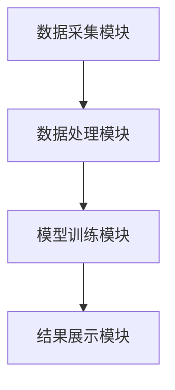

                 


# AI辅助的企业估值模型

> 关键词：企业估值，人工智能，机器学习，金融建模，数据分析，深度学习

> 摘要：本文探讨了人工智能在企业估值中的应用，分析了AI辅助的企业估值模型的核心概念、算法原理、系统架构设计及实际案例，展示了如何利用AI技术提升企业估值的准确性、效率和可解释性。

---

# 第一部分: 企业估值模型的背景与意义

## # 第1章: 企业估值模型的背景与意义

### ## 1.1 企业估值的基本概念

#### ### 1.1.1 什么是企业估值
企业估值是指通过对企业的财务数据、市场表现、行业地位等因素进行分析，估算企业价值的过程。常见的企业估值方法包括DCF（Discounted Cash Flow）模型、市盈率法（P/E ratio）和市净率法（P/B ratio）等。这些方法通常依赖于历史数据和人为判断，存在主观性和局限性。

#### ### 1.1.2 企业估值的目的与意义
企业估值的主要目的是为企业提供合理的价值参考，帮助投资者、经理人在并购、融资、投资决策中做出科学的判断。准确的企业估值能够降低金融市场的信息不对称，提高资本配置效率，促进企业健康发展。

#### ### 1.1.3 传统企业估值方法的局限性
传统的企业估值方法依赖于历史数据和经验判断，存在以下问题：
- 数据单一性：仅依赖财务数据，忽视了市场、行业和非结构化数据的影响。
- 主观性：模型参数的选择（如折现率）主观性强，影响估值结果的准确性。
- 计算复杂性：复杂的模型需要大量手动计算，效率低下。

### ## 1.2 AI技术在企业估值中的应用

#### ### 1.2.1 AI技术对企业估值的影响
人工智能技术，尤其是机器学习，能够通过大数据分析，挖掘传统估值方法难以捕捉的市场信号和非财务因素，提供更全面、更精准的估值结果。

#### ### 1.2.2 AI辅助企业估值的优势
- **数据处理能力**：AI能够处理海量数据，包括财务数据、市场数据、新闻数据等，提取更多有价值的信息。
- **自动化与智能化**：AI模型可以自动学习和优化，减少人工干预，提高估值效率。
- **预测能力**：基于机器学习的模型能够预测未来的现金流和市场趋势，提升估值的前瞻性。

#### ### 1.2.3 企业估值AI化的背景与趋势
随着大数据和AI技术的快速发展，企业估值领域的AI化成为趋势。通过AI技术，企业能够更快、更准确地进行估值，提高决策效率和准确性。

---

## # 第2章: AI辅助企业估值模型的核心概念

### ## 2.1 数据来源与处理

#### ### 2.1.1 企业财务数据的获取与处理
企业财务数据是传统估值的核心数据，包括收入、利润、现金流等。AI模型需要对这些数据进行清洗、标准化和特征提取，以便后续分析。

#### ### 2.1.2 市场数据与行业分析
市场数据（如股价、行业指数）和行业分析（如行业趋势、竞争格局）能够帮助模型更好地理解企业的市场地位和潜在风险。

#### ### 2.1.3 非财务数据的整合与应用
非财务数据（如社交媒体情绪、新闻数据）能够提供更多关于企业市场表现的信号。通过自然语言处理（NLP）技术，可以提取这些数据中的有用信息。

### ## 2.2 模型结构与算法选择

#### ### 2.2.1 传统估值模型与AI模型的对比
| 方法         | 传统估值模型       | AI辅助模型               |
|--------------|--------------------|--------------------------|
| 数据来源     | 财务数据为主         | 财务、市场、非结构化数据   |
| 模型复杂性   | 较低               | 较高                     |
| 预测能力     | 基于假设           | 基于数据驱动             |

#### ### 2.2.2 常见AI算法在企业估值中的应用
- **线性回归**：适用于简单关系的建模。
- **随机森林**：适合处理高维数据，具有较强的抗过拟合能力。
- **神经网络**：能够捕捉非线性关系，适合复杂场景。

#### ### 2.2.3 深度学习模型的优缺点分析
- **优点**：能够处理大量非结构化数据，模型表达能力强。
- **缺点**：计算资源消耗大，模型解释性较差。

---

## # 第3章: 企业估值模型的AI实现原理

### ## 3.1 数据预处理与特征工程

#### ### 3.1.1 数据清洗与标准化
数据清洗是去除噪声数据、处理缺失值的过程。标准化则是将数据归一化，使其适合模型输入。

#### ### 3.1.2 特征选择与降维
特征选择是通过统计方法或模型评估，选择对估值影响最大的特征。降维技术（如PCA）可以减少特征维度，提高模型效率。

#### ### 3.1.3 数据增强与扩展
数据增强是通过生成合成数据（如模拟财务数据）来增加数据多样性，提高模型泛化能力。

### ## 3.2 算法实现与模型训练

#### ### 3.2.1 线性回归模型的实现
线性回归是最简单的回归模型，适用于线性关系的场景。其数学公式为：
$$ y = \beta_0 + \beta_1 x + \epsilon $$
其中，$\beta_0$是截距，$\beta_1$是斜率，$\epsilon$是误差项。

#### ### 3.2.2 支持向量机模型的实现
支持向量机（SVM）适用于分类和回归问题。其核心思想是通过找到一个超平面，将数据点分为两类。

#### ### 3.2.3 随机森林与梯度提升树的实现
随机森林是一种基于决策树的集成学习方法，具有较强的抗过拟合能力。梯度提升树（如XGBoost）通过迭代优化，逐步逼近目标函数。

### ## 3.3 模型评估与优化

#### ### 3.3.1 评估指标与基准模型
常用的评估指标包括均方误差（MSE）、平均绝对误差（MAE）和R平方值（R²）。

#### ### 3.3.2 超参数优化与模型调参
通过网格搜索或随机搜索，找到最优的模型参数组合，提升模型性能。

#### ### 3.3.3 模型部署与实时预测
将训练好的模型部署到生产环境，实现对企业估值的实时预测。

---

## # 第4章: 企业估值模型的系统架构设计

### ## 4.1 系统功能模块划分

#### ### 4.1.1 数据采集模块
负责从数据库、API等来源获取企业数据。

#### ### 4.1.2 数据处理模块
对数据进行清洗、特征工程和数据增强。

#### ### 4.1.3 模型训练模块
选择合适的算法，训练模型并进行优化。

#### ### 4.1.4 结果展示与分析模块
将模型输出结果可视化，便于用户理解和分析。

### ## 4.2 系统架构图



### ## 4.3 接口设计与交互流程

#### ### 4.3.1 API接口定义
API接口用于与其他系统交互，如数据源、前端界面等。

#### ### 4.3.2 用户交互流程设计
用户输入企业信息，系统返回估值结果。

#### ### 4.3.3 模型调用与反馈机制
模型调用后，系统根据反馈结果优化模型。

---

## # 第5章: 项目实战——AI辅助企业估值模型的实现

### ## 5.1 环境搭建与数据准备

#### ### 5.1.1 安装必要的Python库
```python
pip install pandas numpy scikit-learn
```

#### ### 5.1.2 数据集的获取
从公开数据源（如Yahoo Finance）获取企业的财务数据和股价数据。

### ## 5.2 核心实现

#### ### 5.2.1 数据预处理代码
```python
import pandas as pd
import numpy as np

# 加载数据
data = pd.read_csv('enterprise_valuation.csv')

# 数据清洗
data = data.dropna()
data = (data - data.mean()) / data.std()  # 标准化
```

#### ### 5.2.2 模型训练代码
```python
from sklearn.ensemble import RandomForestRegressor
from sklearn.metrics import mean_squared_error

# 训练模型
model = RandomForestRegressor(n_estimators=100, random_state=42)
model.fit(X_train, y_train)

# 模型预测
y_pred = model.predict(X_test)
print('均方误差:', mean_squared_error(y_test, y_pred))
```

### ## 5.3 实际案例分析

#### ### 5.3.1 案例介绍
以某科技公司为例，利用模型预测其合理估值。

#### ### 5.3.2 模型分析
通过模型输出结果，分析企业的市场表现和潜在风险。

#### ### 5.3.3 项目小结
总结项目的实现过程，提出改进建议。

---

## # 结论

AI技术正在改变企业估值的方式，通过大数据分析和机器学习算法，企业能够获得更准确、更高效的估值结果。未来，随着技术的不断发展，AI辅助的企业估值模型将更加智能化和个性化，为企业决策提供更强大的支持。

---

## # 注意事项

- **数据质量**：确保数据的准确性和完整性。
- **模型解释性**：在实际应用中，模型的可解释性同样重要。
- **持续优化**：定期更新模型，适应市场变化。

---

## # 推荐阅读

- 《机器学习实战》——周志华
- 《深入浅出机器学习》——加文·斯利瓦
- 《Python机器学习》——阿斯克·塞勒玛

---

## # 作者

作者：AI天才研究院/AI Genius Institute & 禅与计算机程序设计艺术 /Zen And The Art of Computer Programming

--- 

这篇文章详细介绍了AI辅助企业估值模型的背景、核心概念、实现原理和系统架构，并通过实际案例展示了模型的应用。希望对您有所帮助！

