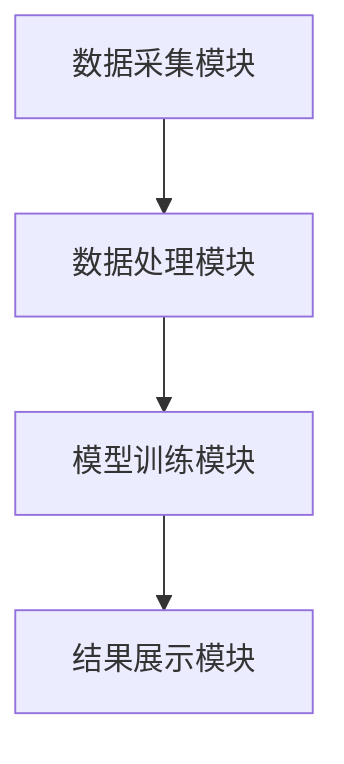

                 


# AI辅助的企业信用周期预测

## 关键词：人工智能、企业信用周期、预测模型、机器学习、深度学习

## 摘要：本文探讨了如何利用人工智能技术辅助企业信用周期预测。通过分析企业信用周期的核心概念、AI算法的原理、系统架构设计以及项目实战，详细介绍了AI在信用周期预测中的应用。本文旨在为企业提供一种高效、精准的信用评估方法，助力企业优化财务管理和风险控制。

---

# 第1章: AI与企业信用周期预测的背景与意义

## 1.1 企业信用周期预测的背景

企业信用周期预测是企业财务管理中的重要环节，它帮助企业识别和评估客户的信用风险，从而优化应收账款管理，降低坏账率。传统的信用评估方法依赖于财务报表分析和人工判断，存在效率低、主观性强的问题。随着人工智能技术的快速发展，AI在信用周期预测中的应用日益广泛，为企业提供了更高效、更精准的解决方案。

---

## 1.2 AI技术的快速发展与应用

AI技术的快速发展为企业信用周期预测带来了新的机遇。机器学习和深度学习算法能够处理海量数据，识别复杂的模式和趋势，从而提高预测的准确性。AI技术在金融领域的应用已涵盖信用评分、欺诈检测、投资决策等多个方面。在企业信用周期预测中，AI技术的优势在于其能够快速处理多维度数据，提供实时的预测结果。

---

## 1.3 AI技术在信用周期预测中的应用潜力

AI技术在企业信用周期预测中的应用潜力巨大。通过自然语言处理（NLP）技术，AI可以从企业报告、新闻等非结构化数据中提取有价值的信息，进一步丰富预测模型的数据来源。此外，AI还可以通过实时数据分析，动态调整预测模型，提高预测的准确性和及时性。

---

# 第2章: 企业信用周期预测的核心概念与AI的结合

## 2.1 企业信用周期预测的核心要素

企业信用周期预测涉及多个核心要素，包括：

- **企业财务数据**：如收入、利润、应收账款等。
- **市场环境数据**：如行业趋势、宏观经济指标等。
- **企业行为数据**：如交易记录、合同履行情况等。

这些数据共同构成了企业信用周期预测的基础。

---

## 2.2 AI技术在信用周期预测中的应用

AI技术在信用周期预测中的应用主要体现在以下几个方面：

- **数据处理与特征提取**：AI能够自动处理和提取数据中的特征，减少人工干预。
- **模型训练与预测**：通过机器学习算法，AI可以训练出高精度的预测模型。
- **结果解释与优化**：AI能够提供预测结果的解释，并根据反馈不断优化模型。

---

## 2.3 本章小结

本章介绍了企业信用周期预测的核心要素以及AI技术在其中的应用。AI技术通过处理多维度数据，构建高精度的预测模型，为企业信用周期预测提供了新的解决方案。

---

# 第3章: AI算法在企业信用周期预测中的原理

## 3.1 机器学习算法概述

### 3.1.1 监督学习

监督学习是一种基于 labeled 数据的机器学习方法。在企业信用周期预测中，监督学习可以用于根据历史数据预测未来的信用周期。

---

### 3.1.2 无监督学习

无监督学习适用于无 labeled 数据的情况。在信用周期预测中，无监督学习可以用于发现数据中的潜在模式。

---

### 3.1.3 强化学习

强化学习是一种通过与环境交互来学习策略的方法。在信用周期预测中，强化学习可以用于动态调整预测模型。

---

## 3.2 深度学习算法概述

### 3.2.1 神经网络

神经网络是一种模仿人脑结构的深度学习模型，能够处理复杂的非线性关系。

---

### 3.2.2 卷积神经网络

卷积神经网络（CNN）常用于图像识别，但在信用周期预测中，也可以用于处理时间序列数据。

---

### 3.2.3 循环神经网络

循环神经网络（RNN）适合处理序列数据，如时间序列数据，能够捕捉数据中的时序关系。

---

## 3.3 常见AI算法在信用周期预测中的应用

### 3.3.1 线性回归

线性回归是一种简单但有效的回归算法，适用于线性关系的预测。

---

### 3.3.2 支持向量机

支持向量机（SVM）适用于分类问题，能够处理高维数据。

---

### 3.3.3 随机森林

随机森林是一种基于决策树的集成学习算法，具有较高的准确性和鲁棒性。

---

### 3.3.4 长短时记忆网络

长短时记忆网络（LSTM）适用于处理时间序列数据，能够捕捉长距离依赖关系。

---

## 3.4 本章小结

本章详细介绍了机器学习和深度学习算法在企业信用周期预测中的应用，强调了不同算法的特点和适用场景。

---

# 第4章: 企业信用周期预测的AI算法实现

## 4.1 数据预处理

### 4.1.1 数据清洗

数据清洗是数据预处理的重要步骤，包括去除重复数据、处理缺失值等。

---

### 4.1.2 数据标准化

数据标准化是将数据缩放到统一的范围内，常用的方法包括归一化和标准化。

---

### 4.1.3 数据增强

数据增强是通过增加数据的多样性来提高模型的泛化能力，常用的方法包括旋转、翻转等。

---

## 4.2 特征工程

### 4.2.1 特征选择

特征选择是选择对预测目标影响最大的特征，常用的方法包括相关性分析和逐步回归。

---

### 4.2.2 特征提取

特征提取是通过降维技术提取数据的主要特征，常用的方法包括主成分分析（PCA）。

---

### 4.2.3 特征组合

特征组合是将多个特征组合成一个新的特征，能够提高模型的表达能力。

---

## 4.3 模型训练与优化

### 4.3.1 模型训练

模型训练是通过优化目标函数来训练模型，常用的方法包括梯度下降和随机梯度下降。

---

### 4.3.2 模型调优

模型调优是通过调整超参数来优化模型的性能，常用的方法包括网格搜索和随机搜索。

---

### 4.3.3 模型评估

模型评估是通过评估指标来衡量模型的性能，常用的指标包括准确率、召回率和F1值。

---

## 4.4 本章小结

本章详细介绍了企业信用周期预测的AI算法实现过程，包括数据预处理、特征工程和模型训练与优化。

---

# 第5章: 企业信用周期预测系统的架构设计

## 5.1 问题场景介绍

企业信用周期预测系统需要处理大量的企业数据，包括财务数据、市场数据等，预测企业的信用周期。

---

## 5.2 系统功能设计

### 5.2.1 数据采集模块

数据采集模块负责采集企业的财务数据、市场数据等。

---

### 5.2.2 数据处理模块

数据处理模块负责对采集到的数据进行清洗、标准化和增强。

---

### 5.2.3 模型训练模块

模型训练模块负责训练和优化预测模型。

---

### 5.2.4 结果展示模块

结果展示模块负责展示预测结果和模型评估指标。

---

## 5.3 系统架构设计

### 5.3.1 系统架构图



---

## 5.4 本章小结

本章详细介绍了企业信用周期预测系统的架构设计，包括各个模块的功能和系统的整体架构。

---

# 第6章: 项目实战

## 6.1 项目背景

本项目旨在利用AI技术构建一个企业信用周期预测系统，帮助企业优化信用管理。

---

## 6.2 数据准备

### 6.2.1 数据来源

数据来源包括企业的财务数据、市场数据和行业报告等。

---

### 6.2.2 数据格式

数据格式包括结构化数据和非结构化数据。

---

## 6.3 系统实现

### 6.3.1 数据预处理

数据预处理代码如下：

```python
import pandas as pd
import numpy as np

# 读取数据
data = pd.read_csv('企业信用数据.csv')

# 处理缺失值
data = data.dropna()

# 标准化处理
from sklearn.preprocessing import StandardScaler
scaler = StandardScaler()
data_scaled = scaler.fit_transform(data)
```

---

### 6.3.2 模型训练

模型训练代码如下：

```python
from sklearn.model_selection import train_test_split
from sklearn.linear_model import LinearRegression
from sklearn.metrics import mean_squared_error

# 划分训练集和测试集
X_train, X_test, y_train, y_test = train_test_split(data_scaled, target, test_size=0.2, random_state=42)

# 训练模型
model = LinearRegression()
model.fit(X_train, y_train)

# 预测结果
y_pred = model.predict(X_test)

# 计算均方误差
mse = mean_squared_error(y_test, y_pred)
print('均方误差:', mse)
```

---

## 6.4 结果分析

通过对模型的训练和测试，可以得到预测结果和评估指标。模型的准确率和召回率越高，说明模型的性能越好。

---

## 6.5 本章小结

本章通过项目实战，详细介绍了企业信用周期预测系统的实现过程，包括数据准备、模型训练和结果分析。

---

# 第7章: 总结与展望

## 7.1 总结

本文详细介绍了AI辅助的企业信用周期预测技术，包括核心概念、算法原理、系统架构设计和项目实战。AI技术在信用周期预测中的应用显著提高了预测的准确性和效率。

---

## 7.2 展望

未来，随着AI技术的不断发展，企业信用周期预测将更加智能化和自动化。同时，如何处理多维度数据和提高模型的解释性也将是研究的重点。

---

# 作者：AI天才研究院/AI Genius Institute & 禅与计算机程序设计艺术/Zen And The Art of Computer Programming

