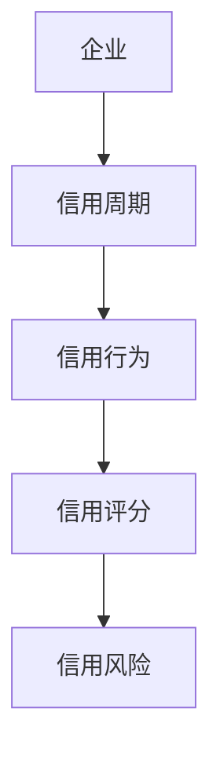
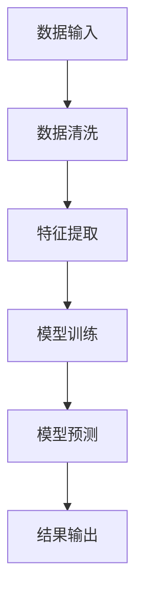
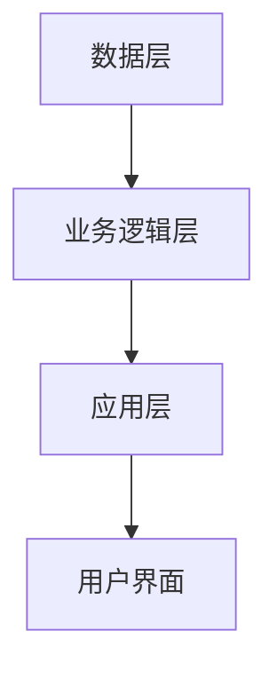
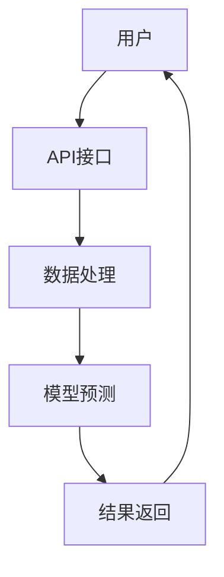

                 


# AI辅助的企业信用周期预测与风险管理

---

## 关键词
- AI技术
- 信用周期预测
- 风险管理
- 机器学习
- 时间序列分析

---

## 摘要
随着全球经济的快速发展，企业信用周期预测与风险管理变得越来越重要。传统的信用评估方法依赖于人工分析和统计模型，存在效率低下、预测精度不足等问题。人工智能（AI）技术的引入为信用周期预测带来了新的可能性。本文将详细探讨AI在企业信用周期预测与风险管理中的应用，从理论基础到实际应用，分析其优势、挑战及解决方案，为读者提供全面的视角。

---

## 第一部分: AI辅助的企业信用周期预测与风险管理概述

### 第1章: 企业信用周期预测与风险管理背景

#### 1.1 问题背景与描述
企业信用周期是指企业在不同时间段内的信用行为变化，反映了企业的信用健康状况。准确预测信用周期有助于企业及时识别潜在风险，优化财务管理，降低违约概率。然而，传统的方法依赖于历史数据和统计模型，难以捕捉复杂市场环境中的动态变化。

#### 1.2 问题解决与边界
AI技术的应用可以显著提升信用周期预测的精度和效率。通过机器学习算法，AI能够分析大量非结构化数据，发现隐藏的模式和趋势，帮助企业在早期识别信用风险。然而，AI模型的边界在于数据质量和模型的泛化能力，需要结合业务知识进行调整。

#### 1.3 核心概念与结构
通过对比表格和ER图，我们可以清晰地理解企业信用周期预测的核心要素及其关系。

| 概念       | 描述                                                                 |
|------------|----------------------------------------------------------------------|
| 信用周期   | 企业信用行为的时间序列，反映企业信用状况的变化                 |
| 风险管理   | 通过识别、评估和控制风险，降低企业信用损失                   |
| AI模型     | 利用机器学习算法对信用周期进行预测和风险评估                 |

ER实体关系图展示了企业、信用周期、信用行为、信用评分和信用风险之间的关系：



### 第2章: AI辅助信用周期预测的核心概念

#### 2.1 AI模型的基本原理
机器学习算法是AI辅助信用周期预测的核心工具。线性回归、随机森林和LSTM网络等算法各有优劣，适用于不同的场景。例如，线性回归适用于线性关系，而LSTM网络适合处理时间序列数据中的长期依赖。

#### 2.2 核心算法与模型
- **线性回归模型**: 适用于简单的线性关系，公式为：
  $$ y = \beta_0 + \beta_1x + \epsilon $$
  其中，$\beta_0$是截距，$\beta_1$是回归系数，$\epsilon$是误差项。
  
- **随机森林与梯度提升树**: 这些集成算法通过组合多个弱模型来提高预测精度。例如，随机森林的公式可以表示为：
  $$ y = \sum_{i=1}^{n} \text{Tree}(x) $$

- **LSTM网络**: 长短期记忆网络适合处理时间序列数据，公式为：
  $$ f_t = \sigma(g_t + f_{t-1}) $$

### 第3章: 信用周期预测的算法原理

#### 3.1 数据预处理与特征选择
数据预处理是确保模型准确性的关键步骤。包括数据清洗、特征提取和降维。例如，使用主成分分析（PCA）进行降维：

$$ \text{PCA}: X = X_{\text{center}} \cdot P $$

其中，$X_{\text{center}}$是中心化数据，$P$是主成分矩阵。

#### 3.2 算法流程图
以下是信用周期预测的算法流程图：



#### 3.3 算法实现代码
以下是一个简单的Python代码示例：

```python
import pandas as pd
from sklearn.model_selection import train_test_split
from sklearn.linear_model import LinearRegression

# 数据加载与预处理
data = pd.read_csv('credit_data.csv')
X = data[['feature1', 'feature2']]
y = data['target']

# 数据分割
X_train, X_test, y_train, y_test = train_test_split(X, y, test_size=0.2)

# 模型训练
model = LinearRegression()
model.fit(X_train, y_train)

# 预测与评估
y_pred = model.predict(X_test)
print('预测结果:', y_pred)
```

---

## 第二部分: 企业信用周期预测与风险管理的系统分析

### 第4章: 系统分析与架构设计

#### 4.1 问题场景介绍
企业信用周期预测系统需要处理大量的历史数据，包括财务数据、市场信息和交易记录。系统需要实时更新模型，以应对市场变化。

#### 4.2 系统架构设计
系统架构包括数据层、业务逻辑层和应用层。使用微服务架构可以提高系统的可扩展性和灵活性。



#### 4.3 系统接口设计
系统接口设计需要考虑数据输入、模型调用和结果输出。例如，API接口可以使用RESTful风格：

```http
POST /predict
Content-Type: application/json

{
    "input": [1, 2, 3]
}
```

#### 4.4 交互流程图
以下是系统的交互流程图：



---

## 第三部分: 项目实战与案例分析

### 第5章: 项目实战

#### 5.1 环境安装
需要安装以下Python库：
- `pandas`
- `numpy`
- `scikit-learn`
- `keras`

#### 5.2 核心代码实现
以下是一个使用LSTM网络进行信用周期预测的代码示例：

```python
import numpy as np
from keras.models import Sequential
from keras.layers import LSTM, Dense

# 数据准备
data = np.random.random((1000, 1))
X = data[:-1, :]
y = data[1:, :]

# 模型构建
model = Sequential()
model.add(LSTM(64, input_shape=(1, 1)))
model.add(Dense(1))
model.compile(optimizer='adam', loss='mean_squared_error')

# 模型训练
model.fit(X, y, epochs=10, batch_size=32)
```

#### 5.3 案例分析
以某制造企业的信用周期预测为例，使用LSTM网络进行预测。模型在训练数据上的表现良好，但在测试数据上可能需要进一步调优。

---

## 第四部分: 最佳实践与总结

### 第6章: 最佳实践

#### 6.1 小结
AI技术在企业信用周期预测与风险管理中的应用前景广阔。通过机器学习算法，可以显著提升预测精度和效率。

#### 6.2 注意事项
- 数据质量是模型性能的关键，需要进行充分的数据清洗和特征工程。
- 模型需要定期更新，以应对市场环境的变化。
- 结合业务知识进行模型解释，避免黑箱操作。

#### 6.3 拓展阅读
建议读者进一步学习时间序列分析和深度学习在金融领域的应用。

---

## 作者：AI天才研究院 & 禅与计算机程序设计艺术

---

以上是《AI辅助的企业信用周期预测与风险管理》的技术博客文章的详细内容，涵盖了从理论到实践的各个方面，帮助读者全面理解AI在信用周期预测与风险管理中的应用。

