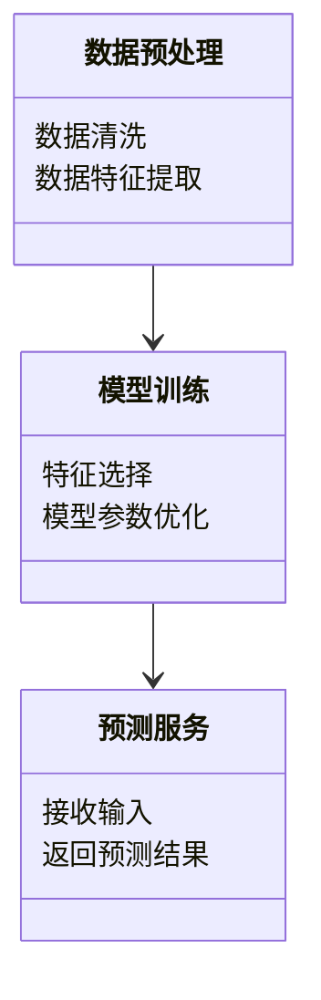

                 


# AI辅助的企业信用周期预测模型

> 关键词：AI辅助，企业信用周期，预测模型，机器学习，深度学习，算法实现

> 摘要：本文详细探讨了如何利用人工智能技术构建企业信用周期预测模型。通过分析传统预测方法的局限性，提出基于机器学习和深度学习的AI辅助解决方案，并结合实际案例展示模型的实现过程和应用场景。文章内容涵盖预测模型的核心概念、算法原理、系统架构设计以及项目实战，为读者提供从理论到实践的全面指导。

---

## 第一章：企业信用周期预测的背景与问题

### 1.1 企业信用周期预测的定义与重要性

企业信用周期是指企业在一定时期内经历的信用状况变化过程，包括信用建立、增长、稳定、衰退和恢复等阶段。准确预测信用周期对于企业融资决策、风险管理以及投资策略具有重要意义。AI技术的引入显著提升了预测的准确性和效率。

### 1.2 企业信用周期预测的现状与挑战

#### 1.2.1 传统预测方法的局限性
传统预测方法依赖于财务指标和历史数据，但其准确性受到数据质量和模型复杂度的限制，难以捕捉复杂的市场变化。

#### 1.2.2 数据质量与获取的挑战
企业信用数据的获取和处理面临数据缺失、噪声和不一致等问题，影响模型的预测效果。

#### 1.2.3 模型泛化能力与解释性问题
传统模型的泛化能力有限，难以应对多样化的信用周期变化，且模型解释性不足，影响实际应用。

### 1.3 AI辅助信用周期预测的核心价值

#### 1.3.1 提高预测准确性的潜力
AI技术能够处理大量非结构化数据，挖掘隐藏的特征，显著提升预测精度。

#### 1.3.2 数据驱动的决策优势
基于AI的预测模型能够实时更新，适应市场变化，为企业提供动态决策支持。

#### 1.3.3 个性化与实时预测的可能性
AI技术支持个性化预测和实时监控，帮助企业及时调整信用策略。

### 1.4 本章小结

本章介绍了企业信用周期预测的背景、重要性以及AI辅助预测的核心价值，为后续分析奠定了基础。

---

## 第二章：企业信用周期预测的核心概念与联系

### 2.1 信用周期预测的关键要素

#### 2.1.1 企业信用周期的核心属性
信用周期受宏观经济环境、行业特性、企业自身状况等因素影响，具有动态性和复杂性。

#### 2.1.2 影响信用周期的主要因素
包括企业财务状况、市场环境、行业竞争格局等多方面因素。

#### 2.1.3 信用周期预测的边界与外延
明确预测的范围和时间跨度，确保模型的应用场景清晰。

### 2.2 核心概念的原理与联系

#### 2.2.1 信用周期预测的系统性分析
从系统工程的角度分析信用周期预测的各个组成部分及其相互作用。

#### 2.2.2 核心概念的ER实体关系图
```mermaid
entity Enterprise {
    [企业ID]
    [企业名称]
    [行业]
}

entity CreditCycle {
    [信用周期阶段]
    [时间戳]
    [企业ID]
}

relation 属于 {
    企业 -> CreditCycle
}
```

### 2.3 核心概念的对比分析

#### 2.3.1 不同信用周期预测方法的对比
| 方法 | 优点 | 缺点 |
|------|------|------|
| 传统统计方法 | 简单易懂 | 预测精度低 |
| 机器学习 | 高精度 | 需大量数据 |
| 深度学习 | 捕捉复杂模式 | 计算资源需求高 |

#### 2.3.2 AI方法与传统方法的优劣势对比

AI方法在数据处理能力和模型复杂度上具有明显优势，但对计算资源要求较高。

### 2.4 本章小结

本章详细分析了信用周期预测的核心概念及其相互关系，为后续AI模型的设计提供了理论基础。

---

## 第三章：AI辅助信用周期预测的算法原理

### 3.1 传统机器学习算法

#### 3.1.1 线性回归
通过最小二乘法拟合数据，适用于线性关系的预测。

#### 3.1.2 支持向量机
利用核技巧处理非线性数据，适合小样本数据。

#### 3.1.3 随机森林
通过集成学习提升模型鲁棒性，适合高维数据。

### 3.2 深度学习算法

#### 3.2.1 神经网络
通过多层感知机捕捉数据的非线性特征。

#### 3.2.2 长短期记忆网络
适用于时间序列数据，能够捕捉长期依赖关系。

#### 3.2.3 图神经网络
用于处理企业间的关联关系，适合复杂网络结构。

### 3.3 算法原理的数学模型

#### 3.3.1 线性回归模型
$$
y = \beta_0 + \beta_1x + \epsilon
$$

#### 3.3.2 长短期记忆网络
$$
f_t = \sigma(W_f \cdot [h_{t-1}, x_t])
$$

---

## 第四章：系统分析与架构设计

### 4.1 系统功能设计

#### 4.1.1 领域模型类图


#### 4.1.2 系统架构设计


### 4.2 接口与交互设计

#### 4.2.1 系统接口
定义API接口，用于数据输入和结果输出。

#### 4.2.2 交互流程
用户通过界面输入数据，系统返回预测结果。

---

## 第五章：项目实战与实现

### 5.1 项目背景

#### 5.1.1 项目介绍
构建一个基于机器学习的企业信用周期预测系统，提供实时预测功能。

### 5.2 核心实现

#### 5.2.1 数据预处理
使用Python进行数据清洗和特征提取。

```python
import pandas as pd

data = pd.read_csv('credit_data.csv')
data_clean = data.dropna()
```

#### 5.2.2 模型训练
选择随机森林算法进行训练。

```python
from sklearn.ensemble import RandomForestClassifier

model = RandomForestClassifier()
model.fit(X_train, y_train)
```

#### 5.2.3 模型评估
使用准确率和F1分数评估模型性能。

### 5.3 项目小结

本章通过实际案例展示了AI辅助信用周期预测模型的实现过程。

---

## 第六章：最佳实践与小结

### 6.1 最佳实践

#### 6.1.1 数据质量管理
确保数据的完整性和准确性。

#### 6.1.2 模型优化
通过交叉验证和超参数调优提升性能。

### 6.2 小结

本文详细介绍了AI辅助企业信用周期预测模型的构建过程，从理论到实践，为读者提供了全面的指导。

---

## 作者：AI天才研究院 & 禅与计算机程序设计艺术

---

以上是《AI辅助的企业信用周期预测模型》的技术博客文章的完整目录和内容概要，涵盖了从背景到实现的各个方面，为读者提供了全面的技术指导。

