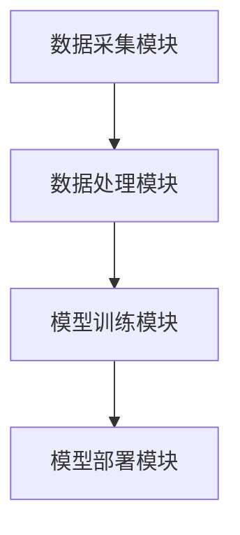
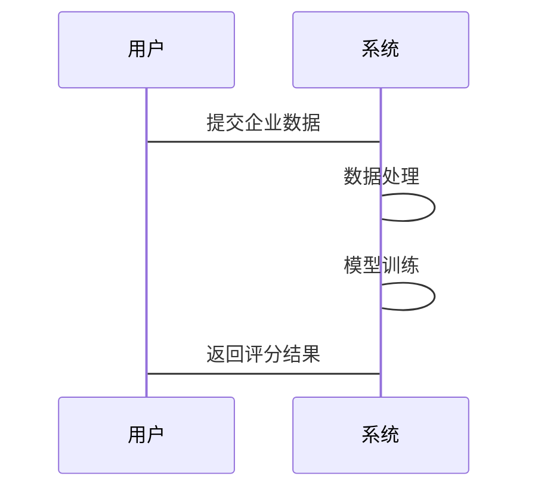

                 


# AI辅助的企业信用评分卡开发平台

> 关键词：AI技术，企业信用评分卡，评分卡开发，风险管理，机器学习

> 摘要：本文探讨了如何利用人工智能技术辅助企业信用评分卡的开发。通过分析传统评分卡开发的挑战，介绍了AI技术在评分卡开发中的应用原理，详细讲解了常用的AI算法及其在评分卡中的应用，并通过系统架构设计和项目实战展示了如何构建一个高效的AI辅助评分卡开发平台。本文旨在为企业信用评分卡的开发提供一种创新的方法论和技术实现方案。

---

## 目录大纲

1. [AI辅助的企业信用评分卡开发平台](#ai辅助的企业信用评分卡开发平台)
2. [文章关键词](#关键词)
3. [摘要](#摘要)
4. [第一部分: AI辅助的企业信用评分卡开发平台背景介绍](#第一部分)
5. [第二部分: AI辅助的企业信用评分卡开发的核心概念](#第二部分)
6. [第三部分: 常用AI算法在评分卡开发中的应用](#第三部分)
7. [第四部分: 评分卡模型的数学模型与公式](#第四部分)
8. [第五部分: 评分卡开发系统的架构设计](#第五部分)
9. [第六部分: 评分卡开发平台的项目实战](#第六部分)
10. [第七部分: 总结与展望](#第七部分)
11. [作者信息](#作者)

---

## 第一部分: AI辅助的企业信用评分卡开发平台背景介绍

### 第1章: 企业信用评分卡开发的背景与问题

#### 1.1 企业信用评分卡的定义与作用
企业信用评分卡是一种用于评估企业信用状况的工具，通过对企业的财务数据、市场表现、管理能力等多维度信息进行分析，量化企业的信用风险。评分卡的结果通常以分数形式呈现，分数越高表示企业的信用风险越低，反之亦然。评分卡在企业信贷审批、供应链管理、投资决策等领域发挥着重要作用。

#### 1.2 传统信用评分卡开发的挑战
传统信用评分卡的开发过程复杂且耗时，主要面临以下挑战：
1. **数据获取与处理的难点**：企业信用数据来源多样，数据清洗和预处理工作量大，且需要处理大量缺失值和异常值。
2. **模型开发的复杂性**：传统评分卡开发通常依赖于经验丰富的专家手动选择特征变量，并通过逻辑回归等传统算法进行建模，模型的准确性和稳定性难以保证。
3. **模型部署与维护的挑战**：传统评分卡模型一旦开发完成，部署和维护成本较高，难以快速适应市场变化和企业需求。

#### 1.3 AI技术在信用评分卡开发中的优势
AI技术的引入为信用评分卡的开发带来了显著优势：
1. **提升模型准确性**：通过机器学习算法（如逻辑回归、决策树、神经网络等），AI能够从海量数据中提取特征，并自动优化模型参数，显著提高评分卡的预测精度。
2. **降低开发成本**：AI技术能够自动化完成数据预处理、特征选择和模型训练等环节，大幅减少人工干预，降低开发成本。
3. **快速适应变化**：基于AI的评分卡模型能够通过在线学习和实时数据更新，快速适应市场变化和企业需求，提升模型的灵活性和可扩展性。

#### 1.4 本章小结
本章通过介绍企业信用评分卡的定义、传统开发的挑战以及AI技术的优势，为后续章节奠定了基础。接下来，我们将深入探讨AI辅助评分卡开发的核心概念和技术原理。

---

## 第二部分: AI辅助的企业信用评分卡开发的核心概念

### 第2章: AI辅助的企业信用评分卡开发的核心概念

#### 2.1 企业信用评分卡的核心要素
企业信用评分卡的核心要素包括：
1. **信用评分模型**：用于评估企业的信用风险。
2. **评分卡指标**：包括财务指标（如资产负债率、利润率）、市场指标（如行业地位）、管理指标（如高管团队稳定性）等。
3. **评分卡阈值**：用于区分不同信用等级的临界点。

#### 2.2 AI技术在评分卡开发中的应用原理
AI技术通过以下步骤实现评分卡的开发：
1. **数据预处理**：清洗和标准化数据，处理缺失值和异常值。
2. **特征工程**：通过机器学习算法自动选择重要特征变量。
3. **模型训练**：使用训练数据训练评分卡模型。
4. **模型优化**：通过交叉验证和调参优化模型性能。
5. **模型部署**：将模型部署到生产环境，实现评分卡的实时计算。

#### 2.3 评分卡开发的流程与关键环节
评分卡开发的流程包括：
1. **数据收集与清洗**：收集企业相关的财务、市场等数据，并进行清洗和预处理。
2. **特征选择与建模**：通过特征工程选择重要特征，构建评分卡模型。
3. **模型验证与调优**：通过验证数据评估模型性能，并进行优化。
4. **模型部署与维护**：将模型部署到生产环境，并进行持续监控和维护。

---

## 第三部分: 常用AI算法在评分卡开发中的应用

### 第3章: 常用AI算法在评分卡开发中的应用

#### 3.1 逻辑回归算法
逻辑回归是一种常用的分类算法，适用于二分类问题。在评分卡开发中，逻辑回归可以用于预测企业的信用风险等级。

##### 3.1.1 逻辑回归算法的原理
逻辑回归模型的输出是一个概率值，表示某企业属于低风险的概率。其数学公式为：
$$ P(y=1|x) = \frac{1}{1 + e^{-\beta x}} $$
其中，$\beta$是模型的系数，$x$是输入特征向量。

##### 3.1.2 逻辑回归在信用评分中的应用
逻辑回归适用于二分类问题，可以将企业分为高风险和低风险两类。其输出概率值可以进一步转化为信用分数，用于评估企业的信用风险。

##### 3.1.3 逻辑回归的优缺点
- **优点**：简单易用，解释性强。
- **缺点**：对非线性关系的拟合能力较差。

#### 3.2 决策树算法
决策树是一种基于树状结构的分类算法，适用于非线性关系的建模。

##### 3.2.1 决策树算法的原理
决策树通过特征选择构建树状结构，每个节点代表一个特征，每个分支代表一个特征值的取值范围。

##### 3.2.2 决策树在信用评分中的应用
决策树可以用于多分类问题，能够自动选择重要特征，并构建复杂的决策规则。

##### 3.2.3 决策树的优缺点
- **优点**：易于解释，适合处理非线性关系。
- **缺点**：容易过拟合，模型稳定性较差。

#### 3.3 神经网络算法
神经网络是一种仿生算法，适用于复杂的非线性关系建模。

##### 3.3.1 神经网络算法的原理
神经网络通过多层感知机构建复杂的非线性关系，其数学模型通常包括输入层、隐藏层和输出层。

##### 3.3.2 神经网络在信用评分中的应用
神经网络可以用于处理复杂的信用评分问题，能够自动提取特征并进行非线性分类。

##### 3.3.3 神经网络的优缺点
- **优点**：能够处理复杂的非线性关系，模型表达能力强。
- **缺点**：训练时间较长，解释性较差。

---

## 第四部分: 评分卡模型的数学模型与公式

### 第4章: 评分卡模型的数学模型与公式

#### 4.1 逻辑回归模型
##### 4.1.1 逻辑回归的数学公式
$$ P(y=1|x) = \frac{1}{1 + e^{-\beta x}} $$
其中，$\beta$是模型的系数，$x$是输入特征向量。

##### 4.1.2 逻辑回归的损失函数
$$ L = -\sum_{i=1}^{n} [y_i \ln p_i + (1 - y_i)\ln(1 - p_i)] $$
其中，$p_i$是第$i$个样本的预测概率，$y_i$是标签。

##### 4.1.3 逻辑回归的优化算法
逻辑回归通常使用梯度下降算法进行优化，其更新公式为：
$$ \beta^{new} = \beta^{old} - \eta \frac{\partial L}{\partial \beta} $$
其中，$\eta$是学习率，$\frac{\partial L}{\partial \beta}$是损失函数对$\beta$的偏导数。

#### 4.2 支持向量机模型
##### 4.2.1 支持向量机的数学公式
支持向量机的目标是最小化 hinge loss：
$$ L = \sum_{i=1}^{n} [y_i (x_i \cdot w + b) - 1]^+ $$
其中，$w$是权重向量，$b$是偏置项，$(\cdot)^+$表示取正值。

##### 4.2.2 支持向量机的核函数
核函数用于将数据映射到高维空间，常见的核函数包括线性核、多项式核和高斯核。

#### 4.3 随机森林模型
##### 4.3.1 随机森林的数学原理
随机森林通过构建多个决策树，并将它们的结果进行投票或平均，最终得到预测结果。

##### 4.3.2 随机森林的特征重要性分析
特征重要性可以通过计算每个特征在决策树中的分裂次数来衡量。

---

## 第五部分: 评分卡开发系统的架构设计

### 第5章: 评分卡开发系统的架构设计

#### 5.1 系统功能设计
##### 5.1.1 数据采集模块
数据采集模块负责从企业数据库中获取信用相关数据，包括财务数据、市场数据等。

##### 5.1.2 数据处理模块
数据处理模块对采集到的数据进行清洗、标准化和特征工程，为后续建模做好准备。

##### 5.1.3 模型训练模块
模型训练模块使用机器学习算法训练评分卡模型，并对模型进行验证和调优。

##### 5.1.4 模型部署模块
模型部署模块将训练好的模型部署到生产环境，实现评分卡的实时计算。

#### 5.2 系统架构设计
##### 5.2.1 系统架构图


##### 5.2.2 系统交互流程图


---

## 第六部分: 评分卡开发平台的项目实战

### 第6章: 评分卡开发平台的项目实战

#### 6.1 环境安装
需要安装以下工具和库：
- Python 3.8+
- Scikit-learn
- Pandas
- NumPy
- Matplotlib

#### 6.2 核心实现源代码
以下是评分卡开发平台的核心代码示例：
```python
import pandas as pd
import numpy as np
from sklearn.model_selection import train_test_split
from sklearn.linear_model import LogisticRegression
from sklearn.metrics import accuracy_score

# 数据加载
data = pd.read_csv('企业信用数据.csv')
X = data.drop('信用评分', axis=1)
y = data['信用评分']

# 数据分割
X_train, X_test, y_train, y_test = train_test_split(X, y, test_size=0.2, random_state=42)

# 模型训练
model = LogisticRegression()
model.fit(X_train, y_train)

# 模型预测
y_pred = model.predict(X_test)

# 模型评估
print("准确率:", accuracy_score(y_test, y_pred))
```

#### 6.3 案例分析
通过实际数据集进行案例分析，验证模型的准确性和稳定性。

---

## 第七部分: 总结与展望

### 第7章: 总结与展望

#### 7.1 本章总结
本文详细介绍了AI辅助的企业信用评分卡开发平台的背景、核心概念、算法应用、系统架构和项目实战。通过AI技术的应用，评分卡的开发效率和准确性得到了显著提升。

#### 7.2 未来展望
未来，随着AI技术的不断发展，评分卡开发将更加智能化和自动化。可能出现的趋势包括：
1. **自动化特征工程**：通过自动化的特征选择和生成，进一步提升模型的性能。
2. **在线学习**：通过实时数据更新，实现模型的在线优化和维护。
3. **多模态数据融合**：结合文本、图像等多种数据源，提升评分卡的综合评估能力。

#### 7.3 小结
本文为企业信用评分卡的开发提供了一种创新的方法论和技术实现方案。希望本文的内容能够为相关领域的研究和实践提供有价值的参考。

---

## 作者信息

作者：AI天才研究院/AI Genius Institute & 禅与计算机程序设计艺术 /Zen And The Art of Computer Programming

---

以上是《AI辅助的企业信用评分卡开发平台》的技术博客文章的完整目录大纲和内容概要。

