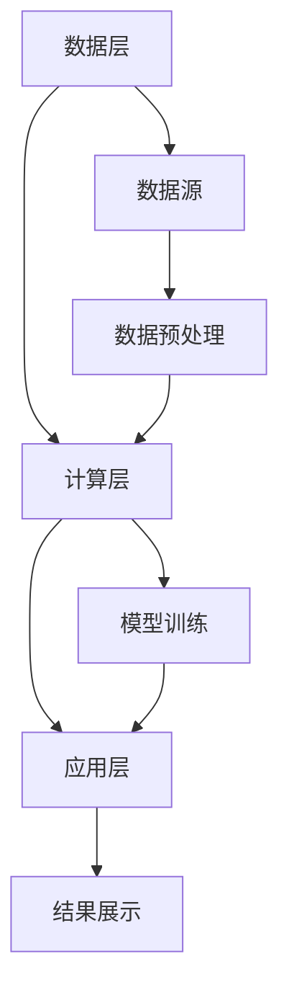

                 


# AI辅助的企业信用风险评估

## 关键词：AI、信用风险评估、机器学习、大数据、金融技术、风险管理

## 摘要：  
本文探讨了人工智能技术在企业信用风险评估中的应用，分析了传统方法的局限性，并详细介绍了基于机器学习的信用风险评估模型，包括算法原理、系统架构、项目实现等，为企业信用风险管理提供新的思路和解决方案。

---

# AI辅助的企业信用风险评估

## 第1章：企业信用风险评估的背景与概述

### 1.1 信用风险的定义与特征  
信用风险是指在信用交易中，交易对手未能履行其合同义务，导致债权人遭受损失的可能性。其主要特征包括：滞后性（风险发生后才显现）、多样性（影响因素众多）、传染性（风险可能在市场中蔓延）。

### 1.2 企业信用风险评估的目的与意义  
信用风险评估旨在通过分析企业的财务状况、市场行为和信用历史，量化其违约概率。其意义在于帮助银行、投资者等利益相关方做出更明智的信贷决策，降低潜在损失。

### 1.3 传统信用风险评估方法的局限性  
传统方法主要依赖财务报表分析，难以捕捉非财务风险因素，如企业声誉、管理团队稳定性等。此外，传统方法对数据质量和完整性要求较高，且缺乏动态调整能力。

### 1.4 AI技术在信用风险评估中的应用前景  
AI技术通过大数据分析和机器学习算法，能够从海量数据中提取非结构化信息，发现传统方法难以察觉的风险信号。AI的引入显著提升了信用评估的准确性和效率，为信用风险管理带来革新。

---

## 第2章：AI与信用风险评估的结合原理  

### 2.1 AI技术在信用评估中的核心作用  
AI在信用评估中的作用体现在以下几个方面：  
1. **数据处理与特征提取**：通过自然语言处理（NLP）和数据挖掘技术，提取企业财报、新闻中的隐含信息。  
2. **模型训练与预测**：利用机器学习算法训练模型，预测企业的违约概率。  
3. **结果解释与优化**：通过可解释性机器学习（如SHAP值），帮助用户理解模型预测的依据，并不断优化模型性能。

### 2.2 信用风险评估中的关键数据特征  
在AI辅助的信用评估中，数据特征是模型性能的关键因素。以下是几种关键数据特征及其描述：  

| 数据类型       | 描述                                                                 |
|----------------|--------------------------------------------------------------------|
| 财务数据       | 包括收入、利润、资产负债率等财务指标，反映企业的财务健康状况。   |
| 市场行为数据     | 包括股票价格波动、成交量、行业趋势等，反映企业的市场表现和行业风险。 |
| 信用历史数据     | 包括过往违约记录、信用评分等，反映企业的信用历史和还款能力。     |

### 2.3 AI算法在信用评估中的应用特点  
AI算法在信用评估中的应用特点如下：  
1. **可解释性**：部分算法（如逻辑回归、XGBoost）具有较高的可解释性，便于业务人员理解。  
2. **泛化能力**：机器学习算法能够处理高维数据，发现复杂模式。  
3. **动态适应性**：AI系统可以实时更新模型，适应市场变化。

---

## 第3章：常用AI算法及在信用评估中的应用  

### 3.1 逻辑回归算法  
逻辑回归是一种经典的分类算法，适用于二分类问题。其核心公式为：  
$$P(y=1|x) = \frac{e^{\beta_0 + \beta_1x}}{1 + e^{\beta_0 + \beta_1x}}$$  
其中，$\beta_0$和$\beta_1$是模型参数，$x$是输入特征。逻辑回归通过最大化对数似然函数进行参数估计。

### 3.2 随机森林算法  
随机森林是一种基于决策树的集成学习算法。它通过随机采样数据和特征，构建多棵决策树，并通过投票或平均的方式得出最终预测结果。随机森林具有较高的鲁棒性和抗过拟合能力。

### 3.3 神经网络算法  
神经网络是一种模仿人脑结构的深度学习算法。它适用于处理复杂非线性关系，如企业信用风险中的多因素相互作用。常用的神经网络模型包括卷积神经网络（CNN）和循环神经网络（RNN）。

---

## 第4章：系统分析与架构设计  

### 4.1 系统功能设计  
信用风险评估系统的核心功能模块包括：  
1. **数据采集**：从企业财报、新闻、社交媒体等来源获取数据。  
2. **数据预处理**：清洗数据，处理缺失值和异常值。  
3. **特征工程**：提取和选择关键特征。  
4. **模型训练**：训练机器学习模型。  
5. **风险评估**：生成信用评分和违约概率预测。  
6. **结果解释**：提供模型预测的解释和建议。

### 4.2 系统架构设计  
系统架构采用分层设计，包括数据层、计算层和应用层。  



### 4.3 系统接口设计  
系统接口设计采用RESTful API，方便与其他系统集成。主要接口包括：  
1. `/api/data/upload`：上传企业数据。  
2. `/api/model/train`：训练模型。  
3. `/api/assessment/predict`：进行信用评估预测。  

---

## 第5章：项目实战  

### 5.1 环境安装  
以下是项目所需的Python库：  
- `pandas`：数据处理  
- `scikit-learn`：机器学习算法  
- `xgboost`：梯度提升算法  
- `matplotlib`：数据可视化  

### 5.2 核心实现  
以下是一个基于逻辑回归的信用评估模型实现示例：  

```python
import pandas as pd
from sklearn.linear_model import LogisticRegression
from sklearn.model_selection import train_test_split
from sklearn.metrics import accuracy_score

# 加载数据
data = pd.read_csv('credit_risk.csv')
X = data.drop('default', axis=1)
y = data['default']

# 数据分割
X_train, X_test, y_train, y_test = train_test_split(X, y, test_size=0.2, random_state=42)

# 模型训练
model = LogisticRegression()
model.fit(X_train, y_train)

# 模型预测
y_pred = model.predict(X_test)

# 评估准确率
print(f'Accuracy: {accuracy_score(y_test, y_pred)}')
```

### 5.3 案例分析  
以某企业为例，分析其信用风险。假设企业的财务数据如下：  
- 营业收入：100万元  
- 净利润：10万元  
- 资产负债率：50%  

通过模型预测，该企业的违约概率为5%。

---

## 第6章：最佳实践与小结  

### 6.1 实践总结  
AI技术在企业信用风险评估中的应用显著提升了评估的准确性和效率。通过机器学习算法，企业能够更好地识别和量化信用风险。

### 6.2 注意事项  
1. **数据隐私**：确保数据处理符合相关法律法规。  
2. **模型解释性**：选择可解释性较强的算法，便于业务人员理解。  
3. **模型维护**：定期更新模型，确保其适应市场变化。

### 6.3 未来展望  
随着AI技术的不断发展，信用风险评估将更加智能化。未来的研究方向包括：  
- 结合NLP技术，从非结构化数据中提取更多信息。  
- 利用区块链技术，确保数据的安全性和可信度。  

---

## 作者：AI天才研究院 & 禅与计算机程序设计艺术  

通过本文的详细分析，您可以全面了解AI在企业信用风险评估中的应用，并为实际项目提供有价值的参考和指导。

