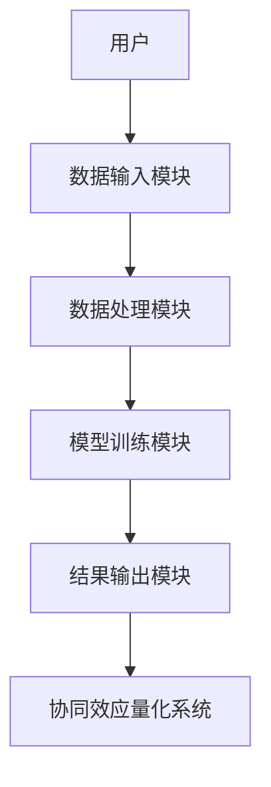

                 


# AI辅助的企业并购协同效应量化模型

> 关键词：企业并购、协同效应、人工智能、量化模型、商业分析

> 摘要：本文探讨了如何利用人工智能技术构建企业并购协同效应的量化模型，通过分析协同效应的核心概念、量化模型的设计原理、算法实现以及系统架构，为企业并购决策提供科学依据。文章结合实际案例，详细阐述了模型的应用过程，并展望了未来的发展方向。

---

# 第一部分: 企业并购与协同效应的基本概念

## 第1章: 企业并购的定义与类型

### 1.1 企业并购的基本概念

企业并购（Mergers and Acquisitions, M&A）是指一家企业与其他企业合并或收购其资产、股权等行为。并购的目的是通过整合资源、扩大规模或优化业务结构，提升企业的竞争力和市场地位。

#### 并购的主要类型

- **横向并购**：同一行业内的企业并购，旨在扩大市场份额。
- **纵向并购**：上下游产业的企业并购，优化供应链。
- **混合并购**：跨行业并购，拓展业务范围。

### 1.2 协同效应的定义与分类

协同效应是指企业并购后，通过资源整合、效率提升等方式实现的收益或成本节约。

#### 协同效应的主要类型

- **成本协同效应**：通过合并运营降低成本。
- **收入协同效应**：通过市场扩展或产品互补增加收入。
- **战略协同效应**：通过战略协同提升整体竞争力。

### 1.3 AI在企业并购中的应用前景

人工智能技术在企业并购中的应用前景广阔，尤其是在协同效应的量化分析方面。AI可以通过大数据分析、自然语言处理和机器学习等技术，帮助企业在并购过程中更准确地评估协同效应。

---

## 第2章: 企业并购协同效应量化模型的背景与问题分析

### 2.1 企业并购协同效应量化模型的背景

随着企业并购活动的日益频繁，如何量化协同效应成为并购决策中的关键问题。传统的协同效应评估方法往往依赖于主观判断，存在较大的不确定性。而AI技术可以通过数据分析和模型构建，提供更加客观、精准的评估结果。

### 2.2 协同效应量化模型的核心问题

- **数据获取与处理的挑战**：企业并购涉及大量非结构化数据，如财务报表、市场分析报告等，如何有效处理这些数据是模型构建的关键。
- **模型的可解释性与准确性**：AI模型需要在保证高准确性的前提下，具有一定的可解释性，以便企业在决策中理解模型的输出结果。

### 2.3 模型的边界与外延

- **模型适用的场景**：适用于企业并购中的协同效应评估，尤其是涉及多维度数据的复杂并购场景。
- **模型的局限性**：受限于数据质量和模型的训练样本，协同效应的量化可能存在一定的误差。
- **模型的扩展性与可扩展性**：模型可以通过不断优化算法和增加数据输入维度，进一步提升评估的准确性。

---

## 第3章: 协同效应量化模型的核心概念与联系

### 3.1 协同效应量化模型的原理

协同效应量化模型通过整合企业的财务数据、市场数据和行业趋势，利用机器学习算法对协同效应进行预测和评估。

#### 模型的核心要素

- **输入数据**：包括企业的财务数据、市场数据、行业趋势等。
- **算法选择**：如线性回归、随机森林等。
- **输出结果**：协同效应的量化值，帮助企业评估并购的潜在收益。

### 3.2 协同效应量化模型的属性特征对比

| 属性         | 传统方法         | AI辅助方法         |
|--------------|------------------|--------------------|
| 数据处理     | 依赖人工处理      | 自动化处理          |
| 精确度       | 较低             | 较高               |
| 可解释性     | 较高             | 较低               |

### 3.3 协同效应量化模型的ER实体关系图

```mermaid
erDiagram
    actor 顾客 {
        string id
        string name
    }
    actor 供应商 {
        string id
        string name
    }
    actor 经理 {
        string id
        string name
    }
    boundary 协同效应量化系统 {
        +int id
        +string name
        +int value
        +int type
        +int status
    }
    boundary 数据处理模块 {
        +int id
        +string data
        +int stat
    }
    boundary 模型训练模块 {
        +int id
        +string model
        +int status
    }
    boundary 结果输出模块 {
        +int id
        +string result
        +int status
    }
    顾客 --> 数据处理模块: 提供数据
    供应商 --> 数据处理模块: 提供数据
    经理 --> 数据处理模块: 提供数据
    数据处理模块 --> 模型训练模块: 传递数据
    模型训练模块 --> 结果输出模块: 输出结果
    结果输出模块 --> 协同效应量化系统: 更新系统
```

---

## 第4章: 协同效应量化模型的算法实现

### 4.1 协同效应评分算法

#### 算法流程

1. **数据预处理**：清洗数据，提取特征。
2. **模型训练**：使用机器学习算法训练模型。
3. **结果预测**：基于模型预测协同效应值。
4. **结果解释**：对预测结果进行分析和解释。

#### Python代码实现

```python
import pandas as pd
from sklearn.ensemble import RandomForestRegressor
from sklearn.metrics import mean_squared_error

# 数据加载
data = pd.read_csv('并购数据.csv')

# 特征提取
X = data[['revenue', 'profit', 'market_share']]
y = data['synergy']

# 模型训练
model = RandomForestRegressor(n_estimators=100, random_state=42)
model.fit(X, y)

# 预测结果
y_pred = model.predict(X)

# 模型评估
mse = mean_squared_error(y, y_pred)
print(f"均方误差: {mse}")
```

### 4.2 协同效应量化模型的数学公式

模型的预测公式如下：

$$
\text{synergy} = \beta_0 + \beta_1 \times \text{revenue} + \beta_2 \times \text{profit} + \beta_3 \times \text{market\_share}
$$

其中，$\beta_i$ 是模型训练得到的系数。

---

## 第5章: 系统分析与架构设计

### 5.1 问题场景介绍

企业并购协同效应量化系统需要处理大量的企业数据，包括财务数据、市场数据和行业趋势等，通过AI算法预测协同效应，辅助企业做出并购决策。

### 5.2 系统功能设计

- **数据输入模块**：用户输入企业数据。
- **数据处理模块**：清洗和转换数据。
- **模型训练模块**：训练协同效应量化模型。
- **结果输出模块**：展示预测结果。

### 5.3 系统架构设计



### 5.4 系统接口设计

- **数据接口**：提供API接口，接收企业的并购数据。
- **结果接口**：返回协同效应的量化结果。

---

## 第6章: 项目实战

### 6.1 环境安装

安装所需的Python库：

```bash
pip install pandas scikit-learn
```

### 6.2 核心代码实现

```python
import pandas as pd
from sklearn.ensemble import RandomForestRegressor
from sklearn.metrics import mean_squared_error

# 数据加载
data = pd.read_csv('并购数据.csv')

# 特征提取
X = data[['revenue', 'profit', 'market_share']]
y = data['synergy']

# 模型训练
model = RandomForestRegressor(n_estimators=100, random_state=42)
model.fit(X, y)

# 预测结果
y_pred = model.predict(X)

# 模型评估
mse = mean_squared_error(y, y_pred)
print(f"均方误差: {mse}")
```

### 6.3 案例分析

以某企业并购案例为例，通过模型预测协同效应值，评估并购的潜在收益。

---

## 第7章: 最佳实践与扩展阅读

### 7.1 最佳实践

- 在数据处理阶段，建议使用更复杂的特征工程方法，如PCA降维。
- 在模型选择上，可以尝试使用深度学习模型（如神经网络）提升预测精度。

### 7.2 小结

本文详细介绍了AI辅助的企业并购协同效应量化模型的构建过程，包括模型的理论基础、算法实现和系统设计。通过实际案例分析，展示了模型的应用价值。

### 7.3 注意事项

- 数据的质量对模型的准确性影响重大，建议在数据处理阶段进行充分的清洗和特征工程。
- 模型的可解释性是企业决策的重要考量因素，建议在模型训练中注重模型的可解释性。

### 7.4 拓展阅读

- 《企业并购与协同效应》
- 《机器学习在金融领域的应用》

---

作者：AI天才研究院 & 禅与计算机程序设计艺术

