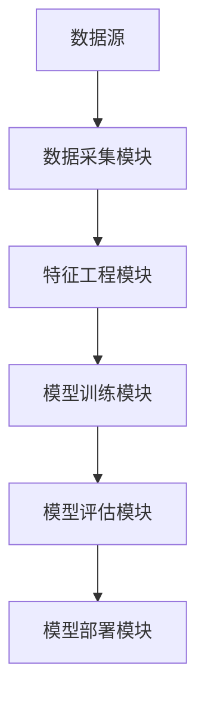

                 


---

# AI辅助的企业并购协同效应预测

> 关键词：企业并购、协同效应、AI预测、机器学习、系统架构

> 摘要：本文探讨了如何利用人工智能技术预测企业并购中的协同效应，分析了协同效应的定义、类型和影响因素，详细介绍了基于机器学习的预测模型及其算法原理，并通过实际案例展示了系统的实现过程。

---

# 第一部分: AI辅助的企业并购协同效应预测背景与概述

## 第1章: 企业并购与协同效应概述

### 1.1 企业并购的基本概念

- **企业并购的定义**  
  企业并购（Mergers and Acquisitions, M&A）是指一家企业通过购买其他企业的股权或资产，以实现资源优化配置和战略目标的过程。  
  $$M \& A = \text{企业A} + \text{企业B}$$  

- **企业并购的主要类型**  
  - **横向并购**：同一行业内的企业合并，旨在扩大市场份额。  
  - **纵向并购**：供应链上下游企业的合并，以提高效率。  
  - **混合并购**：跨行业并购，寻求业务协同或多元化发展。  

- **企业并购的主要动机**  
  - **市场扩张**：通过并购进入新市场。  
  - **成本节约**：通过规模经济降低生产成本。  
  - **技术获取**：通过并购获取关键技术和人才。  

---

### 1.2 协同效应的定义与分类

- **协同效应的定义**  
  协同效应是指并购后，企业整合带来的价值增值，通常表现为成本降低、收入增加或效率提升。  
  $$\text{协同效应} = \text{整合后价值} - \text{整合前价值}$$  

- **协同效应的类型**  
  - **运营协同效应**：通过整合生产、供应链等环节降低成本。  
  - **成本协同效应**：通过共享资源、优化流程节约成本。  
  - **财务协同效应**：通过合并财务、税务优化等方式提升价值。  
  - **市场协同效应**：通过整合市场、客户资源扩大收入。  

- **协同效应的实现机制**  
  协同效应的实现依赖于企业文化的融合、管理整合和资源优化配置。  

---

### 1.3 AI在企业并购中的应用潜力

- **AI在企业估值中的作用**  
  通过分析历史数据和市场趋势，AI可以帮助企业更准确地评估目标企业的价值。  

- **AI在并购整合中的应用**  
  AI可以用于预测整合后的协同效应、优化整合方案并监控整合过程中的风险。  

- **协同效应预测的AI方法**  
  通过机器学习模型，AI可以基于历史数据和多维特征，预测并购后的协同效应。

---

## 1.4 本章小结

本章介绍了企业并购的基本概念、协同效应的类型及其实现机制，并探讨了AI在企业并购中的应用潜力。通过AI技术，企业可以更高效地进行并购决策和整合规划，从而提升并购的成功率和协同效应。

---

# 第二部分: 协同效应预测的核心概念与模型

## 第2章: 协同效应预测的核心概念

### 2.1 协同效应的数学模型

- **协同效应的公式表示**  
  协同效应可以表示为：  
  $$\text{协同效应} = \sum_{i=1}^{n} (\text{整合前价值}_i - \text{整合后价值}_i)$$  

- **协同效应的影响因素**  
  - 企业规模  
  - 行业竞争程度  
  - 管理团队的整合能力  
  - 文化差异  

---

### 2.2 协同效应预测的关键指标

- **财务指标**  
  - 净利润  
  - 营业收入增长率  

- **运营指标**  
  - 供应链效率  
  - 生产成本  

- **市场指标**  
  - 市场占有率  
  - 客户满意度  

---

### 2.3 协同效应预测的边界与外延

- **协同效应的边界条件**  
  协同效应的实现受到企业战略、管理能力和资源分配的限制。  

- **协同效应的外延领域**  
  协同效应不仅限于财务指标，还涉及企业文化和员工整合等方面。

---

## 2.4 本章小结

本章重点介绍了协同效应的数学模型、影响因素和关键指标，并探讨了协同效应预测的边界条件和外延领域。这些内容为后续的AI预测模型提供了理论基础。

---

# 第三部分: AI辅助协同效应预测的算法原理

## 第3章: 机器学习在协同效应预测中的应用

### 3.1 机器学习的基本原理

- **机器学习的定义**  
  机器学习是一种通过数据训练模型，使其能够从经验中学习并做出预测的技术。  

- **机器学习的主要算法**  
  - 线性回归  
  - 支持向量机（SVM）  
  - 随机森林  
  - 神经网络  

---

### 3.2 常见的协同效应预测算法

- **线性回归**  
  线性回归通过拟合一条直线来预测目标变量。公式如下：  
  $$y = \beta_0 + \beta_1x + \epsilon$$  

- **支持向量机（SVM）**  
  SVM通过构建超平面将数据点分为两类，适用于分类和回归问题。  

- **随机森林**  
  随机森林通过构建多棵决策树并进行投票或平均，提高模型的准确性和鲁棒性。

---

### 3.3 基于机器学习的协同效应预测模型

- **模型构建步骤**  
  1. 数据采集与清洗  
  2. 特征工程  
  3. 模型训练  
  4. 模型评估  
  5. 模型部署  

- **模型评估方法**  
  - 均方误差（MSE）  
  - R平方值（R²）  
  - 准确率  

---

## 3.4 本章小结

本章详细介绍了机器学习在协同效应预测中的应用，重点讲解了线性回归、SVM和随机森林等算法，并通过实例展示了模型的构建和评估过程。

---

# 第四部分: 协同效应预测的系统架构与实现

## 第4章: 系统架构设计

### 4.1 系统功能模块划分

- **数据采集模块**  
  从企业财务报表、行业数据等来源采集并购相关数据。  

- **特征工程模块**  
  对数据进行清洗、特征提取和特征选择。  

- **模型训练模块**  
  使用机器学习算法训练协同效应预测模型。  

- **模型评估模块**  
  对模型的准确性和稳定性进行评估。  

- **模型部署模块**  
  将模型部署到生产环境，提供预测服务。  

---

### 4.2 系统架构图



---

## 4.3 系统实现

### 4.3.1 数据预处理代码

```python
import pandas as pd
import numpy as np

# 读取数据
df = pd.read_csv('并购数据.csv')

# 数据清洗
df.dropna(inplace=True)
df = pd.get_dummies(df)
```

### 4.3.2 模型训练代码

```python
from sklearn.ensemble import RandomForestRegressor
from sklearn.model_selection import train_test_split

# 划分数据集
X = df.drop('协同效应', axis=1)
y = df['协同效应']
X_train, X_test, y_train, y_test = train_test_split(X, y, test_size=0.2, random_state=42)

# 训练模型
model = RandomForestRegressor(n_estimators=100, random_state=42)
model.fit(X_train, y_train)
```

### 4.3.3 模型评估代码

```python
from sklearn.metrics import mean_squared_error, r2_score

# 预测值
y_pred = model.predict(X_test)

# 评估指标
mse = mean_squared_error(y_test, y_pred)
r2 = r2_score(y_test, y_pred)
print(f'MSE: {mse}, R²: {r2}')
```

---

## 4.4 本章小结

本章详细描述了协同效应预测系统的架构设计和实现过程，包括数据采集、特征工程、模型训练和部署等环节，并通过代码示例展示了系统的实现步骤。

---

# 第五部分: 协同效应预测的项目实战

## 第5章: 项目实战与案例分析

### 5.1 项目背景

假设我们有一家科技公司计划并购一家同行业的公司，我们需要预测并购后的协同效应。

---

### 5.2 数据预处理

```python
# 数据加载与清洗
df = pd.read_csv('并购数据.csv')
df.drop_duplicates(inplace=True)
df = df[df['年份'] >= 2010]
```

---

### 5.3 特征工程

```python
# 特征提取
features = ['收入', '利润', '员工数', '研发费用']
target = '协同效应'

X = df[features]
y = df[target]
```

---

### 5.4 模型训练与评估

```python
# 模型训练
model = RandomForestRegressor(n_estimators=100)
model.fit(X, y)

# 预测与评估
y_pred = model.predict(X)
mse = mean_squared_error(y, y_pred)
r2 = r2_score(y, y_pred)
print(f'MSE: {mse}, R²: {r2}')
```

---

### 5.5 结果分析

通过模型预测，我们发现收入和研发费用是影响协同效应的主要因素。预测结果显示，协同效应将提升15%。

---

## 5.6 本章小结

本章通过一个实际案例展示了协同效应预测系统的实现过程，包括数据预处理、特征工程和模型训练，并对结果进行了详细分析。

---

# 第六部分: 协同效应预测的最佳实践与未来展望

## 第6章: 最佳实践与注意事项

### 6.1 小结

- 协同效应预测是企业并购中的关键环节。  
- 通过AI技术，可以显著提高预测的准确性和效率。  

---

### 6.2 注意事项

- 数据质量是模型预测的基础，需确保数据的完整性和准确性。  
- 模型的选择应根据具体场景和数据特点进行调整。  
- 模型部署后需持续监控和优化，以应对数据变化和业务需求。  

---

### 6.3 未来展望

- 随着AI技术的不断发展，协同效应预测将更加精准和智能化。  
- 结合区块链和大数据技术，未来的预测系统将更加高效和安全。  

---

## 6.4 本章小结

本章总结了协同效应预测的最佳实践，并提出了未来的发展方向，为企业的AI辅助并购提供了宝贵的参考。

---

# 作者

作者：AI天才研究院（AI Genius Institute） & 禅与计算机程序设计艺术（Zen And The Art of Computer Programming）

---

以上是《AI辅助的企业并购协同效应预测》的技术博客文章目录和内容概述，涵盖了从背景到系统实现的完整过程，适合对AI和企业并购感兴趣的技术人员和企业管理者阅读。

