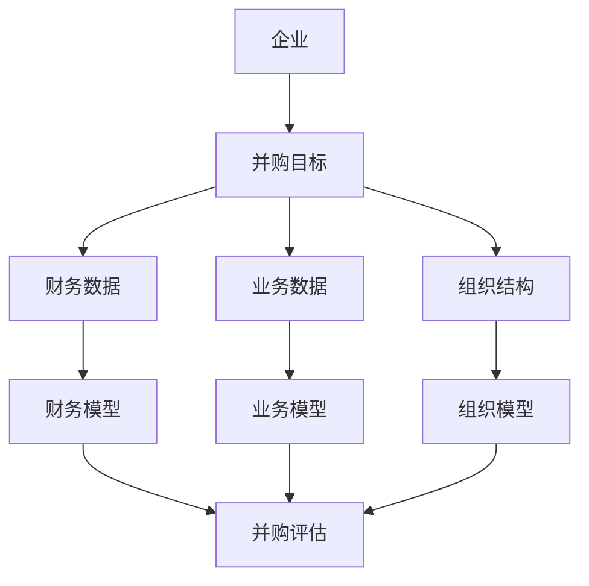
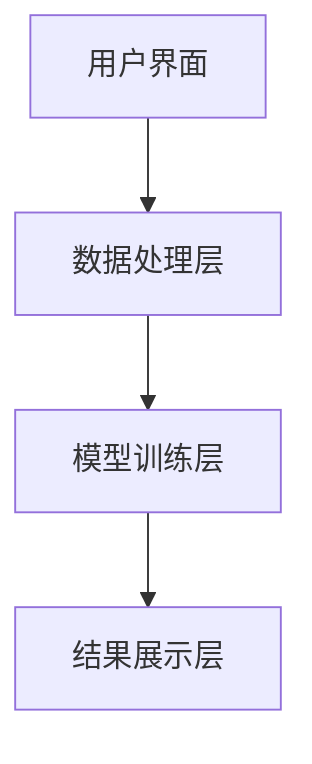

                 


# AI辅助的企业并购整合效果评估与优化

> 关键词：企业并购、AI辅助、整合效果评估、机器学习、自然语言处理

> 摘要：本文探讨了人工智能在企业并购整合中的应用，分析了如何利用AI技术优化整合效果。文章从背景、核心概念、算法原理、系统设计、实战案例等方面展开，详细讲解了AI在企业并购中的作用，并给出了实际应用的代码和案例分析。

---

## 第1章: 企业并购整合的基本概念与问题背景

### 1.1 企业并购的基本概念

企业并购是企业战略发展的重要手段，包括收购和合并两种主要形式。企业并购的动机通常包括寻求增长、获取技术、扩大市场份额等。并购后整合是确保并购成功的关键，涉及战略、组织、文化和财务等多个方面。

### 1.2 企业并购整合的挑战与问题

整合过程中面临的主要问题包括文化冲突、组织协调困难、绩效评估不准确等。这些问题可能导致并购失败或整合效果不佳。

### 1.3 AI技术在企业并购整合中的应用背景

AI技术在企业并购中的应用日益广泛，特别是在数据处理、模式识别和决策支持方面。通过AI，企业可以更高效地分析数据，优化整合策略，提升并购效果。

---

## 第2章: AI辅助企业并购整合的核心概念与联系

### 2.1 AI技术在企业并购整合中的核心作用

AI技术在并购中的应用包括数据挖掘、自然语言处理和机器学习。这些技术帮助企业更好地分析数据，识别风险，并优化整合策略。

### 2.2 企业并购整合的核心要素与AI的结合

AI技术与企业并购整合的结合体现在数据预处理、模型训练和结果评估等方面。通过AI，企业可以更精准地评估并购目标，优化整合过程。

### 2.3 AI辅助企业并购整合的实体关系图



---

## 第3章: AI辅助企业并购整合的算法原理与实现

### 3.1 基于机器学习的并购评估算法

机器学习在并购评估中的应用包括数据预处理、特征提取、模型训练和结果评估。常用的算法有随机森林和逻辑回归。

### 3.2 算法实现的Python代码示例

```python
import pandas as pd
from sklearn.ensemble import RandomForestClassifier
from sklearn.metrics import accuracy_score

data = pd.read_csv('并购数据.csv')
X = data.drop('并购成功', axis=1)
y = data['并购成功']

model = RandomForestClassifier()
model.fit(X, y)
y_pred = model.predict(X)
print("准确率:", accuracy_score(y, y_pred))
```

### 3.3 数学模型与公式

评估指标公式：
$$准确率 = \frac{正确预测数}{总预测数}$$

---

## 第4章: 系统分析与架构设计

### 4.1 项目背景与目标

本项目旨在开发一个AI辅助的企业并购整合效果评估系统，利用机器学习和自然语言处理技术，优化整合效果。

### 4.2 系统功能设计

系统功能模块包括数据采集、分析处理、评估预测和结果展示。

### 4.3 系统架构设计



---

## 第5章: 项目实战

### 5.1 环境安装

安装Python和相关库：
```bash
pip install pandas sklearn
```

### 5.2 核心代码实现

实现数据预处理和模型训练的代码：
```python
import pandas as pd
from sklearn.ensemble import RandomForestClassifier

data = pd.read_csv('并购数据.csv')
X = data.drop('并购成功', axis=1)
y = data['并购成功']

model = RandomForestClassifier()
model.fit(X, y)
```

### 5.3 实际案例分析

通过实际案例分析，展示AI如何优化企业并购整合效果，并解读分析结果。

---

## 第6章: 总结与展望

### 6.1 关键点总结

AI在企业并购整合中的应用显著提升了评估的准确性和效率，帮助企业更好地优化整合策略。

### 6.2 最佳实践 tips

建议企业在并购过程中充分利用AI技术，建立高效的数据分析和决策支持系统。

### 6.3 未来展望

未来，AI在企业并购中的应用将更加深入，推动企业整合效果的进一步优化。

---

## 作者

**作者：AI天才研究院 & 禅与计算机程序设计艺术**

通过本文，我们详细探讨了AI在企业并购整合中的应用，从理论到实践，为读者提供了全面的指导和深入的分析。希望本文能为企业并购整合的优化提供有价值的参考。

