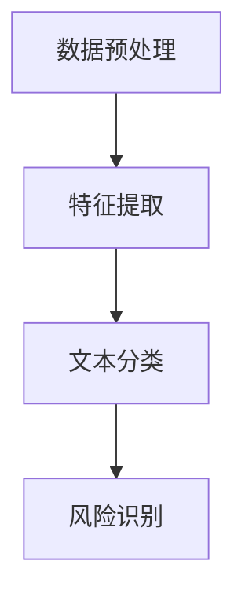
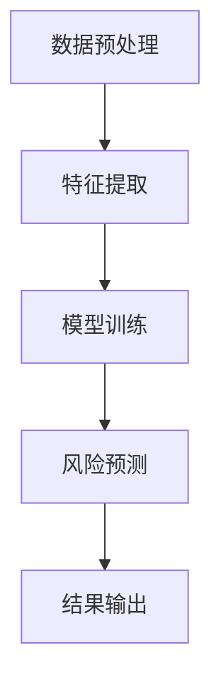
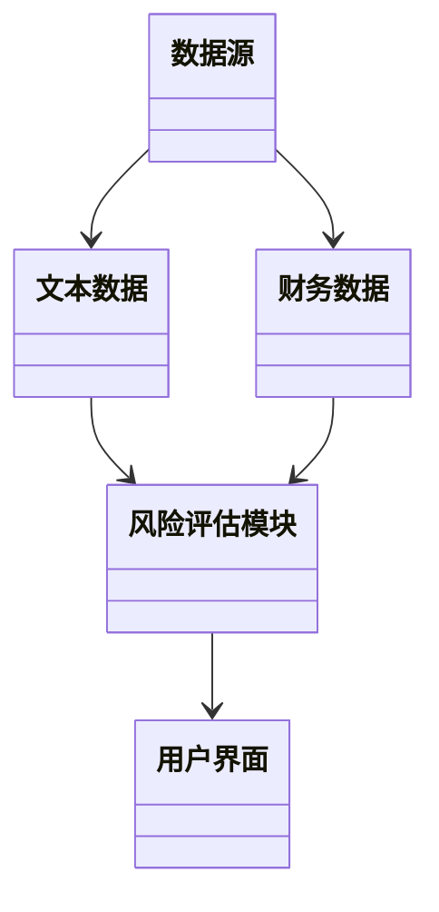
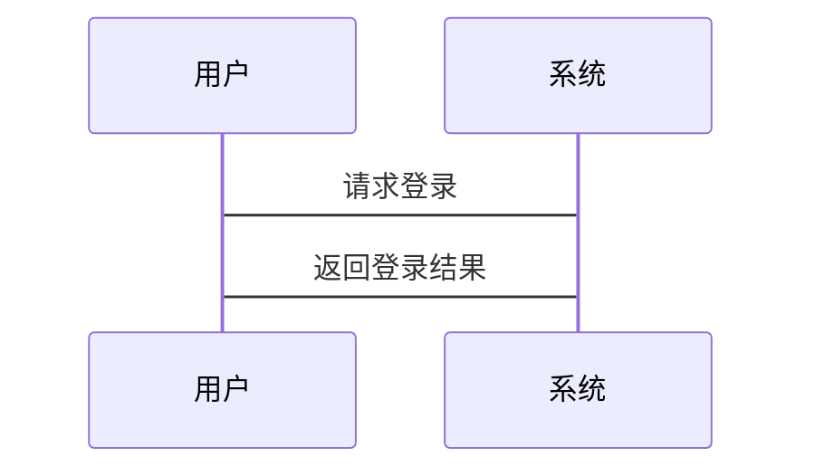

                 


# AI辅助的企业并购整合风险评估

## 关键词：AI、企业并购、风险评估、文本挖掘、机器学习、系统架构

## 摘要：
随着企业并购活动的频繁进行，整合过程中的风险评估变得至关重要。传统的风险评估方法依赖于人工分析，效率低下且容易出错。本文将探讨如何利用人工智能技术，特别是自然语言处理和机器学习算法，来辅助企业并购整合的风险评估。通过分析大量文本数据和历史案例，AI能够快速识别潜在风险，并提供数据驱动的决策支持。本文将从核心概念、算法原理、系统架构到项目实战，全面解析AI在企业并购整合风险评估中的应用，为读者提供一个系统的解决方案。

---

# 第1章: 企业并购整合与风险评估概述

## 1.1 企业并购整合的背景与意义
### 1.1.1 企业并购的定义与特点
企业并购是指一家企业通过购买或其他方式取得另一家企业的一部分或全部股权，以实现资源优化配置和战略目标。其特点包括高风险性、复杂性以及对协同效应的依赖。

### 1.1.2 并购整合的核心目标
并购整合的核心目标是实现企业间的协同效应，包括成本协同、收入协同和管理协同。然而，整合过程中可能会遇到文化冲突、管理不善和技术不匹配等问题，这些都会增加整合风险。

### 1.1.3 并购整合中的风险与挑战
整合过程中面临的主要风险包括：战略风险（目标企业与自身战略不符）、财务风险（资产质量不佳或负债过高）、运营风险（整合过程中的管理不善）以及法律风险（合规性问题）。这些风险可能导致并购失败或整合效果不佳。

## 1.2 风险评估在企业并购中的重要性
### 1.2.1 风险评估的基本概念
风险评估是通过分析潜在风险因素及其影响程度，评估企业并购整合过程中可能面临的风险。它是制定风险应对策略的基础。

### 1.2.2 并购整合中的主要风险类型
根据整合过程的不同阶段，风险可以分为前期风险（如目标选择不当）、整合过程中的风险（如组织文化冲突）和整合后的风险（如协同效应未达成）。

### 1.2.3 风险评估对决策的影响
有效的风险评估可以帮助企业在并购决策中做出更明智的选择，减少潜在风险的影响，提高整合成功的概率。

## 1.3 AI技术在风险评估中的应用前景
### 1.3.1 AI技术的基本概念
人工智能（AI）是指通过计算机模拟人类智能的技术，包括学习、推理、自我改进等功能。在企业并购中，AI可以通过分析大量数据，识别潜在风险。

### 1.3.2 AI在企业并购中的潜在应用
AI可以用于目标企业筛选、风险预测、整合策略制定等多个方面。例如，通过自然语言处理技术分析目标企业的财务报告和新闻，识别潜在风险。

### 1.3.3 AI辅助风险评估的优势与挑战
优势包括提高效率、降低人为错误、提供数据支持等。然而，AI模型的准确性和数据质量也是一个挑战，需要大量的高质量数据来训练模型。

---

# 第2章: 企业并购整合风险评估的核心概念

## 2.1 企业并购整合的关键要素
### 2.1.1 并购目标企业分析
目标企业分析包括对企业财务状况、市场地位、管理团队等多方面的评估。AI可以通过文本挖掘技术分析企业公开报告，提取关键信息。

### 2.1.2 并购后的整合策略
整合策略包括组织结构调整、文化整合、业务流程优化等。AI可以帮助企业制定个性化的整合策略，提高整合效率。

### 2.1.3 并购风险的分类与影响
风险可以分为财务风险、运营风险、法律风险等。不同的风险类型对整合的影响也不同，需要针对性地进行评估和应对。

## 2.2 AI辅助风险评估的核心原理
### 2.2.1 数据驱动的分析方法
AI通过分析大量数据，包括文本数据、财务数据等，提取潜在风险因素。例如，使用自然语言处理技术分析企业新闻，识别潜在的法律风险。

### 2.2.2 AI模型在风险预测中的作用
机器学习算法可以用于预测整合过程中的风险。例如，使用随机森林算法预测财务风险，使用深度学习算法预测运营风险。

### 2.2.3 多维度风险评估的实现路径
通过整合多种数据源，构建多维度的风险评估模型，全面评估整合过程中的潜在风险。例如，结合财务数据、文本数据和市场数据，进行综合风险评估。

## 2.3 核心概念对比与联系
### 2.3.1 传统风险评估与AI辅助评估的对比
传统方法依赖于人工分析，效率低且容易出错。AI辅助方法可以快速处理大量数据，提供更准确的风险评估。

### 2.3.2 不同AI模型的特征对比
不同的AI模型有不同的特点，例如，规则引擎适用于简单的风险规则，而统计模型适用于复杂的风险预测。可以通过表格形式展示不同模型的优缺点。

### 2.3.3 实体关系图（ER图）架构
通过ER图展示企业并购整合中的核心要素及其关系，例如，企业、风险、数据源等。

---

# 第3章: AI辅助企业并购整合风险评估的算法原理

## 3.1 文本挖掘与风险识别
### 3.1.1 文本挖掘的基本原理
文本挖掘是从文本数据中提取有用信息的过程。在企业并购中，可以用于分析目标企业的新闻报道、财务报告等文本数据，识别潜在风险。

### 3.1.2 基于NLP的风险识别流程
（1）数据预处理：清洗、分词、去除停用词。
（2）特征提取：使用TF-IDF提取关键词。
（3）风险识别：使用文本分类算法识别潜在风险。

### 3.1.3 示例代码与实现
```python
from sklearn.feature_extraction.text import TfidfVectorizer
from sklearn.naive_bayes import MultinomialNB
from sklearn.pipeline import Pipeline
```

### 3.1.4 算法流程图
使用mermaid绘制文本挖掘流程图：



## 3.2 风险预测模型的构建
### 3.2.1 机器学习算法的选择
常用的算法包括线性回归、随机森林、支持向量机（SVM）等。根据数据特点选择合适的算法。

### 3.2.2 风险评分模型的数学公式
例如，使用线性回归模型预测风险评分：

$$
\text{风险评分} = \beta_0 + \beta_1x_1 + \beta_2x_2 + \ldots + \beta_nx_n
$$

### 3.2.3 示例代码与实现
```python
import pandas as pd
from sklearn.linear_model import LinearRegression
from sklearn.metrics import mean_squared_error

# 加载数据
data = pd.read_csv('risk_data.csv')

# 定义特征和目标变量
X = data[['feature1', 'feature2']]
y = data['risk_score']

# 训练模型
model = LinearRegression()
model.fit(X, y)

# 预测
y_pred = model.predict(X)
print(mean_squared_error(y, y_pred))
```

### 3.2.4 算法流程图
使用mermaid绘制风险预测流程图：



---

# 第4章: 系统分析与架构设计方案

## 4.1 项目背景与目标
本项目旨在开发一个基于AI的企业并购整合风险评估系统，帮助企业在并购过程中快速识别和评估潜在风险。

## 4.2 系统功能设计
### 4.2.1 领域模型类图
使用mermaid绘制领域模型类图：



### 4.2.2 系统架构设计
使用mermaid绘制系统架构图：


## 4.3 系统接口设计
### 4.3.1 用户登录接口
使用mermaid绘制序列图：



### 4.3.2 数据查询接口
用户可以通过界面输入查询条件，系统返回相应的风险评估结果。

---

# 第5章: 项目实战

## 5.1 环境安装与配置
安装必要的Python库，例如scikit-learn、nltk、pandas等。

## 5.2 核心代码实现
### 5.2.1 文本挖掘部分
```python
from sklearn.feature_extraction.text import CountVectorizer
from sklearn.model_selection import train_test_split
from sklearn.naive_bayes import MultinomialNB

# 加载文本数据
text_data = pd.read_csv('text_data.csv')

# 数据预处理
vectorizer = CountVectorizer()
X = vectorizer.fit_transform(text_data['text'])
y = text_data['label']

# 划分训练集和测试集
X_train, X_test, y_train, y_test = train_test_split(X, y, test_size=0.2)

# 训练模型
model = MultinomialNB()
model.fit(X_train, y_train)

# 预测
y_pred = model.predict(X_test)
print(accuracy_score(y_test, y_pred))
```

### 5.2.2 风险预测部分
```python
from sklearn.ensemble import RandomForestClassifier
from sklearn.metrics import classification_report

# 加载数据
data = pd.read_csv('risk_data.csv')

# 定义特征和目标变量
X = data[['feature1', 'feature2', 'feature3']]
y = data['risk_level']

# 划分训练集和测试集
X_train, X_test, y_train, y_test = train_test_split(X, y, test_size=0.2)

# 训练模型
model = RandomForestClassifier()
model.fit(X_train, y_train)

# 预测
y_pred = model.predict(X_test)
print(classification_report(y_test, y_pred))
```

## 5.3 实际案例分析
以某互联网公司并购为例，详细分析数据来源、数据处理和模型预测的过程，并解读预测结果。

---

# 第6章: 最佳实践与小结

## 6.1 最佳实践
### 6.1.1 数据质量的重要性
确保数据的准确性和完整性，避免因数据问题导致模型误判。

### 6.1.2 模型迭代的必要性
根据实际效果不断优化模型，提高预测精度。

### 6.1.3 团队协作的重要性
AI项目需要跨学科团队合作，包括数据科学家、业务分析师和IT开发人员。

## 6.2 小结
本文详细介绍了AI在企业并购整合风险评估中的应用，从核心概念到算法实现，再到系统架构和项目实战，为读者提供了全面的解决方案。通过AI技术，企业可以更高效地识别和管理并购整合中的风险，提高整合成功的概率。

---

# 作者：AI天才研究院 & 禅与计算机程序设计艺术

---

以上是《AI辅助的企业并购整合风险评估》的完整目录和部分章节内容的示例。希望对您有所帮助！

