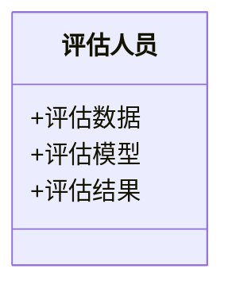
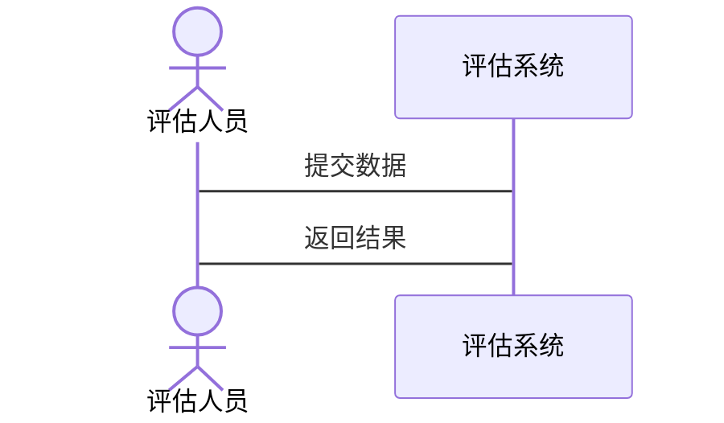

                 


# AI辅助的企业无形资产价值评估

> 关键词：企业无形资产、人工智能、价值评估、机器学习、系统架构

> 摘要：本文探讨了人工智能在企业无形资产价值评估中的应用，从核心概念、算法原理到系统设计和项目实战，系统地分析了如何利用AI技术提高评估效率和准确性。

---

# 第1章 企业无形资产价值评估概述

## 1.1 企业无形资产的定义与分类

企业无形资产是指企业拥有或控制的，没有实物形态的长期资产。它们为企业创造价值，通常包括品牌、专利、商标、商誉、客户关系、技术秘密等。

### 1.1.1 无形资产的定义
- **品牌**：企业的品牌价值与其市场认知度、客户忠诚度密切相关。
- **专利**：技术专利的保护为企业带来竞争优势和收入。
- **商誉**：企业并购时，商誉是评估企业整体价值的重要组成部分。

### 1.1.2 无形资产的分类
无形资产可以分为两类：
1. **可识别无形资产**：如专利、商标、软件等。
2. **不可识别无形资产**：如商誉、客户关系等。

### 1.1.3 无形资产在企业中的重要性
- 无形资产是企业核心竞争力的体现。
- 无形资产的价值评估直接影响企业的并购、融资和战略决策。

## 1.2 无形资产价值评估的背景与挑战

### 1.2.1 传统无形资产评估方法的局限性
- **主观性**：传统评估方法依赖于评估人员的主观判断，可能导致结果偏差。
- **数据不足**：难以收集到足够的数据来支持评估。
- **复杂性**：无形资产的价值受多种因素影响，如市场环境、企业战略等。

### 1.2.2 数字化转型对企业无形资产评估的影响
- **数据丰富性**：数字化转型为企业提供了大量数据，有助于更准确的评估。
- **技术进步**：AI和大数据技术的发展为评估提供了新的工具和方法。

### 1.2.3 AI技术在无形资产评估中的应用前景
- **提高准确性**：AI能够处理大量数据，减少人为误差。
- **实时评估**：AI可以实时监控市场变化，及时调整评估结果。

---

# 第2章 AI在企业无形资产价值评估中的核心作用

## 2.1 AI技术的基本原理

### 2.1.1 人工智能的定义与特点
- **定义**：人工智能是指计算机系统执行人类智能任务的能力。
- **特点**：学习、推理、自我改进。

### 2.1.2 机器学习与深度学习的基本概念
- **机器学习**：通过数据训练模型，使其能够识别模式。
- **深度学习**：一种机器学习方法，利用多层神经网络处理数据。

### 2.1.3 自然语言处理在文本分析中的应用
- **文本分析**：从非结构化数据中提取信息，如客户反馈。

## 2.2 AI在无形资产评估中的优势

### 2.2.1 提高评估效率
- AI能够快速处理大量数据，缩短评估时间。

### 2.2.2 增强数据处理能力
- 通过AI技术，可以挖掘数据中的隐藏信息，提高评估的准确性。

### 2.2.3 优化评估模型的准确性
- AI模型能够识别复杂关系，提供更精确的评估结果。

---

# 第3章 企业无形资产价值评估的核心概念与联系

## 3.1 无形资产价值评估的理论框架

### 3.1.1 无形资产评估的基本原理
- 无形资产价值评估依赖于市场条件、企业绩效等因素。

### 3.1.2 无形资产评估的关键要素
- **市场因素**：市场需求、竞争状况。
- **企业因素**：企业的财务状况、管理能力。

### 3.1.3 无形资产评估的边界与外延
- **边界**：评估范围和时间范围。
- **外延**：评估结果的应用范围。

## 3.2 核心概念与联系的ER实体关系图

```mermaid
er
actor: 评估人员
model: 评估模型
data: 评估数据
result: 评估结果
```

---

# 第4章 AI辅助的无形资产价值评估算法原理

## 4.1 算法原理概述

### 4.1.1 机器学习算法在评估中的应用
- **线性回归**：用于预测关系。
  $$y = \beta_0 + \beta_1x + \epsilon$$

### 4.1.2 深度学习模型的构建与训练
- **神经网络模型**
  ```mermaid
  graph LR
  A[输入层] --> B[隐藏层] --> C[输出层]
  ```

### 4.1.3 自然语言处理技术在文本分析中的应用
- **文本挖掘**：提取关键词和主题。

## 4.2 算法实现的数学模型

### 4.2.1 线性回归模型
$$
y = \beta_0 + \beta_1x + \epsilon
$$

### 4.2.2 神经网络模型


---

# 第5章 系统分析与架构设计方案

## 5.1 问题场景介绍

### 5.1.1 无形资产评估的复杂性
- 多因素影响，数据复杂。

### 5.1.2 AI辅助系统的必要性
- 提供高效的解决方案。

## 5.2 系统功能设计

### 5.2.1 领域模型


## 5.3 系统架构设计

### 5.3.1 系统架构图


### 5.3.2 系统接口设计
- **输入接口**：接收数据和指令。
- **输出接口**：返回评估结果。

## 5.4 系统交互设计

### 5.4.1 交互流程图


---

# 第6章 项目实战

## 6.1 环境安装

### 6.1.1 安装Python
- 使用Anaconda安装Python 3.8以上版本。

### 6.1.2 安装机器学习库
- 安装scikit-learn、TensorFlow等。

## 6.2 系统核心实现源代码

### 6.2.1 代码实现
```python
from sklearn.linear_model import LinearRegression
import numpy as np

# 示例数据
X = np.array([[1], [2], [3], [4]])
y = np.array([1, 2, 3, 4])

# 训练模型
model = LinearRegression()
model.fit(X, y)

# 预测
print(model.predict(np.array([[5]])))
```

### 6.2.2 代码解读
- 使用线性回归模型进行预测。

## 6.3 实际案例分析

### 6.3.1 案例背景
- 某公司品牌价值评估。

### 6.3.2 案例分析
- 使用AI模型分析品牌相关数据，得出品牌价值。

## 6.4 项目小结
- 通过项目实战，展示了AI在无形资产评估中的应用。

---

# 作者：AI天才研究院  
# 文章末尾：  
如果需要进一步了解相关内容，可以参考以下资源：  
- [《人工智能：一种现代的方法》](https://amzn.to/3bFnNz2)  
- [《机器学习实战》](https://amzn.to/3i19fZi)  

---

通过以上思考过程，我逐步构建了文章的结构和内容，确保每一部分都详细且有逻辑性，帮助读者全面理解AI在企业无形资产价值评估中的应用。

