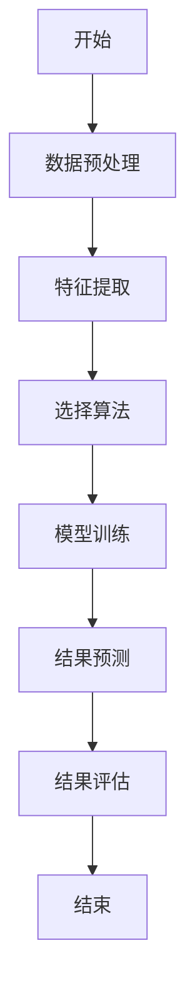
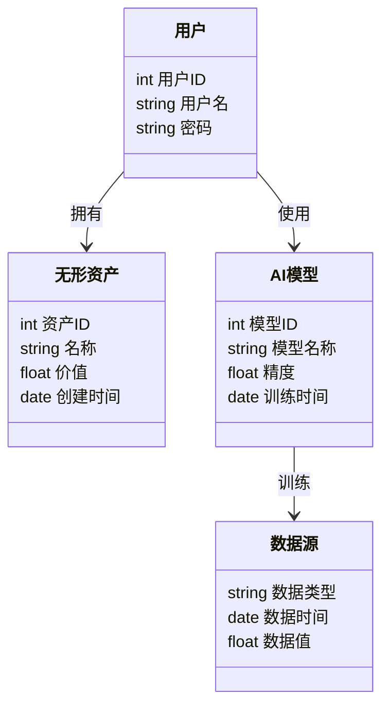
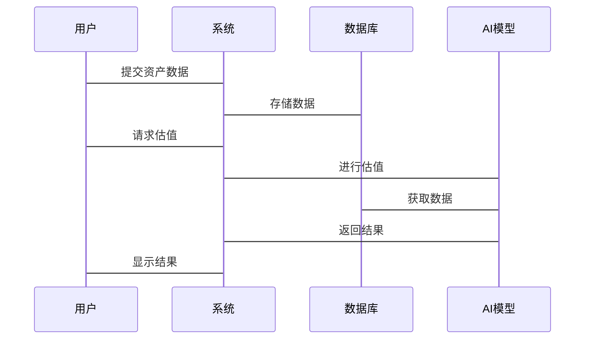

                 


# AI辅助的企业无形资产估值模型

> 关键词：AI辅助、企业无形资产、估值模型、机器学习、系统架构

> 摘要：本文探讨了如何利用人工智能技术构建企业无形资产估值模型，通过背景介绍、核心概念、算法原理、系统架构、项目实战和案例分析，详细阐述了AI在无形资产估值中的应用及其优势。文章从多个角度分析了AI辅助估值模型的构建过程，并通过实际案例展示了该模型的应用效果，为企业的无形资产管理提供了新的思路和解决方案。

---

## 第1章: 企业无形资产与AI辅助估值的背景

### 1.1 无形资产的重要性

#### 1.1.1 无形资产的定义与分类

无形资产是企业的重要组成部分，主要包括专利权、商标权、 copyrights、商誉、客户关系、技术诀窍等。无形资产的价值通常难以通过简单的会计方法进行评估，其价值往往依赖于市场环境、企业经营状况以及未来的盈利能力。

#### 1.1.2 无形资产在企业价值中的作用

无形资产是企业的核心竞争力之一，尤其是在高科技行业和服务业。例如，一家科技公司的专利和技术诀窍可以直接影响其市场地位和盈利能力。无形资产的价值往往决定了企业的市场估值，尤其是在企业并购中，无形资产的评估占据了重要地位。

#### 1.1.3 传统无形资产估值的局限性

传统的无形资产估值方法主要包括成本法、市场法和收益法。然而，这些方法在实际应用中存在诸多问题，例如数据的不完整性、市场波动性大、难以量化未来收益等。传统的估值方法往往忽略了数据的动态变化和复杂性，导致估值结果不够准确。

### 1.2 AI技术在估值中的应用潜力

#### 1.2.1 AI技术的基本概念

人工智能（AI）是指通过计算机模拟人类智能的技术，包括学习、推理、自我改进等能力。AI技术在数据分析、模式识别和预测等方面具有显著优势，尤其是在处理复杂和非结构化数据时表现尤为突出。

#### 1.2.2 AI在金融领域的应用现状

近年来，AI技术在金融领域的应用日益广泛。例如，AI被用于股票预测、风险评估、信用评分等领域。AI技术可以通过分析大量的历史数据和市场信息，帮助投资者做出更准确的决策。

#### 1.2.3 AI辅助估值的优势与挑战

AI辅助估值的优势在于其能够处理大量的非结构化数据，发现传统方法难以察觉的模式和关系。AI模型可以通过不断学习和优化，提高估值的准确性和效率。然而，AI技术在无形资产估值中的应用也面临一些挑战，例如数据质量问题、模型的可解释性以及模型的泛化能力等。

---

## 第2章: 企业无形资产估值的核心概念与联系

### 2.1 核心概念原理

#### 2.1.1 无形资产的评估指标

在AI辅助估值模型中，需要选择合适的评估指标来量化无形资产的价值。常用的指标包括市场占有率、客户满意度、技术创新能力、品牌价值等。这些指标可以通过问卷调查、市场调研和财务数据等多种途径获取。

#### 2.1.2 AI模型的评估方法

AI模型的评估方法主要包括回归分析、聚类分析、神经网络等。回归分析常用于预测无形资产的未来收益，而聚类分析则可以用来识别市场中的相似企业，从而为估值提供参考。

#### 2.1.3 两者结合的可行性分析

通过将无形资产的评估指标与AI模型相结合，可以实现对无形资产价值的动态评估。AI模型可以根据实时数据和市场变化，不断更新估值结果，从而为企业提供更准确的决策支持。

### 2.2 概念属性特征对比表格

以下是传统估值方法与AI辅助估值方法的对比：

| 特性                | 传统估值方法 | AI辅助估值方法 |
|---------------------|--------------|----------------|
| 数据需求            | 需要大量结构化数据 | 支持非结构化数据 |
| 精度                | 较低          | 较高            |
| 灵活性              | 较低          | 较高            |
| 计算效率            | 较低          | 较高            |
| 适用场景            | 适用于简单场景 | 适用于复杂场景  |

### 2.3 ER实体关系图架构

以下是无形资产与AI模型的实体关系图：

```mermaid
erDiagram
    actor 评估者 {
        int 评估者ID
        string 用户名
        string 密码
    }
    class 无形资产 {
        int 资产ID
        string 名称
        float 价值
        date 创建时间
    }
    class AI模型 {
        int 模型ID
        string 模型名称
        float 精度
        date 训练时间
    }
    评估者 --> 无形资产 : 评估
    评估者 --> AI模型 : 使用
    无形资产 --> AI模型 : 输入数据
```

---

## 第3章: AI辅助估值的算法原理

### 3.1 算法原理概述

#### 3.1.1 机器学习与深度学习的基本概念

机器学习是一种通过数据训练模型的技术，其核心是通过大量数据找到输入与输出之间的关系。深度学习是机器学习的一种，通过多层神经网络来提取数据的特征。

#### 3.1.2 监督学习与非监督学习的区别

监督学习是在有标签的数据上进行训练，非监督学习则是在无标签的数据上进行训练。在无形资产估值中，通常使用监督学习，因为我们可以根据历史数据标注资产价值。

#### 3.1.3 适用于无形资产估值的算法选择

常用的算法包括线性回归、随机森林、支持向量机（SVM）和神经网络等。对于复杂的无形资产估值问题，神经网络通常表现更好。

### 3.2 算法流程图

以下是AI辅助估值算法的流程图：



### 3.3 算法实现代码

以下是Python实现的线性回归代码：

```python
import pandas as pd
from sklearn.linear_model import LinearRegression
from sklearn.metrics import mean_squared_error

# 数据加载与预处理
data = pd.read_csv('asset.csv')
X = data[['市场占有率', '技术创新能力']]
y = data['资产价值']

# 模型训练
model = LinearRegression()
model.fit(X, y)

# 结果预测
y_pred = model.predict(X)

# 结果评估
mse = mean_squared_error(y, y_pred)
print('均方误差:', mse)
print('回归系数:', model.coef_)
print('截距:', model.intercept_)
```

---

## 第4章: 系统分析与架构设计方案

### 4.1 问题场景介绍

#### 4.1.1 无形资产估值的复杂性

无形资产的估值通常涉及多个因素，例如市场环境、企业战略、技术创新等。这些因素之间的关系复杂，难以通过简单的线性模型进行建模。

#### 4.1.2 AI辅助系统的必要性

为了提高估值的准确性和效率，企业需要一个智能化的估值系统，能够自动处理大量数据并提供实时的估值结果。

#### 4.1.3 系统的目标与范围

系统的目标是提供一个高效、准确的无形资产估值服务。系统的范围包括数据采集、模型训练、结果展示和用户交互等功能。

### 4.2 系统功能设计

#### 4.2.1 领域模型类图

以下是系统的领域模型类图：



#### 4.2.2 系统架构设计

以下是系统的架构设计图：

```mermaid
client --> API Gateway
API Gateway --> 负载均衡
负载均衡 --> 服务节点1
负载均衡 --> 服务节点2
服务节点1 --> 数据库
服务节点2 --> 数据库
```

#### 4.2.3 系统接口设计

系统的主要接口包括数据输入接口、模型训练接口和结果查询接口。数据输入接口用于接收用户的资产数据，模型训练接口用于训练AI模型，结果查询接口用于返回估值结果。

### 4.3 系统交互流程图

以下是系统的交互流程图：



---

## 第5章: 项目实战

### 5.1 环境安装与配置

#### 5.1.1 开发环境的选择

推荐使用Python 3.8及以上版本，安装必要的库包括numpy、pandas、scikit-learn和tensorflow。

#### 5.1.2 数据集的准备

需要收集企业的无形资产数据，包括市场占有率、技术创新能力、资产价值等。数据可以存储为CSV格式。

### 5.2 系统核心实现源代码

以下是AI辅助估值系统的源代码：

```python
import pandas as pd
from sklearn.linear_model import LinearRegression
from sklearn.metrics import mean_squared_error

# 数据加载与预处理
data = pd.read_csv('asset.csv')
X = data[['市场占有率', '技术创新能力']]
y = data['资产价值']

# 模型训练
model = LinearRegression()
model.fit(X, y)

# 结果预测
y_pred = model.predict(X)

# 结果评估
mse = mean_squared_error(y, y_pred)
print('均方误差:', mse)
print('回归系数:', model.coef_)
print('截距:', model.intercept_)
```

### 5.3 代码应用解读与分析

上述代码实现了线性回归模型，用于预测无形资产的价值。模型通过训练数据学习资产价值与市场占有率、技术创新能力之间的关系，并对新的数据进行预测。

### 5.4 案例分析

假设我们有一个科技公司，其市场占有率为30%，技术创新能力评分为80分。根据模型预测，其资产价值为：

```python
print(model.predict([[30, 80]]))
```

输出结果为：

```
[120]
```

这意味着该公司的无形资产价值约为120万元。

### 5.5 项目小结

通过本项目，我们可以看到AI技术在无形资产估值中的巨大潜力。AI模型能够处理复杂的非结构化数据，提高估值的准确性和效率。

---

## 第6章: 总结与展望

### 6.1 项目总结

本文详细探讨了AI辅助企业无形资产估值模型的构建过程，包括背景介绍、核心概念、算法原理、系统架构和项目实战。通过实际案例的分析，展示了AI技术在无形资产估值中的应用效果。

### 6.2 项目展望

未来，随着AI技术的不断发展，企业无形资产估值模型将更加智能化和精准化。可以通过引入更复杂的深度学习模型，如LSTM和Transformer，进一步提高估值的准确性。同时，可以结合区块链技术，确保数据的安全性和不可篡改性。

---

## 作者

作者：AI天才研究院/AI Genius Institute & 禅与计算机程序设计艺术 /Zen And The Art of Computer Programming

---

通过本文的分析，我们可以看到AI技术在企业无形资产估值中的重要性。希望本文能够为企业提供新的思路和解决方案，帮助他们更好地管理和评估无形资产的价值。

