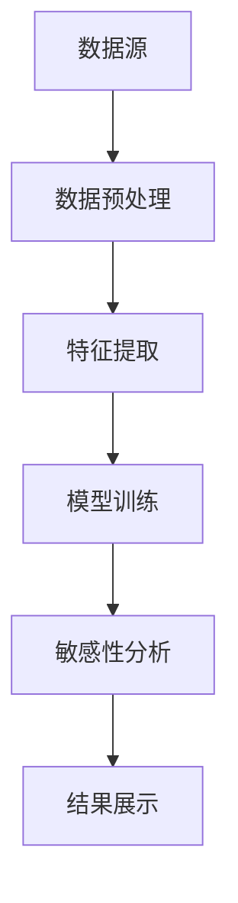
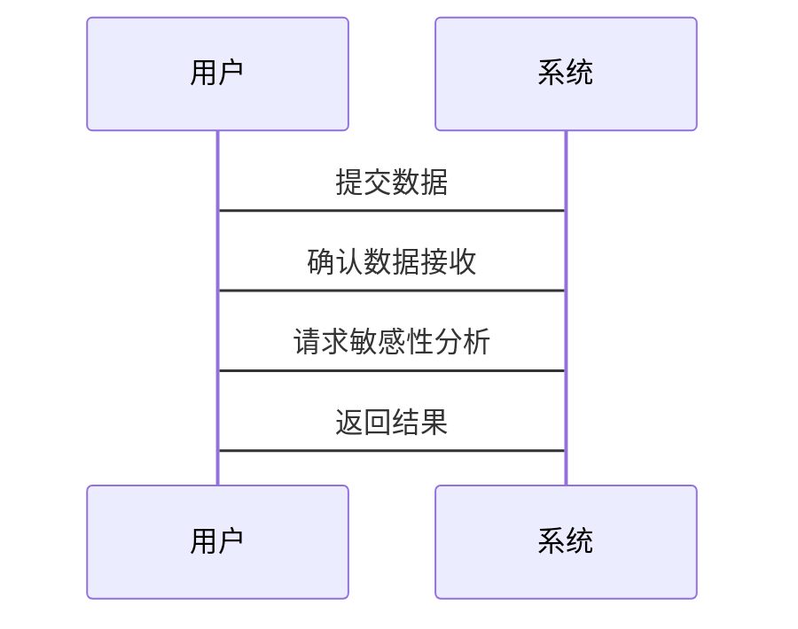

                 


# AI辅助的公司估值敏感性分析

> 关键词：AI辅助，公司估值，敏感性分析，算法原理，系统架构，项目实战

> 摘要：本文探讨了如何利用AI技术辅助公司估值的敏感性分析。首先介绍了敏感性分析的基本概念和其在公司估值中的作用，接着详细讲解了AI在敏感性分析中的应用，包括算法原理、数学模型和系统架构设计。通过实际案例分析，展示了如何利用Python代码实现AI辅助的敏感性分析，并总结了最佳实践和未来的研究方向。

---

## 第一部分：背景与基础

### 第1章：公司估值与敏感性分析的背景

#### 1.1 公司估值的基本概念
公司估值是指通过对公司财务数据、市场表现、行业地位等多方面因素的分析，估算其市场价值的过程。常见的公司估值方法包括DCF模型、EV/EBITDA倍数法和市盈率法等。这些方法通常依赖于对财务数据的分析和对未来现金流的预测。

#### 1.2 敏感性分析的基本概念
敏感性分析是一种评估变量变化对模型输出影响的方法。在公司估值中，敏感性分析可以帮助识别哪些变量对估值结果影响最大，从而帮助投资者制定更稳健的决策。

#### 1.3 AI技术在公司估值中的应用
AI技术，特别是机器学习和深度学习，可以处理大量非结构化数据（如新闻、社交媒体数据）并生成预测模型，从而增强传统估值方法的准确性。

---

### 第2章：敏感性分析的核心概念与原理

#### 2.1 敏感性分析的核心概念
敏感性分析的核心在于识别变量变化对模型输出的影响程度。例如，在公司估值中，敏感性分析可以帮助识别哪些财务指标（如收入增长率、利润率）对估值结果影响最大。

#### 2.2 敏感性分析的方法
敏感性分析的方法包括回归分析法、情景分析法和方差分解法。每种方法都有其优缺点，适用于不同的场景。

#### 2.3 AI在敏感性分析中的应用
AI技术可以用于构建预测模型，并通过自动化分析识别关键变量。例如，可以使用随机森林或神经网络模型来预测变量变化对估值的影响。

---

## 第二部分：算法与模型

### 第3章：敏感性分析的算法原理

#### 3.1 算法概述
敏感性分析的算法通常包括以下步骤：
1. 确定输入变量和输出变量。
2. 分析变量变化对输出的影响。
3. 识别敏感变量。

#### 3.2 基于机器学习的敏感性分析
机器学习模型（如随机森林）可以通过特征重要性分析来识别敏感变量。这种方法比传统方法更高效，且能够处理非线性关系。

#### 3.3 算法实现
以下是基于随机森林的敏感性分析的Python代码示例：

```python
from sklearn.ensemble import RandomForestRegressor
from sklearn.inspection import permutation_importances

# 假设X为输入特征，y为目标变量
model = RandomForestRegressor()
model.fit(X, y)

# 计算特征重要性
importances = model.feature_importances_
```

---

### 第4章：数学模型与公式

#### 4.1 线性回归模型
线性回归模型可以表示为：
$$ y = \beta_0 + \beta_1x_1 + \beta_2x_2 + \ldots + \beta_nx_n + \epsilon $$
其中，$y$ 是目标变量，$x_i$ 是输入变量，$\beta_i$ 是系数，$\epsilon$ 是误差项。

#### 4.2 非线性回归模型
非线性回归模型可以表示为：
$$ y = f(x_1, x_2, \ldots, x_n) $$
其中，$f$ 是非线性函数。

---

## 第三部分：系统架构与实现

### 第5章：系统架构设计

#### 5.1 系统功能设计
系统功能包括数据采集、模型训练、敏感性分析和结果展示。

#### 5.2 系统架构图
以下是系统架构的mermaid图：



---

### 第6章：接口设计与交互流程

#### 6.1 接口设计
系统需要提供以下接口：
- 数据输入接口
- 模型训练接口
- 敏感性分析接口
- 结果展示接口

#### 6.2 交互流程
以下是交互流程的mermaid图：



---

## 第四部分：项目实战与案例分析

### 第7章：项目实战

#### 7.1 环境安装
需要安装以下库：
- Python
- scikit-learn
- pandas
- numpy

#### 7.2 核心代码实现
以下是敏感性分析的核心代码：

```python
import pandas as pd
import numpy as np
from sklearn.ensemble import RandomForestRegressor

# 数据加载
data = pd.read_csv('data.csv')

# 分割特征和目标变量
X = data.drop('target', axis=1)
y = data['target']

# 模型训练
model = RandomForestRegressor()
model.fit(X, y)

# 特征重要性分析
importances = pd.DataFrame({'feature': X.columns, 'importance': model.feature_importances_})
importances = importances.sort_values('importance', ascending=False)
print(importances)
```

---

### 第8章：案例分析

#### 8.1 案例背景
假设我们有一个公司估值的案例，需要分析收入增长率、利润率、市场增长率等变量对估值的影响。

#### 8.2 分析结果
通过敏感性分析，我们发现收入增长率是最重要的变量，其次是利润率。

---

## 第五部分：最佳实践与扩展

### 第9章：最佳实践

#### 9.1 数据预处理的重要性
在进行敏感性分析之前，必须对数据进行预处理，包括缺失值处理、异常值处理和特征标准化。

#### 9.2 模型选择的注意事项
选择合适的模型可以提高分析结果的准确性。随机森林和梯度提升树是常用的选择。

---

### 第10章：未来研究方向

#### 10.1 更复杂的模型
未来可以研究更复杂的模型，如深度学习模型，以提高分析的准确性。

#### 10.2 多因素分析
未来可以研究多因素同时变化对估值的影响，从而更好地反映现实情况。

---

## 作者：AI天才研究院 & 禅与计算机程序设计艺术

