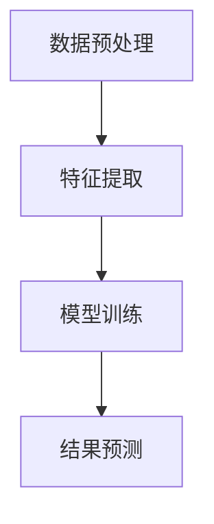
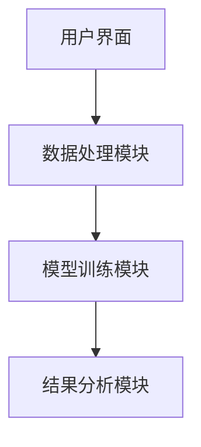
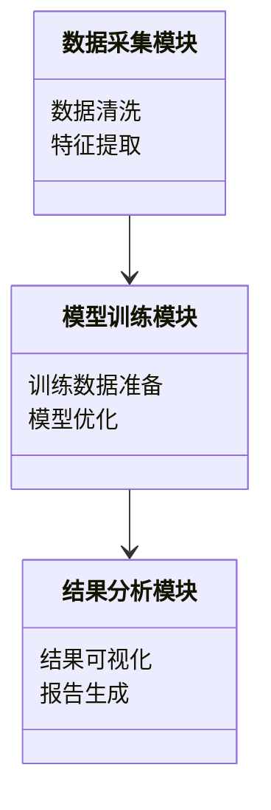
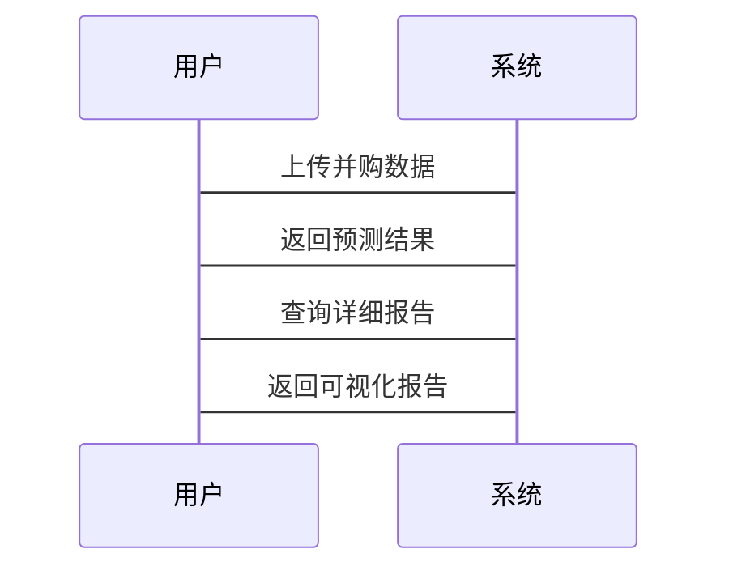

                 


# AI辅助的公司并购整合评估

## 关键词：AI, 公司并购, 整合评估, 机器学习, 自然语言处理

## 摘要：  
随着人工智能技术的快速发展，AI在金融领域的应用越来越广泛。本文详细探讨了AI在公司并购整合评估中的应用，从背景、核心概念到算法原理、系统架构，再到实际案例分析，全面解析了如何利用AI技术提高并购整合评估的效率和准确性。通过本文的分析，读者可以深入了解AI在公司并购中的作用，掌握相关的技术原理和应用方法。

---

## 第一部分: AI辅助的公司并购整合评估概述

### 第1章: 公司并购整合评估的背景与挑战

#### 1.1 公司并购的基本概念
##### 1.1.1 公司并购的定义与类型
公司并购是指一家公司通过购买另一家公司的股权或资产，以实现战略目标的行为。常见的并购类型包括：
- **横向并购**：同一行业内的并购，旨在扩大市场份额。
- **纵向并购**：上下游产业的并购，以增强供应链控制。
- **混合并购**：跨行业并购，以 diversify 业务或开拓新市场。

##### 1.1.2 并购整合的必要性与目标
并购整合的目的是为了实现资源优化配置、提高效率、创造协同效应。整合过程包括：
- **战略规划**：明确整合后的业务目标。
- **组织架构调整**：优化部门结构。
- **文化融合**：确保双方团队的有效协作。

##### 1.1.3 并购整合的常见挑战
- **文化冲突**：整合后的团队可能因文化差异导致合作困难。
- **业务重叠**：如何避免资源浪费和重复工作。
- **风险管理**：如何评估和规避潜在的法律和财务风险。

#### 1.2 AI在公司并购中的应用背景
##### 1.2.1 数据驱动的并购决策趋势
传统并购决策依赖于经验丰富的专家判断，而AI通过分析大量数据，提供更客观、精准的决策支持。

##### 1.2.2 AI技术在金融领域的应用现状
AI已经在金融领域广泛应用于股票预测、风险评估、信用评分等领域。并购整合评估是AI技术的另一个重要应用场景。

##### 1.2.3 并购整合评估中的痛点与解决方案
- **痛点**：传统评估方法耗时长、主观性强、容易遗漏关键风险点。
- **解决方案**：通过AI技术实现自动化数据处理、精准预测和实时监控。

#### 1.3 本章小结
本章介绍了公司并购的基本概念、整合的必要性与目标，以及AI在并购中的应用背景和痛点。接下来的章节将深入探讨AI在并购整合评估中的核心技术和应用方法。

---

### 第2章: AI辅助并购整合评估的核心概念

#### 2.1 并购整合评估的关键要素
##### 2.1.1 企业价值评估
企业价值评估是并购整合中的核心任务，涉及对企业资产、负债、盈利能力等多方面的评估。

##### 2.1.2 并购协同效应
协同效应是并购后企业价值提升的重要来源，包括成本协同、收入协同等。

##### 2.1.3 风险评估与管理
并购过程中可能面临法律风险、财务风险、市场风险等多种风险，需要进行全面评估和管理。

#### 2.2 AI在并购整合中的应用原理
##### 2.2.1 数据驱动的决策模型
AI通过分析历史并购数据，建立预测模型，帮助判断并购后的价值和风险。

##### 2.2.2 机器学习在价值预测中的作用
机器学习算法可以预测并购后的价值变化，帮助制定合理的并购价格。

##### 2.2.3 自然语言处理在文档分析中的应用
自然语言处理技术可以自动分析并购相关的文档（如合同、财务报告），提取关键信息。

#### 2.3 核心概念对比分析
##### 2.3.1 传统并购评估方法与AI方法的对比
- **传统方法**：依赖专家判断，主观性强，效率低。
- **AI方法**：数据驱动，客观精准，效率高。

##### 2.3.2 数据特征与模型性能的关系
数据特征的选取直接影响模型的性能，例如收入增长率、净利润率等关键指标。

##### 2.3.3 不同行业的并购整合评估差异
不同行业的并购评估重点不同，例如科技行业更关注技术创新，而制造业更关注成本控制。

#### 2.4 本章小结
本章详细介绍了并购整合评估的关键要素和AI的应用原理，为后续的算法实现奠定了基础。

---

### 第3章: AI辅助并购整合评估的算法原理

#### 3.1 机器学习在并购评估中的应用
##### 3.1.1 监督学习与非监督学习的对比
- **监督学习**：基于标签数据，用于回归和分类任务。
- **非监督学习**：基于无标签数据，用于聚类和降维任务。

##### 3.1.2 常见算法选择与优化
- **随机森林**：适合处理高维数据，具有较强的抗过拟合能力。
- **神经网络**：适合处理复杂非线性关系，但需要大量数据训练。

##### 3.1.3 案例分析：随机森林在并购价值预测中的应用
```python
import pandas as pd
from sklearn.ensemble import RandomForestRegressor

# 数据加载
data = pd.read_csv('并购数据.csv')

# 特征选择
features = [' revenue', 'net_profit', 'employees']
target = 'merger_value'

# 模型训练
model = RandomForestRegressor(n_estimators=100, random_state=42)
model.fit(data[features], data[target])

# 预测结果
predictions = model.predict(data[features])
```

#### 3.2 自然语言处理在并购文档分析中的应用
##### 3.2.1 文本特征提取与向量化
- 使用TF-IDF或Word2Vec将文本转化为向量表示。

##### 3.2.2 基于BERT的文本相似度计算
- 通过BERT模型计算并购合同文本的相似度，识别潜在风险点。

##### 3.2.3 并购合同风险识别的NLP模型设计
- 使用序列标注模型识别合同中的关键条款，如违约责任、知识产权等。

#### 3.3 算法实现与优化
##### 3.3.1 算法流程图（Mermaid）


##### 3.3.2 代码实现示例
```python
import pandas as pd
from sklearn.ensemble import RandomForestRegressor

# 数据加载
data = pd.read_csv('并购数据.csv')

# 特征选择
features = [' revenue', 'net_profit', 'employees']
target = 'merger_value'

# 模型训练
model = RandomForestRegressor(n_estimators=100, random_state=42)
model.fit(data[features], data[target])

# 预测结果
predictions = model.predict(data[features])
```

#### 3.4 本章小结
本章详细介绍了机器学习和自然语言处理在并购评估中的应用，重点讲解了随机森林算法和BERT模型的实现方法。

---

### 第4章: 系统架构与设计

#### 4.1 系统功能模块划分
##### 4.1.1 数据采集与处理模块
- 数据清洗、特征提取、数据存储。

##### 4.1.2 模型训练与部署模块
- 模型训练、参数优化、模型部署。

##### 4.1.3 结果分析与可视化模块
- 结果展示、可视化分析、报告生成。

#### 4.2 系统架构设计（Mermaid）


#### 4.3 系统功能设计（Mermaid）


#### 4.4 系统接口设计
- API接口设计：RESTful API，支持数据上传、模型调用、结果查询。

#### 4.5 系统交互设计（Mermaid）


#### 4.6 本章小结
本章详细介绍了AI辅助并购整合评估系统的架构设计和功能模块划分，为后续的系统实现奠定了基础。

---

### 第5章: 项目实战与案例分析

#### 5.1 项目背景与目标
##### 5.1.1 项目背景
- 某中型企业的跨国并购项目，需要评估整合后的价值和风险。

##### 5.1.2 项目目标
- 利用AI技术实现并购后的价值预测和风险评估。

#### 5.2 环境配置与数据准备
##### 5.2.1 环境配置
- 安装Python、Pandas、Scikit-learn、BERT库。

##### 5.2.2 数据准备
- 数据清洗、特征工程、数据存储。

#### 5.3 系统核心实现
##### 5.3.1 数据采集模块实现
```python
import pandas as pd

# 数据加载
data = pd.read_csv('并购数据.csv')

# 数据清洗
data.dropna(inplace=True)
data[' revenue'] = data[' revenue'].apply(lambda x: x.strip())
```

##### 5.3.2 模型训练模块实现
```python
from sklearn.ensemble import RandomForestRegressor

# 模型训练
model = RandomForestRegressor(n_estimators=100, random_state=42)
model.fit(X_train, y_train)
```

##### 5.3.3 结果分析模块实现
```python
import matplotlib.pyplot as plt

# 结果可视化
plt.scatter(y_true, y_pred)
plt.xlabel('真实值')
plt.ylabel('预测值')
plt.show()
```

#### 5.4 案例分析与结果解读
##### 5.4.1 案例分析
- 并购后的价值预测结果：预测值与真实值的对比。

##### 5.4.2 结果解读
- 模型预测的准确性：R²系数、均方误差等指标。

#### 5.5 本章小结
本章通过一个实际案例，详细讲解了AI辅助并购整合评估系统的实现过程和结果解读。

---

### 第6章: 总结与展望

#### 6.1 本章总结
本文详细探讨了AI在公司并购整合评估中的应用，从背景、核心概念到算法原理、系统架构，再到实际案例分析，全面解析了如何利用AI技术提高并购整合评估的效率和准确性。

#### 6.2 未来展望
- **技术优化**：进一步优化模型，提高预测精度。
- **应用场景扩展**：探索AI在其他领域的应用，如企业风险管理、战略规划等。
- **工具与平台开发**：开发更多AI辅助决策工具，降低技术门槛。

#### 6.3 注意事项
- 数据隐私和安全问题：确保数据处理过程中的隐私保护。
- 模型的可解释性：确保模型结果的可解释性，便于业务人员理解。

#### 6.4 拓展阅读
- 推荐阅读《机器学习实战》、《自然语言处理入门》等书籍，深入了解相关技术。

---

## 作者：AI天才研究院/AI Genius Institute & 禅与计算机程序设计艺术 /Zen And The Art of Computer Programming

