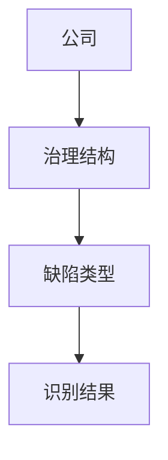
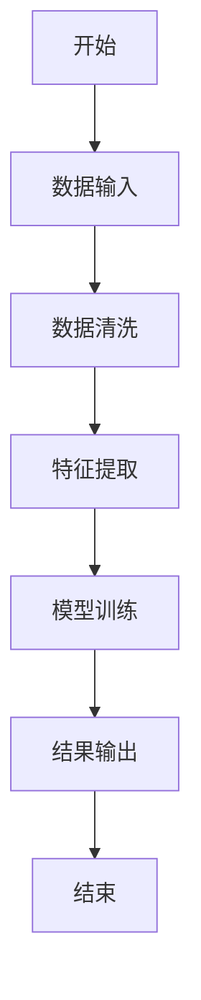
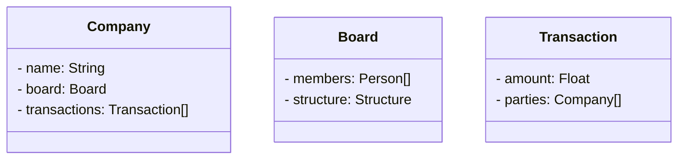
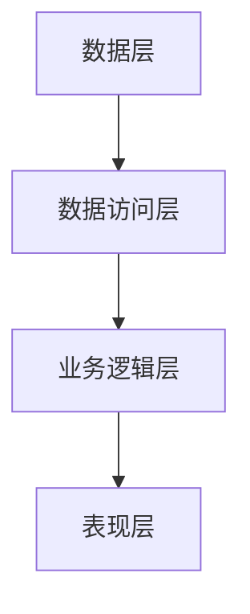
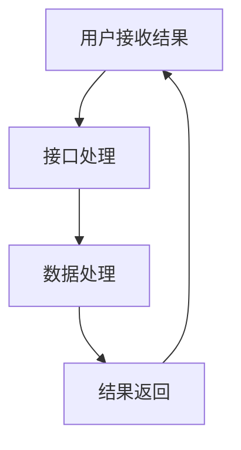

                 


# AI辅助的公司治理缺陷识别系统

> **关键词**：公司治理，缺陷识别，人工智能，系统架构，算法原理

> **摘要**：  
本文探讨了AI技术在公司治理缺陷识别中的应用，系统地介绍了从背景分析、核心概念、算法原理到系统架构设计的全过程。通过详细讲解AI辅助系统的原理、实现方法以及实际案例，本文旨在为公司治理缺陷识别提供一种高效、智能化的解决方案，帮助企业识别潜在问题并优化治理结构。

---

## 第一部分：公司治理缺陷识别的背景与挑战

### 第1章：公司治理缺陷识别的背景与挑战

#### 1.1 问题背景

**1.1.1 公司治理的基本概念**  
公司治理是确保公司有效运作、合规经营并实现长期价值的管理过程。它涉及董事会、高管、股东及其他利益相关者的角色与责任分配。

**1.1.2 公司治理中的常见缺陷**  
公司治理缺陷可能包括董事会结构不合理、关联交易不透明、内部控制失效、合规性不足等问题。这些问题可能导致公司运营效率低下、财务风险增加，甚至引发法律纠纷。

**1.1.3 传统公司治理缺陷识别的局限性**  
传统的缺陷识别方法依赖人工审核，耗时长、效率低，且容易受到主观因素影响，难以全面覆盖复杂的治理问题。

#### 1.2 问题描述

**1.2.1 公司治理缺陷识别的核心目标**  
通过技术手段快速、准确地识别公司治理中的潜在缺陷，帮助公司优化治理结构，降低经营风险。

**1.2.2 缺陷识别的关键维度**  
包括董事会结构、关联交易、内部控制、合规性、信息披露等多个维度。

**1.2.3 识别缺陷的复杂性与挑战**  
治理缺陷的识别需要多维度的数据分析，涉及法律、财务、管理等多方面的知识，且不同公司的情况差异较大。

#### 1.3 问题解决的思路

**1.3.1 引入AI技术的必要性**  
AI技术能够通过大数据分析和机器学习模型，快速识别潜在的治理缺陷，提高识别效率和准确性。

**1.3.2 AI在公司治理缺陷识别中的优势**  
AI能够处理海量数据，发现隐藏的模式和关联，帮助识别传统方法难以察觉的问题。

**1.3.3 系统化解决方案的构建**  
构建一个基于AI的公司治理缺陷识别系统，整合多源数据，利用机器学习模型进行预测和分析，提供智能化的解决方案。

#### 1.4 系统的边界与外延

**1.4.1 系统功能的边界**  
系统专注于识别公司治理缺陷，不涉及具体的整改建议或执行操作。

**1.4.2 系统应用的范围**  
适用于上市公司、大型企业以及需要合规性审查的企业。

**1.4.3 系统与其他模块的交互关系**  
系统可与其他企业管理系统（如ERP、CRM）集成，提供全面的企业管理解决方案。

#### 1.5 核心概念与组成要素

**1.5.1 系统的核心组成**  
包括数据采集模块、模型训练模块、结果输出模块和用户交互界面。

**1.5.2 各组成要素的定义与关系**  
数据采集模块负责获取企业相关信息；模型训练模块利用机器学习算法进行缺陷识别；结果输出模块将识别结果以可视化形式呈现。

**1.5.3 系统的整体架构**  
系统采用模块化设计，各模块协同工作，确保高效、准确的缺陷识别。

---

## 第二部分：AI辅助公司治理缺陷识别的核心概念与联系

### 第2章：AI辅助系统的核心原理

#### 2.1 核心概念的原理分析

**2.1.1 数据驱动的缺陷识别**  
通过收集和分析企业的多源数据，利用大数据技术识别潜在的治理缺陷。

**2.1.2 模型驱动的缺陷预测**  
基于机器学习模型，预测企业可能存在的治理缺陷，并提供风险评估。

**2.1.3 结果反馈的优化机制**  
根据识别结果优化模型，提升识别准确率和效率。

#### 2.2 核心概念的属性特征对比

**2.2.1 数据特征对比表**  
| 数据特征 | 传统方法 | AI方法 |
|----------|----------|--------|
| 数据来源 | 单一 | 多源 |
| 数据量   | 小 | 大 |
| 数据处理 | 人工 | 自动 |

**2.2.2 模型特征对比表**  
| 模型特征 | 传统方法 | AI方法 |
|----------|----------|--------|
| 模型类型 | 统计模型 | 机器学习模型 |
| 模型复杂度 | 简单 | 复杂 |
| 模型更新 | 手动 | 自动 |

**2.2.3 结果特征对比表**  
| 结果特征 | 传统方法 | AI方法 |
|----------|----------|--------|
| 结果精度 | 低 | 高 |
| 结果覆盖范围 | 有限 | 全面 |

#### 2.3 ER实体关系图



---

## 第三部分：AI辅助公司治理缺陷识别的算法原理

### 第3章：算法原理与实现

#### 3.1 算法原理

**3.1.1 数据预处理**  
对收集的企业数据进行清洗、标准化和特征提取，确保数据质量。

**3.1.2 特征提取**  
从企业数据中提取关键特征，如董事会结构、关联交易金额等。

**3.1.3 模型训练**  
使用监督学习算法（如随机森林、支持向量机）训练分类模型，识别治理缺陷。

**3.1.4 结果输出**  
将模型预测结果输出，标记潜在的治理缺陷。

#### 3.2 算法流程图



#### 3.3 数学模型与公式

**3.3.1 损失函数**  
用于评估模型预测结果与实际结果的差异：

$$ L = -\frac{1}{N}\sum_{i=1}^{N} y_i \log(p_i) + (1 - y_i) \log(1 - p_i) $$

其中，$L$是损失函数，$N$是样本数量，$y_i$是真实标签，$p_i$是预测概率。

---

## 第四部分：AI辅助公司治理缺陷识别的系统分析与架构设计

### 第4章：系统分析与架构设计

#### 4.1 问题场景介绍

**4.1.1 系统需求分析**  
系统需要处理海量企业数据，支持多维度的缺陷识别，并提供实时的反馈结果。

**4.1.2 项目介绍**  
本项目旨在开发一个基于AI的公司治理缺陷识别系统，帮助企业优化治理结构。

#### 4.2 系统功能设计

**4.2.1 领域模型类图**



#### 4.3 系统架构设计

**4.3.1 分层架构图**



#### 4.4 系统接口设计

**4.4.1 接口描述**  
系统提供API接口，供外部系统调用缺陷识别结果。

**4.4.2 接口交互流程图**



---

## 第五部分：AI辅助公司治理缺陷识别的项目实战

### 第5章：项目实战

#### 5.1 环境安装

**5.1.1 安装Python环境**  
安装Python 3.8及以上版本，并配置虚拟环境。

**5.1.2 安装依赖库**  
安装numpy、pandas、scikit-learn等库：

```bash
pip install numpy pandas scikit-learn
```

#### 5.2 系统核心实现源代码

**5.2.1 数据预处理代码**

```python
import pandas as pd

# 加载数据
data = pd.read_csv('corporate_data.csv')

# 清洗数据
data.dropna(inplace=True)

# 特征提取
features = data[['board_size', '关联交易金额', '内部控制评分']]
labels = data['缺陷类型']
```

**5.2.2 模型训练代码**

```python
from sklearn.model import RandomForestClassifier

# 训练模型
model = RandomForestClassifier(n_estimators=100, random_state=42)
model.fit(features, labels)

# 预测结果
predictions = model.predict(features)
```

#### 5.3 实际案例分析

**5.3.1 案例介绍**  
某上市公司董事会结构不合理，导致关联交易频繁，存在较大的治理缺陷风险。

**5.3.2 模型分析**  
模型预测该企业存在董事会结构缺陷和关联交易风险。

**5.3.3 结果解读**  
识别出董事会结构和关联交易是主要缺陷，企业需要优化董事会结构并加强关联交易管理。

#### 5.4 项目小结

通过实际案例分析，验证了系统的有效性和准确性。模型能够准确识别公司治理缺陷，为企业优化治理结构提供有力支持。

---

## 第六部分：AI辅助公司治理缺陷识别的最佳实践

### 第6章：最佳实践

#### 6.1 实用小结

**6.1.1 数据质量的重要性**  
高质量的数据是模型准确性的基础，需确保数据的完整性和准确性。

**6.1.2 模型调优的建议**  
定期更新模型，优化算法参数，提升识别准确率。

#### 6.2 注意事项

**6.2.1 数据隐私保护**  
确保企业数据的安全性，遵守相关法律法规。

**6.2.2 模型的可解释性**  
选择具有较高可解释性的模型，便于理解和优化。

#### 6.3 拓展阅读

**6.3.1 推荐书籍**  
《企业风险管理：工具与方法》、《机器学习实战》。

**6.3.2 在线资源**  
Coursera上的“公司治理”课程、Kaggle上的机器学习项目。

---

## 作者：AI天才研究院 & 禅与计算机程序设计艺术

---

通过以上结构，本文系统地介绍了AI辅助公司治理缺陷识别的背景、核心概念、算法原理、系统架构以及实际应用。希望本文能够为企业的治理优化和风险管理提供有价值的参考。

