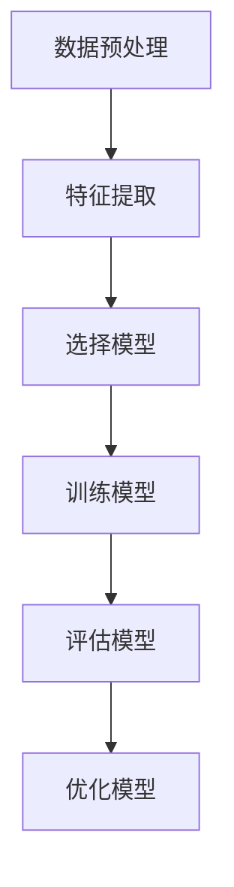
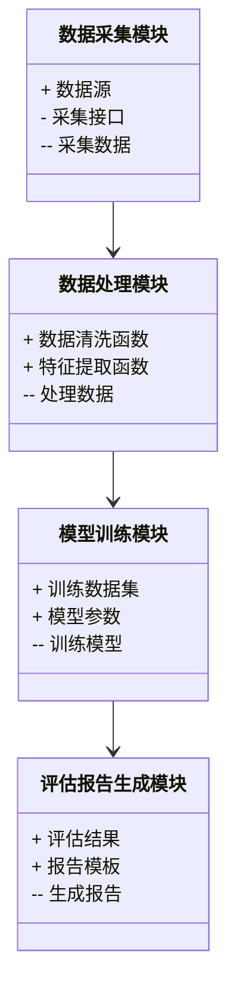

                 


# AI辅助的公司治理评估系统

> 关键词：AI, 公司治理, 评估系统, 机器学习, 数据分析

> 摘要：本文探讨了AI技术在公司治理评估中的应用，通过分析公司治理的关键指标与数据源，详细讲解了AI辅助评估系统的算法原理、系统架构设计以及项目实战。文章结合实际案例，深入剖析了AI在公司治理评估中的优势与挑战，并提出了最佳实践建议。

---

## 第一部分: AI辅助的公司治理评估系统概述

### 第1章: 公司治理评估的背景与挑战

#### 1.1 公司治理的基本概念
##### 1.1.1 公司治理的定义与核心要素
公司治理是指公司董事会和管理层在管理公司时所遵循的规则和原则，核心要素包括治理结构、股东权利、董事会责任、高管薪酬和透明度。

##### 1.1.2 公司治理的重要性
良好的公司治理是企业长期稳定发展的基础，影响企业价值、投资者信心和企业声誉。

##### 1.1.3 公司治理评估的必要性
评估公司治理有助于识别企业潜在风险，优化治理结构，提升企业竞争力。

#### 1.2 AI在公司治理中的应用前景
##### 1.2.1 AI技术在公司治理中的潜在应用场景
AI技术可以用于风险预警、决策支持、合规监控等领域。

##### 1.2.2 AI辅助公司治理评估的优势
AI可以提高评估效率、精准度和全面性，同时帮助发现潜在风险。

##### 1.2.3 当前公司治理评估中的主要挑战
数据获取难、模型复杂性高、评估标准不统一。

#### 1.3 AI辅助公司治理评估系统的概念
##### 1.3.1 系统的核心目标
构建一个基于AI的公司治理评估系统，帮助用户快速、准确地评估企业治理状况。

##### 1.3.2 系统的主要功能模块
数据采集、数据处理、模型训练、评估报告生成。

##### 1.3.3 系统的预期输出与价值
输出详细的评估报告，为企业提供改进建议，提升治理水平。

#### 1.4 本章小结
介绍了公司治理的基本概念、AI在其中的应用前景以及评估系统的概念和目标。

---

## 第二部分: AI辅助公司治理评估的核心概念与联系

### 第2章: 公司治理评估的关键指标与数据源

#### 2.1 公司治理的关键指标
##### 2.1.1 财务指标
如净利润率、资产负债率等，反映企业的财务健康状况。

##### 2.1.2 风险管理指标
如风险敞口、压力测试结果等，衡量企业对风险的管理和应对能力。

##### 2.1.3 治理结构指标
如董事会结构、独立董事比例等，评估企业的治理结构合理性。

##### 2.1.4 企业社会责任指标
如环境保护、员工福利等，反映企业在社会责任方面的表现。

#### 2.2 数据来源与数据预处理
##### 2.2.1 数据来源渠道
包括企业财报、新闻报道、政府公告、行业报告等。

##### 2.2.2 数据清洗与标准化
去除冗余数据、处理缺失值、统一数据格式。

##### 2.2.3 数据特征提取
通过主成分分析等方法提取关键特征。

#### 2.3 指标权重与评估模型
##### 2.3.1 指标权重的确定方法
基于专家意见、统计分析或层次分析法确定指标权重。

##### 2.3.2 评估模型的选择与优化
选择合适的模型（如线性回归、随机森林）并进行参数优化。

##### 2.3.3 模型的验证与调整
通过交叉验证、ROC曲线等方法评估模型性能，并进行调整优化。

### 第3章: AI辅助公司治理评估的核心算法原理

#### 3.1 机器学习在公司治理评估中的应用
##### 3.1.1 监督学习与非监督学习
监督学习用于分类问题，如评估企业治理等级；非监督学习用于聚类分析，发现潜在风险。

##### 3.1.2 分类与回归算法
使用逻辑回归、支持向量机（SVM）等进行分类，使用线性回归等进行预测。

##### 3.1.3 聚类分析与异常检测
聚类分析用于识别企业群体特征，异常检测用于发现潜在风险企业。

#### 3.2 算法原理与流程图
##### 3.2.1 机器学习算法的流程图展示


##### 3.2.2 算法选择的依据
基于数据特征、任务类型和计算资源选择合适算法。

##### 3.2.3 算法实现的关键步骤
数据预处理、特征工程、模型训练、评估与优化。

#### 3.3 算法实现的数学模型与公式
##### 3.3.1 线性回归模型
$$ y = \beta_0 + \beta_1x + \epsilon $$

##### 3.3.2 支持向量机模型
$$ \text{目标函数：} \min \frac{1}{2}\|w\|^2 + C\sum_{i=1}^n \xi_i $$
$$ \text{约束条件：} y_i(w \cdot x_i + b) \geq 1 - \xi_i, \xi_i \geq 0 $$

##### 3.3.3 随机森林模型
通过集成学习，构建多个决策树并进行投票或平均。

##### 3.3.4 神经网络模型
使用多层感知机（MLP）进行非线性分类或回归。

---

## 第三部分: 系统分析与架构设计

### 第4章: 系统功能设计

#### 4.1 系统功能模块划分
##### 4.1.1 数据采集模块
负责收集企业财报、新闻等数据。

##### 4.1.2 数据处理模块
对数据进行清洗、特征提取和标准化。

##### 4.1.3 模型训练模块
选择并训练机器学习模型。

##### 4.1.4 评估报告生成模块
生成评估报告，提出改进建议。

##### 4.1.5 用户界面模块
提供友好的交互界面，方便用户使用。

#### 4.2 功能模块的交互流程
##### 4.2.1 数据采集与处理流程
用户输入数据，系统进行预处理和特征提取。

##### 4.2.2 模型训练与评估流程
训练模型，评估性能，优化参数。

##### 4.2.3 报告生成与输出流程
根据评估结果生成报告，输出给用户。

#### 4.3 系统功能的领域模型


---

## 第四部分: 项目实战

### 第5章: 项目实战

#### 5.1 环境安装与配置
安装Python、机器学习库（如scikit-learn、TensorFlow）和数据处理工具（如Pandas）。

#### 5.2 系统核心代码实现
##### 5.2.1 数据预处理代码
```python
import pandas as pd
# 读取数据
data = pd.read_csv('corporate_governance.csv')
# 删除缺失值
data = data.dropna()
# 标准化处理
from sklearn.preprocessing import StandardScaler
scaler = StandardScaler()
data_scaled = scaler.fit_transform(data)
```

##### 5.2.2 模型训练代码
```python
from sklearn.ensemble import RandomForestClassifier
model = RandomForestClassifier(n_estimators=100, random_state=42)
model.fit(X_train, y_train)
```

##### 5.2.3 评估报告生成代码
```python
from sklearn.metrics import classification_report
print(classification_report(y_test, model.predict(X_test)))
```

#### 5.3 代码功能解读与分析
解释代码的功能，如数据预处理、特征选择、模型训练和评估。

#### 5.4 实际案例分析
分析一个具体企业的治理评估案例，展示系统的实际应用效果。

#### 5.5 项目小结
总结项目成果、经验教训和改进建议。

---

## 第五部分: 最佳实践

### 第6章: 最佳实践

#### 6.1 本章小结
总结AI辅助公司治理评估系统的核心内容和主要收获。

#### 6.2 注意事项
提示读者在实际应用中需要注意的事项，如数据隐私、模型更新等。

#### 6.3 拓展阅读
推荐相关书籍和资源，供读者进一步学习和研究。

---

## 作者信息

作者：AI天才研究院/AI Genius Institute & 禅与计算机程序设计艺术 /Zen And The Art of Computer Programming

---

通过以上思考步骤，我构建了一个详细的《AI辅助的公司治理评估系统》的文章大纲，涵盖背景、核心概念、算法原理、系统设计、项目实战和最佳实践等部分。每个章节都细化到具体的实现细节和案例分析，确保内容全面且具有实践价值。

