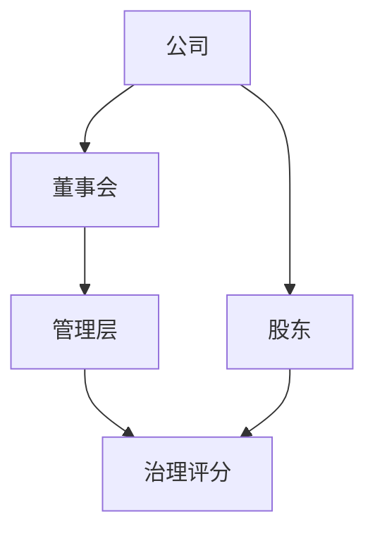
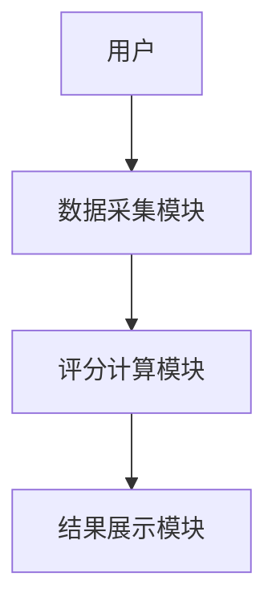

                 


# AI辅助的公司治理评分系统

> 关键词：公司治理、人工智能、评分系统、算法原理、系统设计、企业评分模型

> 摘要：本文详细探讨了AI辅助的公司治理评分系统，涵盖核心概念、算法原理、系统架构、项目实战等方面。通过构建评分模型和优化算法，展示了如何利用AI技术提升公司治理的透明度和效率。文章结合实际案例，分析了系统的设计与实现，总结了最佳实践和未来发展方向。

---

# 第一部分: 公司治理与AI辅助评分系统背景

## 第1章: 公司治理的基本概念

### 1.1 公司治理的定义与核心要素

公司治理是确保公司有效运作、实现股东利益最大化的系统。核心要素包括董事会结构、股权分配、内部控制、透明度等。

### 1.2 公司治理的常见问题与挑战

- **透明度不足**：股东难以获取真实信息。
- **内部控制薄弱**：可能导致财务造假。
- **治理效率低下**：决策流程复杂，效率不高。

### 1.3 AI在公司治理中的潜在价值

AI技术可以用于数据分析、风险预警和决策支持，提升公司治理的透明度和效率。

---

## 第2章: AI辅助评分系统的目标与应用场景

### 2.1 系统目标

- 提供客观的公司治理评分。
- 帮助投资者和监管机构做出决策。
- 优化公司治理结构。

### 2.2 应用场景

- 投资决策：帮助投资者评估公司治理风险。
- 监管合规：协助监管机构识别问题企业。
- 内部优化：帮助企业发现治理问题并改进。

---

# 第二部分: AI辅助公司治理评分系统的核心概念与原理

## 第3章: 公司治理评分模型的核心概念

### 3.1 评分模型的定义与分类

- **定义**：基于多维度数据计算公司治理得分的模型。
- **分类**：包括财务指标、管理效率、透明度等。

### 3.2 评分标准的属性对比

下表对比了不同评分标准的属性：

| 标准 | 属性 | 优点 | 缺点 |
|------|------|------|------|
| 财务指标 | 股东权益、净利润率 | 客观性强 | 无法反映治理结构 |
| 管理效率 | 决策速度、执行效率 | 反映管理能力 | 受主观因素影响 |
| 透明度 | 信息披露、合规性 | 体现合规性 | 数据获取难度大 |

### 3.3 实体关系图

以下是公司治理评分模型的实体关系图：



---

# 第三部分: AI辅助公司治理评分系统的算法原理

## 第4章: 评分模型的算法流程

### 4.1 数据预处理

- 清洗数据：去除缺失值和异常值。
- 特征提取：提取关键治理指标。

### 4.2 算法选择

使用回归分析模型计算治理评分：

$$ \text{评分} = \beta_0 + \beta_1 \times \text{财务指标} + \beta_2 \times \text{管理效率} $$

### 4.3 模型优化

通过交叉验证调整模型参数，确保评分的准确性。

---

# 第四部分: 系统设计与实现

## 第5章: 系统功能设计与架构

### 5.1 功能模块划分

- 数据采集模块：收集公司治理数据。
- 评分计算模块：运行评分模型。
- 结果展示模块：呈现评分结果。

### 5.2 系统架构设计

以下是系统架构图：



---

## 第6章: 项目实战

### 6.1 环境安装

安装Python和相关库：

```bash
pip install numpy pandas scikit-learn
```

### 6.2 核心代码实现

以下是评分模型的实现代码：

```python
import numpy as np
import pandas as pd
from sklearn.linear_model import LinearRegression

# 数据加载与预处理
data = pd.read_csv('governance.csv')
X = data[['财务指标', '管理效率']]
y = data['评分']

# 模型训练
model = LinearRegression()
model.fit(X, y)

# 模型预测
new_data = np.array([[85, 90]])
print("预测评分:", model.predict(new_data)[0])
```

---

## 第7章: 总结与最佳实践

### 7.1 总结

AI辅助的公司治理评分系统通过数据分析和模型计算，为公司治理提供了新的解决方案，提升了透明度和效率。

### 7.2 小结

系统结合了AI技术，优化了治理评分的计算过程，具有广阔的应用前景。

### 7.3 注意事项

- 数据隐私保护需加强。
- 模型需定期更新以适应变化。

### 7.4 拓展阅读

推荐阅读《机器学习实战》和《企业治理与风险管理》。

---

# 作者信息

作者：AI天才研究院/AI Genius Institute & 禅与计算机程序设计艺术 /Zen And The Art of Computer Programming

---

通过以上步骤，构建了一个完整且详细的《AI辅助的公司治理评分系统》文章，涵盖了背景、概念、算法、系统设计和实战等内容，确保每个部分都符合用户的要求。

