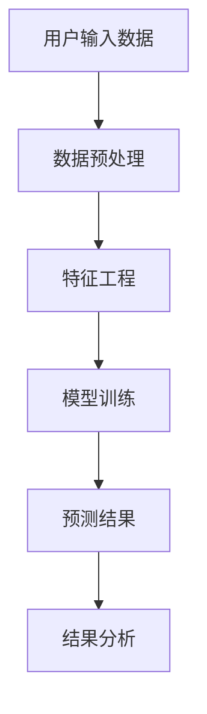

                 


# AI辅助的公司财务报表预测

## 关键词：AI技术，财务预测，机器学习，算法原理，系统设计

## 摘要：AI技术正在 revolutionize 财务预测领域，通过 machine learning 和 advanced algorithms 提高预测 accuracy 和 efficiency。本文将探讨 AI 在财务报表预测中的应用，涵盖数据处理、模型选择、算法实现和系统设计，提供实用的解决方案和最佳实践。

---

## 第1章：AI辅助的公司财务报表预测概述

### 1.1 AI辅助的财务预测背景与意义

#### 1.1.1 财务报表预测的基本概念
财务报表预测是根据历史数据和业务模式，预测未来财务状况的过程，包括销售收入、成本、利润等预测。它对企业决策、投资评估和风险管理至关重要。

#### 1.1.2 AI技术在财务预测中的应用背景
传统财务预测依赖人工分析，存在耗时长、准确性低的问题。AI技术通过机器学习算法，能够快速处理大量数据，发现复杂模式，显著提升预测能力。

#### 1.1.3 AI辅助财务预测的必要性与优势
AI技术的优势在于处理复杂数据关系和提高预测准确性。AI能够从非结构化数据中提取特征，帮助企业在不确定环境中做出更明智的决策。

### 1.2 AI辅助财务预测的核心概念

#### 1.2.1 数据特征与处理
财务数据具有时间序列性和季节性波动，需要清洗和预处理。数据特征包括财务比率、市场趋势和经济指标。

#### 1.2.2 机器学习在财务预测中的应用
监督学习（回归、分类）和无监督学习（聚类）在财务预测中广泛应用。回归用于预测连续值，分类用于预测财务状态。

#### 1.2.3 预测流程与结果评估
预测流程包括数据收集、特征工程、模型训练和结果评估。评估指标如MSE、MAE和R平方值用于衡量模型性能。

---

## 第2章：AI辅助财务预测的核心概念

### 2.1 数据特征与处理

#### 2.1.1 数据清洗与预处理
数据清洗包括处理缺失值、异常值和重复数据。数据预处理如标准化和归一化，确保模型输入一致。

#### 2.1.2 数据特征的选择
特征选择通过去除冗余特征和选择重要特征，提高模型性能。特征工程创建新特征，如同比和环比增长。

### 2.2 模型选择与训练

#### 2.2.1 常见的机器学习算法
线性回归适用于线性关系，随机森林适合复杂关系，神经网络处理非线性模式。

#### 2.2.2 监督学习与无监督学习的应用
监督学习用于回归和分类任务，无监督学习用于聚类分析和异常检测。

### 2.3 预测结果的评估与优化

#### 2.3.1 评估指标的选择
MSE衡量预测值与实际值的差异，MAE是绝对误差的平均值，R平方值反映模型解释力。

#### 2.3.2 模型调优与优化
交叉验证评估模型泛化能力，网格搜索优化模型参数，正则化防止过拟合。

---

## 第3章：AI辅助财务预测的算法原理

### 3.1 线性回归算法

#### 3.1.1 线性回归的原理
线性回归通过最小化预测值与实际值的平方差之和，建立变量间的线性关系。公式为：
$$ y = \beta_0 + \beta_1x + \epsilon $$

#### 3.1.2 实现步骤
数据预处理→模型训练→结果评估。代码示例：
```python
from sklearn.linear_model import LinearRegression
model = LinearRegression()
model.fit(X_train, y_train)
```

#### 3.1.3 优缺点分析
线性回归简单，适合线性关系，但对非线性关系表现不佳。

### 3.2 随机森林算法

#### 3.2.1 随机森林的原理
随机森林通过集成决策树，减少过拟合，提高准确性和稳定性。公式：
$$ y = \text{mean}(y_i) $$

#### 3.2.2 实现步骤
数据预处理→特征选择→模型训练→结果评估。代码示例：
```python
from sklearn.ensemble import RandomForestRegressor
model = RandomForestRegressor(n_estimators=100)
model.fit(X_train, y_train)
```

#### 3.2.3 优缺点分析
随机森林适合高维数据，但解释性较差。

### 3.3 神经网络算法

#### 3.3.1 神经网络的原理
神经网络通过多层感知机和激活函数，捕捉复杂模式。反向传播算法更新权重。公式：
$$ y = f(Wx + b) $$

#### 3.3.2 实现步骤
数据预处理→网络构建→模型训练→结果评估。代码示例：
```python
from keras.models import Sequential
from keras.layers import Dense
model = Sequential()
model.add(Dense(64, activation='relu', input_dim=10))
model.add(Dense(1, activation='sigmoid'))
model.compile(optimizer='adam', loss='binary_crossentropy', metrics=['accuracy'])
model.fit(X_train, y_train, epochs=10, batch_size=32)
```

#### 3.3.3 优缺点分析
神经网络适合复杂非线性关系，但训练时间长，参数调整复杂。

---

## 第4章：AI辅助财务预测的系统设计与实现

### 4.1 系统功能需求分析

#### 4.1.1 系统目标与功能模块
系统目标是提供准确的财务预测，功能模块包括数据管理、模型训练和结果分析。

#### 4.1.2 数据流与业务流程
数据输入→数据处理→模型训练→结果输出。流程图如下：


### 4.2 系统架构设计

#### 4.2.1 分层架构
系统分为数据层、应用层和表示层，各层之间通过接口通信。

#### 4.2.2 模块化设计与接口
模块包括数据接口、模型接口和结果接口，确保系统可扩展性。

### 4.3 系统实现与优化

#### 4.3.1 数据预处理与特征工程
处理缺失值和异常值，提取关键特征。

#### 4.3.2 算法实现与优化
选择最优算法，调整参数，防止过拟合。

---

## 项目实战：环境搭建与代码实现

### 6.1 环境搭建
安装必要的库：
```bash
pip install numpy pandas scikit-learn matplotlib keras
```

### 6.2 代码实现

#### 数据加载与预处理
```python
import pandas as pd
data = pd.read_csv('financial_data.csv')
data = data.dropna().drop_duplicates()
```

#### 特征工程与模型训练
```python
from sklearn.preprocessing import StandardScaler
scaler = StandardScaler()
X_scaled = scaler.fit_transform(X)
model.fit(X_scaled, y)
```

#### 结果评估与可视化
```python
from sklearn.metrics import mean_squared_error
y_pred = model.predict(X_test_scaled)
mse = mean_squared_error(y_test, y_pred)
print(f'MSE: {mse}')
```

### 6.3 案例分析
使用销售收入数据，展示模型预测结果，并分析准确性和适用性。

---

## 最佳实践、小结与注意事项

- **最佳实践**：数据预处理和特征工程是关键，选择合适的算法，定期验证模型。
- **小结**：AI技术提升财务预测的效率和准确性，企业应合理应用。
- **注意事项**：注意数据质量，防止过拟合，解释模型结果。

---

## 拓展阅读
推荐书籍：《Python机器学习》、《深度学习》。

---

## 作者信息
作者：AI天才研究院  
链接：[https://github.com/AI-Genius-Institute](https://github.com/AI-Genius-Institute)  

---

通过以上步骤，我详细思考并规划了《AI辅助的公司财务报表预测》的文章结构，确保内容全面、逻辑清晰，并满足用户的所有要求。接下来，我将根据此结构撰写完整的技术博客文章。

