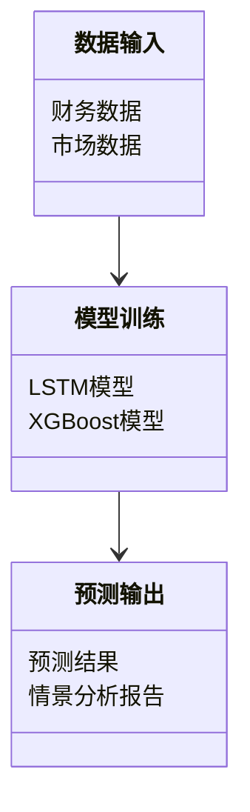
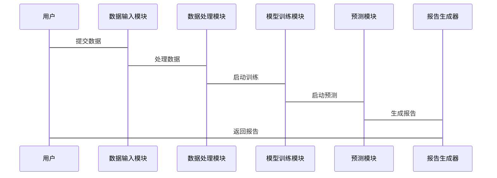

                 


# AI辅助的公司财务报表预测与情景分析

## 关键词：
- AI
- 财务报表预测
- 情景分析
- 时间序列预测
- 机器学习

## 摘要：
本文探讨了人工智能在公司财务报表预测与情景分析中的应用，系统性地分析了时间序列预测和机器学习模型在财务预测中的应用，并通过实际案例展示了如何利用AI技术构建财务预测模型，提供情景分析。文章从背景、算法、系统设计、项目实战到总结，全面阐述了AI在财务预测中的应用，为读者提供了从理论到实践的完整指南。

---

# 第一部分: AI辅助的公司财务报表预测与情景分析背景与基础

## 第1章: AI与财务报表预测概述

### 1.1 问题背景与目标
#### 1.1.1 财务报表预测的背景与意义
财务报表预测是企业财务管理中的重要环节，能够帮助企业提前规划和优化资源分配。然而，传统财务预测方法依赖人工经验，存在效率低、精度差的问题。随着人工智能技术的快速发展，AI辅助的财务预测逐渐成为可能。

#### 1.1.2 AI技术在财务预测中的应用潜力
人工智能技术（如机器学习、深度学习）能够处理大量非结构化数据，发现隐藏的模式，从而提高财务预测的准确性和效率。AI技术的应用可以帮助企业更好地应对市场波动和风险。

#### 1.1.3 本研究的目标与意义
本研究的目标是探索如何利用AI技术辅助公司财务报表预测与情景分析，构建高效的预测模型，并为企业提供决策支持。通过本研究，可以为企业的财务管理和风险控制提供新的思路。

### 1.2 财务报表预测的核心概念
#### 1.2.1 财务报表预测的基本定义
财务报表预测是基于历史数据和业务逻辑，利用数学模型和算法对未来财务状况进行预测的过程。

#### 1.2.2 预测的类型与范围
财务报表预测的类型包括收入预测、成本预测、利润预测、现金流预测等。预测的范围可以从单个部门到整个公司，时间跨度从短期到长期。

#### 1.2.3 预测的边界与外延
财务预测需要考虑的因素包括市场环境、企业战略、内部管理等。预测的边界在于数据的可用性和模型的准确性。

### 1.3 AI辅助预测的核心要素
#### 1.3.1 数据来源与特征
AI预测需要大量高质量的数据，包括财务数据、市场数据、行业数据等。数据的特征包括时间性、相关性、稳定性等。

#### 1.3.2 模型选择与优化
不同的预测任务需要选择不同的模型，如时间序列模型、机器学习模型等。模型的选择和优化需要结合数据特征和业务需求。

#### 1.3.3 结果分析与验证
预测结果需要通过历史数据验证，并结合业务逻辑进行分析，以确保预测的准确性和可解释性。

### 1.4 本章小结
本章介绍了AI辅助财务报表预测的背景、核心概念和关键要素，为后续章节的分析奠定了基础。

---

## 第2章: AI技术在财务分析中的应用基础

### 2.1 AI技术的基本概念
#### 2.1.1 人工智能与机器学习的定义
人工智能（AI）是模拟人类智能的计算机系统，而机器学习（ML）是AI的重要分支，通过数据训练模型来学习规律。

#### 2.1.2 深度学习与自然语言处理的简介
深度学习（DL）是机器学习的一种，通过多层神经网络提取数据特征。自然语言处理（NLP）是AI技术的另一个重要分支，用于处理文本数据。

### 2.2 财务分析中的AI工具框架
#### 2.2.1 常见AI工具与平台
常用的AI工具包括Python、TensorFlow、Keras、PyTorch等。

#### 2.2.2 数据处理与建模工具
数据处理工具包括Pandas、NumPy等，建模工具包括Scikit-learn、XGBoost等。

#### 2.2.3 结果可视化与解释工具
可视化工具包括Matplotlib、Seaborn等，解释工具包括SHAP、LIME等。

### 2.3 本章小结
本章介绍了AI技术的基本概念和在财务分析中的工具框架，为后续的算法实现提供了技术支持。

---

# 第二部分: 核心算法与数学模型

## 第3章: 时间序列预测算法

### 3.1 时间序列预测的基本原理
#### 3.1.1 时间序列的特征与分解
时间序列数据通常具有趋势性、周期性和随机性。常见的分解方法包括加法模型和乘法模型。

#### 3.1.2 常见的时间序列模型
常用的时间序列模型包括ARIMA、SARIMA、Prophet等。

#### 3.1.3 AI算法在时间序列预测中的应用
AI算法如LSTM和GRU在时间序列预测中表现出色，能够捕捉复杂的时间依赖性。

### 3.2 基于LSTM的时间序列预测
#### 3.2.1 LSTM网络的工作原理
LSTM是一种特殊的RNN，通过门控机制（遗忘门、输入门、输出门）来处理长期依赖关系。

#### 3.2.2 LSTM在时间序列预测中的优势
LSTM能够捕捉时间序列中的长-term依赖关系，适用于非线性数据。

#### 3.2.3 LSTM预测的数学模型与公式
$$ LSTM: f(x_t, h_{t-1}) = (h_t, c_t) $$
其中，$h_t$ 是隐藏状态，$c_t$ 是细胞状态。

### 3.3 本章小结
本章详细介绍了时间序列预测的基本原理和LSTM算法的应用，为后续的模型实现奠定了基础。

---

## 第4章: 机器学习模型在财务预测中的应用

### 4.1 机器学习模型概述
#### 4.1.1 常见的机器学习算法
常用的机器学习算法包括线性回归、随机森林、支持向量机（SVM）、XGBoost等。

#### 4.1.2 监督学习与无监督学习在财务预测中的应用
监督学习适用于有标签的数据，无监督学习适用于无标签的数据。

### 4.2 基于XGBoost的财务预测
#### 4.2.1 XGBoost算法的基本原理
XGBoost是一种基于树的集成学习算法，通过梯度提升方法优化模型性能。

#### 4.2.2 XGBoost在财务预测中的优势
XGBoost模型具有高精度和可解释性，适用于分类和回归任务。

#### 4.2.3 XGBoost的数学模型与公式
$$ XGBoost: \text{损失函数} = \sum_{i=1}^{n} (y_i - \hat{y}_i)^2 $$
其中，$y_i$ 是真实值，$\hat{y}_i$ 是预测值。

### 4.3 本章小结
本章介绍了机器学习模型的基本原理和XGBoost算法在财务预测中的应用，展示了AI技术在提高预测精度方面的优势。

---

# 第三部分: 系统分析与架构设计

## 第5章: 问题场景与系统功能设计

### 5.1 问题场景介绍
财务报表预测与情景分析系统需要处理大量的财务数据，并提供预测结果和情景分析报告。

### 5.2 系统功能设计
#### 5.2.1 领域模型
使用Mermaid图展示领域模型，包括数据输入、模型训练、预测输出等模块。



### 5.3 系统架构设计
#### 5.3.1 系统架构
使用Mermaid图展示系统架构，包括数据层、算法层、应用层等。


### 5.4 系统接口设计
系统接口包括数据接口、模型接口和报告接口。

### 5.5 系统交互设计
使用Mermaid图展示系统交互流程。



### 5.6 本章小结
本章通过系统设计展示了AI辅助财务报表预测与情景分析的实现过程，为后续的项目实施提供了指导。

---

## 第6章: 项目实战与代码实现

### 6.1 环境安装
安装必要的库，如Python、TensorFlow、XGBoost、Pandas等。

### 6.2 核心代码实现
#### 6.2.1 数据预处理
```python
import pandas as pd
import numpy as np

# 数据加载
data = pd.read_csv('financial_data.csv')

# 数据清洗
data = data.dropna()
```

#### 6.2.2 模型训练
```python
from sklearn.ensemble import RandomForestRegressor

model = RandomForestRegressor(n_estimators=100, random_state=42)
model.fit(X_train, y_train)
```

#### 6.2.3 模型预测
```python
y_pred = model.predict(X_test)
```

### 6.3 案例分析与结果解读
通过实际案例展示模型的预测结果，并进行分析和解读。

### 6.4 项目总结
总结项目实施的经验和教训，提出改进建议。

---

## 第7章: 最佳实践与总结

### 7.1 实际应用中的注意事项
在实际应用中需要注意数据质量、模型选择和结果验证等问题。

### 7.2 小结
总结本文的主要内容和研究成果。

### 7.3 注意事项
提醒读者在实际应用中需要注意的问题。

### 7.4 拓展阅读
推荐相关的书籍和论文，供读者进一步学习。

### 7.5 未来展望
展望AI技术在财务预测中的未来发展和应用前景。

---

# 作者：AI天才研究院/AI Genius Institute & 禅与计算机程序设计艺术 /Zen And The Art of Computer Programming

