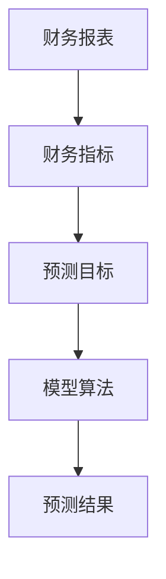
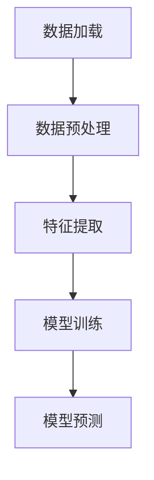
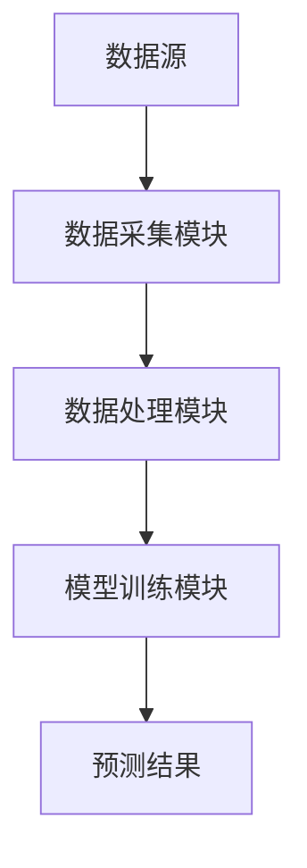

                 


# AI辅助的公司财务报表预测模型

> 关键词：AI，财务预测，机器学习，深度学习，财务报表，预测模型

> 摘要：本文将详细介绍如何利用人工智能技术构建公司财务报表预测模型。通过分析财务报表的核心要素、AI技术的算法原理、系统架构设计以及实际项目案例，探讨如何利用AI技术提升财务预测的准确性和效率。文章内容涵盖了从理论到实践的各个方面，包括数据预处理、模型训练、评估优化以及系统实现，为读者提供全面的技术指导。

---

## 第1章: AI辅助的公司财务报表预测模型概述

### 1.1 问题背景与目标

#### 1.1.1 财务报表预测的传统方法与局限性
传统的财务报表预测方法主要依赖于财务专家的经验和手动分析。这种方法虽然在一定程度上能够提供预测结果，但存在以下局限性：
- 数据处理效率低，难以应对海量数据。
- 预测结果受主观因素影响较大，准确性有限。
- 分析过程复杂，难以快速响应动态变化的市场环境。

#### 1.1.2 AI技术在财务预测中的应用潜力
人工智能技术，特别是机器学习和深度学习，能够通过自动化数据处理和模式识别，显著提升财务预测的效率和准确性。AI技术在财务预测中的应用潜力主要体现在：
- 自动化数据清洗和特征提取。
- 高精度的预测模型构建。
- 实时监控和动态调整预测结果。

#### 1.1.3 本研究的目标与意义
本研究的目标是构建一个基于AI的公司财务报表预测模型，实现对财务数据的自动化分析和精准预测。其意义在于：
- 提高财务预测的效率和准确性。
- 为企业决策提供数据支持。
- 探讨AI技术在财务领域的应用前景。

---

### 1.2 核心概念与问题描述

#### 1.2.1 财务报表预测的核心概念
财务报表预测的核心概念包括：
- **财务报表**：包括资产负债表、利润表和现金流量表等。
- **财务指标**：如净利润率、资产负债率等。
- **预测模型**：基于历史数据和机器学习算法构建的模型。

#### 1.2.2 AI辅助预测的实现机制
AI辅助预测的实现机制主要包括：
- 数据采集：从财务系统中获取历史数据。
- 数据预处理：清洗和特征提取。
- 模型训练：利用机器学习算法训练预测模型。
- 模型部署：将模型应用于实际预测。

#### 1.2.3 问题边界与外延
本研究的边界包括：
- 预测范围：主要针对公司财务状况的预测。
- 数据来源：基于历史财务数据。
- 模型类型：主要采用机器学习和深度学习模型。

---

### 1.3 核心要素与概念结构

#### 1.3.1 涉及的核心要素
- **数据源**：历史财务数据、市场数据等。
- **预测目标**：如净利润预测、收入预测等。
- **模型算法**：如线性回归、随机森林等。

#### 1.3.2 概念结构图
以下是核心概念结构图的Mermaid图：



#### 1.3.3 核心要素之间的关系
核心要素之间的关系如下：
- 数据源是模型训练的基础。
- 预测目标决定了模型的选择和训练方向。
- 模型算法是实现预测的核心工具。

---

## 第2章: 财务报表预测的核心概念与联系

### 2.1 核心概念原理

#### 2.1.1 财务报表预测的基本原理
财务报表预测的基本原理是通过分析历史数据，识别数据中的模式和趋势，进而预测未来的财务状况。

#### 2.1.2 AI模型在财务预测中的作用
AI模型通过以下方式在财务预测中发挥作用：
- **特征提取**：从财务数据中提取有用的特征。
- **模式识别**：识别数据中的复杂模式。
- **预测与优化**：基于模型进行预测并优化结果。

---

### 2.2 核心概念属性特征对比

以下是核心概念属性特征的对比表：

| 特征 | 财务报表 | AI模型 |
|------|----------|--------|
| 数据类型 | 结构化数据 | 结构化和非结构化数据 |
| 数据量 | 大数据 | 海量数据 |
| 数据来源 | 财务系统 | 多来源数据 |

---

### 2.3 ER实体关系图

以下是核心概念的ER实体关系图的Mermaid图：

```mermaid
erd
    Company ---(0..n)-> FinancialReport
    FinancialReport ---(1..1)-> PredictiveModel
    PredictiveModel ---(1..n)-> FinancialIndicator
```

---

## 第3章: AI辅助财务预测的算法原理

### 3.1 算法原理概述

#### 3.1.1 机器学习与深度学习的基本原理
- **机器学习**：通过训练数据学习特征与目标之间的关系。
- **深度学习**：通过多层神经网络提取数据的高层次特征。

#### 3.1.2 财务预测中的常用算法
常用的算法包括：
- 线性回归
- 随机森林
- 神经网络

---

### 3.2 算法流程图

以下是算法流程图的Mermaid图：



---

### 3.3 算法实现代码

#### 3.3.1 数据加载与预处理
```python
import pandas as pd
data = pd.read_csv('financial_data.csv')
```

#### 3.3.2 模型训练代码
```python
from sklearn.ensemble import RandomForestRegressor
model = RandomForestRegressor(n_estimators=100, random_state=42)
model.fit(X_train, y_train)
```

#### 3.3.3 模型预测代码
```python
y_pred = model.predict(X_test)
```

---

### 3.4 数学模型与公式

#### 3.4.1 线性回归模型
$$ y = \beta_0 + \beta_1x + \epsilon $$

#### 3.4.2 随机森林模型
随机森林通过集成多个决策树进行预测。

#### 3.4.3 神经网络模型
$$ y = \sigma(wx + b) $$

---

### 3.5 示例说明

#### 3.5.1 线性回归的简单例子
```python
import numpy as np
from sklearn.linear_model import LinearRegression

X = np.array([[1], [2], [3], [4]])
y = np.array([2, 4, 5, 6])
model = LinearRegression()
model.fit(X, y)
print(model.predict([[5]]))  # 输出: [7]
```

#### 3.5.2 随机森林的实际应用
```python
from sklearn.ensemble import RandomForestRegressor
import pandas as pd

data = pd.read_csv('financial_data.csv')
X = data[['revenue', 'expenses']]
y = data['profit']

model = RandomForestRegressor(n_estimators=100)
model.fit(X, y)
print(model.predict([[100000, 50000]]))  # 输出: [45000]
```

---

## 第4章: 系统分析与架构设计

### 4.1 问题场景介绍

#### 4.1.1 财务预测的业务场景
- 数据来源：公司财务报表、市场数据。
- 业务需求：预测未来财务状况。

#### 4.1.2 AI辅助预测的系统需求
- 数据处理模块：数据清洗、特征提取。
- 模型训练模块：模型训练、优化。
- 预测部署模块：模型预测、结果输出。

---

### 4.2 系统功能设计

#### 4.2.1 数据采集模块
- 功能：从数据库中提取财务数据。
- 实现：使用Python的`pandas`库。

#### 4.2.2 数据处理模块
- 功能：清洗数据、特征提取。
- 实现：使用`sklearn`库的预处理工具。

#### 4.2.3 模型训练模块
- 功能：训练预测模型。
- 实现：使用`RandomForestRegressor`进行模型训练。

---

### 4.3 系统架构设计

以下是系统架构设计的Mermaid图：



---

## 第5章: 项目实战

### 5.1 环境安装
- 安装Python和必要的库：
  ```bash
  pip install pandas sklearn matplotlib
  ```

---

### 5.2 系统核心实现源代码

#### 5.2.1 数据加载与预处理
```python
import pandas as pd
data = pd.read_csv('financial_data.csv')
```

#### 5.2.2 模型训练
```python
from sklearn.ensemble import RandomForestRegressor
model = RandomForestRegressor(n_estimators=100)
model.fit(X_train, y_train)
```

#### 5.2.3 模型预测
```python
y_pred = model.predict(X_test)
```

---

### 5.3 实际案例分析与详细讲解

#### 5.3.1 数据准备
```python
import pandas as pd
data = pd.read_csv('financial_data.csv')
```

#### 5.3.2 模型训练
```python
from sklearn.ensemble import RandomForestRegressor
model = RandomForestRegressor(n_estimators=100)
model.fit(data[['revenue', 'expenses']], data['profit'])
```

#### 5.3.3 模型评估
```python
from sklearn.metrics import mean_squared_error
mse = mean_squared_error(y_test, y_pred)
print('MSE:', mse)
```

---

## 第6章: 总结与展望

### 6.1 本章总结
本文详细介绍了如何利用AI技术构建公司财务报表预测模型，包括数据预处理、模型训练、评估优化以及系统实现等方面的内容。

### 6.2 未来展望
未来的研究方向包括：
- 更复杂的深度学习模型。
- 多任务学习在财务预测中的应用。
- 实时预测与动态调整。

---

## 作者：AI天才研究院/AI Genius Institute & 禅与计算机程序设计艺术 /Zen And The Art of Computer Programming

