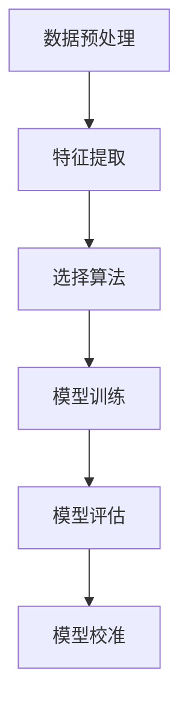
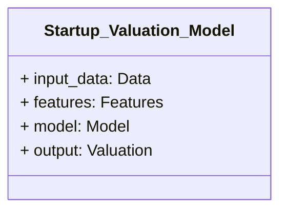
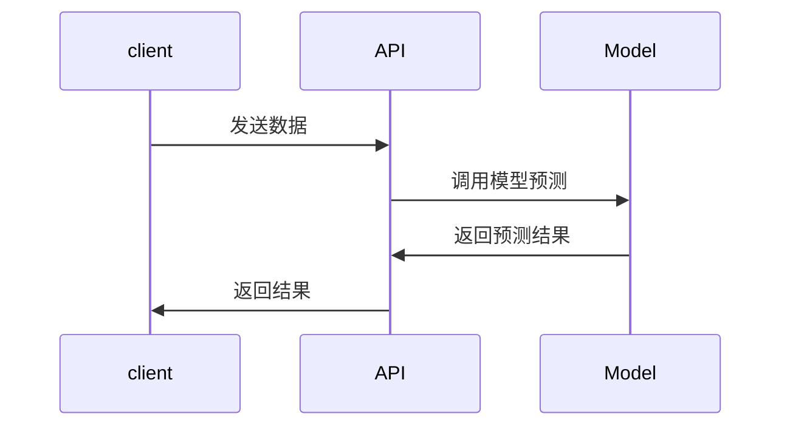

                 


# AI辅助的创业公司估值模型校准

> 关键词：创业公司估值，AI辅助，模型校准，机器学习，金融分析

> 摘要：本文探讨了如何利用人工智能技术辅助创业公司的估值模型校准。通过分析传统估值方法的局限性，结合机器学习算法和特征工程，提出了一种基于AI的估值模型校准方法，旨在提高估值的准确性和效率。

---

# 第一部分: AI辅助的创业公司估值模型校准背景与基础

## 第1章: 创业公司估值模型校准的背景与问题

### 1.1 创业公司估值的挑战与需求

#### 1.1.1 创业公司估值的传统方法与局限性
创业公司的估值通常依赖于财务指标（如收入、利润）和市场状况，但这些指标在早期阶段往往不完整或波动较大。此外，传统估值方法难以捕捉非财务因素（如团队能力、市场潜力）的影响。

#### 1.1.2 为什么需要AI辅助的估值模型
AI可以通过分析大量非结构化数据（如市场趋势、竞争环境、团队背景）来提供更全面的估值支持。此外，AI模型能够快速迭代和优化，适应市场变化。

#### 1.1.3 创业公司估值的核心问题与边界
创业公司估值的核心问题是如何准确预测其未来表现，同时考虑外部市场和内部因素的影响。边界包括数据的可获得性和模型的适用性。

### 1.2 创业公司估值模型的校准需求

#### 1.2.1 模型校准的基本概念
模型校准是指通过调整模型参数，使其更好地拟合实际数据。在创业公司估值中，校准模型可以提高预测的准确性。

#### 1.2.2 创业公司估值模型的特点与属性
创业公司估值模型通常具有以下特点：数据稀疏性、高度不确定性、动态变化。模型需要能够处理这些特点。

#### 1.2.3 校准模型的必要性与方法
校准模型的必要性在于提高模型的泛化能力和预测精度。常用方法包括交叉验证和网格搜索。

## 第2章: AI辅助估值模型的核心概念与联系

### 2.1 估值模型校准的核心概念

#### 2.1.1 机器学习在估值模型中的应用
机器学习可以通过训练数据，自动提取特征并预测估值。

#### 2.1.2 特征工程与数据处理
特征工程是将原始数据转换为有用的特征，数据处理包括清洗和归一化。

#### 2.1.3 模型偏差与方差的平衡
偏差是指模型对训练数据的拟合程度，方差是指模型对新数据的泛化能力。平衡偏差与方差可以提高模型性能。

### 2.2 核心概念对比与联系

#### 2.2.1 传统估值模型与AI模型的对比
传统模型依赖财务指标，AI模型结合了更多非财务因素。

#### 2.2.2 模型校准的流程与步骤
流程包括数据准备、特征工程、模型训练、校准和评估。

#### 2.2.3 数据、特征、模型的关系
数据是基础，特征是关键，模型是工具。

### 2.3 模型校准的ER实体关系图

```mermaid
er
actor: 创业公司
model: 估值模型
data: 业务数据
feature: 特征
label: 估值结果
actor --> model
data --> feature
feature --> model
model --> label
```

---

# 第二部分: AI辅助的创业公司估值模型校准算法与实现

## 第3章: AI辅助估值模型的算法原理

### 3.1 算法选择与原理

#### 3.1.1 线性回归原理
线性回归通过最小化残差平方和来拟合数据。

公式：
$$ y = \beta_0 + \beta_1x + \epsilon $$

#### 3.1.2 随机森林与梯度提升树
随机森林通过集成学习提高准确性和鲁棒性。

#### 3.1.3 神经网络与深度学习
神经网络可以处理复杂非线性关系，适合处理高维数据。

### 3.2 算法流程图



### 3.3 核心代码实现

```python
import pandas as pd
from sklearn.model_selection import train_test_split
from sklearn.linear_model import LinearRegression
from sklearn.metrics import mean_squared_error

# 数据加载
data = pd.read_csv('startup_valuations.csv')

# 特征与目标变量分离
X = data.drop('valuation', axis=1)
y = data['valuation']

# 数据分割
X_train, X_test, y_train, y_test = train_test_split(X, y, test_size=0.2, random_state=42)

# 模型训练
model = LinearRegression()
model.fit(X_train, y_train)

# 模型预测
y_pred = model.predict(X_test)

# 模型评估
mse = mean_squared_error(y_test, y_pred)
print(f"均方误差: {mse}")
```

---

## 第4章: AI辅助估值模型的系统分析与架构设计

### 4.1 系统功能设计

#### 4.1.1 领域模型


#### 4.1.2 系统架构


### 4.2 接口设计与交互流程

#### 4.2.1 API接口设计
```python
class API:
    def __init__(self, model):
        self.model = model

    def predict(self, input_data):
        return self.model.predict(input_data)
```

#### 4.2.2 交互流程图


---

## 第5章: 项目实战

### 5.1 环境安装与配置

```bash
pip install pandas scikit-learn
```

### 5.2 核心代码实现

```python
import pandas as pd
from sklearn.ensemble import RandomForestRegressor
from sklearn.metrics import r2_score

# 数据加载
data = pd.read_csv('startup_data.csv')

# 特征与目标变量分离
X = data.drop('valuation', axis=1)
y = data['valuation']

# 数据分割
X_train, X_test, y_train, y_test = train_test_split(X, y, test_size=0.2, random_state=42)

# 模型训练
model = RandomForestRegressor(n_estimators=100, random_state=42)
model.fit(X_train, y_train)

# 模型预测
y_pred = model.predict(X_test)

# 模型评估
r2 = r2_score(y_test, y_pred)
print(f"R²分数: {r2}")
```

### 5.3 案例分析与解读

#### 5.3.1 数据预处理
处理缺失值和异常值。

#### 5.3.2 特征工程
提取关键特征，如收入增长率、市场渗透率。

#### 5.3.3 模型训练与调优
使用交叉验证优化模型参数。

---

## 第6章: 最佳实践与总结

### 6.1 小结
AI辅助的创业公司估值模型校准能够提高估值的准确性和效率。

### 6.2 注意事项
- 数据质量至关重要。
- 模型需要定期更新。
- 考虑外部事件对估值的影响。

### 6.3 拓展阅读
推荐阅读《机器学习实战》和《深度学习入门》。

---

作者：AI天才研究院 & 禅与计算机程序设计艺术

