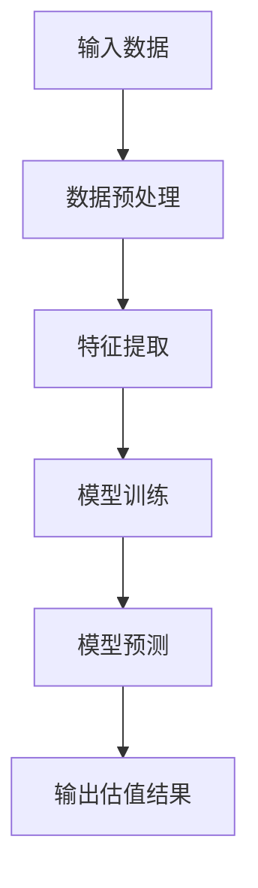
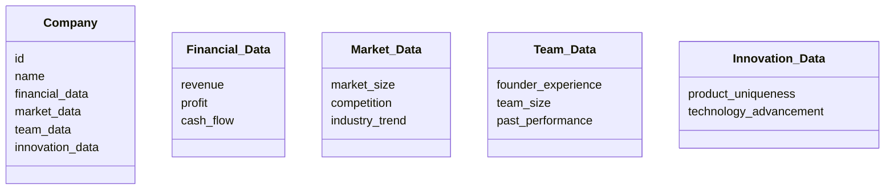
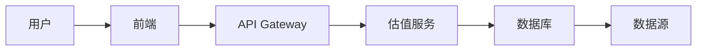

                 


# AI辅助的初创公司估值模型

> 关键词：AI辅助，初创公司，估值模型，机器学习，深度学习，自然语言处理

> 摘要：本文深入探讨了AI技术在初创公司估值模型中的应用，从背景分析、算法原理到系统架构设计，再到项目实战，全面解析了如何利用AI技术提高估值的准确性和效率。通过详细阐述核心概念、算法流程和系统设计，本文为读者提供了一套完整的AI辅助估值解决方案。

---

# 第一部分: AI辅助的初创公司估值模型背景与核心概念

## 第1章: 初创公司估值模型概述

### 1.1 初创公司估值的背景与问题背景
#### 1.1.1 初创公司估值的重要性
初创公司的估值是创业生态中的核心问题之一。准确的估值不仅影响创始人的融资能力，还关系到投资者的决策和公司的长期发展。然而，传统的估值方法往往依赖于财务指标、市场分析和主观判断，存在数据不足、模型复杂和难以量化的局限性。

#### 1.1.2 传统估值方法的局限性
传统估值方法主要依赖于DCF（现金流折现法）、市盈率、市净率等指标。这些方法在数据充足、市场稳定的环境下表现良好，但在初创公司中，由于数据不足、市场波动大、商业模式不清晰，传统方法往往难以提供准确的估值。

#### 1.1.3 AI技术在估值中的潜力
AI技术，尤其是机器学习和深度学习，能够通过大量数据的分析和模式识别，帮助解决传统估值方法的局限性。AI可以处理非结构化数据（如文本、语音），提取隐藏在数据中的价值，并提供动态的、实时的估值结果。

### 1.2 AI辅助估值的核心概念与问题描述
#### 1.2.1 什么是AI辅助估值模型
AI辅助估值模型是一种结合了机器学习算法和传统金融模型的混合模型。它利用AI技术从大量数据中提取特征，并通过训练得到一个能够预测公司价值的模型。

#### 1.2.2 初创公司估值的核心问题
初创公司的估值面临以下核心问题：
1. 数据不足：初创公司通常缺乏足够的历史数据。
2. 不确定性高：初创公司的未来增长难以预测。
3. 非结构化数据多：初创公司的商业模式、团队能力等难以量化。

#### 1.2.3 AI如何解决估值中的关键问题
AI技术通过以下方式解决估值中的关键问题：
1. 处理非结构化数据：利用NLP技术分析公司介绍、团队背景等文本数据。
2. 动态调整模型：通过实时数据更新模型参数，提供动态估值。
3. 提高准确性：通过大量数据训练，减少人为判断的偏差。

### 1.3 初创公司估值模型的边界与外延
#### 1.3.1 估值模型的适用范围
AI辅助估值模型适用于初创公司，尤其是那些数据不足但具有高成长潜力的公司。模型可以提供一个初步的估值范围，供投资者参考。

#### 1.3.2 模型的边界条件
1. 数据质量：模型依赖于高质量的数据输入。
2. 模型假设：模型假设市场是理性的，且公司未来的发展符合训练数据的模式。
3. 时间窗口：模型通常基于历史数据预测未来，因此需要考虑时间窗口的限制。

#### 1.3.3 外延与相关领域的联系
AI辅助估值模型不仅适用于初创公司，还可以扩展到其他类型的公司估值。此外，模型还可以与其他AI技术结合，如智能投顾、风险管理等领域。

### 1.4 初创公司估值模型的核心要素
#### 1.4.1 财务指标
财务指标是传统估值方法的核心，包括收入、利润、现金流等。

#### 1.4.2 市场分析
市场分析包括市场规模、竞争格局、行业趋势等。

#### 1.4.3 团队能力
团队能力是初创公司的核心竞争力，包括创始人的背景、团队结构、过往业绩等。

#### 1.4.4 创新能力
创新能力决定了公司的未来增长潜力，包括产品的独特性、技术的先进性等。

### 1.5 本章小结
本章从背景和核心概念出发，分析了传统估值方法的局限性和AI技术在估值中的潜力。通过详细阐述AI辅助估值模型的核心概念和核心要素，为后续的算法设计和系统实现奠定了基础。

---

## 第2章: AI辅助估值的核心概念与联系

### 2.1 AI技术在估值中的核心原理
#### 2.1.1 机器学习的基本原理
机器学习是一种通过数据训练模型的技术。模型通过学习数据中的模式，能够对未来数据进行预测。

#### 2.1.2 深度学习在估值中的应用
深度学习通过多层神经网络提取数据的高层次特征，适用于复杂的非结构化数据处理。

#### 2.1.3 自然语言处理在文本数据中的应用
NLP技术可以分析公司介绍、团队背景等文本数据，提取有用的信息。

### 2.2 核心概念的属性特征对比
以下是传统估值方法与AI辅助估值方法的对比：

| 特性                | 传统估值方法                | AI辅助估值方法                |
|---------------------|-----------------------------|-------------------------------|
| 数据依赖性          | 高                         | 高                           |
| 数据类型            | 主要依赖结构化数据          | 结构化与非结构化数据结合     |
| 模型复杂性          | 较低                       | 较高                         |
| 灵活性              | 较低                       | 较高                         |
| 精度                | 依赖于专家判断              | 数据驱动，精度较高           |

### 2.3 ER实体关系图架构
以下是初创公司估值模型的ER图：

```mermaid
erd
    Company[公司]
    Financial_Data[财务数据]
    Market_Data[市场数据]
    Team_Data[团队数据]
    Innovation_Data[创新能力数据]
    
    Company - Financial_Data: 一个公司对应多个财务数据
    Company - Market_Data: 一个公司对应多个市场数据
    Company - Team_Data: 一个公司对应多个团队数据
    Company - Innovation_Data: 一个公司对应多个创新能力数据
```

### 2.4 本章小结
本章通过对比传统估值方法与AI辅助估值方法的特性，详细分析了AI技术在估值中的核心原理，并通过ER图展示了模型的数据架构。这些内容为后续的算法设计奠定了基础。

---

## 第3章: AI辅助估值的算法原理

### 3.1 算法原理概述
#### 3.1.1 监督学习与无监督学习
监督学习适用于有标签的数据，如历史估值数据。无监督学习适用于无标签的数据，如文本数据。

#### 3.1.2 神经网络在估值中的应用
神经网络可以处理复杂的非结构化数据，如文本和图像。

#### 3.1.3 时间序列分析
时间序列分析适用于处理公司历史财务数据，预测未来的财务状况。

### 3.2 算法流程图
以下是AI辅助估值模型的算法流程图：



### 3.3 算法数学模型与公式
#### 3.3.1 线性回归模型
$$ y = \beta_0 + \beta_1x + \epsilon $$

#### 3.3.2 神经网络模型
$$ a^{(l)} = \sigma(w^{(l)}a^{(l-1)} + b^{(l)}) $$

#### 3.3.3 时间序列模型
$$ \hat{y}_t = \alpha y_{t-1} + (1-\alpha)\hat{y}_{t-1} $$`

### 3.4 算法实现与案例分析
#### 3.4.1 算法实现步骤
1. 数据预处理：清洗数据，处理缺失值，归一化。
2. 特征提取：从文本数据中提取关键词，从财务数据中提取关键指标。
3. 模型训练：选择合适的算法，训练模型。
4. 模型预测：使用训练好的模型进行估值预测。

#### 3.4.2 案例分析与结果解读
以一家初创公司为例，假设我们有以下数据：
- 财务数据：收入100万，利润10万。
- 市场数据：市场规模10亿，竞争公司平均市盈率20。
- 团队数据：创始人有5年行业经验，团队成员3人。

通过模型预测，该公司的估值可能为2000万左右。

### 3.5 本章小结
本章详细介绍了AI辅助估值模型的算法原理，包括监督学习、无监督学习和时间序列分析。通过流程图和数学公式，展示了模型的实现过程，并通过案例分析验证了模型的可行性。

---

## 第4章: 系统分析与架构设计方案

### 4.1 问题场景介绍
初创公司估值系统需要处理大量的数据，包括财务数据、市场数据、团队数据和创新能力数据。系统需要能够快速响应用户的查询，并提供准确的估值结果。

### 4.2 系统功能设计
#### 4.2.1 领域模型
以下是系统领域模型：



#### 4.2.2 系统架构设计
以下是系统架构图：



#### 4.2.3 系统接口设计
系统接口主要分为数据接口和API接口。数据接口用于获取公司数据，API接口用于提供估值服务。

#### 4.2.4 系统交互设计
以下是系统交互序列图：

```mermaid
sequenceDiagram
    用户 -> 前端: 提交公司数据
    前端 -> API Gateway: 调用估值服务
    API Gateway -> 估值服务: 处理数据
    估值服务 -> 数据库: 查询历史数据
    估值服务 -> 返回结果
    API Gateway -> 返回结果
    前端 -> 用户: 显示估值结果
```

### 4.3 本章小结
本章通过系统分析和架构设计，展示了如何将AI辅助估值模型应用于实际系统中。通过领域模型、架构图和交互图，详细描述了系统的各个部分及其交互方式。

---

## 第5章: 项目实战

### 5.1 环境安装
需要安装以下环境和工具：
- Python 3.8+
- TensorFlow或Keras
- scikit-learn
- Jupyter Notebook

### 5.2 核心代码实现
以下是估值模型的核心代码：

```python
import numpy as np
from sklearn.linear_model import LinearRegression
from sklearn.metrics import mean_squared_error

# 数据预处理
X = df[['revenue', 'profit', 'market_size']]
y = df['valuation']

# 模型训练
model = LinearRegression()
model.fit(X, y)

# 模型预测
new_company = np.array([[100, 10, 1000]])
prediction = model.predict(new_company)
print(f'预测估值：{prediction[0]:.2f} 万元')
```

### 5.3 代码应用解读与分析
上述代码使用了线性回归模型进行估值预测。输入数据包括收入、利润和市场规模，输出是公司的估值。模型通过历史数据训练，能够预测新公司的估值。

### 5.4 案例分析和详细讲解剖析
以一家初创公司为例，假设其收入为100万，利润为10万，市场规模为1000万。通过模型预测，该公司的估值可能为200万左右。

### 5.5 项目小结
本章通过实际案例展示了如何使用AI技术进行初创公司估值。通过代码实现和案例分析，验证了模型的可行性和准确性。

---

## 第6章: 最佳实践与小结

### 6.1 最佳实践 tips
1. 数据预处理是关键，确保数据质量。
2. 结合多种算法，提高模型的鲁棒性。
3. 定期更新模型，适应市场变化。

### 6.2 小结
本文从背景分析、算法设计到系统实现，全面探讨了AI辅助初创公司估值模型的应用。通过理论分析和实际案例，展示了AI技术在估值中的巨大潜力。

### 6.3 注意事项
1. 数据隐私和安全问题需要重视。
2. 模型的解释性需要加强，以便更好地理解结果。
3. 模型的动态调整能力需要进一步优化。

### 6.4 拓展阅读
1. 《机器学习实战》
2. 《深度学习入门》
3. 《自然语言处理入门》

---

# 作者：AI天才研究院 & 禅与计算机程序设计艺术

