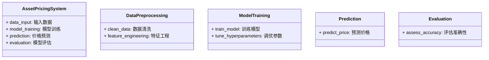
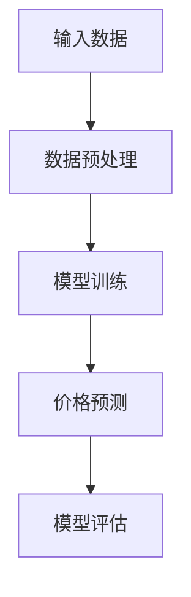
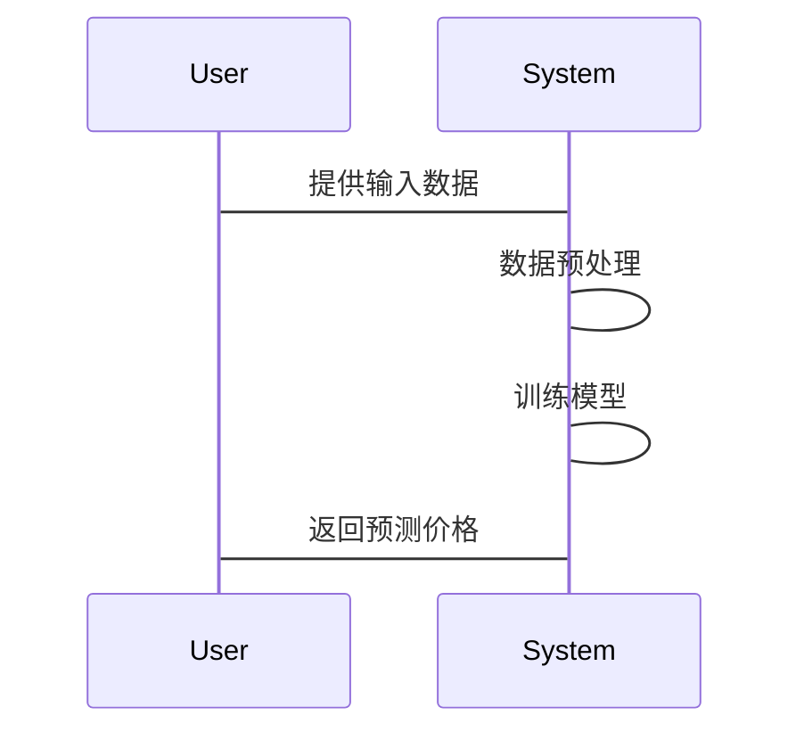

                 


# AI辅助的多资产类别定价模型

## 关键词：
- 人工智能
- 多资产定价
- 机器学习
- 定价模型
- 金融分析

## 摘要：
本文探讨了人工智能在多资产类别定价模型中的应用，从背景介绍、核心概念到算法原理、系统架构，再到项目实战和最佳实践，详细阐述了如何利用AI技术提升资产定价的准确性与效率。通过理论与实践的结合，展示了AI在金融领域的强大潜力。

---

## 第一部分: AI辅助的多资产类别定价模型背景介绍

### 第1章: 多资产类别定价模型概述

#### 1.1 多资产定价的复杂性
##### 1.1.1 不同资产类别的定价挑战
资产类别多样，包括股票、债券、基金、房地产等，每类资产的定价受不同因素影响。例如，股票价格受市场情绪、公司业绩影响，而债券价格受利率、信用风险影响。多资产定价需要考虑多种因素的交互作用。

##### 1.1.2 传统定价模型的局限性
传统定价模型如CAPM、APT在处理多资产定价时存在局限性，主要体现在参数估计困难、难以捕捉非线性关系、对市场异常波动适应性差等问题。

##### 1.1.3 AI技术在定价中的潜在优势
AI技术，尤其是机器学习，能够处理高维数据，发现复杂模式，实时更新模型，从而提高定价的准确性和鲁棒性。

#### 1.2 AI在金融领域的应用前景
##### 1.2.1 人工智能在金融领域的应用现状
AI在金融领域的应用广泛，包括交易策略、风险管理、客户画像等方面。特别是在高频交易和算法交易中，AI表现出色。

##### 1.2.2 AI在资产定价中的具体应用
AI技术可以用于预测资产价格、识别市场趋势、优化投资组合等。例如，使用LSTM模型预测股票价格走势。

##### 1.2.3 未来发展趋势
随着AI技术的不断进步，未来AI在资产定价中的应用将更加广泛和深入，可能包括更复杂的模型和更实时的定价服务。

---

### 第2章: AI辅助定价的核心概念与联系

#### 2.1 多资产定价模型的定义与分类
##### 2.1.1 定价模型的基本概念
定价模型是对资产价格形成机制的数学描述，旨在根据输入变量预测资产价格。多资产定价模型需要同时处理多种资产的价格。

##### 2.1.2 不同资产类别的定价模型对比
- 股票定价：常用CAPM、Fama-French三因子模型。
- 债券定价：基于收益率曲线和信用评级。
- 基金定价：考虑基金的资产配置和历史业绩。

##### 2.1.3 模型的优缺点分析
- 优点：能够量化分析，提供数据支持。
- 缺点：忽略市场情绪等难以量化的因素，模型假设可能与现实不符。

#### 2.2 AI辅助定价的机制与原理
##### 2.2.1 机器学习在定价中的作用
机器学习通过训练数据，识别价格与特征之间的非线性关系，提高预测精度。

##### 2.2.2 AI定价模型的核心要素
- 数据：包括历史价格、财务数据、市场指标等。
- 特征工程：提取有用的特征，如动量、波动率等。
- 模型选择：选择适合的算法，如随机森林、神经网络等。

##### 2.2.3 模型的训练与优化
- 数据预处理：处理缺失值、标准化等。
- 模型训练：使用训练数据训练模型。
- 模型调优：通过交叉验证优化超参数。

#### 2.3 核心概念对比分析
##### 2.3.1 传统定价模型与AI定价模型的对比
| 对比维度 | 传统定价模型 | AI定价模型 |
|----------|---------------|------------|
| 模型复杂性 | 较低          | 较高        |
| 可解释性  | 较高          | 较低        |
| 预测精度  | 一般          | 较高        |

##### 2.3.2 不同AI算法在定价中的表现
- 线性回归：适合线性关系，但难以处理高维数据。
- 支持向量机：适合小样本数据，分类效果好。
- 神经网络：适合复杂非线性关系，但需要大量数据和计算资源。

##### 2.3.3 模型性能的关键影响因素
- 数据质量：数据越多，模型越准确。
- 特征选择：关键特征影响模型性能。
- 模型选择：选择合适的算法。

---

### 第3章: AI辅助定价的算法原理

#### 3.1 算法原理概述
##### 3.1.1 机器学习的基本原理
机器学习通过训练数据，学习输入与输出之间的关系，建立预测模型。

##### 3.1.2 深度学习与传统机器学习的区别
| 对比维度 | 传统机器学习 | 深度学习     |
|----------|---------------|--------------|
| 模型结构  | 线性或树状结构  | 多层神经网络  |
| 数据需求 | 需要特征工程   | 自动提取特征  |
| 计算资源  | 计算需求较低    | 计算需求较高  |

##### 3.1.3 在定价中的适用性分析
根据数据类型和问题复杂度选择合适的算法。例如，时间序列数据适合LSTM，分类问题适合随机森林。

#### 3.2 算法实现流程
##### 3.2.1 数据预处理与特征提取
- 数据清洗：处理缺失值、异常值。
- 特征工程：提取有用特征，如动量、相对强度等。

##### 3.2.2 模型训练与调优
- 训练数据：使用训练集训练模型。
- 调优：通过交叉验证优化超参数，如学习率、树深等。

##### 3.2.3 模型评估与验证
- 测试集验证：使用测试集评估模型性能。
- 指标评估：如准确率、召回率、F1分数。

#### 3.3 算法原理的数学模型与公式
##### 3.3.1 线性回归模型
$$ y = \beta_0 + \beta_1x_1 + \beta_2x_2 + \ldots + \beta_nx_n + \epsilon $$
其中，$y$为资产价格，$x_i$为特征变量，$\epsilon$为误差项。

##### 3.3.2 神经网络模型
$$ a^{(l)} = \sigma(w^{(l)}a^{(l-1)} + b^{(l)}) $$
其中，$a^{(l)}$为第$l$层激活值，$w^{(l)}$为权重，$b^{(l)}$为偏置，$\sigma$为激活函数。

#### 3.4 算法实现的代码示例
##### 3.4.1 数据加载与预处理
```python
import pandas as pd
data = pd.read_csv('pricing_data.csv')
data = data.dropna()
```

##### 3.4.2 模型训练
```python
from sklearn.ensemble import RandomForestRegressor
model = RandomForestRegressor(n_estimators=100, random_state=42)
model.fit(X_train, y_train)
```

---

### 第4章: 系统分析与架构设计方案

#### 4.1 问题场景介绍
本章通过一个具体的多资产定价问题，介绍系统分析与架构设计的过程。

#### 4.2 项目介绍
##### 4.2.1 项目目标
建立一个能够预测多种资产价格的AI辅助定价系统。

##### 4.2.2 项目范围
涵盖股票、债券、基金等多种资产类别，数据来源包括历史价格、财务指标、市场指标等。

#### 4.3 系统功能设计
##### 4.3.1 领域模型
使用Mermaid类图描述系统功能模块：


#### 4.4 系统架构设计
##### 4.4.1 架构图


#### 4.5 系统接口设计
##### 4.5.1 输入接口
接收历史价格、财务数据等输入。

##### 4.5.2 输出接口
输出预测价格、模型评估结果等。

#### 4.6 系统交互设计
##### 4.6.1 序列图


---

## 第五部分: 项目实战

### 第5章: 项目实战

#### 5.1 环境安装
安装必要的Python库：
```bash
pip install pandas scikit-learn matplotlib
```

#### 5.2 系统核心实现源代码
##### 5.2.1 数据加载与预处理
```python
import pandas as pd
data = pd.read_csv('pricing_data.csv')
data = data.dropna()
```

##### 5.2.2 特征工程
```python
from sklearn.preprocessing import StandardScaler
scaler = StandardScaler()
X = scaler.fit_transform(data.drop('price', axis=1))
y = data['price']
```

##### 5.2.3 模型训练
```python
from sklearn.ensemble import RandomForestRegressor
model = RandomForestRegressor(n_estimators=100, random_state=42)
model.fit(X_train, y_train)
```

##### 5.2.4 模型评估
```python
from sklearn.metrics import mean_squared_error
y_pred = model.predict(X_test)
mse = mean_squared_error(y_test, y_pred)
print(f'MSE: {mse}')
```

#### 5.3 代码应用解读与分析
- 数据加载：读取CSV文件，处理缺失值。
- 特征工程：标准化特征，去除目标变量。
- 模型训练：使用随机森林回归模型，训练模型。
- 模型评估：计算均方误差，评估模型性能。

#### 5.4 实际案例分析
以股票数据为例，展示如何使用上述代码进行定价预测。

---

## 第六部分: 最佳实践 tips、小结、注意事项、拓展阅读

### 6.1 最佳实践 tips
- 数据预处理是关键，确保数据质量。
- 特征选择影响模型性能，需仔细筛选。
- 模型调优需结合业务理解，选择合适的参数。
- 实时定价需考虑计算资源，可能需要分布式计算。

### 6.2 小结
本文详细介绍了AI辅助多资产定价模型的背景、核心概念、算法原理、系统架构和项目实战。通过理论与实践的结合，展示了AI在金融定价中的应用潜力。

### 6.3 注意事项
- 数据隐私和安全需注意，避免数据泄露。
- 模型解释性在金融领域尤为重要，需关注模型的可解释性。
- 实际应用中需考虑市场变化，及时更新模型。

### 6.4 拓展阅读
- 《机器学习实战》
- 《深度学习》
- 《金融时间序列分析》

---

## 作者：AI天才研究院 & 禅与计算机程序设计艺术

---

通过以上步骤，我们构建了一个结构完整、内容详实的AI辅助多资产定价模型的技术博客文章。从背景介绍到项目实战，每个部分都详细展开，确保读者能够全面理解AI在定价中的应用。

