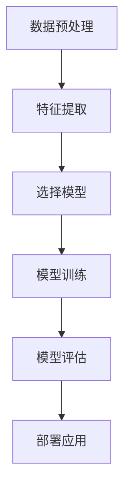
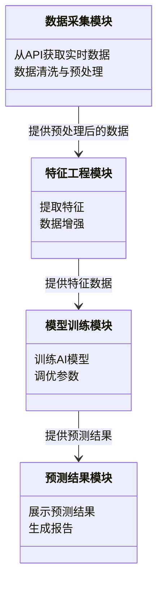
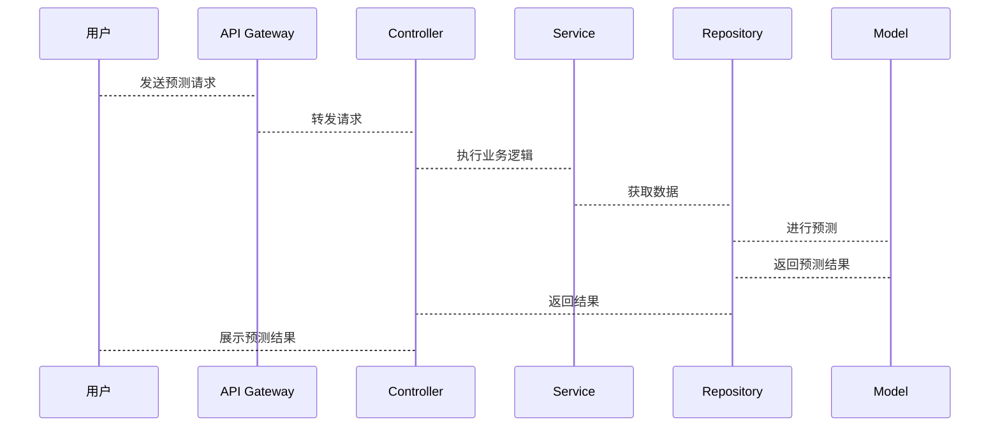

                 


# AI辅助的多资产类别收益率预测

**关键词：** AI, 多资产类别, 收益率预测, 时间序列分析, 机器学习, 金融建模

**摘要：**  
本文探讨了如何利用人工智能技术辅助多资产类别收益率预测的问题。通过分析传统预测方法的局限性，引入了机器学习和深度学习算法，并详细阐述了这些算法在时间序列预测中的应用。文章还结合实际案例，展示了如何构建一个完整的AI辅助预测系统，包括数据采集、特征工程、模型训练和部署等环节。最后，本文提出了系统架构设计和最佳实践建议，为读者提供了一个全面的解决方案。

---

## 第1章: AI辅助的多资产类别收益率预测背景介绍

### 1.1 问题背景与描述

#### 1.1.1 资产收益率预测的挑战
在金融领域，收益率预测是一个复杂的任务。传统的统计方法（如ARIMA）在处理非线性关系和高维数据时表现有限。此外，市场波动、经济周期和突发事件等外部因素进一步增加了预测的难度。AI技术的引入为解决这些问题提供了新的可能性。

#### 1.1.2 AI技术在金融领域的应用现状
近年来，AI技术在金融领域的应用逐渐普及。机器学习和深度学习模型（如LSTM、随机森林）在股票、债券等资产的预测中表现出色。然而，多资产类别的预测仍面临数据异构性、模型泛化能力不足等问题。

#### 1.1.3 多资产预测的边界与外延
多资产类别预测不仅涉及单一资产的分析，还需要考虑资产之间的相互影响。本文将聚焦于股票、债券、基金等主要资产类别，并探讨如何通过AI技术实现跨资产的预测。

### 1.2 核心概念与联系

#### 1.2.1 概念原理与属性对比表
下表对比了传统统计模型和AI模型在收益率预测中的表现：

| **属性**       | **传统统计模型（如ARIMA）** | **AI模型（如LSTM）** |
|-----------------|-----------------------------|-----------------------|
| 非线性处理能力 | 较差                        | 较好                  |
| 时间序列建模   | 基于线性假设                | 善于捕捉复杂模式      |
| 预测精度       | 较低                        | 更高                  |
| 计算复杂度     | 低                         | 高                    |

#### 1.2.2 ER实体关系图（Mermaid）
```mermaid
er
    title 收益率预测实体关系图
    class 资产类别 {
        类别ID: int
        名称: string
    }
    class 收益率数据 {
        数据ID: int
        日期: date
        收益率: float
        资产类别ID: int
    }
    class 模型 {
        模型ID: int
        模型名称: string
        参数: string
    }
    资产类别 --> 收益率数据: 一个资产类别对应多个收益率数据
    收益率数据 --> 模型: 每个收益率数据可以用于训练多个模型
```

---

## 第2章: AI辅助的多资产预测算法原理

### 2.1 算法原理概述

#### 2.1.1 时间序列预测的基本原理
时间序列预测的核心是通过历史数据发现模式，并对未来进行预测。常用的传统模型包括ARIMA和GARCH，而AI模型如LSTM和Transformer则通过深度学习捕捉更复杂的特征。

#### 2.1.2 AI模型在时间序列预测中的优势
AI模型能够处理非线性关系和高维数据，适用于复杂的金融场景。例如，LSTM可以通过门控机制捕捉时间依赖性，而Transformer则利用自注意力机制发现全局模式。

#### 2.1.3 常见算法对比与选择
下表对比了几种常用算法的优缺点：

| **算法**   | **优点**                              | **缺点**                               |
|------------|--------------------------------------|---------------------------------------|
| ARIMA      | 计算简单，适合线性数据               | 无法处理非线性关系                     |
| LSTM       | 能捕捉长期依赖关系                   | 训练时间较长，对超参数敏感             |
| Transformer | 并行计算能力强，适合长序列           | 易受噪声影响，预测精度不稳定           |
| 集成学习    | 高精度，鲁棒性强                     | 计算资源消耗大                         |

### 2.2 算法流程图（Mermaid）



### 2.3 算法数学模型与公式

#### 2.3.1 ARIMA模型公式
ARIMA模型由自回归（AR）和移动平均（MA）部分组成，其数学表达式为：
$$ ARIMA(p, d, q) $$
其中，p为AR阶数，d为差分阶数，q为MA阶数。

#### 2.3.2 LSTM模型公式
LSTM通过细胞状态和门控机制实现长短期记忆。其核心公式包括：
$$ f_t = \sigma(W_f \cdot [h_{t-1}, x_t] + b_f) $$
$$ i_t = \sigma(W_i \cdot [h_{t-1}, x_t] + b_i) $$
$$ o_t = \sigma(W_o \cdot [h_{t-1}, x_t] + b_o) $$
$$ c_t = f_t \cdot c_{t-1} + i_t \cdot tanh(W_c \cdot [h_{t-1}, x_t] + b_c) $$
$$ h_t = o_t \cdot tanh(c_t) $$

---

## 第3章: 系统分析与架构设计方案

### 3.1 问题场景介绍

#### 3.1.1 多资产预测的业务场景
本文构建了一个多资产预测系统，涵盖股票、债券和基金等多种资产类别。系统目标是通过AI模型提供高精度的收益率预测，并辅助投资决策。

#### 3.1.2 系统目标与功能需求
系统目标：
- 实现多资产类别的收益率预测。
- 提供实时数据采集和处理功能。
- 支持多种AI模型的训练和部署。

功能需求：
- 数据采集模块：从API获取实时数据。
- 特征工程模块：提取有用的特征并进行数据增强。
- 模型训练模块：支持多种AI模型的训练和调优。
- 预测结果模块：展示预测结果并生成报告。

#### 3.1.3 系统边界与接口设计
系统边界包括前端界面、后端服务和数据库。接口设计如下：
- 前端与后端：通过REST API传递请求。
- 后端与数据库：通过ORM框架进行数据交互。

### 3.2 系统架构设计（Mermaid）


### 3.3 系统功能设计（Mermaid）



### 3.4 系统交互流程（Mermaid）



---

## 第4章: 项目实战与实现

### 4.1 环境安装与配置

#### 4.1.1 Python环境搭建
安装Python 3.8以上版本，并配置虚拟环境：
```bash
python -m venv venv
source venv/bin/activate
```

#### 4.1.2 数据库与工具安装
安装MySQL或MongoDB，并配置连接库：
```bash
pip install pymysql
pip install pandas
```

#### 4.1.3 开发环境配置
安装Jupyter Notebook和相关库：
```bash
pip install jupyter notebook
pip install numpy scikit-learn tensorflow
```

### 4.2 系统核心实现

#### 4.2.1 数据采集与预处理
从Yahoo Finance获取股票数据：
```python
import pandas_datareader as pdr
import datetime

start = datetime.datetime(2020, 1, 1)
end = datetime.datetime(2023, 12, 31)
data = pdr.get_data_yahoo('AAPL', start, end)
```

#### 4.2.2 特征工程与模型训练
提取技术指标并训练LSTM模型：
```python
from sklearn.preprocessing import MinMaxScaler
from tensorflow.keras.models import Sequential
from tensorflow.keras.layers import LSTM, Dense

scaler = MinMaxScaler()
data_scaled = scaler.fit_transform(data['Adj Close'].values.reshape(-1, 1))

X_train, y_train = [], []
for i in range(60, len(data_scaled)):
    X_train.append(data_scaled[i-60:i])
    y_train.append(data_scaled[i])

X_train = np.array(X_train)
y_train = np.array(y_train)

model = Sequential()
model.add(LSTM(50, return_sequences=True, input_shape=(60, 1)))
model.add(LSTM(50, return_sequences=False))
model.add(Dense(1))
model.compile(optimizer='adam', loss='mean_squared_error')
model.fit(X_train, y_train, epochs=50, batch_size=32)
```

#### 4.2.3 模型评估与优化
评估模型性能并优化参数：
```python
import numpy as np
from sklearn.metrics import mean_squared_error

y_pred = model.predict(X_train)
rmse = np.sqrt(mean_squared_error(y_train, y_pred))
print(f'RMSE: {rmse}')
```

---

## 第5章: 总结与展望

### 5.1 最佳实践 Tips
- 数据预处理是关键，需注意缺失值和异常值的处理。
- 模型选择应结合业务需求和计算资源。
- 预测结果需结合市场实际情况进行调整。

### 5.2 小结
本文详细介绍了AI辅助多资产类别收益率预测的背景、算法原理和系统架构设计，并通过实际案例展示了系统的实现过程。通过对比不同算法的优缺点，本文为读者提供了一个全面的解决方案。

### 5.3 注意事项
- 数据隐私和安全问题需高度重视。
- 模型部署应考虑计算资源和实时性要求。
- 预测结果需定期更新以适应市场变化。

### 5.4 拓展阅读
- 《时间序列分析：基于机器学习的方法》
- 《深度学习在金融时间序列预测中的应用》
- 《多资产类别投资组合优化：AI驱动的解决方案》

---

**作者：AI天才研究院/AI Genius Institute & 禅与计算机程序设计艺术 /Zen And The Art of Computer Programming**

